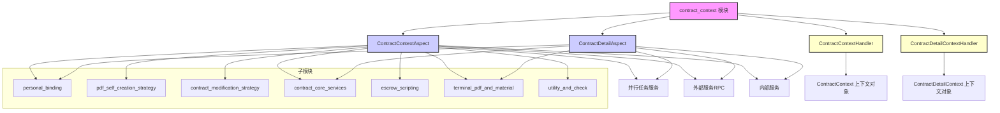
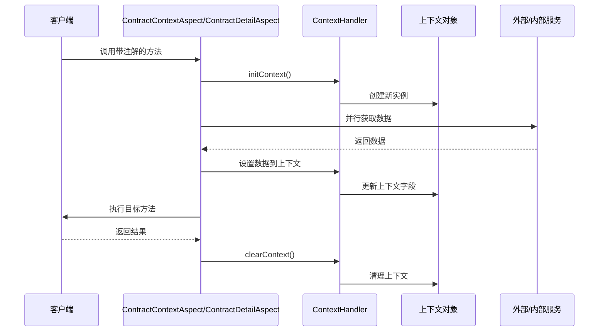
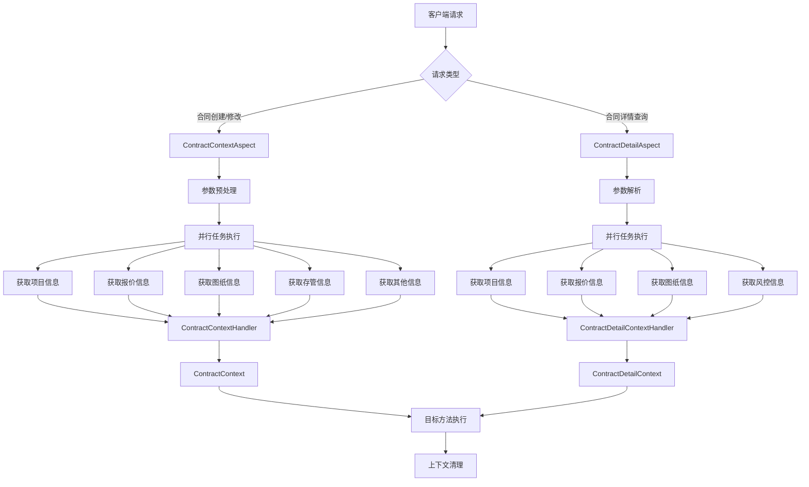
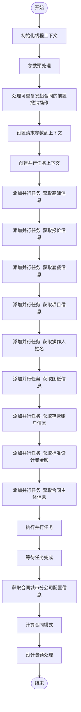
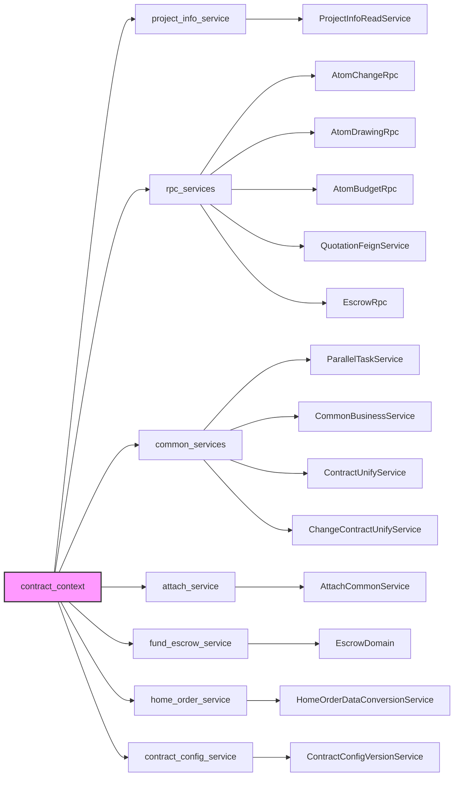

# contract_context 模块文档

## 模块概述

`contract_context` 模块是合同业务处理流程中的核心上下文管理模块，负责在合同操作的不同阶段（如创建、修改、查询详情）通过面向切面编程（AOP）预先收集、聚合和准备所需的上下文数据。该模块通过两个主要切面（`ContractContextAspect` 和 `ContractDetailAspect`）在目标方法执行前异步获取并整合来自多个外部服务和内部模块的数据（如项目信息、报价信息、图纸信息、存管账户信息等），并将结果存储在线程安全的上下文对象中，以供后续业务逻辑使用。模块采用策略模式处理不同的合同类型和业务场景，并通过并行任务执行优化数据准备的性能。

## 架构图

## 组件详细说明

### 1. 切面组件（Aspects）

#### ContractContextAspect
- **职责**：在合同创建、修改、提交等操作前，通过AOP拦截`@ContractDataPrepare`注解的方法，预先准备合同上下文数据。
- **主要功能**：
  - 初始化线程上下文（`ContractContext`）。
  - 并行获取多种数据：项目信息、报价信息、图纸信息、存管账户信息、合同主体信息等。
  - 处理参数预处理（如代理人信息、签约形式等）。
  - 根据合同类型和业务类型路由到不同的数据获取策略。
  - 在方法执行后清理上下文。

#### ContractDetailAspect
- **职责**：在合同详情查询操作前，通过AOP拦截`@ContractDetailDataPrepare`注解的方法，预先准备合同详情所需的上下文数据。
- **主要功能**：
  - 初始化线程上下文（`ContractDetailContext`）。
  - 并行获取项目信息、报价信息、图纸信息、风控审核信息等。
  - 区分首屏加载和非首屏加载，优化数据获取策略。
  - 处理合同详情特有的逻辑（如设计费金额、关联款项信息等）。

### 2. 上下文处理器（Context Handlers）

#### ContractContextHandler
- **职责**：提供线程安全的上下文管理，使用`ThreadLocal`存储`ContractContext`对象。
- **主要功能**：
  - 初始化、获取、设置和清理线程上下文。
  - 提供对上下文中各数据字段的便捷访问方法（如项目信息、报价信息等）。

#### ContractDetailContextHandler
- **职责**：类似`ContractContextHandler`，但管理`ContractDetailContext`对象。
- **主要功能**：
  - 管理合同详情查询的上下文数据。
  - 提供对详情特有数据字段的访问方法（如图纸URL、变更范围列表等）。

### 3. 子模块（Sub-modules）

#### personal_binding
- **职责**：处理个人签约相关的数据获取和策略路由。
- **核心组件**：
  - `PersonalRelationHandler`：个人关系处理器接口。
  - `ContractSigningSourceRouter`：根据绑定类型（如账单、变更单、子单）路由到不同的图纸构建策略。

#### pdf_self_creation_strategy
- **职责**：提供合同PDF自生成的策略模式实现。
- **核心组件**：
  - `DrawingContractPdfBySelfStrategy`：图纸合同PDF自生成策略。
  - `GroupFormalContractPdfBySelfStrategy`：集团正式合同PDF自生成策略。
  - `ReformAllFormalContractPdfBySelfStrategy`：翻新全案正式合同PDF自生成策略。

#### contract_modification_strategy
- **职责**：处理合同修改的策略模式。
- **核心组件**：
  - `ChangeContractStrategyFactory`：变更合同策略工厂。
  - `NormalChangeContractStrategy`：常规变更合同策略。
  - `ZQChangeContractStrategy`：ZQ变更合同策略。

#### contract_core_services
- **职责**：提供合同业务的核心服务，按功能分组。
- **子分组**：
  - **contract_detail_and_config**：合同详情和配置服务，包括展示与交互、数据验证。
  - **contract_seal_and_sign**：合同盖章和签署服务。
  - **contract_draft_and_process_control**：合同草稿和流程控制服务。

#### escrow_scripting
- **职责**：处理托管脚本相关的服务。
- **核心组件**：
  - `ContractEscrowService`：合同托管服务。
  - `ContractScriptCreateService`：合同脚本创建服务。
  - `ContractScriptBuildService`：合同脚本构建服务。

#### terminal_pdf_and_material
- **职责**：处理终端PDF和材料相关服务。
- **核心组件**：
  - `TerminalContractPdfBuildService`：终端合同PDF构建服务。
  - `MaterialPdfDiffService`：材料PDF差异服务。

#### utility_and_check
- **职责**：提供工具类和检查服务。
- **核心组件**：
  - `WorkerTypeCheckService`：工人类型检查服务。

## 数据流图

## 组件交互图

## 流程图：合同创建数据准备

## 依赖关系

## 引用其他模块文档

- [project_info_service](project_info_service.md) - 提供项目信息读取服务
- [rpc_services](rpc_services.md) - 提供RPC调用服务，包括原子化服务和报价服务
- [common_services](common_services.md) - 提供通用业务服务，如并行任务执行、业务工具类等
- [attach_service](attach_service.md) - 提供附件和备件信息处理服务
- [fund_escrow_service](fund_escrow_service.md) - 提供资金托管相关服务
- [home_order_service](home_order_service.md) - 提供家单数据转换服务
- [contract_config_service](contract_config_service.md) - 提供合同配置版本管理服务

## 总结

`contract_context` 模块通过AOP切面和并行任务执行机制，为合同业务提供了高效、可扩展的数据准备框架。模块设计遵循了单一职责原则和策略模式，能够灵活应对不同合同类型和业务场景的需求。通过线程安全的上下文管理，确保了数据在请求处理过程中的完整性和一致性，为后续的业务逻辑处理提供了可靠的数据基础。