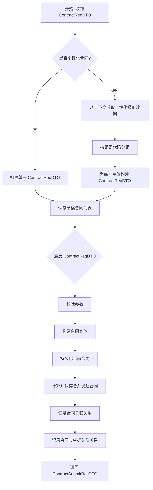

# contract_draft_and_process_control 模块文档

## 简介

`contract_draft_and_process_control` 是合同核心服务 (`contract_core_services`) 中的一个子模块，主要负责合同的**草稿保存**与特定业务场景下的**合同数据流程控制**（如主订单号变更）。本模块作为合同生命周期管理的起点和关键业务逻辑处理器，确保合同数据在创建、编辑和关联变更过程中的完整性与一致性。

## 核心功能与组件

本模块包含两个核心服务类，分别处理不同的业务场景：

### 1. ContractSaveDraftService (合同草稿保存服务)

此服务是合同创建与编辑流程的核心入口之一，专门用于将前端提交的合同数据持久化为“草稿”状态的合同记录。

**主要职责与流程：**
1.  **参数预校验与准备**：使用 `@ContractDataPrepare` 注解触发 AOP 切面，对传入的 `ContractReqDTO` 进行预处理（例如，从上下文获取数据）。
2.  **业务规则校验**：
    *   调用 `contractUnifyService` 进行报价类型预检、对公签约多主体校验、正签合并发起销售合同校验等。
3.  **个性化合同拆分**：
    *   对于个性化合同 (`ContractTypeEnum.PERSONAL`)，会从 `ContractContextHandler` 中获取分组后的报价数据 (`ContractSourceDataBO`)。
    *   根据报价数据中的组织代码 (`organizationCode`) 将一个请求拆分为多个针对不同主体的 `ContractReqDTO`。
    *   利用 `ContractSigningSourceRouter` 路由策略，为每个主体构建相应的商品信息。
4.  **草稿保存核心逻辑 (`saveDraftContract`)**：
    *   **参数合法性校验**：再次校验合同参数。
    *   **构建合同实体**：调用 `contractUnifyService.buildDraftContract` 生成 `Contract` 对象。
    *   **持久化当前合同**：将当前合同数据保存至数据库。
    *   **处理合并发起合同**：通过 `contractMergeLaunchComputer` 计算需要与本合同一并发起的其他合同类型，并调用 `contractUnifyServiceSelf` 保存这些关联的草稿合同。
    *   **记录关联关系**：
        *   调用 `contractSubmitService` 记录合同之间的“合并发起”关系 (`ContractRelationEnum.MERGE_LAUNCH`)。
        *   调用 `quotationRelationCommonService` 记录合同与外部单据（账单、子订单、变更单）的绑定关系。
5.  **返回结果**：返回包含新生成合同代码的 `ContractSubmitResDTO`。

### 2. ContractHomeOrderNoChangeService (主订单号变更服务)

此服务响应系统内的**主订单号变更**事件，负责在业务绑定的主订单发生变更时，对关联的合同数据进行同步调整或回滚。

**主要职责与流程：**
1.  **变更处理 (`doChange`)**：
    *   **类型判断**：仅处理特定类型 (`BIND_DECORATE_COMMISSION`) 的主订单变更。
    *   **数据迁移**：
        *   **作废旧合同**：软删除目标主订单 (`targetMainOrderNo`) 下已存在的 `个性化首期合同`。
        *   **更新合同单号**：将原主订单 (`sourceMainOrderNo`) 下所有个性化相关合同 (`getPersonalizedRelevantContractList`) 的 `projectOrderId` 更新为新主订单号。
    *   **返回变更结果**：封装并返回操作结果（包含被更新和被删除的合同列表）。
2.  **变更回滚 (`doRevert`)**：
    *   **类型判断**：同样仅处理 `BIND_DECORATE_COMMISSION` 类型。
    *   **反向操作**：
        *   **回滚单号更新**：将之前更新过 `projectOrderId` 的合同，如果其当前单号等于 `targetHomeOrderNo`，则回滚为 `sourceHomeOrderNo`。
        *   **回滚合同作废**：根据之前记录的被删除合同代码列表，恢复这些被软删除的合同。
    *   **返回回滚结果**：表示操作成功。

## 架构与依赖关系

本模块在系统中的定位和与其他模块的交互关系如下图所示。

```mermaid
graph TD
    subgraph “外部事件/调用方”
        A[前端界面/API] --> B[ContractSaveDraftService]
        C[主订单变更事件] --> D[ContractHomeOrderNoChangeService]
    end

    subgraph “contract_draft_and_process_control (当前模块)”
        B
        D
    end

    subgraph “contract_core_services 同级模块”
        E[contract_detail_and_config]
        F[contract_seal_and_sign]
    end

    subgraph “核心依赖服务层”
        G[ContractUnifyService<br>(统一合同服务)]
        H[ContractService<br>(合同DAO服务)]
        I[ContractSubmitService<br>(合同提交服务)]
        J[ContractSigningSourceRouter<br>(签约源路由)]
        K[ContractMergeLaunchComputer<br>(合并发起计算器)]
    end

    subgraph “数据与上下文”
        L[ContractContextHandler<br>(合同上下文)]
        M[数据库]
    end

    B --> G
    B --> I
    B --> J
    B --> K
    B --> L
    G --> H
    G --> M
    D --> H
    H --> M
    I --> H

    style B fill:#e1f5fe
    style D fill:#e1f5fe
```

**依赖关系说明：**
*   **`ContractSaveDraftService`** 依赖于：
    *   **`ContractUnifyService`**：处理所有合同业务逻辑的统一服务，是本服务的核心依赖。
    *   **`ContractSubmitService`**：用于建立合同间的关联关系。
    *   **`ContractSigningSourceRouter`**：用于个性化合同拆分时的策略路由。
    *   **`ContractMergeLaunchComputer`**：计算合并发起合同的逻辑。
    *   **`ContractContextHandler`**：获取由 AOP 切面（如 `ContractContextAspect`，参见 [contract_context 模块](contract_context.md)）准备的合同上下文数据。
*   **`ContractHomeOrderNoChangeService`** 依赖于：
    *   **`ContractService`**：直接与数据库交互，执行合同的查询、软删除和恢复操作。

## 关键业务流程

### 1. 草稿保存流程



### 2. 主订单号变更与回滚流程

```mermaid
flowchart TD
    subgraph “变更流程 (doChange)”
        A1[开始: 收到变更事件] --> B1{是否为指定变更类型?}
        B1 -- 否 --> C1[返回失败]
        B1 -- 是 --> D1[查询目标订单下个性化首期合同]
        D1 --> E1[软删除这些合同]
        E1 --> F1[查询原订单下个性化相关合同]
        F1 --> G1[更新合同的项目订单号]
        G1 --> H1[封装并返回成功结果]
    end

    subgraph “回滚流程 (doRevert)”
        A2[开始: 收到回滚事件] --> B2{是否为指定变更类型?}
        B2 -- 否 --> C2[返回失败]
        B2 -- 是 --> D2[解析之前变更的结果]
        D2 --> E2[回滚合同单号更新]
        E2 --> F2[恢复被软删除的合同]
        F2 --> G2[返回成功结果]
    end
```

## 模块间交互

本模块作为**业务流程控制层**，与系统内其他模块紧密协作：
*   **上游依赖**：
    *   **`contract_context`**：为其提供 AOP 切面支持（如数据准备），本模块通过 `ContractContextHandler` 读取切面准备的上下文数据。
    *   **`personal_binding`**：`ContractSaveDraftService` 通过 `ContractSigningSourceRouter` 间接使用了 `personal_binding` 模块中的签约源策略 (`ContractSigningSource`)，以正确构建个性化合同的业务信息。
*   **下游依赖**：
    *   **`contract_detail_and_config`**：该模块负责合同的展示与配置，而本模块负责生成初始的草稿数据，为其提供基础。
    *   **`contract_seal_and_sign`**：本模块保存的草稿合同，后续将由该模块的盖章、签署服务进行处理。
*   **数据持久化**：最终都通过 `ContractService` 等 DAO 层服务与数据库交互。

## 总结

`contract_draft_and_process_control` 模块是合同系统数据流的关键枢纽。`ContractSaveDraftService` 复杂而健壮地处理了从创建到持久化的全过程，尤其妥善解决了个性化合同的拆分与关联逻辑。`ContractHomeOrderNoChangeService` 则确保了在核心业务实体（主订单）发生变更时，关联合同数据的准确性和可逆性。两者共同维护了合同数据在整个生命周期早期阶段和关键业务变更场景下的完整性与一致性。