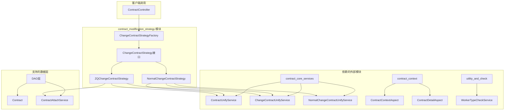
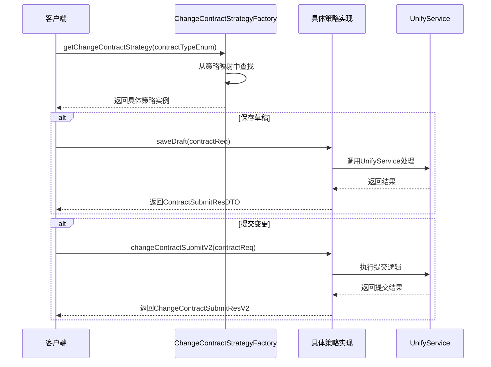
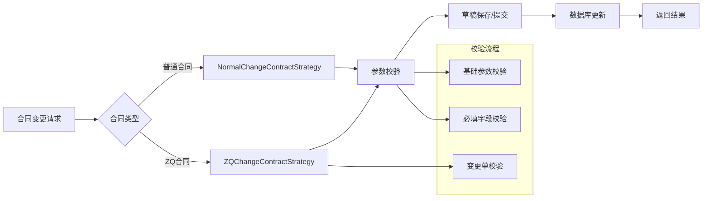
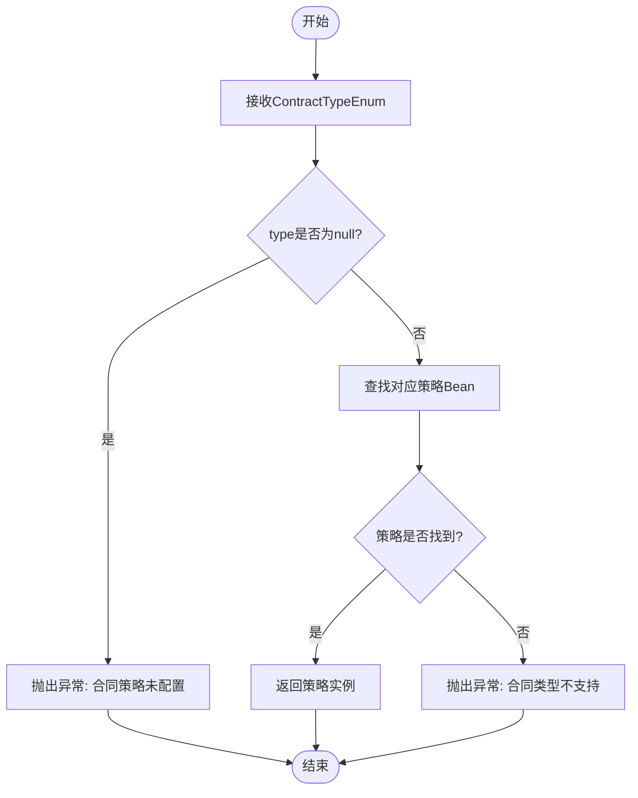
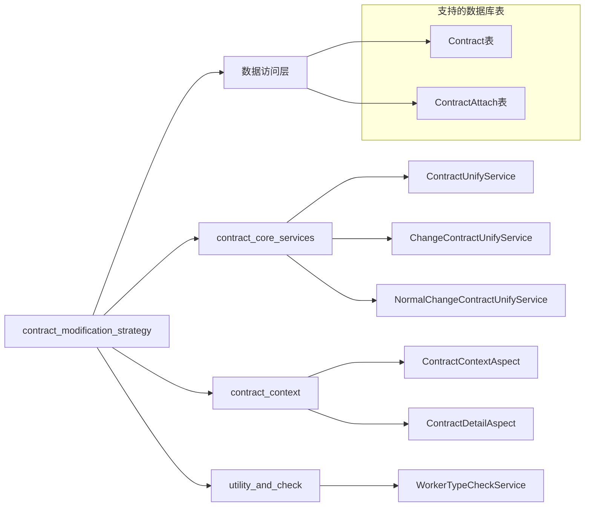

# contract_modification_strategy 模块文档

## 模块概述

`contract_modification_strategy` 模块是合同变更处理系统的核心策略组件，实现了**策略设计模式**，为不同类型的合同变更提供差异化的处理逻辑。该模块通过工厂模式动态选择合适的变更策略，实现了合同变更流程的灵活扩展和解耦。

## 核心功能

### 1. 策略工厂 (ChangeContractStrategyFactory)
- **职责**：作为策略模式的入口，根据合同类型创建和返回对应的变更策略实例
- **核心机制**：
  - 实现 `ApplicationContextAware` 接口，在Spring容器初始化时自动收集所有 `ChangeContractStrategy` 实现类
  - 通过 `ContractTypeEnum` 的 `getChangeContractStrategy()` 方法映射到具体的策略Bean名称
  - 提供统一的 `getChangeContractStrategy()` 方法供外部调用

### 2. 变更策略接口 (ChangeContractStrategy)
定义合同变更的通用操作接口，包括：
- `changeDetail` - 获取变更详情
- `beforeSaveDraftCheck` - 保存草稿前的校验
- `saveDraft` - 保存草稿
- `beforeSubmitCheck` - 提交前的校验
- `changeContractSubmit` / `changeContractSubmitV2` - 提交变更
- `changeContractConfirm` - 确认变更

### 3. 策略实现类

#### NormalChangeContractStrategy (普通变更策略)
- **适用场景**：常规合同变更处理
- **特性**：
  - 调用 `NormalChangeContractUnifyService` 处理详情和提交
  - 简化的校验流程，不包含变更单校验
  - 提供统一的提交接口 (`changeContractSubmitV2`)

#### ZQChangeContractStrategy (ZQ变更策略)
- **适用场景**：需要更严格校验的特殊合同变更（如ZQ项目）
- **特性**：
  - 调用通用的 `ChangeContractUnifyService` 处理详情和提交
  - 包含完整的变更单校验 (`checkChangeOrder`)
  - 同时支持新旧提交接口兼容

## 架构设计

### 模块架构图



### 组件交互图



### 数据流图



### 策略选择流程图



## 模块依赖关系



## 关键流程说明

### 1. 策略初始化流程
1. Spring容器初始化时扫描所有实现 `ChangeContractStrategy` 接口的Bean
2. `ChangeContractStrategyFactory.setApplicationContext()` 被调用，收集所有策略实现
3. 策略Bean以 `BeanName -> Bean` 的映射存储在 `changeContractStrategyMap` 中

### 2. 合同变更处理流程
1. **策略选择**：通过 `ChangeContractStrategyFactory` 获取对应策略
2. **详情获取**：调用 `changeDetail()` 获取合同变更的详细信息
3. **校验处理**：
   - 保存草稿前：`beforeSaveDraftCheck()` 进行基础校验
   - 提交前：`beforeSubmitCheck()` 进行完整校验（包括必填字段校验）
4. **业务处理**：
   - 保存草稿：`saveDraft()` 暂存变更内容
   - 提交变更：`changeContractSubmitV2()` 正式提交变更
   - 确认变更：`changeContractConfirm()` 确认变更完成

### 3. 策略差异对比

| 特性 | NormalChangeContractStrategy | ZQChangeContractStrategy |
|------|------------------------------|--------------------------|
| **适用场景** | 普通合同变更 | 需要严格校验的合同变更 |
| **详情获取** | NormalChangeContractUnifyService | ContractUnifyService |
| **变更单校验** | 无 | checkChangeOrder() |
| **变更合同校验** | checkChangeContractWithoutChangeOrderId() | checkChangeContract() |
| **提交接口** | 统一V2接口 | 支持新旧接口兼容 |
| **依赖服务** | NormalChangeContractUnifyService | ContractAttachService, S3Service |

## 与其他模块的集成

### 1. 与 contract_context 模块集成
- 通过 `ContractContextAspect` 和 `ContractDetailAspect` 获取合同上下文信息
- 在校验流程中依赖上下文数据进行业务规则验证

### 2. 与 contract_core_services 模块集成
- 依赖 `ContractUnifyService` 进行通用合同处理
- 依赖 `ChangeContractUnifyService` 处理变更特有逻辑
- 依赖 `NormalChangeContractUnifyService` 处理普通变更流程

### 3. 与 utility_and_check 模块集成
- 通过 `WorkerTypeCheckService` 进行工人类型校验
- 在变更提交前确保工人类型符合业务要求

## 扩展性设计

该模块采用策略模式设计，具有良好的扩展性：

1. **新合同类型支持**：只需实现 `ChangeContractStrategy` 接口，并注册到Spring容器
2. **策略行为修改**：修改具体策略实现类，不影响工厂和其他策略
3. **配置驱动**：通过 `ContractTypeEnum` 的映射配置决定使用哪个策略

### 新增策略示例
```java
@Component("customChangeContractStrategy")
public class CustomChangeContractStrategy implements ChangeContractStrategy {
    // 实现接口方法...
}
```

在 `ContractTypeEnum` 中添加对应配置：
```java
CUSTOM_TYPE("CUSTOM", "customChangeContractStrategy")
```

## 配置说明

### 策略映射配置
在 `ContractTypeEnum` 中定义合同类型与策略Bean名称的映射关系：

```java
public enum ContractTypeEnum {
    NORMAL_CONTRACT("NORMAL", "normalChangeContractStrategy"),
    ZQ_CONTRACT("ZQ", "zqChangeContractStrategy"),
    // ... 其他类型
}
```

### 异常处理
- 当合同类型为 `null` 时抛出 `NrsBusinessException("合同策略未配置")`
- 当找不到对应策略时抛出 `NrsBusinessException("合同类型不支持")`

## 使用示例

```java
@Service
public class ContractModificationService {
    @Resource
    private ChangeContractStrategyFactory strategyFactory;
    
    public void processContractChange(ContractTypeEnum contractType, ContractReqDTO request) {
        // 1. 获取对应策略
        ChangeContractStrategy strategy = strategyFactory.getChangeContractStrategy(contractType);
        
        // 2. 执行校验
        strategy.beforeSubmitCheck(request);
        
        // 3. 提交变更
        ChangeContractSubmitResV2 result = strategy.changeContractSubmitV2(request);
        
        // 4. 处理结果
        if (result.isSuccess()) {
            // 变更成功处理
        }
    }
}
```

## 最佳实践

1. **策略选择**：根据业务场景选择合适的策略，避免混用
2. **校验顺序**：严格按照 beforeSaveDraftCheck → saveDraft → beforeSubmitCheck → submit 的流程执行
3. **异常处理**：妥善处理策略工厂抛出的异常，提供友好的错误提示
4. **性能考虑**：策略实例由Spring管理，避免每次创建新实例

## 相关模块文档

- [contract_context.md](contract_context.md) - 合同上下文处理模块
- [contract_core_services.md](contract_core_services.md) - 合同核心服务模块
- [utility_and_check.md](utility_and_check.md) - 工具与校验模块