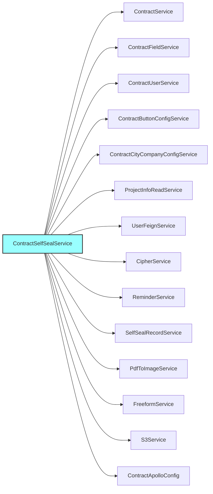
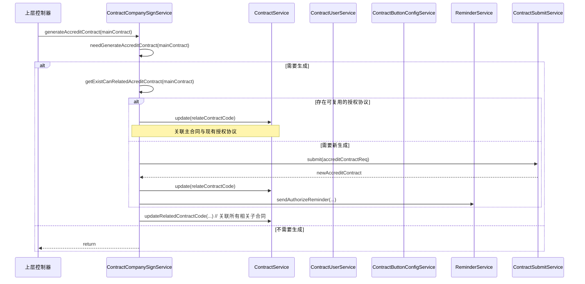
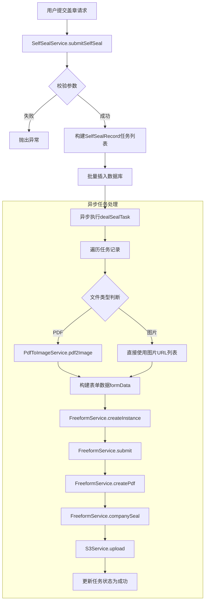

# contract_seal_and_sign 模块文档

## 1. 模块概述

`contract_seal_and_sign` 模块是合同服务 (`contract_core_services`) 中的一个核心子模块，专注于处理合同签约和盖章的关键业务流程。它包含两个主要服务：

1.  **对公签约服务 (ContractCompanySignService)**: 处理“公对公”场景下的在线签约，核心职责是生成、复用和管理授权协议书 (Accredit Contract)。
2.  **自主盖章服务 (ContractSelfSealService)**: 提供非合同场景下的通用文件自助盖章功能，支持对PDF或图片文件进行电子章加盖。

该模块是合同生命周期中“签署”环节的核心实现，连接了合同的准备状态（草稿、待提交）和签署完成状态，并与外部服务（如表单服务、文件存储服务、短信服务）紧密集成。

## 2. 架构与组件关系

### 2.1 模块架构图

```mermaid
graph TB
    subgraph “contract_seal_and_sign 模块”
        A[ContractCompanySignService]
        B[ContractSelfSealService]
    end

    subgraph “依赖的内部服务/组件”
        C[合同核心服务<br>(ContractService, ContractFieldService, ContractUserService)]
        D[合同配置与按钮服务<br>(ContractButtonConfigService, ContractCityCompanyConfigService)]
        E[项目与用户服务<br>(ProjectInfoReadService, UserFeignService)]
        F[通用业务服务<br>(CommonBusinessService, CipherService, S3Service)]
        G[文件与表单服务<br>(FreeformService, PdfToImageService)]
        H[提醒服务<br>(ReminderService)]
    end

    subgraph “外部系统/依赖”
        I[表单渲染平台<br>(Freeform)]
        J[对象存储服务<br>(S3)]
        K[短信服务]
        L[支付服务]
    end

    A --> C
    A --> D
    A --> E
    A --> F
    A --> H
    A --> L

    B --> G
    B --> F
    B --> J
    B --> I

    G --> I
    G --> J
    H --> K
    F --> J
```

### 2.2 核心组件依赖关系图



### 2.3 数据流图

#### 2.3.1 对公签约 - 授权协议书生成与关联流程



#### 2.3.2 自主盖章 - 任务处理流程



### 2.4 组件交互图 - 授权列表查询

```mermaid
graph TB
    subgraph “请求流程”
        A[前端] --> B[ContractCompanySignService.getContractAuthList]
    end

    B --> C[获取项目下所有合同]
    C --> D[过滤出主合同]
    D --> E[获取关联的授权协议列表]
    E --> F[获取登录用户信息]
    F --> G[过滤用户可见的授权协议]
    G --> H[获取合同用户信息]
    H --> I[组装返回数据DTO]
    I --> J[返回合同列表、状态、按钮配置]
    J --> A

    subgraph “依赖服务调用”
        C --> CS[ContractService]
        F --> UFS[UserFeignService]
        F --> CSVC[CipherService]
        H --> CUS[ContractUserService]
        I --> CBDS[ContractButtonConfigService]
    end
```

## 3. 核心功能详解

### 3.1 对公签约服务 (ContractCompanySignService)

#### 3.1.1 主要职责
-   **授权协议书生命周期管理**: 根据对公合同（正签、变更等）在线签署的触发条件，自动判断是否需要生成授权协议书。
-   **协议复用优化**: 在同一项目下，针对相同的甲乙双方主体、法人及代理人，复用已生成的授权协议书，避免重复生成。
-   **授权协议列表与详情**: 提供C端和B端查询授权协议列表及详情的接口，包含状态、关联合同信息及操作按钮。
-   **提醒触发**: 在生成或关联授权协议后，触发短信等提醒，通知相关人员进行签署。

#### 3.1.2 核心方法
-   `generateAccreditContract(Contract contract)`: 触发授权协议书生成的入口方法。内部逻辑包括判断条件、复用查找、新生成、关联等步骤。
-   `getAccreditContractList(...)`: 获取授权协议列表，用于C端客户查看。
-   `getContractAuthInfo(...)`: 获取授权协议详情，包含项目信息、签约人信息、授权状态等。

#### 3.1.3 业务规则
-   **生成条件**: 必须是线上签约、对公合同、特定合同类型（正签、首期款、变更等）。
-   **复用规则**: 项目ID、我方分公司(`companyCode`)、甲方信用代码(`companyCreditCode`)、法人证件号、代理人证件号全部匹配时，可复用授权协议。
-   **关联关系**: 一个授权协议可关联多个主合同（1:N）。

### 3.2 自主盖章服务 (ContractSelfSealService)

#### 3.2.1 主要职责
-   **盖章主体配置管理**: 从Apollo配置中心读取可操作的盖章分公司信息。
-   **盖章任务创建与执行**: 接收用户提交的文件（PDF或图片），创建异步盖章任务，调用Freeform服务生成带电子章的PDF并存储。
-   **任务查询与重试**: 提供盖章任务列表查询功能，并支持失败任务的重新盖章。

#### 3.2.2 核心方法
-   `getSelfSealCompanyInfos()`: 获取当前登录用户可操作的盖章主体分公司列表。
-   `submitSelfSeal(SelfSealSubmitDTO)`: 提交盖章请求。校验参数后，构建任务记录并触发异步处理。
-   `getSelfSealList(...)`: 分页查询盖章任务列表。
-   `reSeal(Long id)`: 对指定任务进行重新盖章（用于失败重试）。

#### 3.2.3 技术实现
-   **异步处理**: 使用`CompletableFuture.runAsync`异步执行耗时的盖章任务，避免阻塞主线程。
-   **外部服务集成**:
    -   **Freeform服务**: 创建表单实例、提交表单数据、生成PDF、进行电子章加盖。
    -   **S3服务**: 存储生成的带章PDF文件，并提供临时访问URL。
    -   **PdfToImage服务**: 当源文件为PDF时，先将其转换为图片以便于表单渲染。

## 4. 与其他模块的集成

本模块是合同流程中的关键一环，与多个模块紧密协作：

-   **[contract_detail_and_config](contract_detail_and_config.md)**: 依赖`ContractButtonConfigService`来确定在授权列表中展示哪些操作按钮（如“查看”、“签署”）。依赖`ContractFieldCheckService`和`ContractDetailService`进行数据获取和校验。
-   **[contract_draft_and_process_control](contract_draft_and_process_control.md)**: 在生成授权协议书时，可能调用`ContractSaveDraftService`（通过`ContractSubmitService`）来创建新的协议合同草稿。
-   **[terminal_pdf_and_material](terminal_pdf_and_material.md)**: 虽然本模块自身处理PDF生成（针对授权协议），但`ContractSelfSealService`的PDF处理依赖于通用的`FreeformService`，这与终端合同PDF的生成路径可能部分重叠。
-   **[utility_and_check](utility_and_check.md)**: 可能在某些流程中共享基础的工具类或检查逻辑。