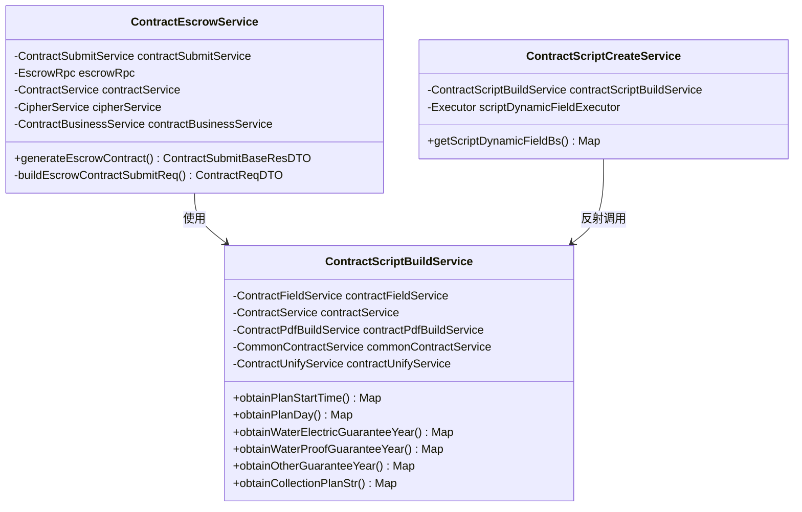
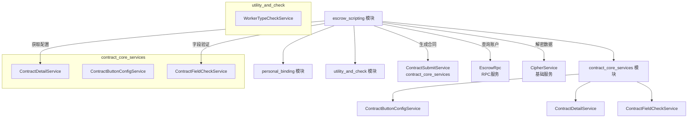
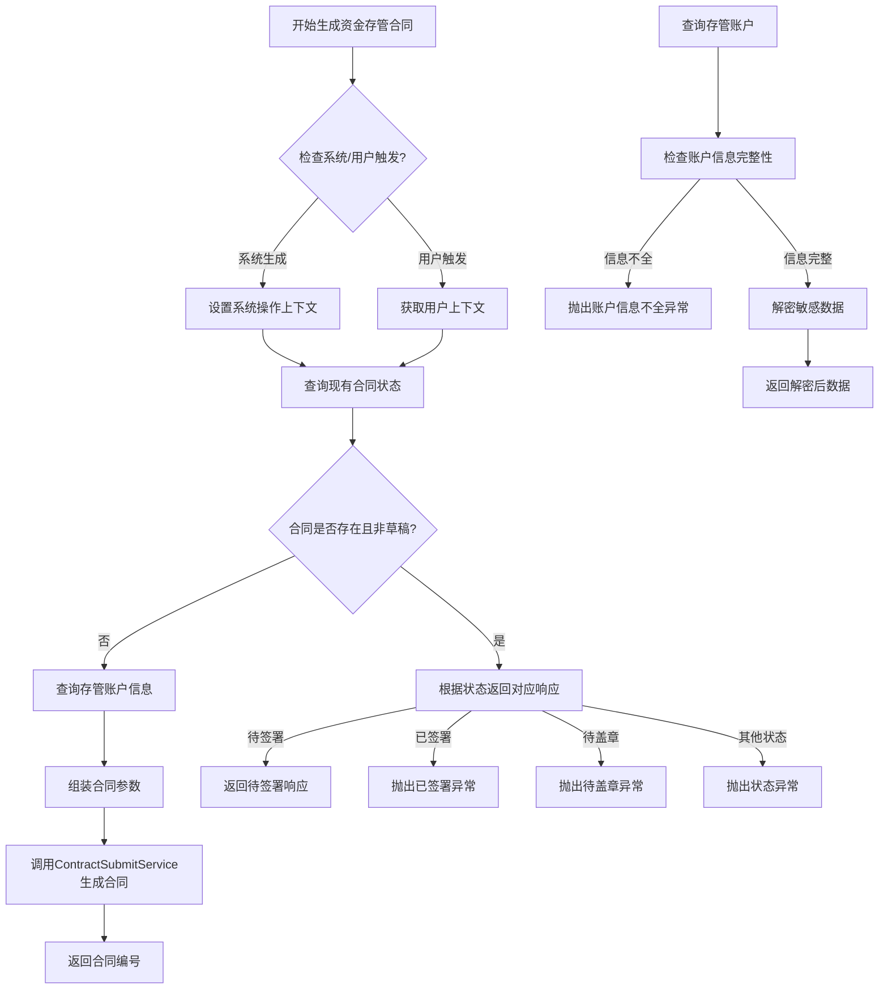
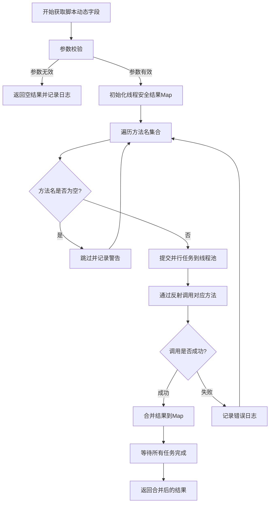

# escrow_scripting 模块文档

## 概述

`escrow_scripting` 模块是合同管理系统中的核心业务模块，专注于资金存管合同（Fund Escrow Contract）的业务逻辑处理。该模块负责处理与资金存管合同相关的合同生成、脚本动态字段构建等业务场景，为前端提供标准化的合同数据处理和脚本生成能力。

## 核心功能

### 1. 资金存管合同生成
- **ContractEscrowService**：处理资金存管合同的生成逻辑，支持系统自动生成和用户触发两种模式
- 实现幂等性控制，避免重复生成合同
- 处理合同状态流转逻辑（草稿、待签署、待盖章等状态）

### 2. 合同脚本动态字段构建
- **ContractScriptBuildService**：提供各类合同脚本动态字段的数据获取服务
- 包括工期、保修期、收款计划等关键业务字段的计算和格式化

### 3. 批量动态字段获取
- **ContractScriptCreateService**：提供高效的并行字段获取能力
- 通过反射机制动态调用字段获取方法，提升系统扩展性

## 架构与组件关系

### 模块内部架构



### 与系统其他模块的交互



## 数据流与处理流程

### 资金存管合同生成流程



### 脚本动态字段获取流程



## 关键服务说明

### 1. ContractEscrowService（资金存管合同服务）

**职责**：处理资金存管合同的完整生命周期管理

**核心方法**：
- `generateEscrowContract()`：生成资金存管合同，支持系统自动生成和用户触发
- `buildEscrowContractSubmitReq()`：组装合同生成所需的业务参数

**业务规则**：
1. **幂等性控制**：同一项目订单的合同只能生成一次
2. **状态流转管理**：根据合同当前状态返回不同的处理结果
3. **数据完整性校验**：确保存管账户信息完整且解密成功

### 2. ContractScriptBuildService（合同脚本构建服务）

**职责**：提供合同脚本所需的各类动态字段数据

**提供的字段获取方法**：
| 方法名 | 功能 | 数据来源 |
|--------|------|----------|
| `obtainPlanStartTime()` | 获取计划开工日期 | ContractField |
| `obtainPlanDay()` | 获取工期 | ContractField |
| `obtainWaterElectricGuaranteeYear()` | 获取水电保修期 | ContractBusinessConfig |
| `obtainWaterProofGuaranteeYear()` | 获取防水保修期 | ContractBusinessConfig |
| `obtainOtherGuaranteeYear()` | 获取其他保修期 | ContractBusinessConfig |
| `obtainCollectionPlanStr()` | 获取收款计划 | CommonContractService |

### 3. ContractScriptCreateService（脚本创建服务）

**职责**：提供高效的批量字段获取能力

**核心特性**：
- **并行处理**：使用自定义线程池并行调用多个字段获取方法
- **反射机制**：通过反射动态调用方法，支持灵活的字段扩展
- **错误隔离**：单个字段获取失败不影响其他字段的获取

## 依赖关系分析

### 直接依赖模块
1. **contract_core_services**：依赖合同核心服务进行合同操作
2. **personal_binding**：依赖个人绑定服务处理用户签名相关逻辑
3. **utility_and_check**：依赖工具检查服务进行业务规则验证

### 核心依赖组件
| 组件 | 所属模块 | 用途 |
|------|----------|------|
| ContractSubmitService | contract_core_services | 合同提交和生成 |
| ContractService | DAO层 | 合同数据访问 |
| EscrowRpc | RPC层 | 存管账户信息查询 |
| CipherService | 基础服务层 | 敏感数据解密 |
| ContractBusinessService | contract_core_services | 合同业务配置 |

## 配置与扩展点

### 线程池配置
```java
@Resource(name = "scriptDynamicFieldExecutor")
private Executor scriptDynamicFieldExecutor;
```
- 可配置线程池大小、队列类型等参数以优化并行处理性能

### 业务配置扩展
- 保修期等业务参数通过 `ContractBusinessConfig` 配置，支持按业务类型和渠道进行差异化配置
- 字段获取方法可通过反射机制动态扩展，无需修改核心代码

## 最佳实践与注意事项

### 1. 合同生成场景
- 系统自动生成时需确保操作上下文正确设置
- 处理并发生成请求时注意幂等性控制
- 及时处理异常状态的合同数据

### 2. 脚本字段获取场景
- 合理设置线程池参数，避免资源耗尽
- 对反射调用的方法名进行白名单校验
- 监控并行任务执行性能，及时优化

### 3. 错误处理
- 区分业务异常和系统异常，使用适当的日志级别
- 关键操作需要记录完整的业务上下文
- 敏感信息处理要符合安全规范

## 相关文档

- [contract_core_services 模块文档](contract_core_services.md) - 合同核心服务
- [personal_binding 模块文档](personal_binding.md) - 个人绑定与签名服务
- [utility_and_check 模块文档](utility_and_check.md) - 工具类与检查服务
- [terminal_pdf_and_material 模块文档](terminal_pdf_and_material.md) - PDF生成与物料处理

## 版本历史

| 版本 | 日期 | 变更说明 |
|------|------|----------|
| v1.0 | 初始版本 | 基础功能实现，包括合同生成和脚本字段获取 |
| v1.1 | 性能优化 | 引入并行处理机制，优化字段获取性能 |
| v1.2 | 架构优化 | 完善错误处理机制，增强系统稳定性 |