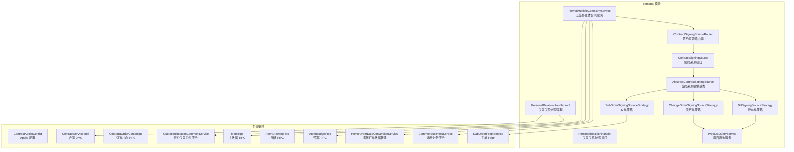
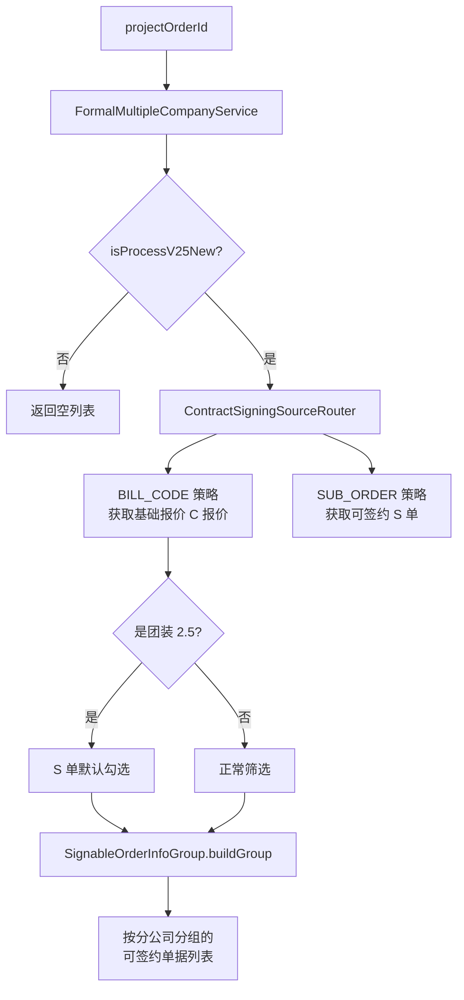
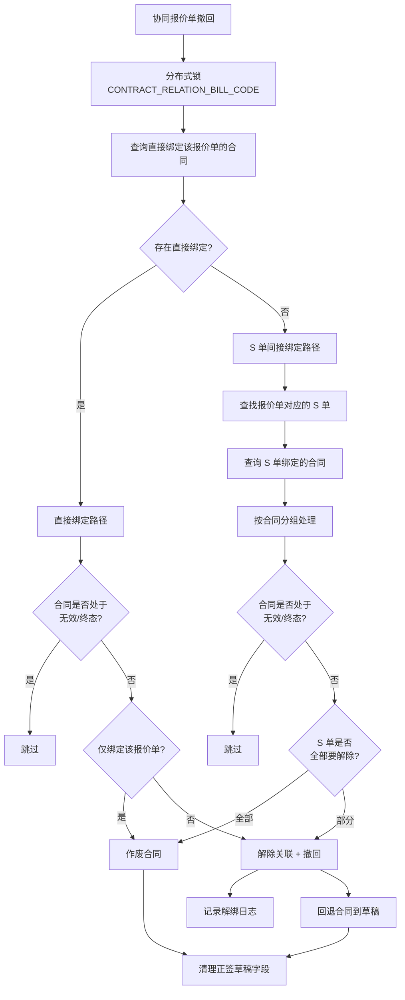
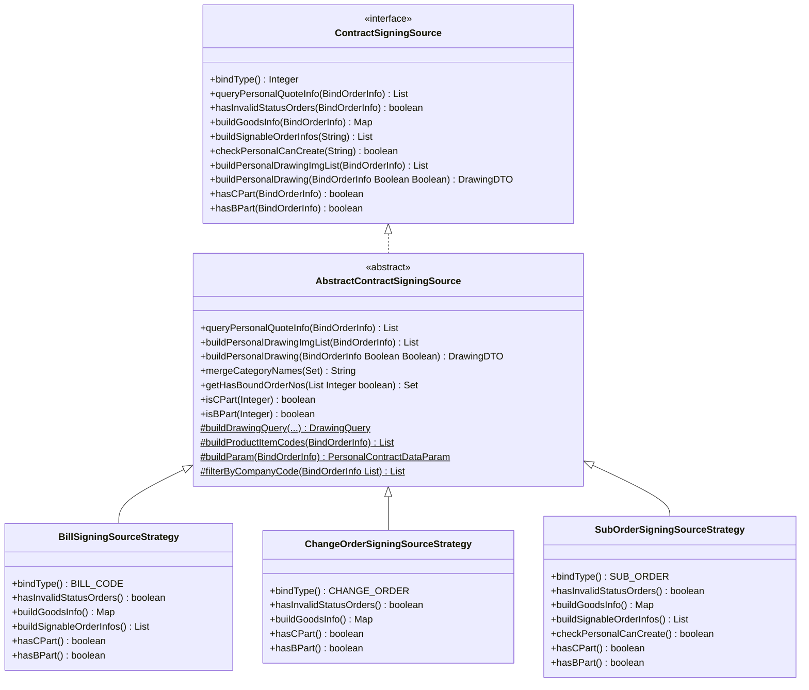
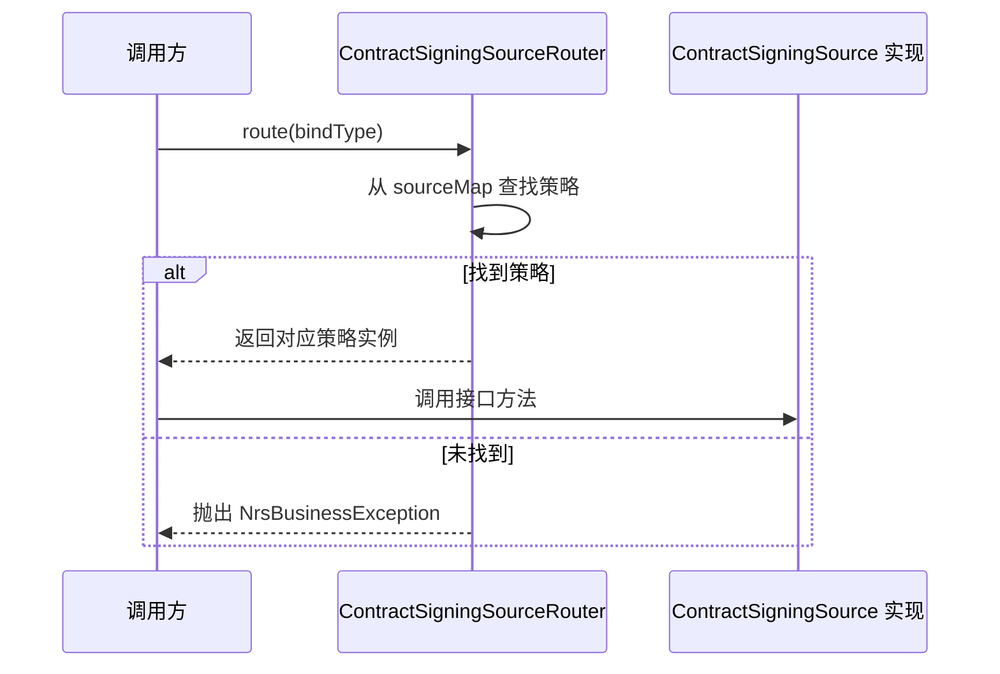
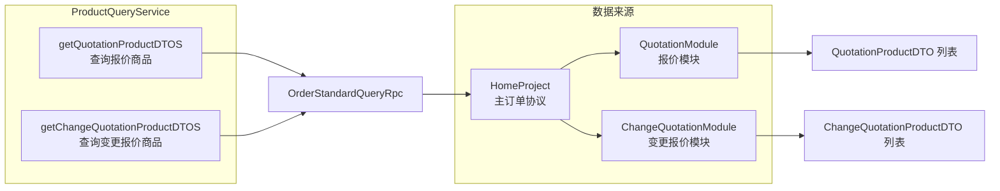
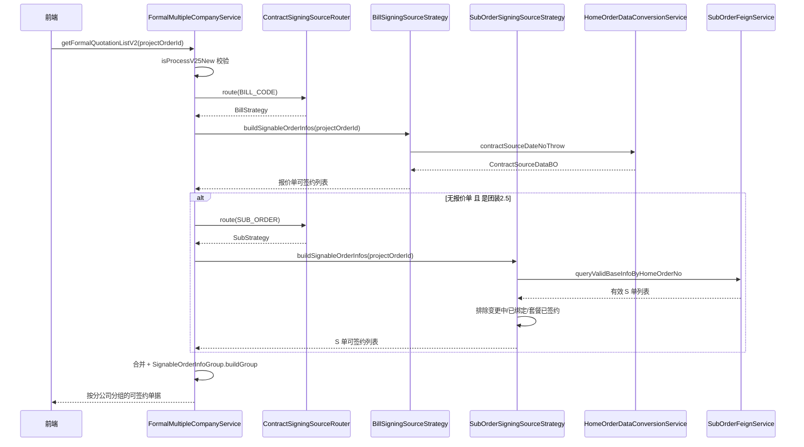
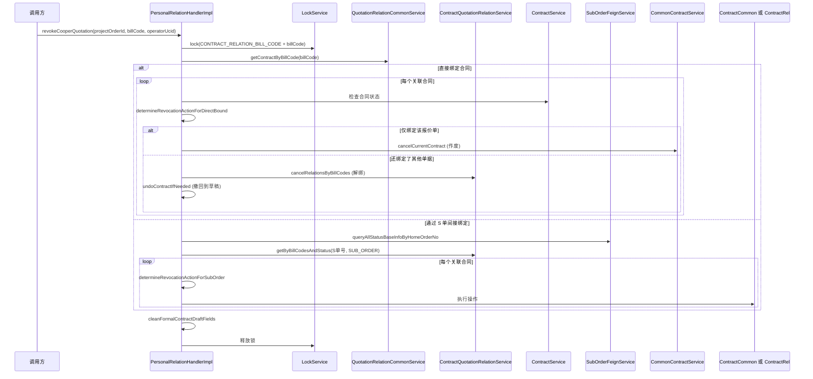

Now I have a thorough understanding of the module. Here is the comprehensive documentation:

# Personal 模块 — 个性化合同服务

## 模块概述

`personal` 模块是销售合同系统（`service.contract.v2`）中的核心子模块，负责处理**个性化合同**的签约数据准备、多主体（分公司）合同发起、以及合同与报价单/S 单/变更单之间的关联关系管理。

本模块解决的核心业务问题：家装项目中，一个主订单可能涉及多个分公司的报价单（C 报价）、协同报价单、变更单、以及 S 单（子订单），需要将这些不同类型的单据按业务规则筛选、分组后绑定到销售合同上，并在撤回/作废时正确处理关联关系的级联变更。

---

## 架构总览

---

## 核心组件详解

### 1. FormalMultipleCompanyService — 正签多主体合同服务

**职责**：在正签发起弹窗中，汇总所有可签约的 C 报价单和协同报价单信息，按分公司（主体）分组后返回给前端，供用户选择签约。

**核心方法**：

| 方法 | 状态 | 说明 |
|------|------|------|
| `getFormalQuotationList` | `@Deprecated` | 旧版：直接构建 `FormalSealInfo` 列表，按分公司分组 |
| `getFormalQuotationListV2` | 当前使用 | 新版：通过 `ContractSigningSourceRouter` 路由获取可签约单据，返回 `SignableOrderInfoGroup` |
| `getFormalQuotationInfoList` | `@Deprecated` | 旧版：获取基础报价内的 C 报价信息 |
| `getCooperQuoteInfoList` | 旧版辅助 | 获取协同报价单信息，过滤已关联/不可签约的单据 |
| `getNotSupportSignBillCodeList` | 辅助 | 通过 Atom 预算服务查询不支持签约的变更协同报价单 |

**关键业务规则**：
- 整装模式下，与正签同主体的协同报价单会合并到正签 C 报价中，不同主体的单独列出
- 团装 2.5 场景下，即使没有报价单也继续查询 S 单，且 S 单默认全部勾选
- 已发起过个性化合同的协同报价单不再可选
- 变更单状态不是"待签约"或"已完成"的不可签约

---

### 2. PersonalRelationHandler — 关联关系处理器

**职责**：处理个性化合同与报价单/S 单之间的绑定关系变更，核心场景为**协同报价单撤回**时的级联处理。

**核心枚举 — ContractRevocationAction**：

| 操作 | 含义 | 触发条件 |
|------|------|----------|
| `CANCEL_CONTRACT` | 作废合同 | 合同仅绑定了被撤回的单据 |
| `UNBIND_AND_UNDO` | 解除关联并撤回 | 合同还绑定了其他有效单据 |
| `SKIP` | 跳过 | 合同已作废/已签约/已确认 |

**关键设计**：
- 使用分布式锁（`LockService`）保证协同报价单撤回与换绑操作互斥
- 支持两条路径：报价单直接绑定合同 vs 报价单先下单变成 S 单再绑定合同
- 解绑后自动清理正签草稿中的协同报价单号和 S 单号字段
- 解绑日志记录到 `ContractBindLogService`

---

### 3. ContractSigningSource 策略体系

**职责**：将不同类型的签约来源（报价单、变更单、S 单）抽象为统一接口，通过策略模式实现差异化处理。

---

### 4. ContractSigningSourceRouter — 路由器

**职责**：基于 `BindTypeEnum` 将请求路由到对应的策略实现。

路由器在构造时通过 Spring 注入所有 `ContractSigningSource` 实现，自动构建 `bindType → 策略实例` 的映射表。三种策略对应的 `BindTypeEnum`：

| 策略 | BindTypeEnum | 说明 |
|------|-------------|------|
| `BillSigningSourceStrategy` | `BILL_CODE` | 基础报价单/协同报价单 |
| `ChangeOrderSigningSourceStrategy` | `CHANGE_ORDER` | 变更单 |
| `SubOrderSigningSourceStrategy` | `SUB_ORDER` | S 单（子订单） |

---

### 5. ProductQueryService — 商品查询服务

**职责**：封装从主订单协议中查询报价商品和变更报价商品的通用逻辑，供各策略复用。

---

## 三种策略对比

| 维度 | BillSigningSourceStrategy | ChangeOrderSigningSourceStrategy | SubOrderSigningSourceStrategy |
|------|--------------------------|----------------------------------|-------------------------------|
| **绑定类型** | 报价单 (`BILL_CODE`) | 变更单 (`CHANGE_ORDER`) | S 单 (`SUB_ORDER`) |
| **状态校验** | 查询预算服务，排除调整中/已删除/已取消 | 查询变更流程状态，仅待签约/已完成可签约 | 查询 S 单状态，排除无效状态 |
| **商品信息** | 通过报价单号查 SKU，取内控类目名 | 通过变更单号查 SKU，取内控类目名 | 通过 S 单号查子单商品行，取前/后端类目名 |
| **可签约单据构建** | 从家居订单数据中获取个性化报价数据 | 不支持（返回空） | 查询有效 S 单，排除变更中/已绑定/套餐已签约的 |
| **图纸查询** | 标准图纸查询 | 标准图纸查询 + 暂存态图纸 | 标准图纸查询 |
| **C/B 部分判断** | 通过 `ProductQueryService` 查报价商品 | 通过 `ProductQueryService` 查变更商品 | 通过子单商品行的 `purchaseType` 判断 |
| **主体过滤** | 按 `billCode_companyCode` 过滤 | 按 `changeOrderId_companyCode` 过滤 | 不过滤（S 单单主体） |

---

## 数据流

### 正签弹窗数据流

### 撤回协同报价数据流

---

## 外部依赖关系

```mermaid
graph TD
    subgraph personal[personal 模块]
        direction TB
        A[FormalMultipleCompanyService]
        B[PersonalRelationHandlerImpl]
        C[BillSigningSourceStrategy]
        D[ChangeOrderSigningSourceStrategy]
        E[SubOrderSigningSourceStrategy]
        F[ProductQueryService]
    end

    subgraph rpc[RPC / Feign 服务]
        BudgetRpc[AtomBudgetRpc<br/>预算查询]
        MdmSvc[MdmRpc<br/>主数据/分公司]
        DrawingSvc[AtomDrawingRpc<br/>图纸服务]
        SubOrderSvc[SubOrderFeignService<br/>子单查询]
        OrderStdRpc[OrderStandardQueryRpc<br/>标准订单查询]
        OrderCenterRpc[ContractOrderCenterRpc<br/>订单中心]
    end

    subgraph dao[DAO 层]
        ContractDao[ContractServiceImpl]
        QuotationRelDao[ContractQuotationRelationService]
        RelationDao[ContractRelationService]
    end

    subgraph service[同层服务]
        CommonBiz[CommonBusinessService<br/>通用业务判断]
        HomeDataSvc[HomeOrderDataConversionService<br/>家居数据转换]
        QuotationRelCommon[QuotationRelationCommonService<br/>报价关联公共]
        CommonContract[CommonContractService<br/>合同通用操作]
        LockSvc[LockService<br/>分布式锁]
        BindLog[ContractBindLogService<br/>绑定日志]
        FieldHandler[ContractFieldHandler<br/>合同字段处理]
        HomePcCommon[HomeAndPcCommonService<br/>合同撤回]
    end

    A --> BudgetRpc
    A --> MdmSvc
    A --> OrderCenterRpc
    A --> CommonBiz
    A --> HomeDataSvc
    B --> QuotationRelCommon
    B --> ContractDao
    B --> QuotationRelDao
    B --> RelationDao
    B --> CommonContract
    B --> LockSvc
    B --> BindLog
    B --> FieldHandler
    B --> HomePcCommon
    B --> SubOrderSvc
    C --> BudgetRpc
    C --> OrderStdRpc
    D --> BudgetRpc
    D --> OrderStdRpc
    E --> SubOrderSvc
    E --> MdmSvc
    F --> OrderStdRpc
```

---

## 关键设计模式

### 1. 策略模式（Strategy Pattern）

`ContractSigningSource` 接口 + `ContractSigningSourceRouter` 路由器构成了经典的策略模式。三种绑定类型（报价单、变更单、S 单）各自封装了差异化逻辑（状态校验、商品查询、可签约筛选），同时共享 `AbstractContractSigningSource` 中的通用实现（个性化报价查询、图纸构建、C/B 部分判断）。

**新增绑定类型时**：只需新建 `AbstractContractSigningSource` 子类，实现 `bindType()` 和各抽象方法，无需修改路由或调用方代码。

### 2. 模板方法模式（Template Method Pattern）

`AbstractContractSigningSource` 中定义了算法骨架（如 `queryPersonalQuoteInfo` 的 3 步流程：构建参数 → 执行查询 → 过滤），将可变步骤（`buildParam`、`buildDrawingQuery`、`filterByCompanyCode`、`buildProductItemCodes`）留给子类实现。

### 3. 策略分支（Branching via Enum）

`PersonalRelationHandlerImpl` 中的 `ContractRevocationAction` 枚举实现了细粒度的撤回策略分支，根据合同绑定关系的复杂度决定作废、解绑撤回还是跳过。

---

## 与其他模块的关系

| 相关模块 | 关系说明 |
|---------|---------|
| [ContractDependentDataService](ContractDependentDataService.md) | 本模块调用其 `groupPersonalForFormal` 判断团装是否需要处理个性化报价 |
| [QuotationRelationCommonService](QuotationRelationCommonService.md) | 本模块依赖其查询报价单与合同的绑定关系 |
| [ContractSigningSourceRouter](ContractSigningSourceRouter.md) | 路由器是本模块的策略调度核心，由 `FormalMultipleCompanyService` 调用 |
| [ContractFieldHandler](ContractFieldHandler.md) | `PersonalRelationHandlerImpl` 在撤回时调用其清理正签草稿字段 |
| [ContractBindLogService](ContractBindLogService.md) | `PersonalRelationHandlerImpl` 在解绑时记录操作日志 |

---

## 注意事项

1. **废弃方法迁移**：`getFormalQuotationList`、`getFormalQuotationInfoList` 已标记 `@Deprecated`，新逻辑应使用 `getFormalQuotationListV2` + 策略路由模式
2. **分布式锁**：`revokeCooperQuotation` 操作需要获取分布式锁，锁 key 为 `CONTRACT_RELATION_BILL_CODE + billCode`，超时时间 10 秒
3. **Apollo 开关**：旧版 `getFormalQuotationList` 依赖 `contractApolloConfig.getOpenFormalMultiple()` 开关，V2 版本已移除此开关控制
4. **业务类型判断**：`shouldProcessPersonalContractData` 仅对整装全包（REFORM_ALL）和房产证（HOUSE_CERTIFICATE）业务类型返回 true，团装由上层单独处理