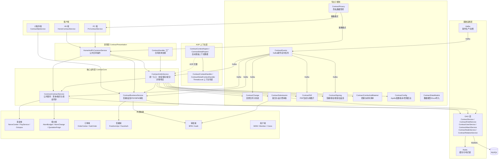

# Contract 仓库概览文档

## 1. 仓库目的

Contract 仓库是一个**装修业务合同管理系统**，负责管理家装合同的全生命周期。系统覆盖以下核心业务：

- **合同创建**：支持正签合同、个性化销售合同、首期款合同、设计合同、变更合同、解约协议、补充协议、和解协议等多种合同类型
- **合同签署**：支持线上签署（电子签章）、线下签署、公对公签署、协议确认等多种签约方式
- **合同管理**：草稿保存、提交发起、审核审批、PDF 生成、盖章签署、变更管理、合同完成/作废等完整业务链路
- **业务适配**：覆盖家装整装、翻新全案、局装、团装、零售等多种业务场景

---

## 2. 端到端架构



---

## 3. 核心模块文档索引

| 模块 | 职责 | 关键设计模式 | 文档 |
|------|------|-------------|------|
| **ContractCore** | 合同核心服务层：公共服务、业务服务、统一入口、AOP上下文、合并发起、字段校验、报价单关联 | AOP切面、ThreadLocal、策略模式、工厂模式、反射调用 | [ContractCore.md](ContractCore.md) |
| **ContractChange** | 变更合同子系统：变更创建、差异计算、草稿保存、提交、确认、撤回审核 | 策略模式（Normal/ZQ 变更）、工厂模式 | [ContractChange.md](ContractChange.md) |
| **ContractSubmission** | 合同提交服务：提交发起、PDF并行生成、设计费审核BPM、补充协议BPM | 策略模式（审核校验）、模板方法 | [ContractSubmission.md](ContractSubmission.md) |
| **ContractPdf** | PDF生成子系统：字段映射、版式/自生成两种策略、PDF转图片、文件处理 | 策略模式（按业务类型差异化PDF生成）、工厂模式 | [ContractPdf.md](ContractPdf.md) |
| **ContractSigning** | 签署子系统：线上签署、公司盖章、代理人授权、视频观看、人脸识别、正签重签 | 策略模式 | [ContractSigning.md](ContractSigning.md) |
| **ContractComboAndMaterial** | 套餐信息与材料清单：套餐配置查询、材料清单PDF生成与差异比对 | 模板方法 | [ContractComboAndMaterial.md](ContractComboAndMaterial.md) |
| **ContractConfig** | 配置中心：Apollo动态配置、城市分公司配置、配置版本管理、管理后台工具 | 工厂模式 | [ContractConfig.md](ContractConfig.md) |
| **ContractEvents** | 事件驱动：Kafka事件生产/消费（合同生命周期事件）、定时任务（BPM补偿、字段巡检、隐私预警） | 观察者/事件驱动模式 | [ContractEvents.md](ContractEvents.md) |
| **ContractPrivacy** | 隐私管控：敏感信息访问的策略化解密、访问记录、频率预警 | 策略模式、工厂模式 | [ContractPrivacy.md](ContractPrivacy.md) |
| **ContractPresentation** | 表现层：H5端/PC端/小程序端的合同展示、表单处理、合同讲解脚本 | 工厂模式、模板方法 | [ContractPresentation.md](ContractPresentation.md) |
| **ContractDataModels** | 数据模型：Excel配置导入生成SQL、BO/DTO数据模型定义 | — | [ContractDataModels.md](ContractDataModels.md) |

---

## 4. 关键业务流程概览

### 合同类型体系

| 合同类型 | 说明 |
|---------|------|
| PACKAGE_FORMAL | 正式套餐合同（正签） |
| ADVANCE | 首期款合同 |
| PERSONAL | 个性化销售合同 |
| DESIGN | 设计合同 |
| PACKAGE_CHANGE / DESIGN_CHANGE | 正签/设计变更合同 |
| TERMINAL | 解约协议 |
| SUPPLEMENT | 补充协议 |
| SETTLEMENT | 和解协议 |

### 合同状态流转

```
草稿 → 提交发起 → [审核] → 待用户签署/确认 → 公司盖章 → 完成
                      ↓
                   审核驳回 → 回退草稿
```

### 核心设计模式总结

| 模式 | 应用场景 |
|------|---------|
| **策略模式** | 签约源路由、变更合同策略、PDF生成策略、隐私操作策略、审核校验策略 |
| **AOP切面** | 合同上下文数据自动准备与清理（项目/报价/图纸/套餐信息并行获取） |
| **ThreadLocal** | 请求级上下文数据传递，避免重复RPC调用 |
| **事件驱动** | Kafka消息驱动合同状态变更后的异步后续处理（盖章、短信、资金同步、PDF转图片） |
| **工厂模式** | 策略路由（签约源、变更策略、PDF策略、隐私策略） |
| **反射调用** | 基于配置名称动态调用校验/条件方法（字段校验、合并发起计算） |