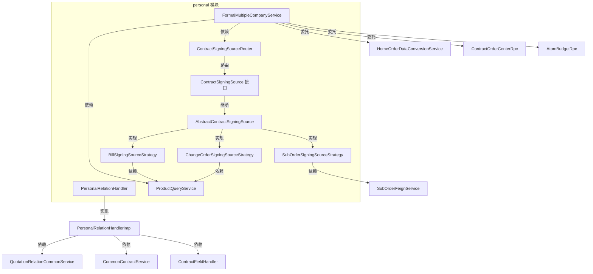
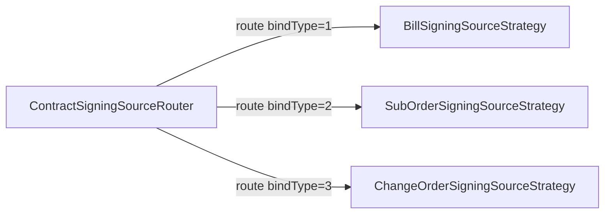
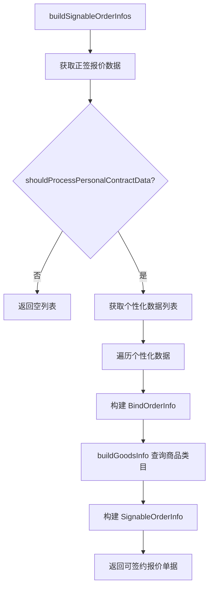
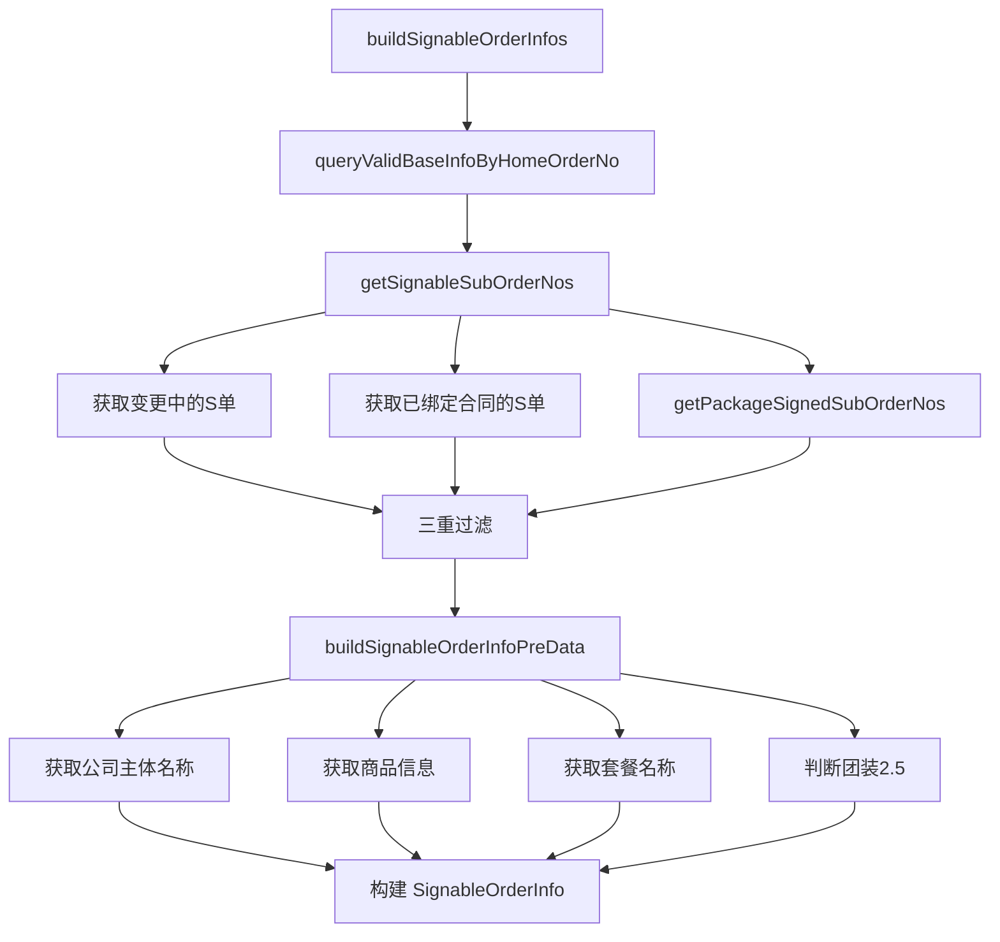
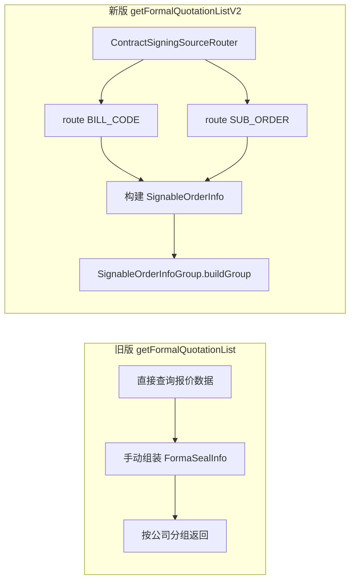
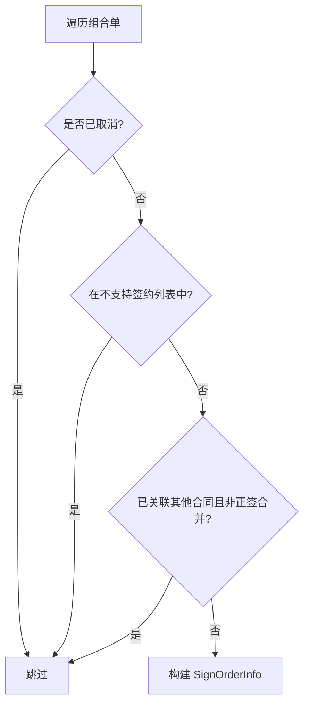
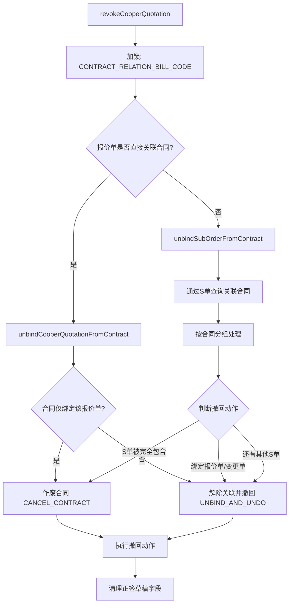
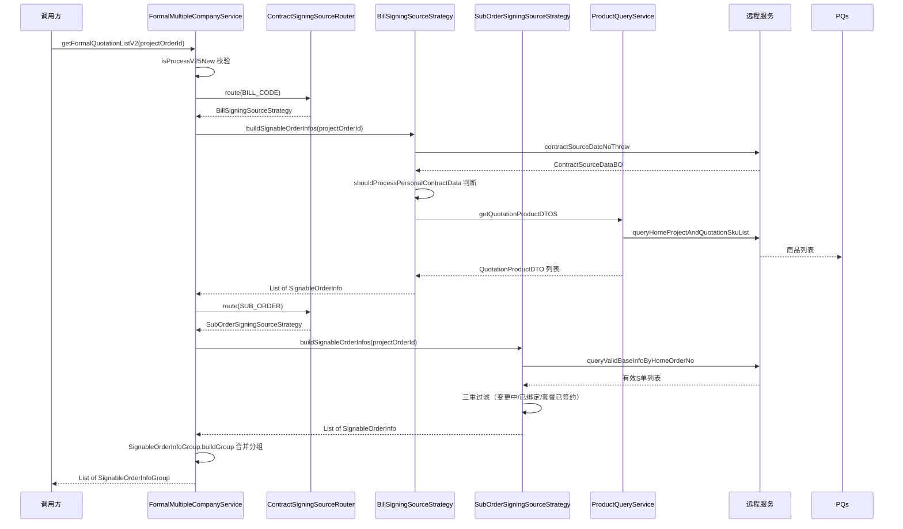
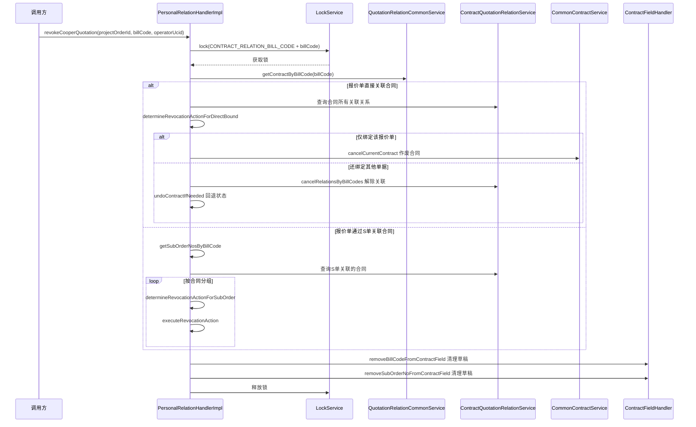

# Personal 模块文档

## 1. 模块概述

`personal` 模块位于 `com.ke.utopia.nrs.salesproject.service.contract.v2.personal` 包下，是销售合同系统中**个性化合同**的核心业务模块。该模块负责处理个性化合同的签约单据来源管理、正签多主体合同的报价获取、以及合同与报价单/S单的关联关系撤回等关键业务场景。

### 核心职责

| 职责 | 说明 |
|------|------|
| **签约单据路由** | 根据绑定类型（报价单/变更单/S单）路由到不同的签约来源策略 |
| **正签报价聚合** | 获取正签发起时可选择的C报价信息，支持多主体分公司场景 |
| **关联关系撤回** | 处理协同报价单撤回时，解绑合同与报价单/S单的关联关系 |
| **商品信息构建** | 统一处理报价单、变更单、S单的商品信息和图纸查询 |

---

## 2. 架构总览

---

## 3. 核心组件详解

### 3.1 ContractSigningSourceRouter — 签约来源路由器

**设计模式**：策略模式 + 路由注册

`ContractSigningSourceRouter` 是整个签约来源体系的入口路由器。它在构造时通过 Spring 的依赖注入收集所有 `ContractSigningSource` 实现，并以 `bindType` 为键构建映射表。

**路由逻辑**：调用方传入 `bindType`（绑定类型枚举），路由器返回对应的策略实现。若 `bindType` 为空或无匹配实现，则抛出 `NrsBusinessException`。

**相关枚举**（`BindTypeEnum`）：

| 枚举值 | 说明 |
|--------|------|
| `BILL_CODE` | 报价单绑定 |
| `SUB_ORDER` | S单绑定 |
| `CHANGE_ORDER` | 变更单绑定 |

---

### 3.2 ContractSigningSource — 签约来源抽象接口

定义了个性化合同签约来源的统一契约，所有策略实现均需遵守此接口。

| 方法 | 返回类型 | 说明 |
|------|----------|------|
| `bindType()` | `Integer` | 返回该策略对应的绑定类型枚举值 |
| `queryPersonalQuoteInfo(BindOrderInfo)` | `List<PersonalContractData>` | 查询个性化报价信息 |
| `hasInvalidStatusOrders(BindOrderInfo)` | `boolean` | 校验是否存在无效状态的单据 |
| `buildGoodsInfo(BindOrderInfo)` | `Map<String, String>` | 构建商品信息（单据号→商品描述） |
| `buildSignableOrderInfos(String)` | `List<SignableOrderInfo>` | 构建可签约单据列表（弹窗使用） |
| `checkPersonalCanCreate(String)` | `boolean` | 校验是否存在可签约单据 |
| `buildPersonalDrawingImgList(BindOrderInfo)` | `List<String>` | 获取个性化图纸预览图URL列表 |
| `buildPersonalDrawing(...)` | `DeliverDrawingDTO` | 获取完整的个性化图纸数据 |
| `hasCPart(BindOrderInfo)` | `boolean` | 是否包含C部分（客户承担）商品 |
| `hasBPart(BindOrderInfo)` | `boolean` | 是否包含B部分（开发商承担）商品 |

---

### 3.3 AbstractContractSigningSource — 抽象基类

实现了 `ContractSigningSource` 接口中的通用逻辑，子类只需实现模板方法。

**模板方法**（由子类实现）：

| 方法 | 说明 |
|------|------|
| `buildDrawingQuery(...)` | 构造图纸查询参数（不同单据类型参数不同） |
| `buildProductItemCodes(BindOrderInfo)` | 获取商品唯一键列表 |
| `buildParam(BindOrderInfo)` | 构建个性化报价查询参数 |
| `filterByCompanyCode(...)` | 按公司主体过滤个性化报价数据 |

**通用工具方法**：

| 方法 | 说明 |
|------|------|
| `mergeCategoryNames(Set<String>)` | 聚合类目名称，最多取3个，超出用"等"省略 |
| `getHasBoundOrderNos(...)` | 查询已绑定合同的单据号列表 |
| `buildPackageCodeMap(List<String>)` | 构建S单号→套餐实例编码映射 |
| `getPackageCodesByOrderNos(Set<String>)` | 根据S单号集合获取套餐编码集合 |
| `isCPart(Integer)` / `isBPart(Integer)` | 根据 `purchaseType` 判断是否为C部分/B部分商品 |

---

### 3.4 三大策略实现

#### 3.4.1 BillSigningSourceStrategy — 报价单策略

绑定类型：`BindTypeEnum.BILL_CODE`

**核心逻辑**：

- **报价单有效性校验**：通过 `AtomBudgetRpc` 查询报价单状态，若报价单处于"调整中/已删除/已取消"状态则返回无效
- **可签约单据构建**：获取正签报价中的个性化数据，仅处理整装全包（`REFORM_ALL`）和房产证（`HOUSE_CERTIFICATE`）业务类型
- **商品信息构建**：通过 `ProductQueryService` 查询报价单下的SKU商品，聚合内控类目生成 `goodsInfo`
- **主体过滤**：根据 `单据号+公司编码` 精确过滤个性化报价数据

#### 3.4.2 ChangeOrderSigningSourceStrategy — 变更单策略

绑定类型：`BindTypeEnum.CHANGE_ORDER`

**核心逻辑**：

- **变更单有效性校验**：通过 `AtomBudgetRpc.getChangeApplyDetails` 查询变更流程状态，仅"待签约/已完成"状态允许签约
- **商品信息构建**：通过 `ProductQueryService.getChangeQuotationProductDTOS` 查询变更单下的SKU商品
- **图纸查询**：构造图纸查询参数时额外传入 `projectChangeNo`（变更单号）和 `drawingStatus=TEMP`（临时状态）
- **可签约单据**：变更单策略不构建可签约单据（`buildSignableOrderInfos` 返回空），变更单只通过绑定流程直接关联

#### 3.4.3 SubOrderSigningSourceStrategy — S单策略

绑定类型：`BindTypeEnum.SUB_ORDER`

**核心逻辑**：

- **S单有效性校验**：通过 `SubOrderFeignService` 批量查询S单，校验数量一致性和状态有效性
- **可签约S单筛选**：通过三重过滤获取可签约S单
  1. 排除变更中的S单
  2. 排除已绑定合同的S单
  3. 排除套餐已签约的S单（同套餐下的其他S单已绑定合同）
- **团装2.5特殊逻辑**：团装2.5场景下，正签弹窗默认勾选所有S单（`mustSelect=true`）
- **套餐名称映射**：通过S单的商品行获取 `packageInstanceCode`，再批量查询套餐名称

---

### 3.5 FormalMultipleCompanyService — 正签多主体服务

负责正签发起时获取可选择的C报价信息，支持设计师正签C报价和家居顾问协同C报价的聚合。

**核心方法**：

| 方法 | 说明 | 状态 |
|------|------|------|
| `getFormalQuotationList` | 获取正签可选C报价（旧版，按分公司分组） | `@Deprecated` |
| `getFormalQuotationListV2` | 获取正签可选C报价（新版，通过路由策略获取） | 当前使用 |
| `getFormalQuotationInfoList` | 获取基础报价内的C报价信息 | `@Deprecated` |
| `getCooperQuoteInfoList` | 获取协同报价单信息列表 | 内部使用 |
| `getNotSupportSignBillCodeList` | 获取不支持签约的协同报价单列表 | 内部使用 |

**V2 升级变化**：

V2 版本将单据获取逻辑委托给路由策略，实现了**报价单与S单的统一构建**，并通过 `SignableOrderInfoGroup` 按主体分组。

**协同报价单过滤规则**（`getCooperQuoteInfoList`）：

**不支持签约的变更单状态判定**（`getNotSupportSignBillCodeList`）：

查询类型为 `BUDGET_COOPER`（预算协同）和 `CHANGE_COOPER`（变更协同）的报价单，对变更协同报价单查询变更流程状态，仅"待签约/已完成"状态的变更单允许签约。

---

### 3.6 PersonalRelationHandler — 关联关系撤回处理器

**接口定义**：仅一个方法 `revokeCooperQuotation(projectOrderId, billCode, operatorUcid)`。

**实现核心逻辑**（`PersonalRelationHandlerImpl`）：

**ContractRevocationAction 枚举**：

| 枚举值 | 说明 |
|--------|------|
| `CANCEL_CONTRACT` | 作废合同——当合同仅绑定当前需要撤回的单据时 |
| `UNBIND_AND_UNDO` | 解除关联并撤回——当合同还绑定了其他单据时，只解除当前单据的关联 |
| `SKIP` | 跳过处理 |

**并发控制**：使用分布式锁 `LockService.CONTRACT_RELATION_BILL_CODE + cooperBillCode` 防止同一协同报价单的撤回与换绑操作并发冲突。

**正签草稿字段清理**：撤回完成后，通过 `ContractFieldHandler` 从关联的正签合同草稿中移除协同报价单号和S单号。

---

### 3.7 ProductQueryService — 商品查询服务

封装了报价单和变更单的商品查询逻辑，供各策略复用。

| 方法 | 输入 | 输出 | 说明 |
|------|------|------|------|
| `getQuotationProductDTOS` | projectOrderId + billCodeList | `List<QuotationProductDTO>` | 查询报价单商品（含套餐和单品） |
| `getChangeQuotationProductDTOS` | projectOrderId + changeOrderId | `List<ChangeQuotationProductDTO>` | 查询变更单商品（含套餐和单品） |

两者均通过 `OrderStandardQueryRpc` 查询主订单协议数据，从 `HomeProject → MainOrder → CostControl` 链路中提取个性化报价的商品列表。

---

## 4. 依赖关系图

```mermaid
graph TD
    subgraph PersonalModule[personal 模块]
        FMCS[FormalMultipleCompanyService]
        PRH[PersonalRelationHandlerImpl]
        CSRR[ContractSigningSourceRouter]
        BSSS[BillSigningSourceStrategy]
        COSS[ChangeOrderSigningSourceStrategy]
        SOSSS[SubOrderSigningSourceStrategy]
        PQS[ProductQueryService]
    end

    subgraph InternalDeps[内部依赖 - v2 层]
        CDDS[ContractDependentDataService]
        QRCS[QuotationRelationCommonService]
        CFH[ContractFieldHandler]
        CBLS[ContractBindLogService]
    end

    subgraph CommonDeps[通用服务]
        CBS[CommonBusinessService]
        HODCS[HomeOrderDataConversionService]
        CCMS[CommonContractService]
        HPCMS[HomeAndPcCommonService]
        LS[LockService]
    end

    subgraph DAO[数据访问层]
        CS[ContractServiceImpl]
        CRS[ContractRelationService]
        CQRS[ContractQuotationRelationService]
    end

    subgraph RPC[远程调用层]
        CORPC[ContractOrderCenterRpc]
        MDM[MdmRpc]
        ABRPC[AtomBudgetRpc]
        ADRPC[AtomDrawingRpc]
        SFS[SubOrderFeignService]
        OSQR[OrderStandardQueryRpc]
        PQFS[PackageQueryFeignService]
    end

    FMCS --> CSRR
    FMCS --> HODCS
    FMCS --> CORPC
    FMCS --> MDM
    FMCS --> ABRPC
    FMCS --> CBS
    FMCS --> CDDS

    PRH --> QRCS
    PRH --> CCMS
    PRH --> CFH
    PRH --> CQRS
    PRH --> HPCMS
    PRH --> LS
    PRH --> CBLS
    PRH --> SFS

    CSRR --> BSSS
    CSRR --> COSS
    CSRR --> SOSSS

    BSSS --> PQS
    BSSS --> ABRPC
    BSSS --> CDDS
    BSSS --> CBS

    COSS --> PQS
    COSS --> ABRPC

    SOSSS --> SFS
    SOSSS --> MDM
    SOSSS --> CBS

    PQS --> OSQR
    BSSS --> SFS
    BSSS --> ADRPC
    COSS --> ADRPC
    SOSSS --> ADRPC
```

---

## 5. 数据流

### 5.1 正签发起 — 获取可签约单据

### 5.2 协同报价单撤回

---

## 6. 关键设计模式

### 6.1 策略模式（Strategy Pattern）

模块中最核心的设计模式。`ContractSigningSource` 接口定义统一契约，三种策略实现各自处理不同绑定类型的业务逻辑。`ContractSigningSourceRouter` 充当策略的上下文，根据 `bindType` 动态选择策略。

**优势**：新增绑定类型时，只需添加新的策略实现类，无需修改路由和已有策略代码，符合开闭原则。

### 6.2 模板方法模式（Template Method Pattern）

`AbstractContractSigningSource` 提供了通用查询流程的骨架（`queryPersonalQuoteInfo`、`buildPersonalDrawing`），将差异化的步骤（`buildParam`、`filterByCompanyCode`、`buildProductItemCodes`）定义为抽象方法，由子类实现。

### 6.3 路由注册模式（Router/Registry Pattern）

`ContractSigningSourceRouter` 在构造时自动收集所有 `ContractSigningSource` 的 Spring Bean，以 `bindType` 为键建立映射。这种模式消除了手动的 `if-else` 或 `switch-case` 分支，新增策略时自动注册。

---

## 7. 模块间引用关系

本模块作为合同子系统的一部分，与其他模块存在以下关系：

| 相关模块 | 关系 | 说明 |
|----------|------|------|
| [common](common.md) | 依赖 | 使用 `CommonBusinessService` 判断业务类型、流程版本等 |
| [contract/v2](../contract/v2/contract.md) | 被依赖 | 被合同创建/编辑流程调用，提供可签约单据和报价信息 |
| [quotation](quotation.md) | 内部子包 | `ProductQueryService` 提供商品查询能力 |
| [bind](bind.md) | 内部子包 | 签约来源策略体系所在子包 |

---

## 8. 注意事项

1. **废弃方法**：`getFormalQuotationList`、`getFormalQuotationInfoList` 已标记 `@Deprecated`，应使用 `getFormalQuotationListV2` 替代。V2 版本通过路由策略统一管理单据来源，架构更清晰。

2. **并发安全**：`PersonalRelationHandlerImpl.revokeCooperQuotation` 使用分布式锁保证协同报价单撤回操作的原子性，锁粒度为单个报价单号。

3. **数据一致性**：撤回操作涉及多表联动（合同表、关联关系表、正签草稿字段），执行顺序为：解绑关系 → 回退合同状态 → 清理草稿字段。任何步骤失败都会抛出异常，由锁超时机制保证数据不处于不一致状态。

4. **业务类型差异**：
   - 整装全包（`REFORM_ALL`）和房产证（`HOUSE_CERTIFICATE`）：需要处理个性化报价数据
   - 团装（`GROUP_DECORATE`）：需要额外的 `groupPersonalForFormal` 判断
   - 团装2.5：正签弹窗默认勾选所有S单

5. **套餐关联逻辑**：S单的签约筛选中，同套餐下的S单视为一个整体——若某套餐下任一S单已绑定合同，则该套餐下所有其他S单也不可再签约。