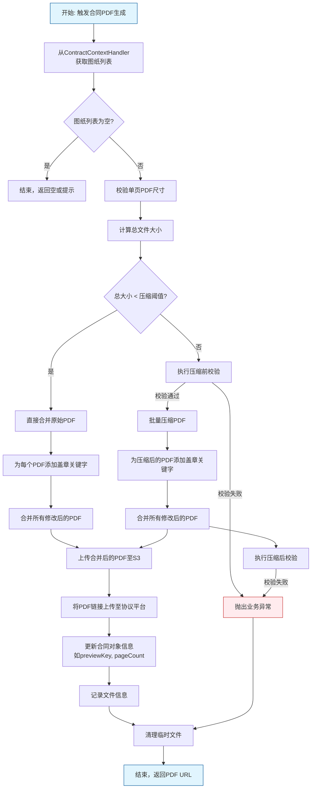

好的，作为 AI 文档助手，我将根据您提供的模块信息和核心代码，为您生成一份全面的 `pdf_self_creation_strategy.md` 系统文档。

```markdown
# pdf_self_creation_strategy 模块文档

## 1. 简介

`pdf_self_creation_strategy` 模块是合同生成系统中的一个核心策略模块。其主要职责是**为不同类型的合同（如图纸合同、团装正式合同、翻新全案合同）提供定制化、自动化的 PDF 文件生成策略**。

该模块采用了**策略设计模式**，通过 `CreateContractPdfBySelfStrategy` 接口定义了统一的生成契约，并由不同的策略实现类（`DrawingContractPdfBySelfStrategy`、`GroupFormalContractPdfBySelfStrategy`、`ReformAllFormalContractPdfBySelfStrategy`）来处理特定合同类型的复杂 PDF 生成逻辑。每个策略实现都包含从数据获取、内容拼接、盖章处理、文件压缩到最终上传的全流程。

## 2. 架构概览

本模块在系统中的定位及与其他关键模块的交互关系如下图所示。

```mermaid
graph TD
    subgraph “pdf_self_creation_strategy 模块”
        A[CreateContractPdfBySelfStrategy<br>(接口)]
        B[DrawingContractPdfBySelfStrategy]
        C[GroupFormalContractPdfBySelfStrategy]
        D[ReformAllFormalContractPdfBySelfStrategy]
        E[BaseContractPdfCreateService<br>(基类)]
    end

    subgraph “依赖的外部模块与服务”
        F[contract_context<br>(上下文/数据源)]
        G[contract_core_services<br>(核心服务)]
        H[terminal_pdf_and_material<br>(PDF处理与工具)]
        I[S3Service<br>(文件存储)]
        J[FreeformService<br>(协议平台)]
        K[Other Strategy Modules<br>(如 contract_modification_strategy)]
    end

    F -- 提供图纸/项目数据 --> B
    F -- 提供上下文 --> C & D
    B & C & D -- “实现” --> A
    B & C & D -- “继承” --> E
    E -- 提供通用方法(如关键字处理) --> B & C & D
    B & C & D -- “调用PDF处理” --> H
    B & C & D -- “调用存储服务” --> I
    B & C & D -- “调用协议服务” --> J
    B & C & D -- “调用合同信息/业务服务” --> G
    B & C & D -- “可能触发” --> K

    style F fill:#e1f5fe,stroke:#01579b
    style G fill:#e8f5e8,stroke:#1b5e20
    style H fill:#f3e5f5,stroke:#4a148c
    style I fill:#fff3e0,stroke:#e65100
    style J fill:#fce4ec,stroke:#b71c1c
    style K fill:#f1f8e9,stroke:#33691e
```

## 3. 核心组件分析

本模块的核心是三个策略实现类，它们各自针对特定的合同场景。

### 3.1 `DrawingContractPdfBySelfStrategy`
*   **职责**：处理**图纸合同**的 PDF 生成。专门用于将外部系统（BIM）提供的多个图纸 PDF 文件进行合并、压缩，并根据配置插入甲方及甲方代理人盖章关键字。
*   **关键特性**：
    *   **智能压缩**：根据总文件大小（`spaceSizeMB`）与配置阈值比较，决定是否执行 PDF 压缩。使用 `DrawingCompressionConfig` 动态计算 DPI。
    *   **严格校验**：
        *   **尺寸校验** (`checkDrawingPdfAreaSize`)：检查单页 PDF 面积是否超限。
        *   **数量/大小校验** (`checkBeforeCompressPdf`)：在压缩前检查图纸数量和总大小。
        *   **压缩后校验** (`checkAfterCompressPdf`)：压缩后再次检查文件大小。
    *   **并发处理**：使用 `CompletableFuture` 和自定义线程池 (`pdfHandleExecutor`) 并行获取各图纸 PDF 的页面尺寸信息。
    *   **上下文数据**：通过 `ContractContextHandler.getDrawingDTO()` 获取图纸数据。

### 3.2 `GroupFormalContractPdfBySelfStrategy`
*   **职责**：处理**团装正式套餐合同**的 PDF 生成。它将多个独立的 PDF 附件（正签文本、报价单、图纸等）按业务规则顺序合并为一个最终合同 PDF。
*   **关键特性**：
    *   **组合拼接**：按照业务定义的顺序（正签文本 → 报价单 → 基础图纸 → 个性化附件）合并 PDF。
    *   **盖章处理**：为报价单和图纸等特定部分添加盖章关键字。
    *   **继承基类**：继承 `BaseContractPdfCreateService`，复用 `getFormalBudgetUrlPdf`、`addFooter` 等通用方法。

### 3.3 `ReformAllFormalContractPdfBySelfStrategy`
*   **职责**：处理**翻新全案正式套餐合同**的 PDF 生成。生成逻辑与团装合同类似，但附件组成和顺序不同。
*   **关键特性**：
    *   **特定附件处理**：支持“工期说明附件”，该附件可能以图片形式存储，本策略负责将其转换为 PDF 并合并。
    *   **配置化依赖**：通过 `ContractAttachConfigService` 查询附件配置，实现了附件的可配置性。
    *   **组合拼接**：顺序为：正签文本 → 报价单 → 工期说明附件(可选) → 个性化附件(可选)。

所有策略类都依赖于以下通用服务：
*   `ContractPdfFileHandleService`：提供 PDF 下载、压缩、合并、添加页脚等底层操作。
*   `S3Service`：负责将生成的最终 PDF 上传至对象存储并获取访问 URL。
*   `ContractBusinessService`：负责将 PDF URL 上传至协议平台（如 Freeform）进行关联。
*   `ContractFileInfoService`：记录生成的合同文件元数据（如大小）。
*   `FreeformService`：查询协议平台的盖章规则配置（关键字）。

## 4. 与其他模块的集成

*   **[contract_context](contract_context.md)**：本模块从该模块的 `ContractContextHandler` 中获取生成 PDF 所需的业务上下文数据，特别是图纸数据 (`DrawingDTO`)。
*   **[contract_core_services](contract_core_services.md)**：
    *   调用 `ContractDetailService`, `ContractButtonConfigService` 等获取合同详情和配置。
    *   调用 `ContractSelfSealService`, `ContractCompanySignService` 处理自盖章和公司签章逻辑。
    *   调用 `ContractSaveDraftService`, `ContractFieldCheckService` 确保在生成 PDF 前合同数据已保存且校验通过。
*   **[terminal_pdf_and_material](terminal_pdf_and_material.md)**：大量使用其 `TerminalContractPdfBuildService`、`MaterialPdfDiffService` 等提供的 PDF 构建和对比功能。
*   **[contract_modification_strategy](contract_modification_strategy.md)**：在合同变更场景中，变更策略可能会触发重新生成 PDF，从而调用本模块的相关策略。

## 5. 数据流与处理流程

以下流程图以 `DrawingContractPdfBySelfStrategy` 为例，展示典型的 PDF 生成业务逻辑：



## 6. 设计模式与原则

*   **策略模式 (Strategy Pattern)**：这是本模块的核心模式。`CreateContractPdfBySelfStrategy` 是策略接口，各个具体的合同类型 PDF 生成器是具体策略。调用方（如上层服务）可以在运行时根据不同合同类型选择不同的策略。
*   **模板方法模式 (Template Method Pattern)**：`BaseContractPdfCreateService` 作为基类，定义了 PDF 生成算法的骨架（如获取文本PDF、获取报价单PDF），将某些步骤延迟到子类中实现（如 `getGroupDrawing`, `getDurationDescriptionAttachPdfUrl`）。
*   **单一职责原则 (SRP)**：每个策略类只负责一种合同类型的 PDF 生成逻辑，使代码更清晰、更易于维护和扩展。
*   **依赖倒置原则 (DIP)**：高层模块（策略实现）依赖于抽象（`CreateContractPdfBySelfStrategy` 接口和 `BaseContractPdfCreateService` 抽象类），而不是具体实现。

通过以上结构，`pdf_self_creation_strategy` 模块实现了一个灵活、可扩展的合同 PDF 生成体系，能够适应多样化的业务需求。