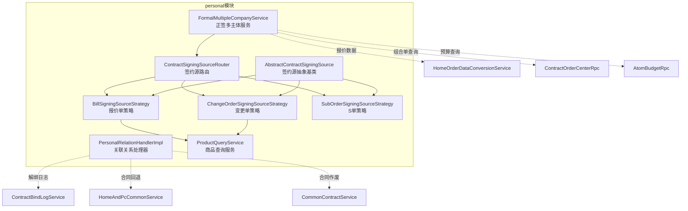
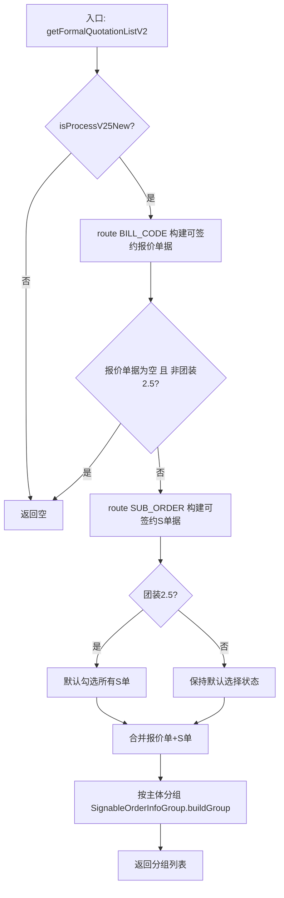
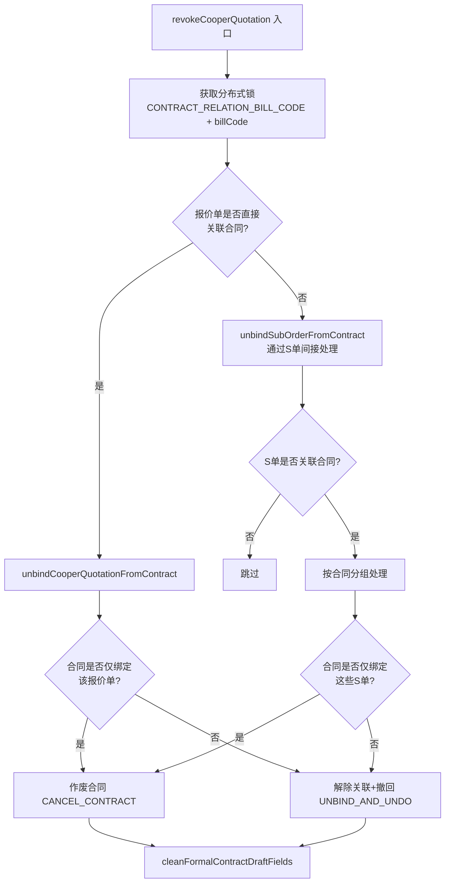
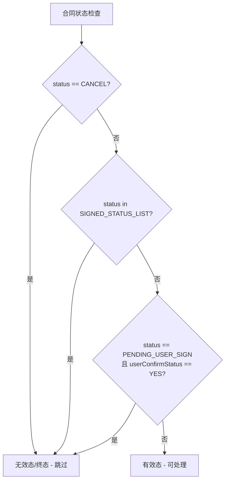
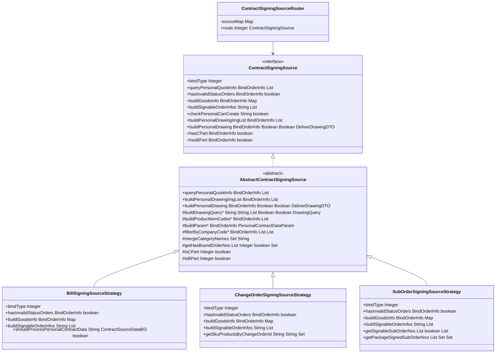
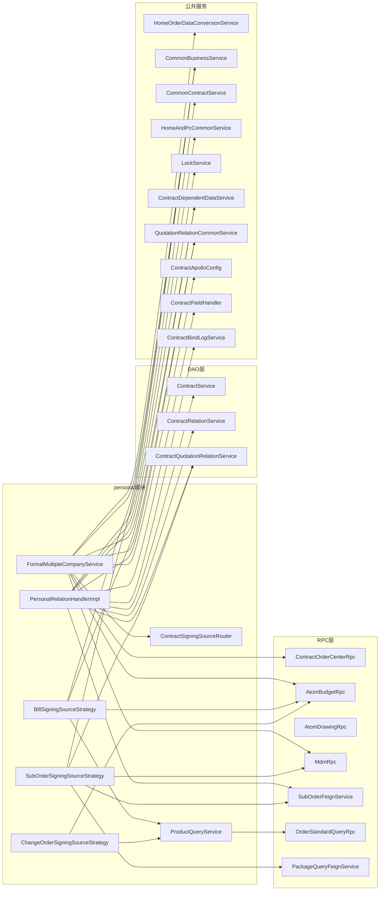
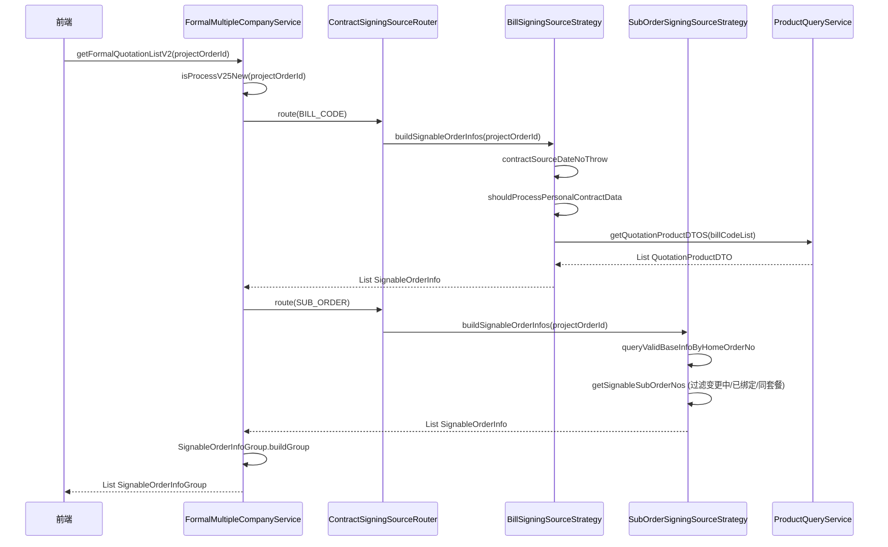
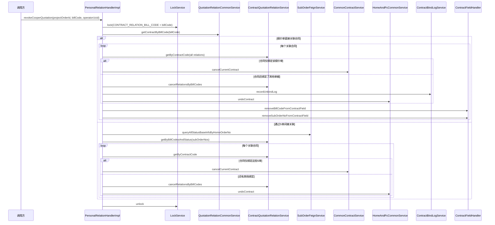

# Personal 模块 — 个性化合同签约与关联管理

## 一、模块概述

`personal` 模块位于 `com.ke.utopia.nrs.salesproject.service.contract.v2.personal` 包下，是销售合同系统中负责**个性化合同（C 部分）签约数据准备与关联关系管理**的核心模块。

模块解决的核心业务问题：

1. **多主体正签场景**：一个项目订单可能涉及多个分公司主体，每个主体下有不同的报价单/S 单，需要聚合后供前端弹窗选择，按主体分别发起合同。
2. **签约数据源多态**：个性化合同的绑定对象有三种——报价单（Bill Code）、变更单（Change Order）、S 单（Sub Order），每种的数据获取、校验、图纸构建逻辑各不相同。
3. **关联关系撤回**：当协同报价单被撤回时，需要正确处理合同与报价单/S 单之间的绑定关系，决定是作废合同还是仅解绑后回退状态。

---

## 二、模块架构



> 灰色虚线箭头表示对模块外部服务的依赖。

---

## 三、核心组件详解

### 3.1 FormalMultipleCompanyService — 正签多主体服务

**职责**：在用户发起正签（正式合同签约）时，汇总所有可供选择的 C 报价信息，按分公司主体分组返回给前端。

#### 核心方法

| 方法 | 说明 | 状态 |
|------|------|------|
| `getFormalQuotationList` | V1 版本获取正签可选 C 报价（按主体分组） | @Deprecated |
| `getFormalQuotationListV2` | V2 版本，通过 `ContractSigningSourceRouter` 策略路由获取可签约单据 | 当前使用 |
| `getFormalQuotationInfoList` | 获取基础报价内的 C 报价信息 | @Deprecated |
| `getCooperQuoteInfoList` | 获取协同报价单信息列表 | @Deprecated |
| `getNotSupportSignBillCodeList` | 获取不允许签约的协同报价单列表 | 辅助方法 |

#### V2 流程



#### V1 流程（已废弃）

V1 流程存在以下问题，导致被 V2 取代：

1. 混合了基础报价内的 C 报价和协同报价的查询逻辑，方法职责不单一
2. 直接通过 `contractSourceDateNoThrow` + `queryOrderByHomeOrderNo` 拼装数据，未使用策略模式
3. 过滤逻辑（取消状态、已关联合同状态）嵌套在 service 层，难以扩展

---

### 3.2 PersonalRelationHandler — 关联关系处理器

**职责**：处理协同报价单撤回时，合同与报价单/S 单之间的绑定关系清理。

#### 接口定义

```java
void revokeCooperQuotation(String projectOrderId, String billCode, Long operatorUcid);
```

#### 实现逻辑（PersonalRelationHandlerImpl）



#### ContractRevocationAction 枚举

| 枚举值 | 含义 | 触发条件 |
|--------|------|---------|
| `CANCEL_CONTRACT` | 作废合同 | 合同仅绑定了要撤回的单据 |
| `UNBIND_AND_UNDO` | 解除关联并回退合同到草稿 | 合同还绑定了其他单据 |
| `SKIP` | 跳过处理 | 默认兜底 |

#### 关键判定逻辑

**`isContractInInvalidOrFinalStatus`** — 判断合同是否处于无效/终态：



---

### 3.3 ContractSigningSource — 策略模式签约源体系

#### 设计模式

采用**策略模式（Strategy Pattern）** + **模板方法模式（Template Method Pattern）**：

- `ContractSigningSource`：策略接口，定义所有绑定类型需要实现的契约
- `AbstractContractSigningSource`：抽象基类，实现模板方法，抽取公共逻辑
- `BillSigningSourceStrategy` / `ChangeOrderSigningSourceStrategy` / `SubOrderSigningSourceStrategy`：三种具体策略
- `ContractSigningSourceRouter`：路由器，根据 `bindType` 分发到具体策略

#### 类图



#### 三种策略对比

| 维度 | BillSigningSourceStrategy | ChangeOrderSigningSourceStrategy | SubOrderSigningSourceStrategy |
|------|--------------------------|--------------------------------|------------------------------|
| **bindType** | `BILL_CODE` (报价单) | `CHANGE_ORDER` (变更单) | `SUB_ORDER` (S单) |
| **数据源** | 主订单内 C 报价 + 协同报价 | 变更流程中的变更报价 | 下单后生成的 S 单 |
| **无效状态判定** | 报价单状态为"调整中/已删除/已取消" | 变更单状态非"待签约/已完成" | S 单状态在 invalidStatus 集合中 |
| **可签约弹窗** | 构建基础报价内的个性化报价单 | 不返回（由报价单侧覆盖） | 构建可签约的 S 单列表 |
| **额外过滤** | 整装不处理 | — | 过滤变更中 + 已绑定合同 + 同套餐已签约的 S 单 |

---

### 3.4 ProductQueryService — 商品查询服务

**职责**：封装从主订单协议数据中提取报价商品/变更商品的逻辑，供 `BillSigningSourceStrategy` 和 `ChangeOrderSigningSourceStrategy` 调用。

| 方法 | 入参 | 出参 | 数据路径 |
|------|------|------|---------|
| `getQuotationProductDTOS` | projectOrderId + billCodeList | `List<QuotationProductDTO>` | `HomeProject.MainOrder.CostControl.QuotationModule.PersonalQuotation` |
| `getChangeQuotationProductDTOS` | projectOrderId + changeOrderId | `List<ChangeQuotationProductDTO>` | `HomeProject.MainOrder.CostControl.ChangeQuotationModule.PersonalQuotation` |

两种方法的数据结构对称：先从套餐列表（comboList）中展开商品，再合并单品列表（quotationList），最终合并为统一的商品集合。

---

## 四、模块依赖关系



---

## 五、关键数据流

### 5.1 正签弹窗获取可签约单据



### 5.2 协同报价单撤回



---

## 六、关键设计模式与原则

### 6.1 策略模式 + 模板方法

`ContractSigningSource` 体系是本模块最核心的设计。三种绑定类型（报价单/变更单/S 单）共享相同的接口契约，但实现逻辑各异：

- **模板方法**（`AbstractContractSigningSource`）：`queryPersonalQuoteInfo` 和 `buildPersonalDrawing` 的骨架固定——构建参数、执行查询、过滤结果——子类只需实现 `buildParam`、`filterByCompanyCode`、`buildProductItemCodes`、`buildDrawingQuery` 四个钩子方法。
- **策略模式**（`ContractSigningSourceRouter`）：通过 `bindType` 动态路由到具体策略，新增绑定类型时只需添加新的 `@Service` 实现类并实现 `bindType()`，路由自动发现。

### 6.2 分布式锁保护

`PersonalRelationHandlerImpl.revokeCooperQuotation` 使用分布式锁（`LockService.CONTRACT_RELATION_BILL_CODE` + billCode）确保同一协同报价单的撤回操作串行执行，防止并发撤回导致状态不一致。

### 6.3 状态判定与防御式编程

模块中多处使用防御式编程：

- 合同无效/终态判定（`isContractInInvalidOrFinalStatus`）统一收口，避免各处重复实现
- 撤回操作前检查合同状态，避免对已取消/已签署的合同执行无效操作
- 可签约 S 单过滤时考虑变更中、已绑定、同套餐已签约三种排除条件

### 6.4 V1 → V2 演进

V1 逻辑（`getFormalQuotationList`、`getFormalQuotationInfoList`、`getCooperQuoteInfoList`）标记为 `@Deprecated`，核心演进路径：

| 维度 | V1 | V2 |
|------|----|----|
| 数据获取 | 直接 RPC 拼装 | 策略路由分发 |
| 绑定类型 | 仅支持报价单 | 报价单 + 变更单 + S 单 |
| 扩展性 | 硬编码 if-else | 策略模式，新增类型零侵入 |
| 团装2.5 | 不支持 | 默认勾选 S 单 |

---

## 七、模块外延接口

### 7.1 ContractSigningSource 接口契约

本模块对外通过 `ContractSigningSourceRouter.route(bindType)` 暴露能力，调用方可获取：

| 能力 | 方法 | 用途 |
|------|------|------|
| 查询个性化报价 | `queryPersonalQuoteInfo` | 合同创建时获取报价数据 |
| 校验单据有效性 | `hasInvalidStatusOrders` | 发起签约前校验 |
| 构建商品信息 | `buildGoodsInfo` | 合同商品信息展示 |
| 获取可签约列表 | `buildSignableOrderInfos` | 弹窗选择单据 |
| 校验能否创建 | `checkPersonalCanCreate` | 创建合同前置校验 |
| 获取个性化图纸 | `buildPersonalDrawing` / `buildPersonalDrawingImgList` | 合同附件 |
| 判断 B/C 部分 | `hasCPart` / `hasBPart` | 合同类型判定 |

### 7.2 PersonalRelationHandler 接口契约

对外仅暴露一个方法 `revokeCooperQuotation`，由协同报价单撤回流程调用，负责清理合同与报价单/S 单之间的绑定关系。