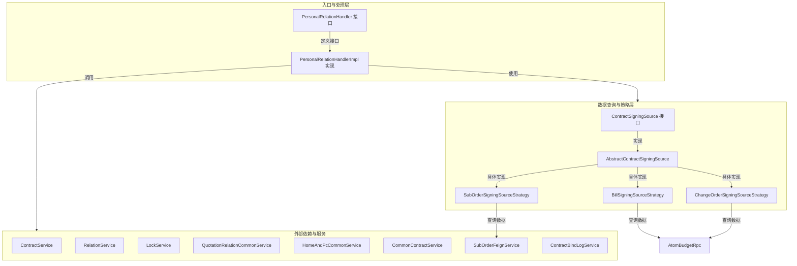
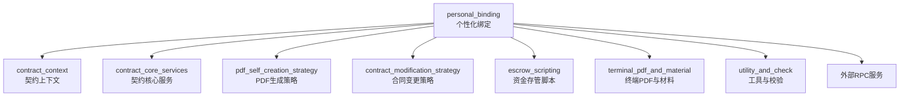
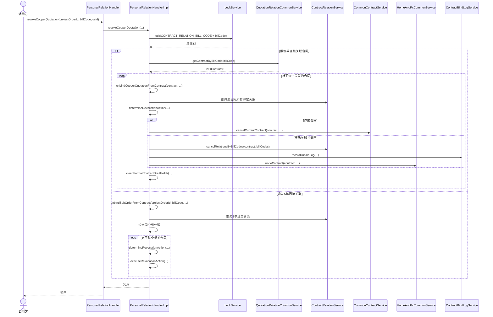
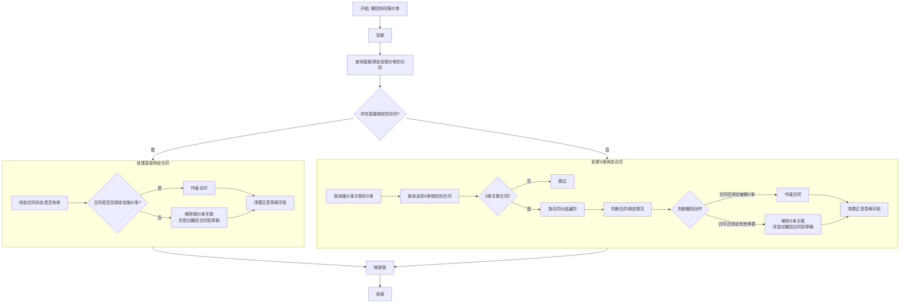

# personal_binding 模块文档

## 1. 概述

`personal_binding` 模块是销售合同系统中的一个核心功能模块，专注于处理**个性化合同**与**业务单据**（如报价单、S单、变更单）之间的绑定关系管理。

该模块的核心职责包括：
1.  **管理绑定关系**：建立、维护和解除个性化合同与报价单（`Bill Code`）、S单（`Sub Order`）、变更单（`Change Order`）之间的关联。
2.  **处理业务事件**：响应外部事件（如协同报价单撤回），并基于复杂的业务规则（合同状态、绑定类型、单据组合）智能地更新合同状态（如作废、撤回、解绑）。
3.  **提供数据查询**：为合同创建、编辑、签约等流程提供基础的可绑定单据列表查询、状态校验及商品/图纸等信息组装服务。

通过策略模式和分层处理，该模块实现了对不同绑定源类型（`BindTypeEnum`）的扩展性支持，并与系统中的其他契约服务模块紧密协作，共同完成完整的合同生命周期管理。

## 2. 架构与核心组件

### 2.1 整体架构

该模块采用经典的分层架构，并在数据查询层应用了**策略模式**以支持多种绑定源。核心组件关系如下图所示：

**图表说明**：
*   **入口与处理层** (`PersonalRelationHandler`)：对外提供统一的绑定关系管理入口，目前包含“撤回协同报价单”等操作。
*   **数据查询与策略层** (`ContractSigningSource`)：采用策略模式，为不同类型的绑定源（报价单、S单、变更单）提供标准化的数据查询、状态校验、可签约列表构建等能力。
*   **外部依赖与服务**：模块依赖于多个内部服务和外部RPC客户端，用于操作合同数据库、管理分布式锁、查询订单信息等。

### 2.2 核心组件详解

#### `PersonalRelationHandler` / `PersonalRelationHandlerImpl`
*   **职责**：处理个性化合同绑定关系的业务操作，目前核心是 `revokeCooperQuotation`（撤回协同报价单）。
*   **关键逻辑**：
    1.  **并发控制**：使用 `LockService` 对协同报价单号加锁，确保撤回操作的原子性。
    2.  **智能路由**：
        *   若报价单**直接绑定**了合同，则直接处理该合同。
        *   若未直接绑定，则查询其关联的**S单**，并通过S单处理绑定的合同。
    3.  **合同状态决策**：根据合同当前已绑定的单据（是否仅包含待撤换单据），决定对合同执行**作废**、**解除关联并撤回**还是**跳过**操作。
    4.  **清理与记录**：解绑后清理正签草稿中的相关字段，并记录解绑日志。

#### `ContractSigningSource` 及其实现策略
*   **职责**：定义并实现针对不同绑定源类型的标准数据查询接口。
*   **策略实现**：
    *   `BillSigningSourceStrategy` (`BindTypeEnum.BILL_CODE`)：处理**报价单**相关逻辑。查询报价单状态、商品信息、构建可签约报价单列表等。
    *   `ChangeOrderSigningSourceStrategy` (`BindTypeEnum.CHANGE_ORDER`)：处理**变更单**相关逻辑。校验变更流程状态、构建变更单商品信息等。
    *   `SubOrderSigningSourceStrategy` (`BindTypeEnum.SUB_ORDER`)：处理**S单**相关逻辑。校验S单状态、构建可签约S单列表（需排除变更中和已绑定的单据）、管理套餐签约关系等。

## 3. 模块交互与依赖

### 3.1 与其他模块的依赖关系
`personal_binding` 模块与系统中的多个模块存在依赖，共同构成完整的合同处理链路。

**依赖关系说明**：
1.  **向上依赖 (`contract_context`)**：
    *   本模块的处理器可能作为`ContractContextAspect`的一个方面被调用，用于在特定合同上下文（如撤回操作）中执行绑定关系处理。
2.  **平行依赖 (`contract_core_services`)**：
    *   **数据操作**：依赖`ContractDetailService`、`ContractSaveDraftService`等进行合同明细查询、草稿保存。
    *   **业务逻辑**：依赖`ContractCompanySignService`、`ContractSelfSealService`处理签约和用章。
    *   **数据验证**：依赖`ContractFieldCheckService`进行合同字段校验。
3.  **向下依赖 (其他业务模块)**：
    *   **PDF与材料**：依赖`pdf_self_creation_strategy`和`terminal_pdf_and_material`模块来生成合同附件，如个性化图纸。
    *   **合同变更**：依赖`contract_modification_strategy`来执行合同变更相关的逻辑。
4.  **基础设施依赖**：
    *   依赖`utility_and_check`模块中的`WorkerTypeCheckService`进行工种检查。
    *   依赖`escrow_scripting`模块处理与资金存管脚本相关的逻辑。
5.  **外部服务依赖**：
    *   通过RPC客户端（如`AtomBudgetRpc`, `SubOrderFeignService`, `OrderStandardQueryRpc`）与上游业务系统（预算系统、订单系统等）交互，获取报价单、S单、变更单的详情。

### 3.2 关键数据流示例
以下图示展示了“撤回协同报价单”这一核心操作的数据处理流程：

## 4. 核心业务逻辑：撤回协同报价单

该逻辑由 `PersonalRelationHandlerImpl.revokeCooperQuotation` 方法实现，其决策流程如下：

**逻辑要点**：
1.  **并发安全**：通过分布式锁确保对同一协同报价单的操作是串行的。
2.  **两种处理路径**：根据报价单是否直接绑定合同，走不同的处理路径。这反映了系统中合同可能通过“报价单->S单”的链条与业务单据间接关联。
3.  **合同状态判断**：对处于终态（已作废、已签署）、或已确认申请用章的合同，不做任何操作。
4.  **撤回动作决策**：
    *   **作废合同**：当合同**仅**绑定了待撤回的报价单或S单时，合同已无存在必要，执行作废。
    *   **解除关联并撤回**：当合同还绑定了其他有效的业务单据时，仅解除与当前被撤单据的关联，并将合同状态回退至草稿（如有可能），以供后续编辑。
5.  **数据清理**：无论执行哪种操作，都会清理相关正签合同草稿中的引用字段。

## 5. 总结

`personal_binding` 模块是一个专注于合同与业务单据关联关系管理的领域服务模块。它通过清晰的**策略模式**设计，优雅地支持了多种业务单据类型作为合同的绑定源。

其最复杂的业务逻辑体现在**撤回协同报价单**的场景中，需要根据合同的绑定拓扑（直接/间接）、合同当前状态以及绑定的其他单据类型，做出“作废”、“解绑并撤回”或“忽略”的智能决策，并辅以严格的数据清理和状态校验，确保了系统数据的一致性和业务流转的正确性。

该模块与 `contract_context`、`contract_core_services` 等模块紧密集成，是实现合同全生命周期管理（特别是个性化合同）不可或缺的一部分。