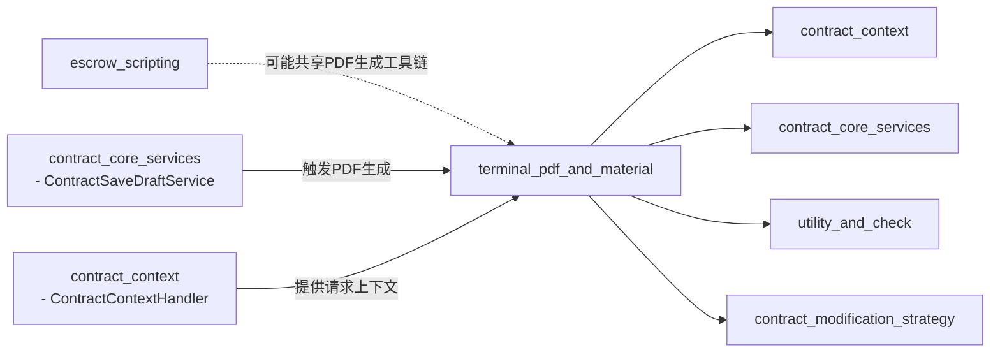

好的，作为一名 AI 文档助手，我将根据您提供的模块信息和核心代码，为 `terminal_pdf_and_material` 模块生成综合文档。

## 简介

`terminal_pdf_and_material` 模块是销售项目合同管理系统中的一个关键功能单元，主要负责**合同相关PDF文件（特别是解约协议和材料清单）的生成、差异检查与处理**。该模块在合同生命周期的末端阶段发挥重要作用，确保关键法律文档能够准确、高效地生成，并为后续的归档、审计或客户服务提供支持。

模块的设计融合了策略模式和数据一致性检查机制，旨在满足复杂业务场景下对PDF生成内容的定制化需求以及数据实时性的验证要求。

---

## 模块综合文档

### 1. 模块目的与核心功能

本模块的核心目标是为合同系统提供**解约协议PDF**和**材料清单PDF**的自动化生成能力，并附带数据一致性校验功能，以保证生成文档内容的准确性和时效性。

**核心功能包括：**

1.  **解约协议PDF数据构建** (`TerminalContractPdfBuildService`): 根据项目信息、合同信息、退单数据等，动态计算并组装解约协议PDF中所需的各项数据，如甲方/乙方信息、合同关联信息、款项明细、退款条款等。
2.  **材料清单PDF数据一致性检查** (`MaterialPdfDiffService`): 对比远程实时获取的材料数据（如套餐SKU）与数据库中已存储的材料PDF数据，判断是否需要重新生成PDF，以避免数据过时。
3.  **材料清单PDF生成与上传** (`MaterialPdfUtil`): 负责将HTML模板渲染为PDF文件，并上传至对象存储服务（S3），返回可访问的URL。
4.  **数据聚合与格式化**: 将原始业务数据（如材料SKU列表、款项信息）转换并聚合为PDF模板所需的标准化数据格式。

### 2. 架构与组件关系

下图展示了 `terminal_pdf_and_material` 模块的内部架构及其与系统其他部分的交互关系。

```mermaid
graph TD
    subgraph “terminal_pdf_and_material 模块”
        A[TerminalContractPdfBuildService] -->|依赖| B(MaterialPdfUtil)
        A -->|提供数据| C[PDF模板数据]
        D[MaterialPdfDiffService] -->|检查数据一致性| E[数据库 (ContractMaterialPdfData)]
        D -->|检查数据一致性| F[远程材料服务 (ComboSkuGroupDTO)]
    end

    G[外部调用方<br/>(如：合同提交/退单流程)] -->|触发| A
    G -->|触发| D
    A -->|查询数据| H[合同核心服务<br/>(contract_core_services)]
    A -->|查询数据| I[合同上下文处理<br/>(contract_context)]
    A -->|查询数据| J[退单服务<br/>(CancelOrderService)]
    D -->|查询/存储数据| K[合同数据访问层<br/>(DAO)]
    B -->|调用| L[HTML渲染服务<br/>(HtmlRenderUtil)]
    B -->|调用| M[PDF生成工具<br/>(PdfUtils)]
    B -->|调用| N[S3对象存储服务<br/>(S3Service)]
    B -->|下载临时文件| O[合同PDF文件处理服务<br/>(ContractPdfFileHandleService)]
```

**图表解读:**
*   **核心服务交互**: `TerminalContractPdfBuildService` 是解约协议的数据聚合中心，它大量依赖 `contract_core_services`（如获取合同详情、公司信息）和 `contract_context`（获取当前请求上下文）模块。
*   **数据流**: 数据来源于数据库（合同、退单、材料数据）和远程的材料服务。解约协议数据被组装后，可进一步传递给PDF生成环节；材料数据则先进行一致性比对，再决定是否生成新PDF。
*   **PDF生成链**: `MaterialPdfUtil` 封装了“HTML渲染 → PDF转换 → 上传S3”的完整流程，并与基础工具类（HtmlRenderUtil, PdfUtils）和基础设施服务（S3Service）交互。

### 3. 组件详解

#### 3.1 TerminalContractPdfBuildService
该服务是**解约协议PDF的核心数据引擎**。它不直接生成PDF文件，而是提供一系列方法，用于从各业务源提取、计算并格式化解约协议所需的全部文本和数值数据。

**关键方法及作用:**
*   `getTerminalSecondPartyCompanyInfo`: 获取解约协议乙方的公司名称。
*   `getTerminalProjectContractAddress`: 根据合同字段信息拼接完整的项目地址。
*   `getTerminalSignContractInfo`: 汇总关联的已签署合同（设计合同、主合同、变更合同）的名称和编号，用于协议描述。
*   `getTerminalDetailFundInfo`: 根据退单款项明细，生成协议中关于已付款项、违约金、已发生费用的详细描述段落，区分整装和局装业务。
*   `getTerminalTotalFundInfo`: 计算最终结算金额（应付或退款），并生成相应的支付或退款条款（包含退款方式、账户信息）。
*   `getTerminalRelationHouseFormalInfo`: 处理合并发起场景，获取关联的家装正签合同信息。
*   辅助方法如 `getTerminalRetrieveMaterialDays`, `getBreachPenaltyAmount` 用于获取协议中的其他约定条款数据。

**设计特点:**
*   **策略化**: 内部逻辑根据不同的业务类型（`BusinessTypeEnum`）和合同类型（`ContractTypeEnum`）采用不同的数据处理分支。
*   **强依赖上下文**: 使用 `ContractContextHandler` 静态方法获取当前线程的请求上下文，体现了面向请求的数据处理模式。
*   **数据组装与格式化**: 大量使用字符串模板（`String.format`）和金额大小写转换（`MoneyConvertUtil`）来生成规范的法律文本。

#### 3.2 MaterialPdfDiffService
该服务专注于**材料清单PDF的数据版本管理**。在套餐装修场景中，材料清单（如品牌、品类）可能随时更新。此服务通过比对“线上实时数据”与“上次生成PDF时存储的数据”，判断当前数据库中存储的PDF是否仍然有效。

**核心流程 (`isConsistent` 方法):**
1.  **数据转换**: 将远程API返回的 `ComboSkuGroupDTO` 和数据库的 `ContractMaterialPdfData` 列表，分别转换为统一的 `ComboSkuVO` 中间对象。
2.  **数据聚合**: 调用 `aggregateMaterialData` 方法，对材料数据按三级品类分组，过滤无效品牌，合并品牌名称，并按品类名称排序，生成用于比较的 `MaterialPdfItemVO` 列表。
3.  **差异比对**: 比较转换后两个列表的“唯一键”（由 `categoryLevel3Name` 和 `brandNames` 组成）集合是否完全相等，从而得出数据一致性的结论。

#### 3.3 MaterialPdfUtil
该工具类封装了将数据渲染为PDF并上传的**通用流程**。

**核心方法 (`doGeneral`):**
1.  **渲染HTML**: 使用 `HtmlRenderUtil` 将模板文件和数据渲染为HTML字符串。
2.  **生成PDF**: 调用 `PdfUtils` 将HTML转换为PDF文件并上传到临时存储，获得临时URL。
3.  **Host替换**: 将外网文件URL (`file.ljcdn.com`) 替换为内网地址 (`file.media.lianjia.com`)，以便在服务器环境内进行下载。
4.  **上传最终文件**: 从临时URL下载PDF文件，并通过 `S3Service` 上传到最终的目标存储桶（使用提供的`key`）。
5.  **清理**: 删除本地临时文件。

### 4. 与其他模块的关系

本模块作为**文档生成层**，与系统中多个模块存在依赖或协作关系。



**关系说明:**
*   **依赖 (A →)**:
    *   `contract_context`: `TerminalContractPdfBuildService` 直接使用 `ContractContextHandler` 获取项目信息、合同请求等上下文数据。
    *   `contract_core_services`: 深度依赖此模块提供的服务来查询合同、公司、字段信息，以及获取业务类型等基础数据。
    *   `utility_and_check`: 可能使用 `WorkerTypeCheckService` 进行工种相关校验（代码中未直接体现，但属于关联业务）。
*   **触发与使用 (→ A)**:
    *   `contract_core_services` 中的 `ContractSaveDraftService` 或其他服务在完成合同草稿保存、提交或退单处理后，会调用本模块的服务来生成相应的PDF文件。
*   **潜在协作**:
    *   `escrow_scripting` 模块处理托管脚本相关合同，可能与本模块共享 `MaterialPdfUtil` 中定义的通用PDF生成与上传逻辑，或复用 `PdfUtils`、`S3Service` 等基础组件。

### 5. 总结

`terminal_pdf_and_material` 模块是合同业务文档自动化的核心组件，它有效地将复杂的业务逻辑、动态数据与标准化的文档模板相结合。其模块化设计（数据构建、差异检查、生成工具分离）使得它易于维护和扩展。通过与 `contract_context` 和 `contract_core_services` 的紧密集成，它能够响应业务流程的驱动生成准确的法律文件，并通过 `MaterialPdfDiffService` 确保了数据文档的实时一致性，为系统的可靠性和用户体验提供了保障。

**典型使用场景:**
1.  用户提交退单申请时，系统调用 `TerminalContractPdfBuildService` 组装数据，并生成解约协议PDF供用户下载或归档。
2.  套餐装修合同签订或修改材料配置后，系统调用 `MaterialPdfDiffService` 检查材料清单是否变更，如果变更则通过 `MaterialPdfUtil` 重新生成并更新材料配送清单PDF。