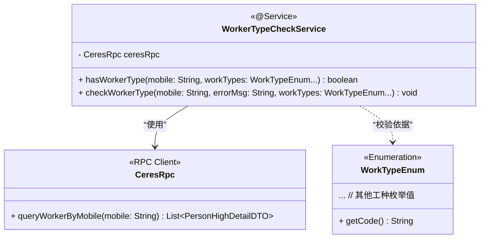
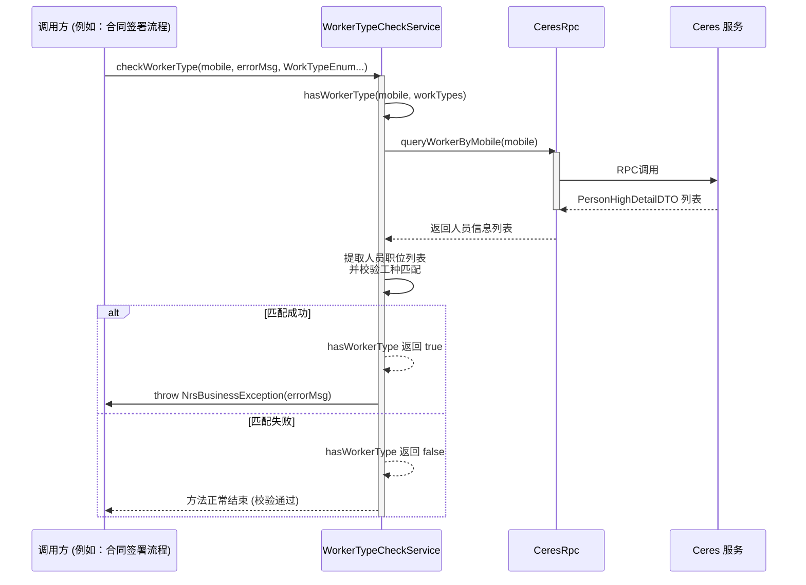

# utility_and_check 模块文档

## 简要介绍

`utility_and_check` 模块是合同管理系统中一个专注于**数据校验和基础工具功能**的子模块。当前的核心功能是提供通用的**工种（Worker Type）校验服务**，通过验证与合同相关的人员（如工人）是否具备指定的工种资格，以确保业务流程的合规性与准确性。

该模块作为[contract_core_services](contract_core_services.md)中**数据验证**分支的一个具体实现，旨在为上层复杂的合同业务逻辑（如签署、存档、审核等）提供可复用的、可靠的校验能力。

## 模块概述与架构

### 1. 模块目的与核心功能

本模块的核心目的是**保障业务数据的准确性**。具体到当前实现，其核心功能为：
- **工种资格校验**：根据手机号查询人员信息，并验证其是否具备一个或多个指定的工种类型。
- **业务规则守卫**：通过`checkWorkerType`方法，在校验失败时直接抛出业务异常，从而阻断不符合规则的操作流程。

### 2. 系统定位与依赖关系

`utility_and_check` 模块位于系统的技术支撑层，其上游依赖于**人员信息服务**，下游则服务于所有需要进行工种校验的**业务流程模块**。

```mermaid
graph TD
    subgraph “外部服务”
        CeresRPC[“Ceres RPC 服务<br/>(人员/职位信息查询)”]
    end

    subgraph “合同管理系统”
        subgraph “contract_core_services (父模块)”
            UC[“utility_and_check 模块<br/>(WorkerTypeCheckService)”]
            direction LR
            subgraph “contract_detail_and_config”
                DS[“ContractDetailService”]
                BC[“ContractButtonConfigService”]
                FC[“ContractFieldCheckService”]
            end
            subgraph “contract_seal_and_sign”
                CS[“ContractCompanySignService”]
                SS[“ContractSelfSealService”]
            end
            subgraph “contract_draft_and_process_control”
                SVD[“ContractSaveDraftService”]
                HNS[“ContractHomeOrderNoChangeService”]
            end
        end

        BusinessModules[“其他业务模块<br/>(如: personal_binding, contract_modification_strategy 等)”]
    end

    CeresRPC -- “1. 查询人员信息” --> UC
    UC -- “2. 提供校验服务” --> BusinessModules
    UC -. “可被集成于” .-> DS
    UC -. “可被集成于” .-> FC
    UC -. “可被集成于” .-> CS
```

**依赖说明**：
1.  **向上依赖**：模块通过 `CeresRpc` 客户端，远程调用 `Ceres` 系统的 RPC 接口 (`queryWorkerByMobile`) 以获取人员的详细职位信息。
2.  **被依赖**：作为一个通用服务，`WorkerTypeCheckService` 可以被合同管理系统内的任何业务模块注入和调用，用于执行前置的业务规则校验。

### 3. 核心组件分析：WorkerTypeCheckService

该服务类是本模块的唯一体现，它封装了校验逻辑，并对外暴露了两个清晰的方法。



**方法详解**：
- `hasWorkerType(String mobile, WorkTypeEnum... workTypes)`：
    - **逻辑流**：接收手机号和可变长度的工种枚举数组。首先进行参数校验，然后调用 `CeresRpc` 查询人员信息。获取到人员的职位列表后，遍历职位，并检查任意职位的 `workTypeCode` 是否与传入的任一 `workType` 枚举值匹配。
    - **返回值**：布尔值，表示该人员是否具备指定工种之一。

- `checkWorkerType(String mobile, String errorMsg, WorkTypeEnum... workTypes)`：
    - **逻辑流**：调用 `hasWorkerType` 方法进行判断。如果返回 `true`（即人员具备禁止的工种），则抛出 `NrsBusinessException`，并附带预设的错误信息。
    - **作用**：作为业务规则守卫，简化调用方代码，实现“若不符合条件则中断”的语义。

### 4. 数据流

以 `checkWorkerType` 方法为例，其内部数据流如下：



## 与其他模块的集成

本模块的设计使其易于集成到其他业务流程中。以下是一些潜在的集成场景：

1.  **合同字段校验 ([ContractFieldCheckService](contract_core_services.md))**：在保存合同草稿或提交合同时，可以注入 `WorkerTypeCheckService`，对合同中关联的工人、监理等角色的手机号进行工种校验。
2.  **个人关系绑定 ([personal_binding](personal_binding.md))**：在将人员与合同进行绑定（如签约、变更）时，校验该人员是否具备合同所要求的特定工种资格。
3.  **合同操作守卫**：在执行关键操作（如“公司签章”、“自己签章”）前，作为前置条件检查，确保参与操作的人员资质符合要求。

## 总结

`utility_and_check` 模块虽然结构简单，但扮演着**系统“质量检查员”** 的关键角色。它将分散的、与人员资质相关的校验逻辑集中管理，提高了代码的复用性和一致性。通过依赖可靠的 `Ceres` 人员服务，它为整个合同管理系统的业务流程准确性和合规性提供了坚实的基础保障。未来，该模块可以方便地扩展其他通用的校验工具服务。