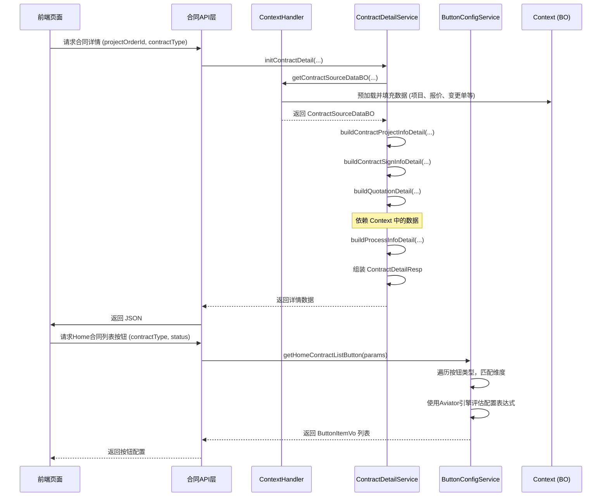

# 展示与交互 模块文档

## 1. 简介
“展示与交互”模块是合同系统中的核心展示层，主要负责为前端页面（如Home App、PC端）提供结构化数据和控制视图状态。该模块的核心目标是将复杂的后端业务逻辑、多源数据聚合、状态计算封装成清晰的前端接口，驱动合同详情页、列表页、预览页等界面的渲染与交互。

其核心职责包括：
1.  **数据聚合与组装**：将来自项目、报价、资金、附件、审核等多个域的数据，组装成前端所需的详情对象（`ContractDetailResp`）。
2.  **视图状态控制**：根据合同类型、状态、业务规则和用户角色，动态计算并配置页面中各个交互按钮（如编辑、提交、删除、去签署等）的显示/隐藏、启用/禁用状态。
3.  **流程信息呈现**：计算并封装合同审批流程的状态、节点和描述，向用户提供清晰的进度指引。

## 2. 架构与组件
该模块由两个主要服务类构成，它们协同工作，为前端提供完整的视图模型。

### 2.1 模块架构图
```mermaid
graph TD
    subgraph “展示与交互 模块”
        CDS[“ContractDetailService<br>合同详情服务”]
        CBCS[“ContractButtonConfigService<br>按钮配置服务”]
    end

    subgraph “上下文与数据”
        CTX[“ContractDetailContextHandler<br>上下文处理器”]
        BO[“ContractDetailContext<br>上下文数据对象”]
    end

    subgraph “依赖的内部/外部服务”
        CS[“ContractService<br>合同数据服务”]
        CFS[“ContractFieldService<br>合同字段服务”]
        PIS[“ProjectInfoReadService<br>项目信息服务”]
        FBS[“FundBaseService<br>资金基础服务”]
        ATT[“AttachCommonService<br>附件通用服务”]
        AUD[“AuditRpc<br>审核服务RPC”]
        CHG[“AtomChangeRpc<br>变更服务RPC”]
        QFS[“QuotationFeignService<br>报价服务Feign”]
        CFG[“MultidimensionalConfigService<br>多维配置服务”]
        APO[“ContractApolloConfig<br>Apollo配置”]
    end

    CDS -- 使用 --> CTX
    CBCS -- 使用 --> CFG & APO
    CTX -- 管理 --> BO
    BO -- 聚合数据来自 --> CS & PIS & FBS & ATT & AUD & CHG & QFS
    CDS -- 构建详情对象 --> CDS
    CBCS -- 计算按钮配置 --> CBCS
```

**图示说明：**
*   `ContractDetailService` 是数据聚合的主引擎，它依赖 `ContractDetailContextHandler` 来获取一个已预加载了多方数据的上下文对象（`ContractDetailContext`），然后调用一系列 `build*` 方法（如 `buildContractProjectInfoDetail`, `buildContractSignInfoDetail`）组装最终的详情响应。
*   `ContractButtonConfigService` 是状态控制的主引擎，它在系统启动时初始化按钮配置规则（使用 Aviator 表达式引擎），并在运行时根据传入的参数（合同类型、状态等）评估表达式，返回应该显示的按钮列表。
*   `ContractDetailContextHandler` 充当数据中转站和预加载器，它协调调用多个底层数据服务（合同、项目、资金、报价等），将数据汇集到上下文中，供 `ContractDetailService` 高效读取。

### 2.2 核心组件交互图
下图展示了用户请求合同详情页时，核心组件之间的交互流程。


## 3. 核心功能详解

### 3.1 合同详情数据组装 (`ContractDetailService`)
该服务是详情页的“数据工厂”，主要方法 `initContractDetail` 返回一个 `ContractDetailResp` 对象，其内部结构包含：
*   **ContractBaseInfoDetail**: 合同基础信息（类型、状态、链接等）。
*   **ContractProjectInfoDetail**: 项目信息（客户、房屋、设计师、工期等）。
*   **ContractSignInfoDetail**: 签约信息（签约主体、代理人、证件、备件等）。
*   **QuotationInfo / PersonalQuotation**: 报价信息（套餐、价格、图纸附件）。
*   **ActivityInfo**: 优惠活动信息。
*   **PromiseInfoDetail**: 承包约定信息。
*   **AmountInfo / ContractPrice**: 金额信息。
*   **ProcessInfo**: 流程审批信息。
*   **ContractAttachInfoDetail**: 合同附件信息。
*   **SupplementItemInfo / SettlementItemInfo**: 补充协议/和解协议信息。

**关键流程：**
1.  **初始化上下文**：通过 `ContractDetailContextHandler` 预加载项目、最新报价、变更单列表、附件信息、资金信息等。
2.  **分模块构建**：调用多个 `build*` 方法，每个方法从上下文中读取相关数据，并结合合同自身数据进行组装。
3.  **处理默认值与逻辑**：在构建过程中处理大量业务逻辑，例如：根据城市开关控制字段展示、从历史合同或项目中带出信息、计算设计费标准等。
4.  **流程状态计算** (`buildProcessInfoDetail`)：基于审核状态和变更单状态，计算出当前合同所处的审批流程节点（待审核、审核中、审核驳回、复审中、完成）。

### 3.2 按钮配置与动态显示 (`ContractButtonConfigService`)
该服务实现了“基于配置的动态按钮控制”，其核心是**规则引擎**。
1.  **初始化阶段 (`@PostConstruct`)**：
    *   定义多维配置模块：`HOME_CONTRACT_BUTTON_CONFIG`（Home列表）、`PC_CONTRACT_BUTTON_CONFIG`（PC列表）、`AUTH_LIST_BUTTON_CONFIG`（授权列表）、`CONTRACT_PREVIEW_BUTTON_CONFIG`（预览页）。
    *   为每个模块定义维度（如 `ContractButtonDimensional`，包含 `contractType` 和 `buttonType`）。
    *   向配置服务中追加规则，规则是 `维度 -> 表达式` 的键值对，表达式使用 Aviator 脚本编写。
    *   规则分为**通用规则**（如 `*_1: contractStatus != 1 && ...`）和**类型特殊规则**（如 `4_2: false` 表示变更合同没有编辑按钮）。特殊规则的优先级更高。
2.  **运行时阶段**：
    *   接收前端请求参数（如 `ContractListButtonExecParam`，包含合同类型、状态、是否有BPM单号等）。
    *   遍历该场景下所有可能的按钮类型。
    *   对每个按钮，根据合同类型和按钮类型匹配对应的维度配置。
    *   使用 Aviator 引擎执行配置的表达式，表达式中可以调用自定义函数（`ContractFunction`）处理复杂逻辑（如 `showUndoButton`, `showReSignButton`）。
    *   将表达式计算结果为 `true` 的按钮添加到返回列表中。

### 3.3 按钮配置规则评估流程图
```mermaid
flowchart TD
    A[“接收请求: 合同类型X, 按钮类型Y”] --> B{“查找精确匹配规则<br>(X_Y)”}
    B -- 找到 --> C[“评估精确规则表达式”]
    B -- 未找到 --> D{“查找通配规则<br>(*_Y)”}
    D -- 找到 --> E[“评估通配规则表达式”]
    D -- 未找到 --> F[“返回默认值 false”]
    C --> G{“表达式结果”}
    E --> G
    G -- true --> H[“显示按钮”]
    G -- false --> I[“隐藏按钮”]
    F --> I
```

## 4. 模块间依赖与引用
*   **依赖模块**：
    *   **数据验证 (`ContractFieldCheckService`)**：在合同提交前，依赖此服务进行字段校验。详情页在某些状态下可能需要调用其校验逻辑。
    *   **合同核心服务 (`contract_core_services`)**：本模块是其子模块之一，依赖同一层级下的其他服务，如 `ContractCompanySignService`（公司签章）、`ContractSaveDraftService`（保存草稿）等，以完成完整的业务操作链。
    *   **PDF生成策略 (`pdf_self_creation_strategy`, `terminal_pdf_and_material`)**：详情页中的“预览合同”功能，最终会调用这些策略模块生成PDF文件。
    *   **个人绑定 (`personal_binding`)**：处理合同与个人、订单的关联逻辑，为详情页提供绑定关系数据。
    *   **合同修改策略 (`contract_modification_strategy`)**：处理合同变更的逻辑，其输出会影响详情页的变更信息展示。
    *   **托管脚本 (`escrow_scripting`)**：涉及资金托管的合同，其详情可能需要展示托管相关状态。
*   **被引用**：
    *   **合同API层**：对外暴露的HTTP接口会直接调用本模块的服务方法，获取数据返回给前端。
    *   **其他需要展示合同概览或按钮的模块**：可能复用 `ContractButtonConfigService` 的逻辑。

## 5. 总结
“展示与交互”模块是连接复杂后端逻辑与用户界面的“翻译层”和“控制层”。`ContractDetailService` 通过精心设计的上下文管理和数据组装流程，将分散的数据转化为前端友好的结构化信息；`ContractButtonConfigService` 则通过灵活的规则引擎，实现了高度可配置的界面交互控制。两者共同确保了合同相关页面的数据准确性、状态一致性和交互灵活性。