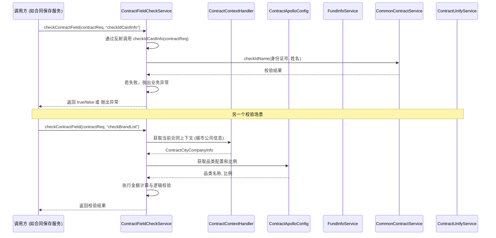
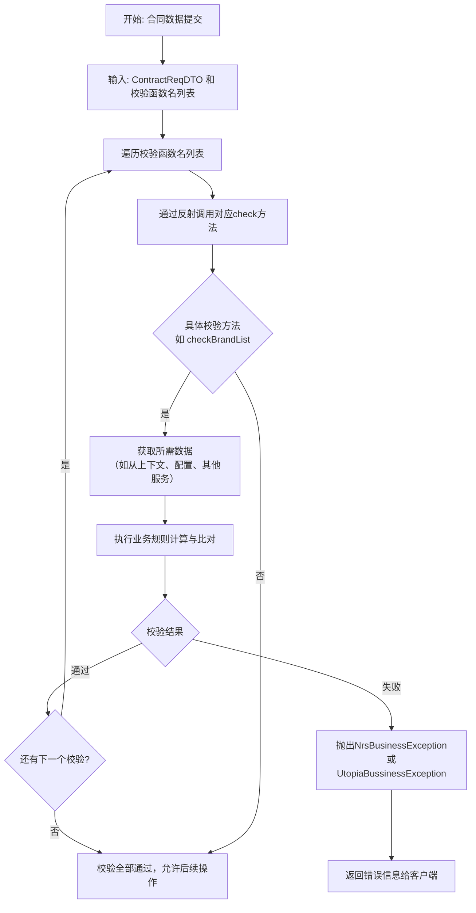

# 数据验证 模块文档

## 1. 模块概述
**数据验证模块**是合同服务（Contract Service）中**合同详情与配置（`contract_detail_and_config`）** 子模块的核心组成部分。其核心职责是**在合同提交、保存等关键业务节点，对合同相关数据的完整性、一致性和业务规则进行强制性校验**。该模块以`ContractFieldCheckService`为核心服务，采用**反射机制**动态调用具体的校验方法，实现了校验逻辑与业务流程的解耦，提升了系统的灵活性和可扩展性。

本模块是确保合同数据质量、防止脏数据进入下游流程（如PDF生成、签章、财务结算）的关键屏障。

## 2. 架构概述

### 2.1 模块定位
在整体系统中，数据验证模块位于业务逻辑层，是**合同核心服务（`contract_core_services`）** 的一部分。它通常在合同数据持久化或状态变更前被调用。

```mermaid
graph TD
    A[合同业务流程<br>（提交/保存/修改）] --> B{数据验证模块};
    B -- 验证通过 --> C[继续后续流程<br>（如持久化、状态更新）];
    B -- 验证失败 --> D[终止流程并返回错误];

    subgraph “核心模块依赖”
        E[合同上下文<br>（Contract Context）] --> B;
        F[基金服务<br>（Fund Service）] --> B;
        G[配置服务<br>（Apollo Config）] --> B;
        H[公共合同服务<br>（Common Contract）] --> B;
        I[设计费计算器<br>（Design Fee Calculator）] --> B;
    end
```

### 2.2 核心设计
`ContractFieldCheckService` 的核心设计采用了**策略模式与反射相结合**的方案：
- **统一入口**：外部通过`checkContractField(contractReq, functionName)`方法传入合同请求数据和待执行的校验函数名。
- **动态分派**：利用Java反射机制，根据传入的`functionName`动态查找并调用`ContractFieldCheckService`类中对应的`public boolean checkXXX(ContractReqDTO contractReq)`方法。
- **方法约束**：所有具体的校验方法必须遵循`checkXxx`的命名规范，接收`ContractReqDTO`作为参数，并返回布尔值表示校验结果。

## 3. 核心组件分析：`ContractFieldCheckService`

### 3.1 组件职责
该类是本模块的唯一核心组件，封装了所有具体的字段级和业务规则校验逻辑。每个`checkXxx`方法对应一个特定的校验规则。

### 3.2 关键校验方法列表

| 方法名 (functionName) | 校验目的 | 主要规则 | 依赖的外部服务 |
| :--- | :--- | :--- | :--- |
| `checkBrandList` | 校验品类列表数据 | 1. 品类编号必须在配置中有效。<br>2. 各品类预收金额之和必须等于总额。<br>3. 单个品类预收金额不能低于其报价金额的配置比例。 | `ContractApolloConfig`, `ContractContextHandler` |
| `checkBrandTotalAmount` | 校验品类总额与已付款 | 品类列表的预收总额不能小于对应款项类型的历史已付金额。 | `FundInfoService` |
| `checkAdvanceAmount` | 校验首期款金额与比例 | 1. 预估合同额需在合理区间内。<br>2. 首期款金额必须在预估合同额的20%~70%范围内。 | `ContractUnifyService`, `ContractApolloConfig` |
| `checkAdvanceFileSize` | 校验首期款报价单文件大小 | 上传的报价单文件大小不能超过配置的阈值（如10M）。 | `AdminService` |
| `checkHouseType` | 校验房屋类型一致性 | 正式套餐合同提交时，页面选择的房屋类型必须与报价侧数据保持一致（特定流程版本下）。 | `ContractContextHandler`, `CommonBusinessService` |
| `checkIdCardInfo` | 校验身份证信息一致性 | 签约人（业主、代理人、公司法人/代理人）的姓名与身份证号必须逻辑匹配。 | `CommonContractService`, `CipherService` |
| `checkCompanyInfo` | 校验企业信息一致性 | 当签约主体为企业时，企业名称与统一社会信用代码必须匹配且不为空。 | `ContractBusinessService` |
| `checkDesignAmount` | 校验设计服务费 | 在线签约且支持标准设计费的城市，设计服务费（优惠后）不能大于优惠前，且不能为负数。 | `DesignFeeCalculator`, `ContractApolloConfig`, `ContractUnifyService` |

### 3.3 组件交互图
下图展示了`ContractFieldCheckService`在执行校验时与系统其他关键组件的交互关系。



## 4. 模块依赖关系

数据验证模块的稳定运行依赖于多个基础服务和业务模块。

```mermaid
graph LR
    subgraph “数据验证模块 (当前)”
        CFCS[ContractFieldCheckService]
    end

    subgraph “基础与配置”
        CCH[ContractContextHandler<br>（合同上下文）]
        ACO[ContractApolloConfig<br>（动态配置）]
        PJS[ProjectConfigSnapService]
    end

    subgraph “合同核心业务”
        CCS[CommonContractService<br>（公共合同逻辑）]
        CBS[ContractBusinessService<br>（公司信息校验）]
        CUS[ContractUnifyService<br>（统一业务规则）]
        CPH[ContractContextHandler<br>（合同详情处理）]
    end

    subgraph “资金与用户”
        FIS[FundInfoService<br>（资金信息）]
        FBS[FundBaseService]
    end

    subgraph “工具与计算”
        CIP[CipherService<br>（加解密）]
        DFC[DesignFeeCalculator<br>（设计费计算）]
        CBS[CommonBusinessService]
        ADS[AdminService<br>（后台管理）]
    end

    CFCS --> CCH
    CFCS --> ACO
    CFCS --> PJS
    CFCS --> CCS
    CFCS --> CBS
    CFCS --> CUS
    CFCS --> FIS
    CFCS --> FBS
    CFCS --> CIP
    CFCS --> DFC
    CFCS --> CBS
    CFCS --> ADS
```

## 5. 数据流与验证流程

当合同数据准备提交或保存时，会触发数据验证流程。下图描述了一个典型请求经过本模块的数据流。



## 6. 与其他模块的关联

- **[合同上下文模块 (contract_context)](contract_context.md)**: 数据验证模块通过`ContractContextHandler`获取当前请求的上下文信息，例如`ContractCityCompanyInfo`和`PlanAllDTO`，这些是进行业务规则校验（如品类配置、房屋类型）的必要输入。
- **[合同修改策略模块 (contract_modification_strategy)](contract_modification_strategy.md)**: 在合同变更流程中，数据验证是确保变更合法性的前置步骤。`ChangeContractStrategy`的实现中应包含或调用此验证模块。
- **[展示与交互模块](ContractDetailService.md)**: 前端页面数据提交后，首先由展示与交互层的服务接收，随后调用本数据验证模块进行校验，再决定是否执行后续的保存或提交动作。

## 7. 注意事项与维护指南

1.  **反射机制约束**：新增或修改校验规则时，必须严格遵守`checkXxx(ContractReqDTO)`的方法签名。**方法名称一旦被配置使用，便不能轻易修改或删除**，否则会导致运行时找不到方法而校验失效。
2.  **异常处理规范**：校验失败时，统一抛出`NrsBusinessException`或`UtopiaBussinessException`，并携带明确的错误码和面向用户的提示信息。对于需要前端友好提示的场景，使用`ReturnCodeEnum.SHOW_TO_CLIENT`。
3.  **配置驱动**：许多校验阈值和规则（如金额比例、文件大小限制、支持的品类列表）由`ContractApolloConfig`动态管理。调整业务规则时，应优先考虑修改配置，而非代码。
4.  **幂等性**：校验方法应设计为幂等的，即对同一输入多次调用，结果一致。避免在方法内部修改外部状态。
5.  **日志记录**：关键的校验失败点（如金额超限、信息不匹配）应有详细的日志输出，便于问题排查。日志级别为`WARN`或`ERROR`。
6.  **性能考虑**：部分校验方法（如`checkIdCardInfo`）涉及远程调用或数据库查询，需关注其性能影响，尤其是在批量处理场景下。