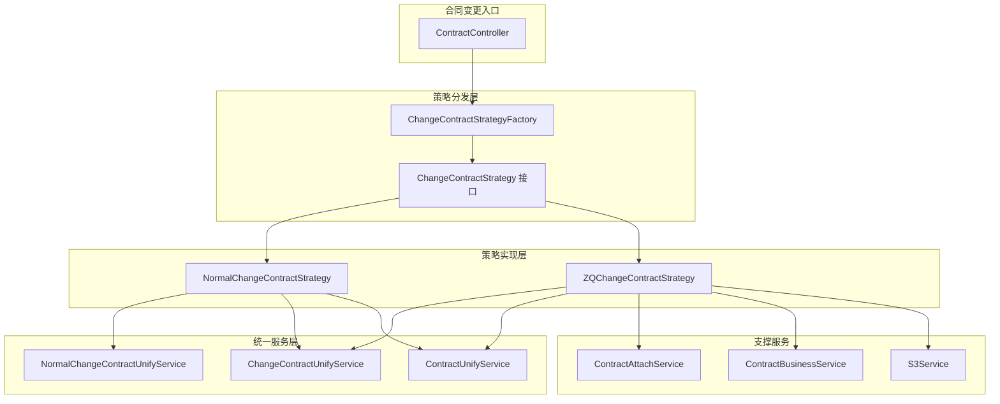
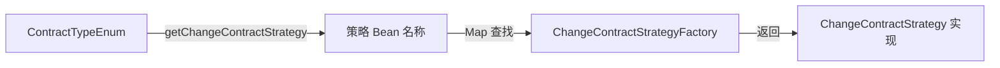
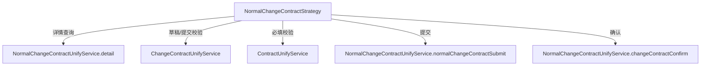
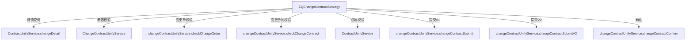
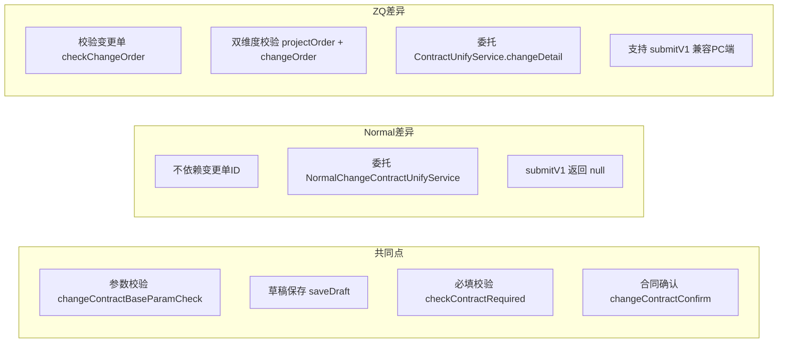
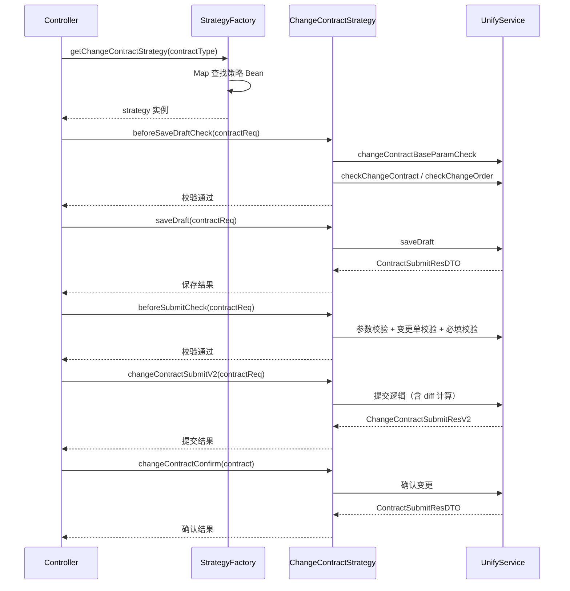
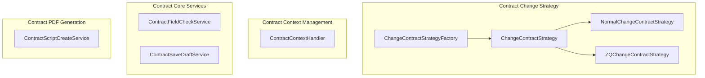
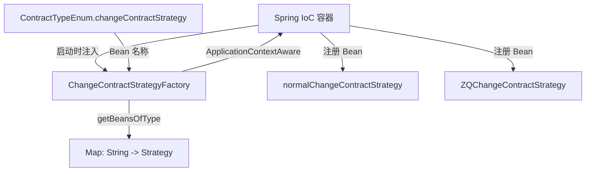

# Contract Change Strategy

## 模块概述

Contract Change Strategy 模块是合同变更流程的核心策略分发层，采用**策略模式（Strategy Pattern）**与**工厂模式（Factory Pattern）**相结合的方式，根据不同的合同类型（`ContractTypeEnum`）路由到对应的变更策略实现。该模块封装了合同变更的完整生命周期——从详情查询、草稿保存、提交校验到最终确认——并对不同业务场景（整装套餐变更 vs 设计变更）提供差异化的处理逻辑。

模块位于包路径 `com.ke.utopia.nrs.salesproject.service.contract.v2.changecontractstrategey` 下。

> **注意**：包名中 `strategey` 为历史拼写错误（正确拼写应为 `strategy`），已在代码库中沿用。

---

## 架构总览

---

## 核心组件详解

### 1. ChangeContractStrategy 接口

策略接口定义了合同变更操作的完整契约，包含 7 个方法，覆盖变更合同的全生命周期：

| 方法 | 职责 | 返回类型 |
|------|------|---------|
| `changeDetail` | 查询变更合同详情 | `ContractDetailResp` |
| `beforeSaveDraftCheck` | 保存草稿前的参数校验 | `void` |
| `saveDraft` | 保存变更合同草稿 | `ContractSubmitResDTO` |
| `beforeSubmitCheck` | 提交前的必填校验 | `void` |
| `changeContractSubmit` | 提交 V1（2.0 分模块 diff） | `ChangeContractSubmitRes` |
| `changeContractSubmitV2` | 提交 V2（2.5 统一 diff） | `ChangeContractSubmitResV2` |
| `changeContractConfirm` | 确认变更合同 | `ContractSubmitResDTO` |

### 2. ChangeContractStrategyFactory（工厂）

工厂类实现了 `ApplicationContextAware` 接口，在 Spring 容器启动时自动收集所有 `ChangeContractStrategy` 类型的 Bean，存入 `Map<String, ChangeContractStrategy>`。运行时通过 `ContractTypeEnum.getChangeContractStrategy()` 返回的 Bean 名称查找对应策略实例。

**路由规则**（基于 `ContractTypeEnum` 的 `changeContractStrategy` 字段）：

| 合同类型枚举 | Code | 名称 | 策略 Bean |
|-------------|------|------|----------|
| `PACKAGE_CHANGE` | 4 | 套餐变更协议 | `ZQChangeContractStrategy` |
| `DESIGN_CHANGE` | 11 | 设计变更协议 | `normalChangeContractStrategy` |

> 其余 28 种合同类型未配置变更策略，调用时将抛出 `NrsBusinessException("合同类型不支持")`。

### 3. NormalChangeContractStrategy（设计变更策略）

处理 **设计变更协议**（`DESIGN_CHANGE`），适用于设计方案调整场景。

**核心委托关系**：

**校验逻辑特征**：
- 使用 `checkChangeContractWithoutChangeOrderId` —— **不依赖变更单 ID**，仅校验项目订单维度的变更合同发起资格
- 说明设计变更可以脱离独立变更单直接发起

### 4. ZQChangeContractStrategy（套餐变更策略）

处理 **套餐变更协议**（`PACKAGE_CHANGE`），适用于整装/团装套餐升级或调整场景。

**核心委托关系**：

**校验逻辑特征**：
- 使用 `checkChangeOrder` —— **额外校验变更单是否满足发起合同变更的条件**
- 使用 `checkChangeContract(projectOrderId, changeOrderId)` —— **同时校验项目订单和变更单两个维度**
- 相比 Normal 策略多了变更单级别的前置校验，确保套餐变更流程的完整性
- 保留了 `changeContractSubmit`（V1）接口以兼容原有 PC 端的分模块 diff 对比方式

---

## 策略对比

| 维度 | NormalChangeContractStrategy | ZQChangeContractStrategy |
|------|-----------------------------|-------------------------|
| 适用合同 | 设计变更协议 (code=11) | 套餐变更协议 (code=4) |
| 变更单校验 | 无（不依赖变更单） | 有（`checkChangeOrder` + `checkChangeContract`） |
| 详情查询 | `NormalChangeContractUnifyService.detail` | `ContractUnifyService.changeDetail` |
| V1 提交 | 返回 `null`（不支持） | 委托 `changeContractUnifyService.changeContractSubmit` |
| V2 提交 | 委托 `NormalChangeContractUnifyService` | 委托 `changeContractUnifyService` |
| 额外依赖 | 无 | `ContractAttachService`, `ContractBusinessService`, `S3Service` |

---

## 数据流

### 合同变更提交流程

---

## 依赖关系

### 内部依赖

### 外部服务依赖

| 依赖服务 | 引用方 | 用途 |
|---------|--------|------|
| `ChangeContractUnifyService` | Normal, ZQ | 参数校验、草稿保存、提交、确认等统一逻辑 |
| `NormalChangeContractUnifyService` | Normal | 设计变更专用的详情查询和提交逻辑 |
| `ContractUnifyService` | Normal, ZQ | 必填校验、详情查询（ZQ 的 changeDetail） |
| `ContractAttachService` | ZQ | 合同附件操作 |
| `ContractBusinessService` | ZQ | 合同业务逻辑 |
| `S3Service` | ZQ | 文件存储（S3）操作 |
| `ContractTypeEnum` | Factory | 合同类型枚举，提供策略 Bean 名称映射 |

---

## 关键设计模式

### 策略模式 + 工厂模式

本模块是策略模式的经典应用，结合 Spring 的 IoC 容器实现了自动化的策略注册与分发：

1. **策略接口定义契约**：`ChangeContractStrategy` 接口定义了所有变更合同操作的标准方法签名
2. **具体策略封装差异**：`NormalChangeContractStrategy` 和 `ZQChangeContractStrategy` 分别封装各自业务场景的差异逻辑
3. **工厂统一分发**：`ChangeContractStrategyFactory` 通过 `ApplicationContextAware` 在容器启动时自动收集所有策略 Bean，运行时根据 `ContractTypeEnum` 的 `changeContractStrategy` 字段（Bean 名称）精确路由

### 开闭原则（OCP）

新增变更合同类型时，只需：
1. 创建新的 `ChangeContractStrategy` 实现类并标注 `@Component`
2. 在 `ContractTypeEnum` 中为对应枚举值配置 `changeContractStrategy` 字段为新 Bean 的名称

无需修改工厂类或现有策略实现，完全遵循开闭原则。

### 模板方法模式的影子

虽然未使用显式的模板方法，但两个策略实现中 `beforeSaveDraftCheck` 和 `beforeSubmitCheck` 的结构高度相似——都遵循"参数校验 → 业务校验 → 必填校验"的三步流程，差异仅在于业务校验的具体逻辑。这暗示未来可考虑将公共校验骨架提升到抽象基类中。

---

## 与其他模块的关系

| 相关模块 | 关系说明 |
|---------|---------|
| [Contract Context Management](Contract Context Management.md) | 为合同变更操作提供上下文环境，`ContractContextHandler` 在变更流程中注入必要的上下文信息 |
| [Contract Core Services](Contract Core Services.md) | 提供草稿保存（`ContractSaveDraftService`）、字段校验（`ContractFieldCheckService`）等基础能力，被本模块的 UnifyService 层间接调用 |
| [Contract PDF Generation](Contract PDF Generation.md) | 变更合同确认后可能触发 PDF 重新生成，`ContractScriptCreateService` 负责变更后的脚本/PDF 创建 |
| [Personal Relation & Signing](Personal Relation & Signing.md) | 变更合同的签署来源策略（`ChangeOrderSigningSourceStrategy`）与本模块的变更单校验逻辑存在业务关联 |
