# Contract Context Handler 模块文档

## 1. 模块概述

Contract Context Handler 是合同管理系统中的**数据准备基础设施模块**，负责在合同业务操作执行前，通过 AOP 切面机制自动收集、聚合多源业务数据，并将其缓存到线程级上下文中，供下游合同业务组件免重复查询地使用。

该模块解决了合同操作中的核心痛点：一次合同提交/预览涉及 **项目信息、报价数据、图纸信息、存管账户、套餐数据、公司主体信息** 等十余种外部数据源，且不同合同类型（正签、变更、解约、设计、存管协议等）所需数据组合各异。模块通过声明式注解 + 并行拉取 + ThreadLocal 缓存的组合，将数据准备逻辑从业务代码中彻底剥离。

## 2. 架构总览

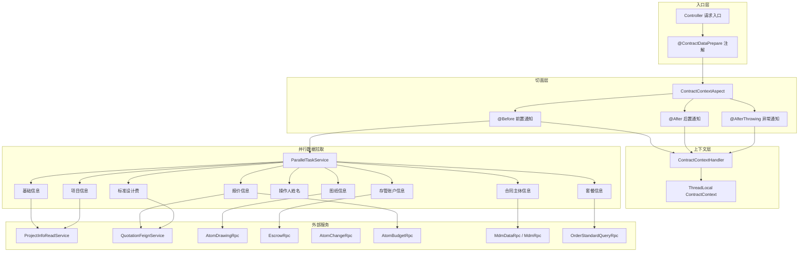

## 3. 核心组件详解

### 3.1 ContractContextHandler — 线程上下文持有者

`ContractContextHandler` 是一个基于 `ThreadLocal<ContractContext>` 的静态工具类，为当前 HTTP 请求线程提供合同数据的存取服务。

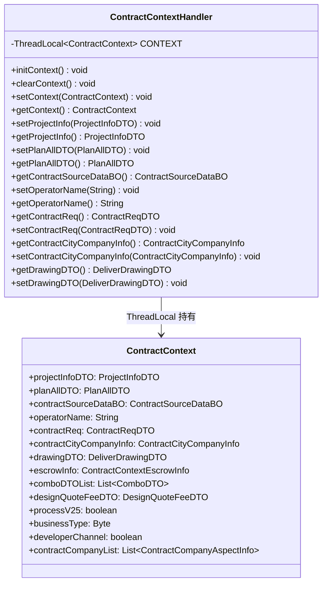

**设计要点**：

| 特性 | 说明 |
|------|------|
| 线程隔离 | 每个请求线程拥有独立的 `ContractContext` 实例，天然线程安全 |
| 生命周期管理 | 通过 AOP `@Before` 初始化、`@After` / `@AfterThrowing` 清除，确保无内存泄漏 |
| 空安全防护 | getter 方法在 `CONTEXT.get() == null` 时返回 null 而非抛 NPE，防御下游越权调用 |
| 静态访问 | 全局静态方法，任意业务层均可通过 `ContractContextHandler.getContext()` 获取当前上下文 |

### 3.2 ContractContextAspect — AOP 数据准备切面

`ContractContextAspect` 是模块的核心调度者，通过拦截 `@ContractDataPrepare` 注解的方法，在业务逻辑执行前完成全部数据准备。

#### 3.2.1 切面生命周期

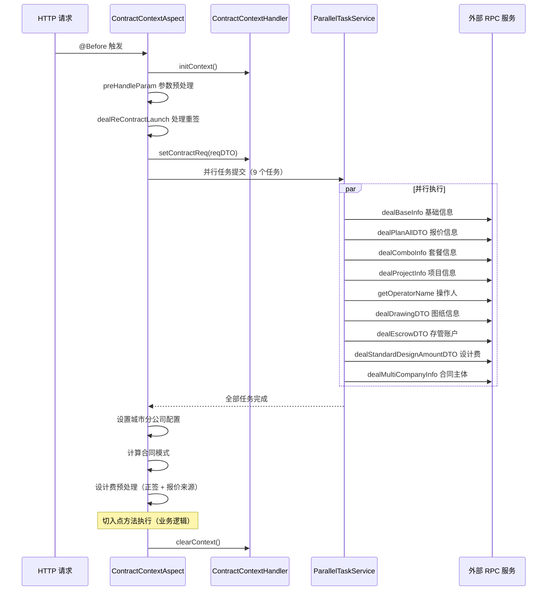

#### 3.2.2 参数预处理策略

切面的 `preHandleParam()` 方法实现了复杂的入参清洗逻辑，根据合同对象类型（个人/公司）、签约渠道（线上/线下）、是否有代理人等维度，清除不相关字段，避免脏数据写入：

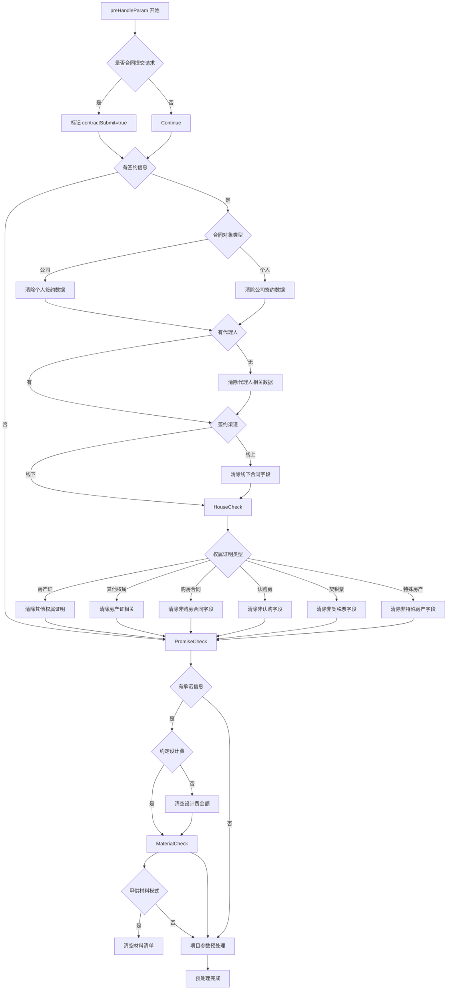

#### 3.2.3 合同类型分支：报价信息拉取

报价信息是数据准备中最复杂的部分，不同合同类型走完全不同的数据获取路径：

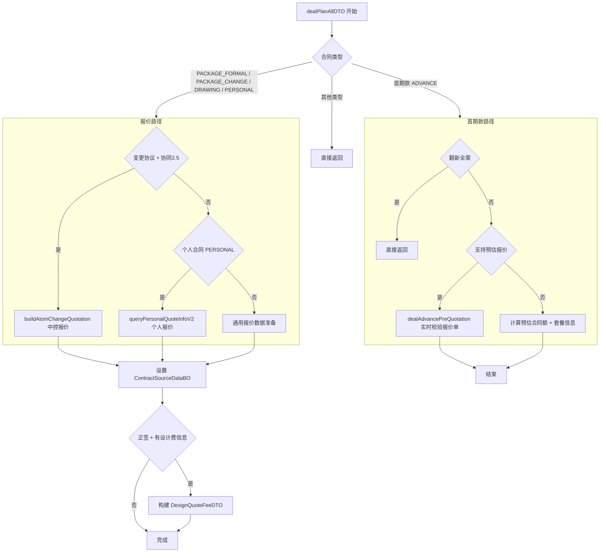

#### 3.2.4 条件执行的数据任务

并非所有并行任务都会执行完整逻辑，模块通过合同类型和业务模式进行前置过滤：

| 数据任务 | 执行条件 | 说明 |
|---------|---------|------|
| `dealBaseInfo` | 始终执行 | 开发商渠道标记 |
| `dealPlanAllDTO` | 始终执行，内部按类型分支 | 最复杂的任务 |
| `dealComboInfo` | 仅 V2.5 流程 + 户证业务 + 正签合同 | 套餐数据 |
| `dealProjectInfo` | 始终执行 | 项目基础信息 |
| `getOperatorName` | 始终执行 | 操作人姓名 |
| `dealDrawingDTO` | 正签/变更/个人/设计合同 + V2.5 流程 | 图纸信息 |
| `dealEscrowDTO` | 需要存管账户的合同类型 | 开户信息 |
| `dealStandardDesignAmountDTO` | 设计合同 + 特定城市 | 标准设计费 |
| `dealMultiCompanyInfo` | 仅存管协议 FUND_ESCROW | 多公司主体 |

## 4. 模块依赖关系

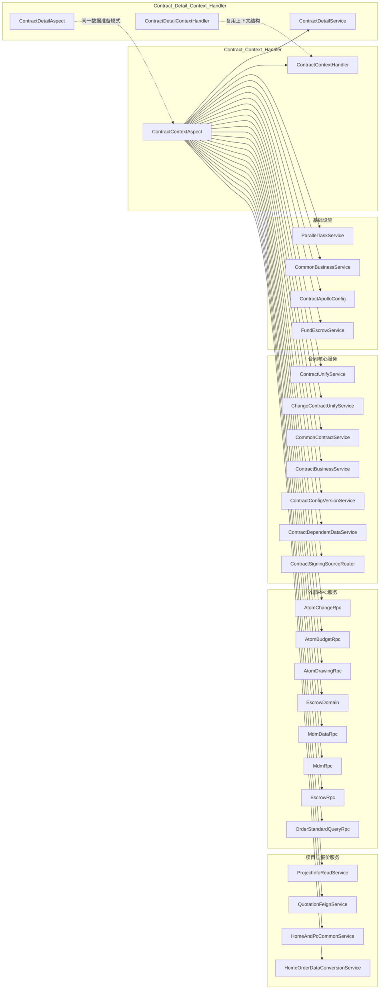

> **注**：Contract Detail Context Handler 模块（[Contract Detail Context Handler](Contract%20Detail%20Handler.md)）采用与本模块相同的 ThreadLocal 上下文模式，用于合同详情查询场景的数据准备。两模块共享 `ContractDetailService` 作为部分数据获取的公共入口。

## 5. 数据流全景

```mermaid
flowchart TD
    subgraph 请求入口
        R1[合同提交请求]
        R2[合同预览请求]
        R3[合同保存草稿]
    end

    subgraph ContractContextAspect 数据准备
        P1[参数预处理 preHandleParam]
        P2[重签前置处理]
        P3[并行数据拉取 9个任务]
        P4[后置处理：城市配置 + 合同模式 + 设计费]
    end

    subgraph ContractContext 数据载体
        C1[ContractReqDTO 请求参数]
        C2[ProjectInfoDTO 项目信息]
        C3[PlanAllDTO 报价信息]
        C4[ContractSourceDataBO 报价源数据]
        C5[DrawingDTO 图纸信息]
        C6[ContractContextEscrowInfo 存管信息]
        C7[ComboDTOList 套餐列表]
        C8[ContractCityCompanyInfo 城市公司配置]
        C9[DesignQuoteFeeDTO 设计费信息]
        C10[ContractCompanyAspectInfoList 公司主体]
    end

    subgraph 下游消费方
        D1[ContractUnifyService 合同保存]
        D2[ContractScriptCreateService 脚本生成]
        D3[PDF 生成服务]
        D4[合同字段校验]
    end

    R1 -->|ContractDataPrepare| P1
    R2 -->|ContractDataPrepare| P1
    R3 -->|ContractDataPrepare| P1
    P1 --> P2
    P2 --> P3
    P3 --> P4

    P1 --> C1
    P3 --> C2
    P3 --> C3
    P3 --> C4
    P3 --> C5
    P3 --> C6
    P3 --> C7
    P4 --> C8
    P4 --> C9
    P3 --> C10

    C1 -->|getContext| D1
    C2 -->|getContext| D1
    C3 -->|getContext| D1
    C4 -->|getContext| D1
    C5 -->|getContext| D1
    C6 -->|getContext| D1
    C7 -->|getContext| D1
    C8 -->|getContext| D1
    C9 -->|getContext| D1
    C10 -->|getContext| D1
    C1 -->|getContext| D2
    C2 -->|getContext| D2
    C3 -->|getContext| D2
    C4 -->|getContext| D2
    C5 -->|getContext| D2
    C6 -->|getContext| D2
    C7 -->|getContext| D2
    C8 -->|getContext| D2
    C9 -->|getContext| D2
    C10 -->|getContext| D2
    C1 -->|getContext| D3
    C2 -->|getContext| D3
    C3 -->|getContext| D3
    C4 -->|getContext| D3
    C5 -->|getContext| D3
    C6 -->|getContext| D3
    C7 -->|getContext| D3
    C8 -->|getContext| D3
    C9 -->|getContext| D3
    C10 -->|getContext| D3
    C1 -->|getContext| D4
    C2 -->|getContext| D4
    C3 -->|getContext| D4
    C4 -->|getContext| D4
    C5 -->|getContext| D4
    C6 -->|getContext| D4
    C7 -->|getContext| D4
    C8 -->|getContext| D4
    C9 -->|getContext| D4
    C10 -->|getContext| D4
```

## 6. 关键设计模式

### 6.1 ThreadLocal 上下文模式

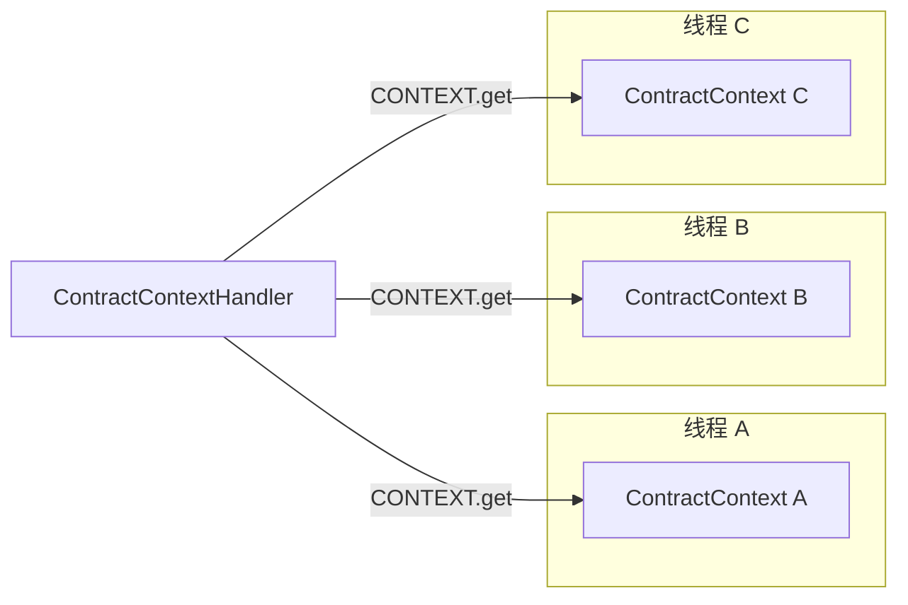

每个请求线程拥有独立的数据副本，通过 `initContext()` → 业务执行 → `clearContext()` 的生命周期保证数据隔离和内存安全。

### 6.2 AOP 拦截器模式

模块使用 `@Aspect` + `@Pointcut` 的声明式切面，以 `@ContractDataPrepare` 自定义注解作为切点标识。业务方法只需添加注解即可自动获得完整数据准备能力，实现了**数据准备与业务逻辑的彻底解耦**。

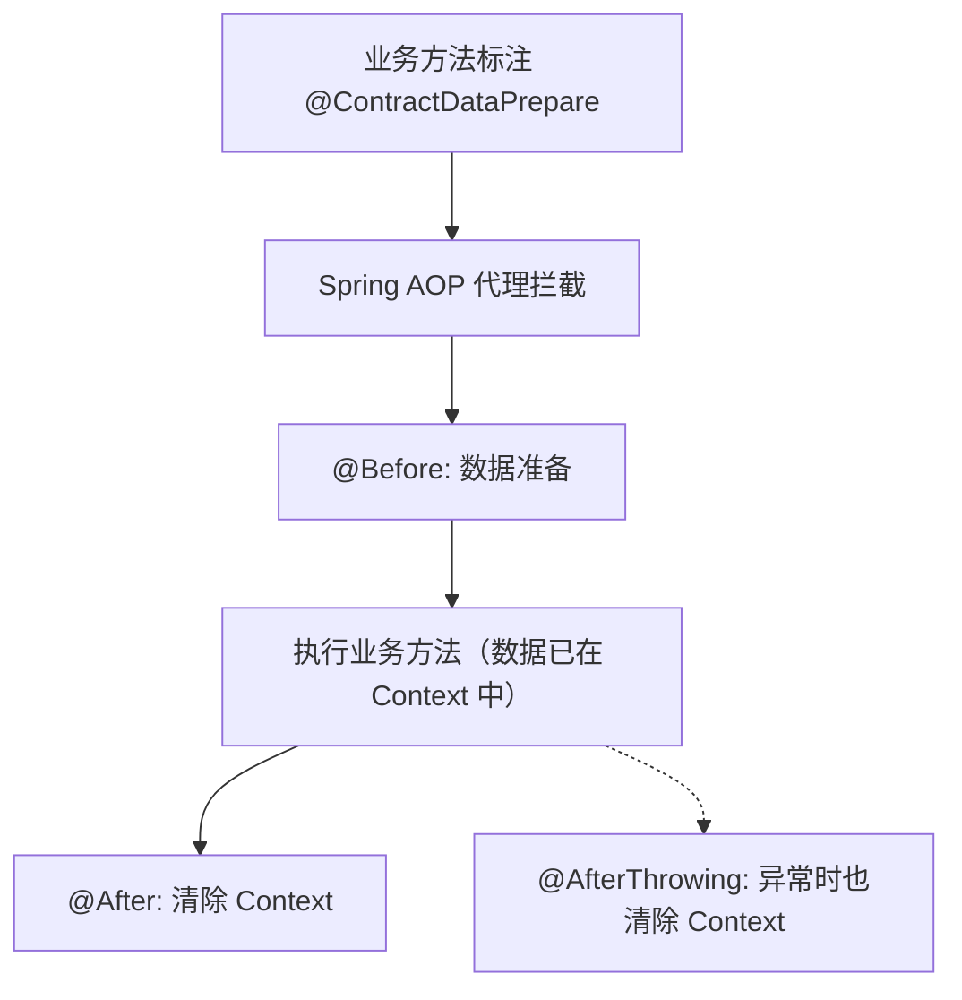

### 6.3 并行任务编排模式

模块使用 `ParallelTaskService` 编排多个独立数据拉取任务，通过 `addNewTask` → `execTasks` → `awaitTasksResult` 三步完成并行执行和结果收集：

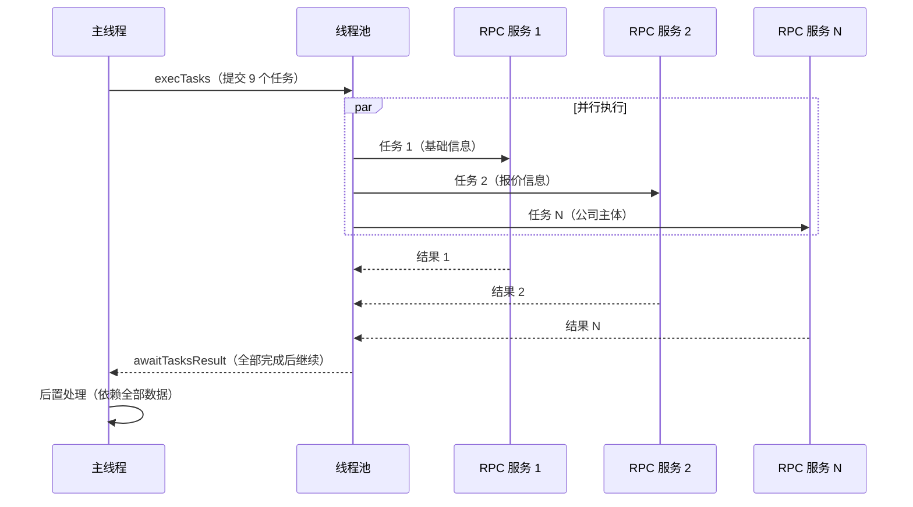

> **性能意义**：9 个远程调用并行执行，总耗时约等于最慢单个调用的耗时，而非串行的总和。典型场景下从约 2-3 秒降至约 500ms。

### 6.4 策略分支模式

报价信息拉取（`dealPlanAllDTO`）、图纸信息拉取（`dealDrawingDTO`）等方法内部根据合同类型走不同的分支策略。这是一种轻量级的策略模式实现——通过 `if/else` 链而非策略工厂，适合分支数量有限且不频繁扩展的场景。

## 7. 外部服务交互拓扑

```mermaid
graph TD
    subgraph 合同模块
        Aspect[ContractContextAspect]
    end

    subgraph 项目域
        P1[ProjectInfoReadService]
        P2[CommonBusinessService]
    end

    subgraph 报价域
        Q1[QuotationFeignService]
        Q2[AtomBudgetRpc]
        Q3[HomeOrderDataConversionService]
        Q4[ContractDependentDataService]
    end

    subgraph 变更域
        CH1[AtomChangeRpc]
        CH2[ChangeContractUnifyService]
    end

    subgraph 图纸域
        DR1[AtomDrawingRpc]
        DR2[ContractBusinessService]
        DR3[ContractSigningSourceRouter]
    end

    subgraph 存管域
        E1[EscrowDomain]
        E2[EscrowRpc]
        E3[FundEscrowService]
    end

    subgraph 主数据域
        M1[MdmDataRpc]
        M2[MdmRpc]
    end

    subgraph 套餐域
        O1[OrderStandardQueryRpc]
    end

    subgraph 配置域
        C1[ContractConfigVersionService]
        C2[ContractApolloConfig]
    end

    Aspect --> P1
    Aspect --> P2
    Aspect --> Q1
    Aspect --> Q2
    Aspect --> Q3
    Aspect --> Q4
    Aspect --> CH1
    Aspect --> CH2
    Aspect --> DR1
    Aspect --> DR2
    Aspect --> DR3
    Aspect --> E1
    Aspect --> E2
    Aspect --> E3
    Aspect --> M1
    Aspect --> M2
    Aspect --> O1
    Aspect --> C1
    Aspect --> C2
```

## 8. 变更合同的特殊处理：buildAtomChangeQuotation

变更合同（PACKAGE_CHANGE）的报价数据获取有一条独立路径，涉及中控报价系统：

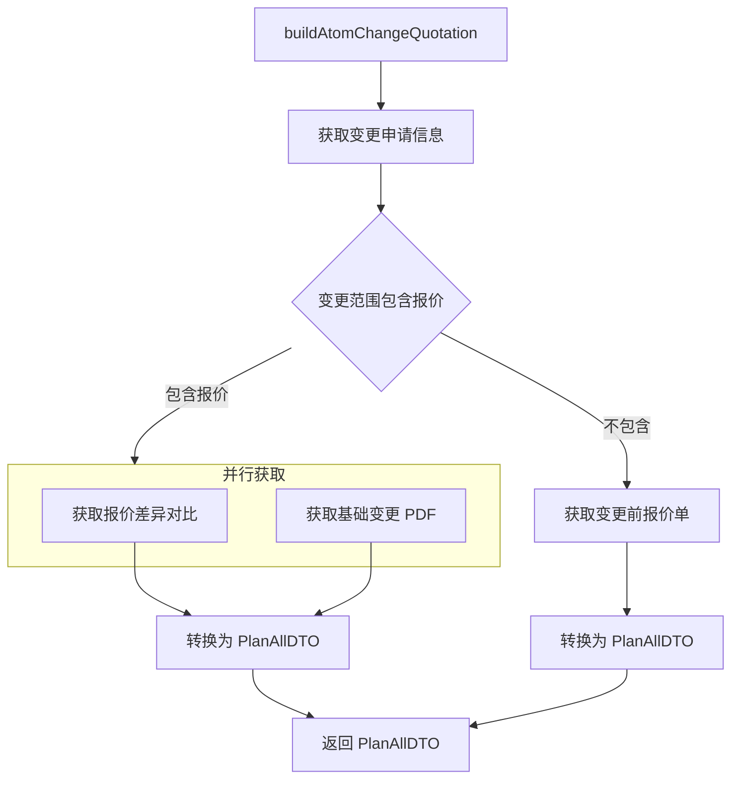

> 详细变更策略实现参见 [Contract Change Strategy](Contract Change Strategy.md)。

## 9. 与关联模块的关系

| 关联模块 | 关系说明 |
|---------|---------|
| [Contract Detail Context Handler](Contract%20Detail%20Handler.md) | 共享上下文架构模式，用于合同详情查询场景；共享 `ContractDetailService` |
| [Contract Core Services](Contract Core Services.md) | 上游消费者，通过 `ContractContextHandler.getContext()` 获取已准备的数据 |
| [Contract PDF Generation](Contract PDF Generation.md) | 上游消费者，依赖上下文中的图纸、报价、项目信息生成 PDF |
| [Contract Change Strategy](Contract Change Strategy.md) | 协作关系，变更合同的报价差异计算在本模块中触发，策略选择在变更策略模块中完成 |
| [Personal Relation & Signing](Personal%20Relation%20Signing.md) | 协作关系，个人合同的图纸获取通过 `ContractSigningSourceRouter` 路由到该模块的策略实现 |
