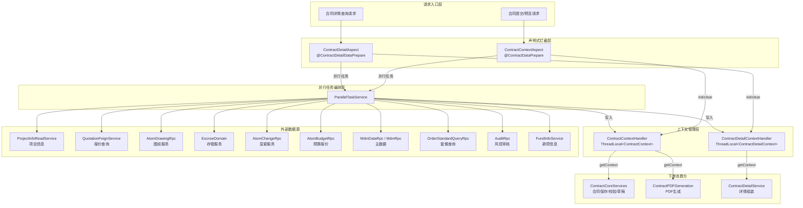
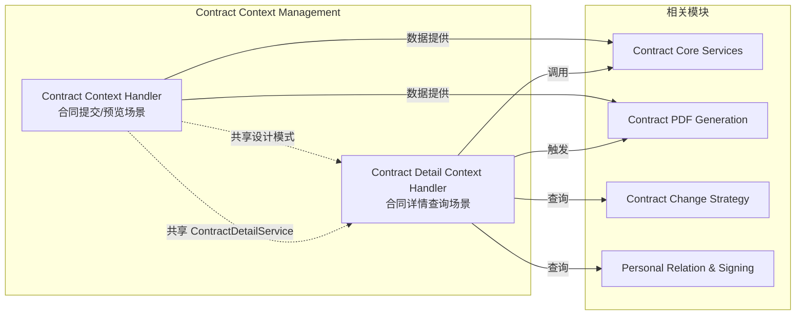
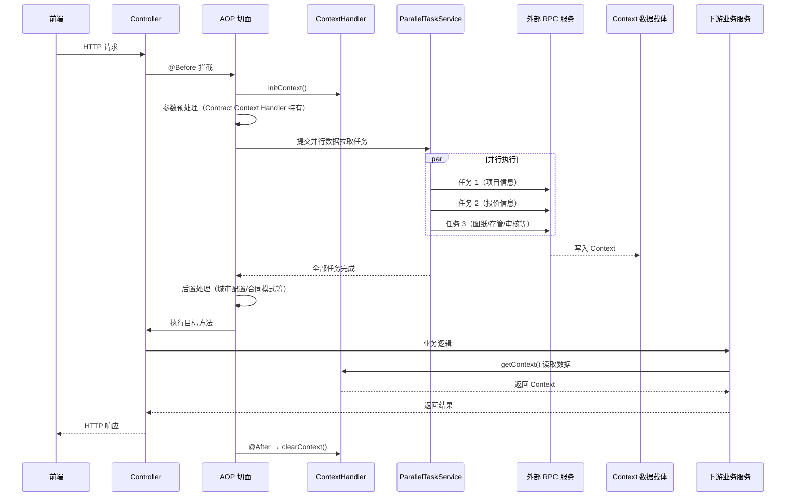
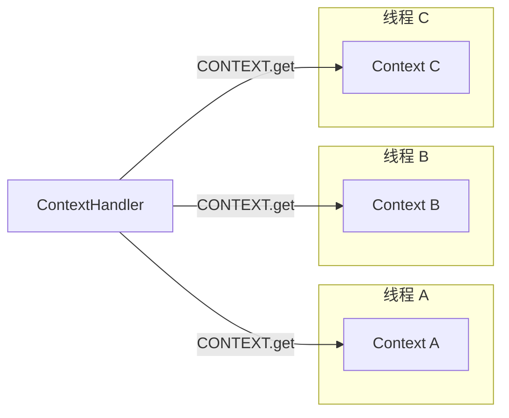
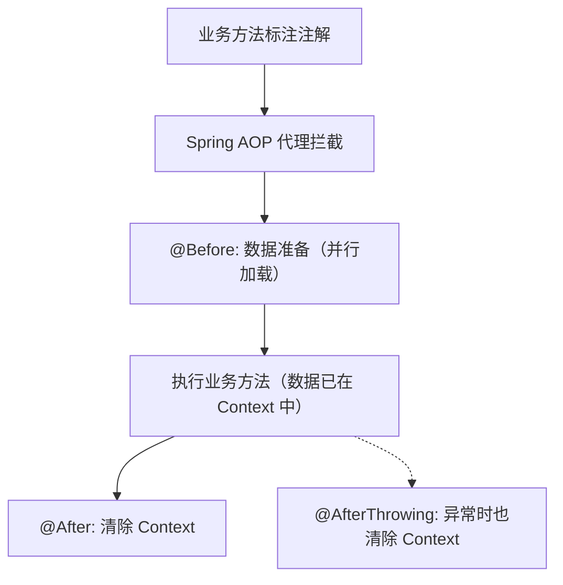

# Contract Context Management 模块概览

## 1. 模块目的

**Contract Context Management** 是合同管理系统的**数据准备基础设施层**，负责在合同业务操作执行前，通过 AOP 切面机制自动收集、聚合来自项目、报价、图纸、存管、审核等多个外部服务的数据，并将其缓存到线程级上下文（ThreadLocal）中，供下游业务组件免重复查询地使用。

该模块解决的核心痛点：

- **一次合同操作涉及十余种外部数据源**（项目信息、报价数据、图纸信息、存管账户、套餐数据、审核信息等），串行调用会导致接口响应过慢
- **不同合同类型（正签、变更、解约、设计、存管协议等）所需数据组合各异**，数据准备逻辑分散在业务代码中难以维护
- **数据加载与业务逻辑耦合**，新增数据源需要修改业务代码

模块通过 **声明式注解 + 并行拉取 + ThreadLocal 缓存** 的三层架构，将数据准备逻辑从业务代码中彻底剥离，实现：

- **声明式触发**：业务方法只需添加注解即可自动获得完整数据准备能力
- **并行执行**：所有独立的 RPC 调用通过线程池并发执行，总耗时约等于最慢单个调用
- **零侵入传递**：下游通过静态工具类读取上下文，无需方法签名传参

---

## 2. 子模块组成

本模块包含两个采用相同架构模式的子模块，分别服务于不同的业务场景：

| 子模块 | 触发注解 | 业务场景 | 并行任务数 | 核心特色 |
|--------|---------|---------|-----------|---------|
| **Contract Context Handler** | `@ContractDataPrepare` | 合同提交、预览、保存草稿 | 9 个 | 复杂的参数预处理（个人/公司、线上/线下、权属证明类型等维度清洗） |
| **Contract Detail Context Handler** | `@ContractDetailDataPrepare` | 合同详情查询 | 最多 8 个 | 首屏/非首屏分层加载优化，首屏仅加载 3 个轻量任务 |

两个子模块共享以下基础设施：

- **设计模式**：ThreadLocal Holder 模式（单例静态工具类 + 线程隔离数据）
- **并行编排**：`ParallelTaskService`（addNewTask → execTasks → awaitTasksResult 三步范式）
- **生命周期管理**：AOP `@Before` 初始化、`@After` / `@AfterThrowing` 清除

---

## 3. 模块架构

### 3.1 整体架构图

### 3.2 子模块协作关系

### 3.3 请求全链路数据流

---

## 4. 关键设计模式

### 4.1 ThreadLocal 上下文模式

每个请求线程拥有独立的数据副本，通过 `initContext()` → 业务执行 → `clearContext()` 的生命周期保证数据隔离和内存安全。

### 4.2 AOP 拦截器模式

### 4.3 并行任务编排模式

所有独立的远程调用通过 `ParallelTaskService` 并发执行，总耗时约等于最慢单个调用。典型场景下从串行的 2-3 秒降至约 500ms。

### 4.4 条件短路过滤

每个数据准备方法内部通过合同类型、业务模式等条件判断是否需要执行，不满足条件直接返回，避免无意义的 RPC 调用。

---

## 5. 子模块文档索引

| 子模块 | 说明 |
|--------|------|
| [Contract Context Handler](Contract Context Handler.md) | 合同提交/预览场景的数据准备模块，9 个并行任务，含复杂参数预处理逻辑 |
| [Contract Detail Context Handler](./Contract%20Detail%20Handler.md) | 合同详情查询场景的数据准备模块，首屏/非首屏分层加载优化，15+ 数据字段的详情组装 |

---

## 6. 与系统其他模块的关系

| 模块 | 关系 | 说明 |
|------|------|------|
| **Contract Core Services** | 上游消费方 | 通过 `ContractContextHandler.getContext()` 获取已准备的数据，执行合同保存、校验、草稿等核心操作 |
| **Contract PDF Generation** | 上游消费方 | 依赖上下文中的图纸、报价、项目信息生成 PDF 合同文档 |
| **Contract Change Strategy** | 协作方 | 变更合同的报价差异计算在 Context 模块中触发，策略选择在变更策略模块中完成 |
| **Personal Relation & Signing** | 协作方 | 个人合同的图纸获取通过 `ContractSigningSourceRouter` 路由到该模块的策略实现 |