# Contract Core Services

## 模块概述

Contract Core Services 是合同管理系统的核心业务服务层，位于合同提交流程的中间层，负责合同生命周期中各类核心业务逻辑的编排与执行。该模块包含 8 个核心服务组件，涵盖合同按钮动态配置、对公签约与授权协议管理、资金存管合同生成、合同字段校验、主订单号变更、草稿保存、自主盖章以及工种校验等关键业务能力。

本模块向上为 Controller/API 层提供业务操作入口，向下依赖 DAO 层进行数据持久化，同时与其他子模块（[Contract Context Management](Contract Context Management.md)、[Contract PDF Generation](Contract PDF Generation.md)、[Contract Change Strategy](Contract Change Strategy.md)、[Personal Relation & Signing](Personal Relation & Signing.md)）协同完成完整的合同业务流程。

---

## 系统架构

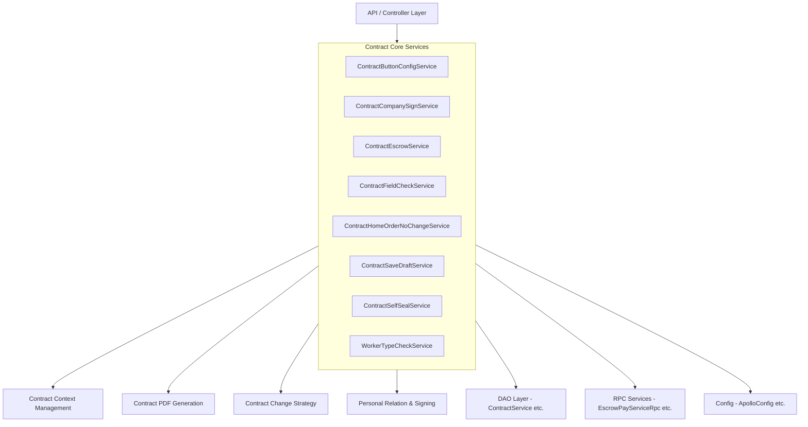

### 模块间协作关系

| 本模块组件 | 协作模块 | 协作方式 |
|-----------|---------|---------|
| ContractSaveDraftService | Personal Relation & Signing | 通过 `ContractSigningSourceRouter` 构建个性化合同商品信息 |
| ContractCompanySignService | Contract Context Management | 通过 `ContractContextHandler` 获取上下文信息 |
| ContractFieldCheckService | Contract Context Management | 通过 `ContractContextHandler` 获取 `ContractCityCompanyInfo` 和 `PlanAllDTO` |
| ContractSaveDraftService | Contract Change Strategy | 合并发起时关联变更合同策略 |
| ContractButtonConfigService | — | 独立运行，为其他模块提供按钮配置能力 |

---

## 核心组件详解

### 1. ContractButtonConfigService — 合同按钮动态配置

**职责**：基于多维配置引擎和 Aviator 表达式引擎，实现合同列表、授权列表、合同预览页、PC 端列表中各按钮的动态显隐控制。

**核心机制**：

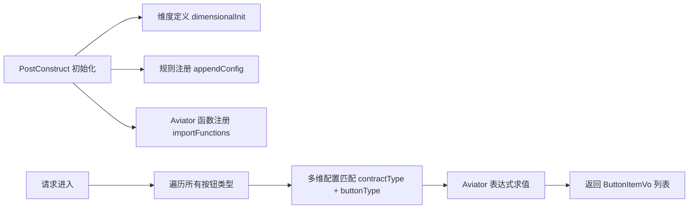

**按钮配置结构**：

- **配置维度**（`ContractButtonDimensional`）：按 `contractType`（合同类型）+ `buttonType`（按钮类型）二维定位
- **优先级机制**：通用规则（`normalRouteMap`，priority=10）覆盖默认值（`"false"`，priority=0），特殊规则（`routeMap`，priority=100）覆盖通用规则
- **表达式上下文**：通过 `ContractListButtonExecParam` / `ContractPreviewButtonExecParam` 等参数对象注入 `contractStatus`、`contractCode`、`bpmNo` 等变量

**四套配置场景**：

| 配置模块 | 模块键 | 适用场景 | 按钮枚举 |
|---------|-------|---------|---------|
| Home 合同列表 | `homeContractListButtonConfig` | 移动端合同列表 | `ContractButtonEnum` |
| PC 合同列表 | `pcContractListButtonConfig` | PC 端合同列表 | `PcButtonEnum` |
| 授权列表 | `authListContractButtonConfig` | 授权协议列表（已废弃） | `ContractButtonEnum` |
| 合同预览页 | `contractPreviewButtonConfig` | 合同详情预览 | `ContractButtonEnum` |

**合同类型特殊规则示例**：

- **变更合同**（type=4）：无编辑、无删除、无撤回、无查看按钮
- **解约协议**（type=5）：无编辑、无撤回、无删除，查看按钮仅限当前项目
- **个性化合同**（type=8）：编辑/删除/撤回仅限单独发起的 C 合同
- **补充协议**（type=29）：编辑/删除/撤回仅限单独发起；审核详情允许待签署/待确认态查看
- **和解协议**（type=30）：审核详情允许待签署/待确认态查看；不展示去重签

**自定义函数**：通过 `ContractFunction` 类向 Aviator 注册业务函数，如 `showUndoButton`、`showReSignButton`、`showChangeButton`、`showPersonCreateButton` 等，封装复杂的按钮显隐判断逻辑。

---

### 2. ContractCompanySignService — 对公签约与授权协议

**职责**：处理企业（对公）线上签约场景下的授权协议书生成、授权列表查询、授权信息查询及短信通知等业务。

**授权协议生成流程**：

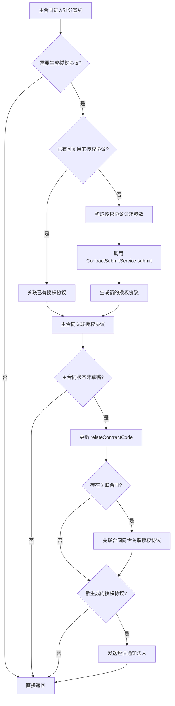

**授权协议复用判断**（`getExistCanRelatedAcreditContract`）：

复用条件需同时满足：
1. 乙方分公司（`companyCode`）相同
2. 甲方分公司（`companyCreditCode`）相同
3. 法人证件号相同
4. 代理人证件号相同（如有代理人）

**前置条件**（`needGenerateAccreditContract`）：

- 签约渠道为线上（`ONLINE`）
- 合同类型属于需要关联授权协议的类型（正签、个性化、首期款、变更、设计、设计变更）
- 非协同发起的 C 合同
- 签约对象为企业（`COMPANY`）
- 变更合同需有平台实例

**C 端授权列表**（`getAccreditContractList`）：

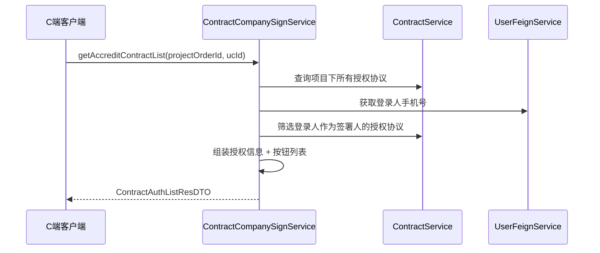

**短信通知**（`sendMessage`）：

授权协议生成后向法人发送短信，包含合同名称、加密地址、跳转短链。针对施工套餐合同和部分个性化合同有不同的发送策略。

---

### 3. ContractEscrowService — 资金存管合同

**职责**：生成资金存管协议合同，对接外部存管账户系统获取用户信息并组装合同参数。

**核心流程**：

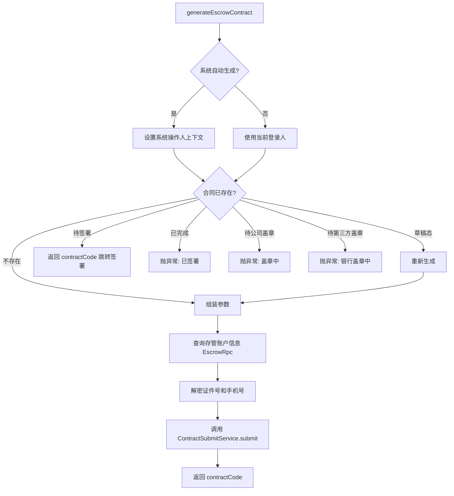

**幂等设计**：根据 `projectOrderId` + `FUND_ESCROW` 类型查询已有合同，根据不同状态返回不同结果或抛出明确业务异常，避免重复生成。

---

### 4. ContractFieldCheckService — 合同字段校验

**职责**：提供合同提交前的各类业务字段校验能力，通过反射机制支持动态调用。

**设计特点**：

- **反射调用**：`checkContractField` 方法根据 `functionName` 通过反射调用具体校验方法，方法名不能修改、不能删除
- **抛异常 vs 返回 false**：字段缺失等结构性问题返回 `false`，业务规则违反抛出 `NrsBusinessException` 或 `UtopiaBussinessException` 并附带用户可读的错误信息

**校验方法清单**：

| 校验方法 | 校验内容 | 关键规则 |
|---------|---------|---------|
| `checkBrandList` | 品类列表预收金额 | 品类编号在配置中；预收金额 >= 报价金额 × 百分比阈值；总计金额一致 |
| `checkBrandTotalAmount` | 品类总计金额 | 品类总金额 >= 已付金额 |
| `checkAdvanceAmount` | 首期款金额 | 预估合同额 > 0；首期款在 20%~70% 范围内；整装不可小于报价预估合同额 |
| `checkAdvanceFileSize` | 首期款报价单 | 文件大小不超过配置上限 |
| `checkHouseType` | 房屋类型一致性 | 正式套餐合同（2.5 流程）的房屋类型需与报价侧一致 |
| `checkIdCardInfo` | 身份证与姓名一致性 | 业主/代理人/法人/公司代理人的身份证号与姓名匹配 |
| `checkCompanyInfo` | 企业信息一致性 | 企业名称与统一社会信用代码匹配 |
| `checkDesignAmount` | 设计服务费 | 优惠后 <= 优惠前；优惠后 > 0 |

**校验流程**：

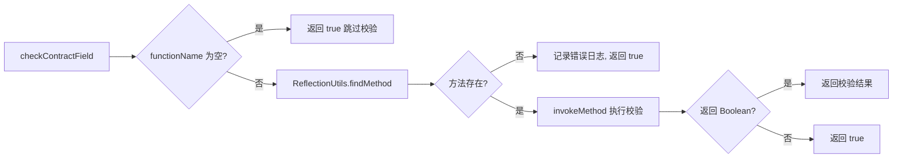

---

### 5. ContractHomeOrderNoChangeService — 主订单号变更

**职责**：处理装修佣金绑定场景下的主订单号变更，支持变更和回滚两个方向。

**变更逻辑**（`doChange`）：

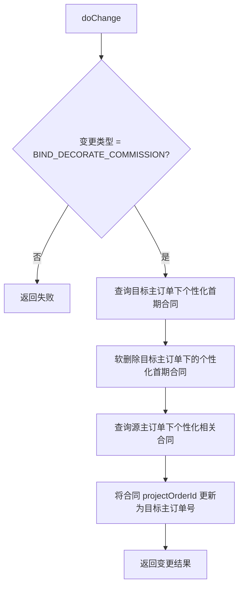

**回滚逻辑**（`doRevert`）：
1. 恢复销售合同的 `projectOrderId` 为源主订单号
2. 恢复被软删除的个性化首期合同

**事务保障**：变更和回滚操作均使用 `@Transactional` 注解保证原子性，变更结果通过 JSON 序列化存储以支持回滚。

---

### 6. ContractSaveDraftService — 合同草稿保存

**职责**：处理合同草稿保存逻辑，支持单合同和个性化合同的多主体拆分保存。

**核心流程**：

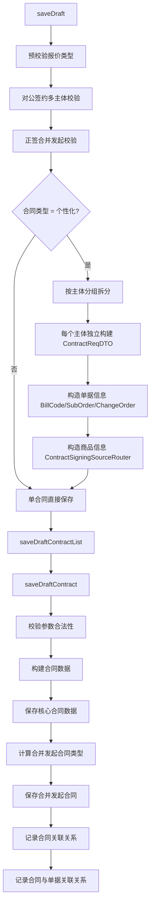

**个性化合同拆分**：

个性化合同按 `organizationCode`（组织主体编码）分组，每个主体独立生成一份合同请求。单据信息（账单、子单、变更单）和商品信息通过 `ContractSigningSourceRouter` 路由到不同的策略实现。

**AOP 增强**：`@ContractDataPrepare` 注解触发 AOP 切面进行合同数据预处理（参见 [Contract Context Management](Contract Context Management.md)）。

**合并发起机制**：通过 `ContractMergeLaunchComputer` 计算与当前合同合并发起的其他合同类型，在同一事务中保存所有关联合同。

---

### 7. ContractSelfSealService — 自主盖章

**职责**：提供企业自主盖电子章的能力，支持 PDF 和图片两种文件类型的盖章处理。

**盖章流程**：

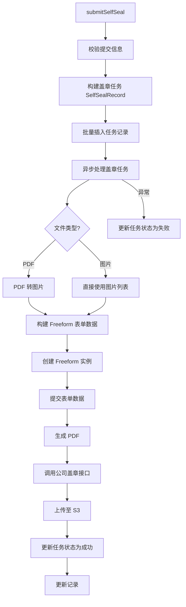

**任务状态流转**：

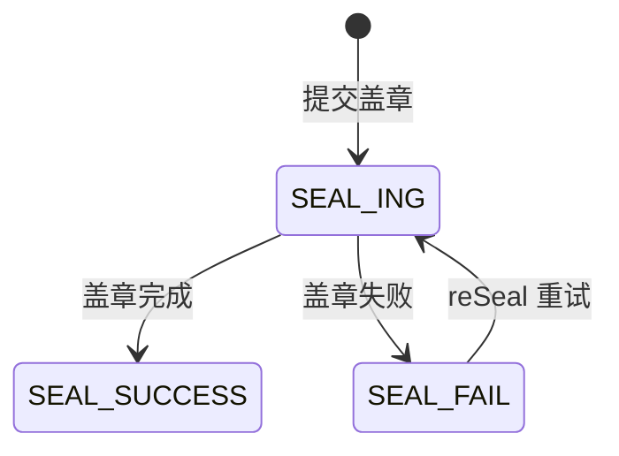

**权限控制**：根据登录人的系统号（`systemCode`）匹配 Apollo 配置中允许操作的分公司列表，不同系统号对应不同的可盖章分公司范围。

**异步处理**：盖章任务通过 `CompletableFuture.runAsync` 异步执行，使用 `RunnableWrapper` 集成 SkyWalking 链路追踪，失败时自动更新任务状态。

---

### 8. WorkerTypeCheckService — 工种校验

**职责**：提供基于手机号的工种校验能力，用于合同签约场景下排除特定工种人员。

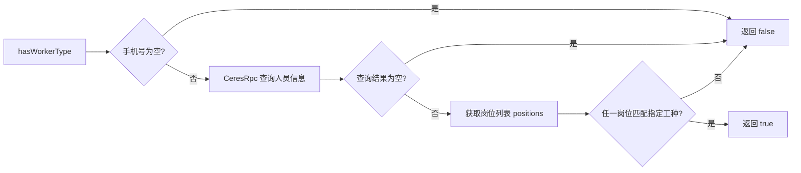

**两个入口方法**：
- `hasWorkerType(mobile, workTypes...)`：返回布尔值，判断是否包含指定工种
- `checkWorkerType(mobile, errorMsg, workTypes...)`：包含则抛出 `NrsBusinessException`，用于校验拦截场景

---

## 依赖关系

```mermaid
graph TD
    subgraph CoreServices[Contract Core Services]
        CBCS[ContractButtonConfigService]
        CCSS[ContractCompanySignService]
        CES[ContractEscrowService]
        CFCS[ContractFieldCheckService]
        CHONS[ContractHomeOrderNoChangeService]
        CSSDS[ContractSaveDraftService]
        CSSS[ContractSelfSealService]
        WTCS[WorkerTypeCheckService]
    end

    subgraph InternalDeps[内部依赖服务]
        CS[ContractService]
        CFS[ContractFieldService]
        CUS[ContractUserService]
        CRS[ContractRelationService]
        CNS[ContractNodeService]
        CSUB[ContractSubmitService]
        CUS2[ContractUnifyService]
        HCMS[HomeAndPcCommonService]
        CBS[ContractBusinessService]
    end

    subgraph ExternalDeps[外部 RPC / 基础服务]
        ERPC[EscrowRpc]
        UFS[UserFeignService]
        CSRV[PayServiceRpc]
        CERPC[CeresRpc]
        CIPS[CipherService]
        S3[S3Service]
        FFS[FreeformService]
    end

    subgraph ConfigDeps[配置服务]
        MDCS[MultidimensionalConfigService]
        CAC[ContractApolloConfig]
        CCCS[ContractCityCompanyConfigService]
        ASC[ApolloConfigService]
    end

    CBCS --> MDCS
    CBCS --> CAC
    CBCS --> CFS
    CBCS --> CS
    CBCS --> CRS

    CCSS --> CS
    CCSS --> CFS
    CCSS --> CUS
    CCSS --> CSUB
    CCSS --> HCMS
    CCSS --> CIPS
    CCSS --> CRS
    CCSS --> CBCS
    CCSS --> CSRV
    CCSS --> CCCS

    CES --> CSUB
    CES --> ERPC
    CES --> CS
    CES --> CIPS
    CES --> CBS

    CFCS --> CAC
    CFCS --> CIPS
    CFCS --> CBS
    CFCS --> CUS2

    CHONS --> CS

    CSSDS --> CUS2
    CSSDS --> CSUB

    CSSS --> CAC
    CSSS --> FFS
    CSSS --> S3

    WTCS --> CERPC
```

### 关键依赖说明

| 依赖服务 | 用途 | 消费方 |
|---------|------|-------|
| `MultidimensionalConfigService` | 多维配置引擎，支持按维度匹配并求值 Aviator 表达式 | ContractButtonConfigService |
| `ContractSubmitService` | 通用合同提交服务，封装合同创建的完整流程 | ContractCompanySignService, ContractEscrowService, ContractSaveDraftService |
| `ContractUnifyService` | 合同统一服务，提供参数校验、草稿构建、数据持久化等 | ContractSaveDraftService, ContractFieldCheckService |
| `ContractSigningSourceRouter` | 签约来源路由，根据绑定类型路由到不同策略 | ContractSaveDraftService |
| `FreeformService` | 自由表单服务，用于创建实例、提交表单、生成 PDF | ContractSelfSealService |
| `EscrowRpc` | 存管账户 RPC，查询存管账户详情 | ContractEscrowService |
| `CeresRpc` | 人员信息 RPC，查询工种信息 | WorkerTypeCheckService |
| `CipherService` | 加解密服务，处理手机号、证件号等敏感信息 | ContractCompanySignService, ContractEscrowService, ContractFieldCheckService |

---

## 数据流

### 合同草稿保存完整数据流

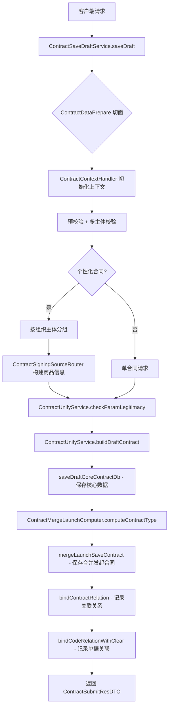

### 对公签约授权协议数据流

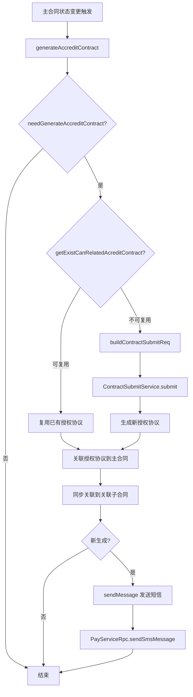

---

## 关键设计模式

### 1. 多维配置 + 表达式引擎模式

`ContractButtonConfigService` 采用维度定义 + 规则注册 + 表达式求值的三层架构：

- **维度层**：`ContractButtonDimensional` 定义配置的匹配维度（contractType + buttonType）
- **规则层**：通过 `appendConfig` 以不同优先级注册规则，高优先级覆盖低优先级
- **表达式层**：Aviator 表达式引擎支持布尔逻辑运算和自定义函数调用

此模式将按钮显隐规则从硬编码中解耦，支持通过配置动态调整而无需代码变更。

### 2. 反射调用模式

`ContractFieldCheckService` 通过 `ReflectionUtils.findMethod` + `ReflectionUtils.invokeMethod` 实现校验方法的动态调用。校验方法名作为配置项存储，新增校验只需添加方法并更新配置。**约束**：方法签名固定为 `public boolean methodName(ContractReqDTO)`，方法名不可修改。

### 3. 幂等设计模式

`ContractEscrowService.generateEscrowContract` 通过查询已有合同状态实现幂等：
- 草稿态 → 重新生成
- 待签署 → 返回跳转信息
- 已完成/盖章中 → 抛出明确业务异常
- 不存在 → 正常生成

### 4. 异步任务模式

`ContractSelfSealService` 的盖章任务采用异步处理模式：
- 同步阶段：参数校验 + 任务记录入库
- 异步阶段：PDF 转换 + 表单生成 + 盖章 + S3 上传
- 状态跟踪：通过 `SelfSealRecord` 的 `sealStatus` 字段跟踪任务状态
- 失败重试：`reSeal` 方法支持对失败任务重新执行

### 5. 策略路由模式

`ContractSaveDraftService` 通过 `ContractSigningSourceRouter` 实现签约来源的策略路由，根据 `bindType`（绑定类型：账单/子单/变更单）路由到不同的 `ContractSigningSourceStrategy` 实现（参见 [Personal Relation & Signing](Personal Relation & Signing.md)）。

### 6. 事务补偿模式

`ContractHomeOrderNoChangeService` 在变更操作中记录操作结果的 JSON 快照（`ContractHomeOrderNoChangeResultDTO`），回滚时解析快照精确还原，实现跨表事务的补偿机制。

---

## 相关模块文档

- [Contract Context Management](Contract Context Management.md) — 合同上下文管理，为本模块提供 AOP 数据准备和上下文传递
- [Contract PDF Generation](Contract PDF Generation.md) — 合同 PDF 生成，处理合同板式渲染
- [Contract Change Strategy](Contract Change Strategy.md) — 合同变更策略，处理变更合同的业务逻辑
- [Personal Relation & Signing](Personal Relation & Signing.md) — 个人关系与签约，处理个性化合同的签约来源路由
