# Contract Detail Context Handler

## 模块概述

**Contract Detail Context Handler** 是合同详情查询子系统中的核心数据准备模块，负责在合同详情接口调用时，通过 AOP 切面拦截机制，**并行加载**来自项目服务、报价系统、风控审核、款项系统等多个外部服务的数据，并将结果缓存在基于 `ThreadLocal` 的请求级上下文中，供下游 `ContractDetailService` 的各 `build*` 方法读取并组装最终响应。

本模块解决的核心问题是：合同详情页面需要聚合十余个外部数据源，如果串行调用会导致接口响应时间过长。通过 AOP + 并行任务编排 + ThreadLocal 上下文的三层架构，实现了数据加载的**声明式触发**、**并行执行**和**零侵入传递**。

---

## 模块在系统中的位置

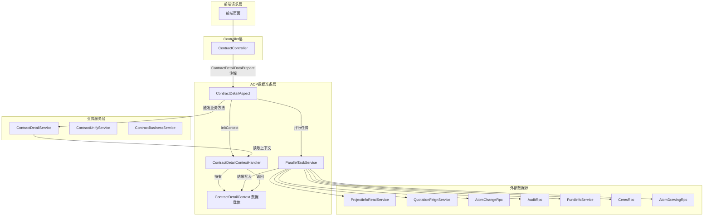

---

## 架构设计

### 三层架构

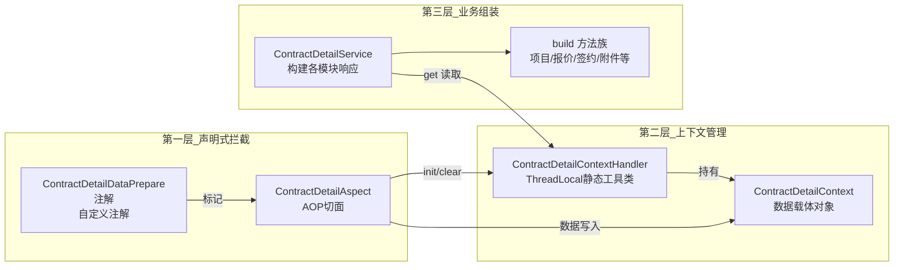

---

## 核心组件详解

### 1. ContractDetailContextHandler — 上下文管理器

**职责**：通过 `ThreadLocal<ContractDetailContext>` 管理请求级的合同详情数据上下文的生命周期。

**设计模式**：ThreadLocal Holder 模式（单例静态工具类 + 线程隔离数据）

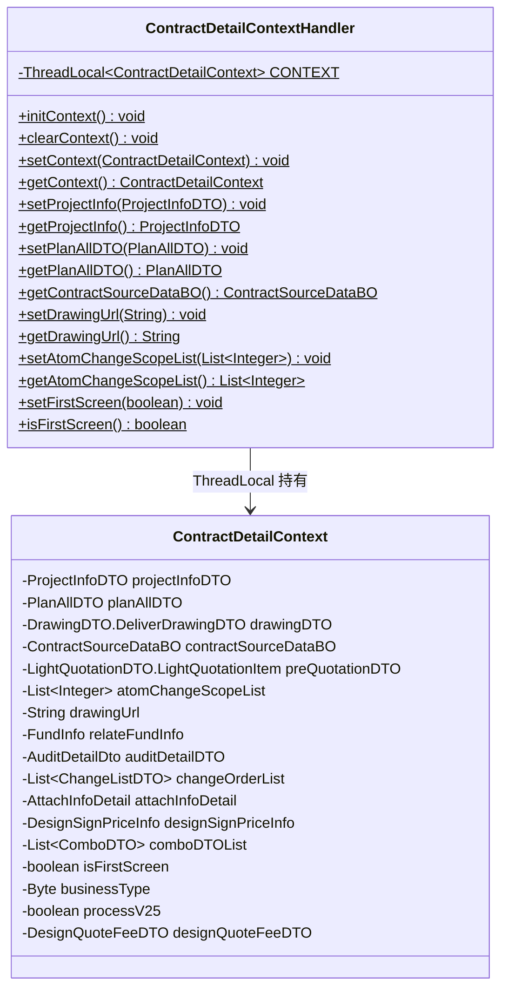

**关键设计决策**：

| 设计点 | 说明 |
|--------|------|
| 全静态方法 | 无实例化需求，任意位置可直接调用 `ContractDetailContextHandler.getContext()` |
| ThreadLocal 隔离 | 每个请求线程拥有独立上下文，避免并发数据串扰 |
| 生命周期由 AOP 管理 | `initContext()` 在 `@Before` 中调用，`clearContext()` 在 `@After` 和 `@AfterThrowing` 中调用，确保无内存泄漏 |
| 便捷访问方法 | 提供 `set/getProjectInfo`、`set/getPlanAllDTO` 等快捷方法，避免调用方直接操作 Context 对象 |

**内存安全机制**：

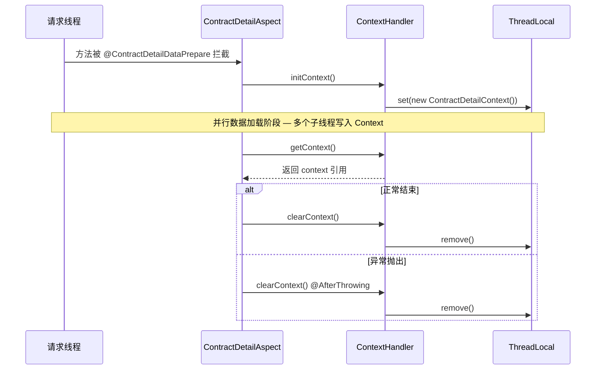

> **关联文档**：[Contract Context Handler](Contract Context Handler.md) 描述了同层的通用合同上下文处理器（`ContractContextHandler`），两者共享相同的 ThreadLocal Holder 设计模式，但管理不同粒度的上下文数据。

---

### 2. ContractDetailAspect — AOP 数据准备切面

**职责**：拦截标注了 `@ContractDetailDataPrepare` 注解的方法，在目标方法执行前并行加载所有依赖数据到上下文，并在方法结束后清理上下文。

**切入点定义**：
```java
@Pointcut("@annotation(com.ke.utopia.nrs.salesproject.service.contract.annotation.ContractDetailDataPrepare)")
public void pointCut() {}
```

**核心数据准备流程**：

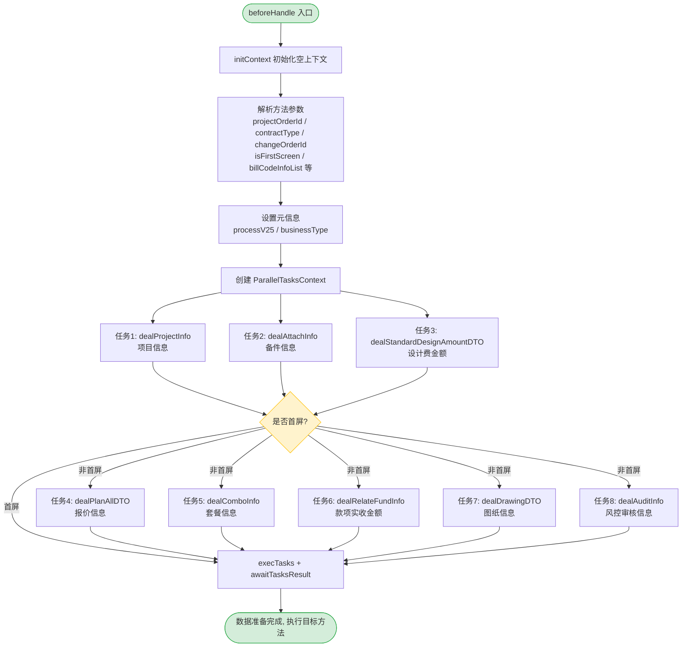

**首屏优化策略**：

首屏（`isFirstScreen=true`）仅加载 3 个核心数据任务，跳过报价、套餐、款项、图纸、审核等重量级 RPC 调用，确保首屏渲染速度：

| 数据任务 | 首屏 | 非首屏 | 说明 |
|---------|------|--------|------|
| `dealProjectInfo` | 加载 | 加载 | 项目基础信息，必需 |
| `dealAttachInfo` | 加载 | 加载 | 仅正签合同需要 |
| `dealStandardDesignAmountDTO` | 加载 | 加载 | 仅设计合同需要 |
| `dealPlanAllDTO` | 跳过 | 加载 | 报价信息，涉及多 RPC 调用 |
| `dealComboInfo` | 跳过 | 加载 | 套餐信息，需查询中控 |
| `dealRelateFundInfo` | 跳过 | 加载 | 款项信息 |
| `dealDrawingDTO` | 跳过 | 加载 | 图纸信息，大文件 |
| `dealAuditInfo` | 跳过 | 加载 | 风控审核，仅正签需要 |

**各数据准备方法的条件过滤逻辑**：

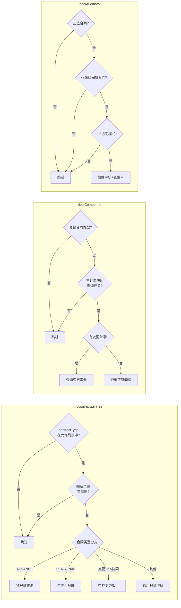

**切面生命周期保障**：

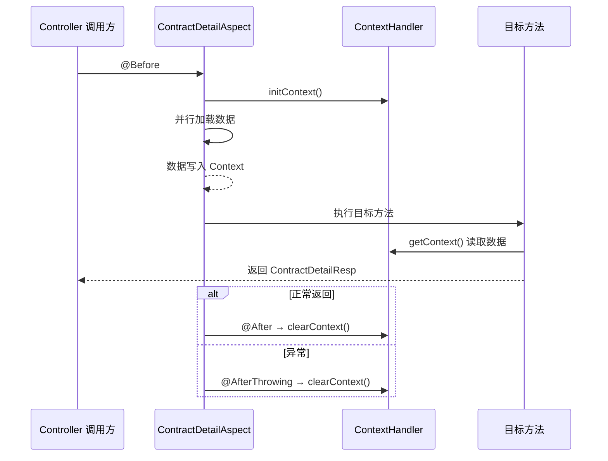

---

### 3. ContractDetailContext — 数据载体

**职责**：作为请求级的数据容器，聚合来自多个外部服务的数据，供下游服务构建各模块的详情响应。

**字段与数据来源映射**：

| 字段 | 类型 | 数据来源 | 写入方法 |
|------|------|---------|---------|
| `projectInfoDTO` | `ProjectInfoDTO` | ProjectInfoReadService | `dealProjectInfo` |
| `planAllDTO` | `PlanAllDTO` | QuotationFeignService / HomeOrderDataConversionService | `dealPlanAllDTO` |
| `contractSourceDataBO` | `ContractSourceDataBO` | HomeOrderDataConversionService / ContractDependentDataService | `dealPlanAllDTO` |
| `drawingDTO` | `DrawingDTO.DeliverDrawingDTO` | AtomDrawingRpc / ContractBusinessService | `dealDrawingDTO` |
| `preQuotationDTO` | `LightQuotationDTO.LightQuotationItem` | AtomBudgetRpc | `dealPlanAllDTO` (ADVANCE) |
| `atomChangeScopeList` | `List<Integer>` | AtomChangeRpc | `buildAtomChangeQuotation` |
| `drawingUrl` | `String` | AtomDrawingRpc | `buildAtomChangeQuotation` |
| `relateFundInfo` | `FundInfo` | FundInfoService | `dealRelateFundInfo` |
| `auditDetailDTO` | `AuditDetailDto` | AuditRpc | `dealAuditInfo` |
| `changeOrderList` | `List<ChangeListDTO>` | AtomChangeRpc | `dealAuditInfo` |
| `attachInfoDetail` | `AttachInfoDetail` | AttachCommonService | `dealAttachInfo` |
| `designSignPriceInfo` | `DesignSignPriceInfo` | CeresRpc + QuotationFeignService | `dealStandardDesignAmountDTO` |
| `comboDTOList` | `List<ComboDTO>` | OrderStandardQueryRpc | `dealComboInfo` |
| `isFirstScreen` | `boolean` | 请求参数 | `beforeHandle` |
| `businessType` | `Byte` | CommonBusinessService | `beforeHandle` |
| `processV25` | `boolean` | CommonBusinessService | `beforeHandle` |
| `designQuoteFeeDTO` | `DesignQuoteFeeDTO` | HomeOrderDataConversionService | `dealPlanAllDTO` (PACKAGE_FORMAL) |

---

### 4. ContractDetailService — 业务组装服务

**职责**：从 `ContractDetailContextHandler` 读取预加载的数据，结合数据库中的合同持久化数据，构建合同详情页所需的各模块响应对象。

**主要构建方法与上下文数据读取关系**：

```mermaid
flowchart TD
    subgraph Context读取
        CTX[ContractDetailContext]
    end

    subgraph build方法族
        BPRJ[buildContractProjectInfoDetail<br>项目信息详情]
        BBASE[buildContractBaseInfoDetail<br>合同基础信息详情]
        BSIGN[buildContractSignInfoDetail<br>签约信息详情]
        BQUOTE[buildQuotationDetail<br>报价信息详情]
        BPERS[buildPersonalQuotationDetail<br>个性化报价详情]
        BPROM[buildPromiseInfoDetail<br>承包约定信息]
        BACT[buildActivityInfoDetail<br>优惠活动信息]
        BPROC[buildProcessInfoDetail<br>审核流程信息]
        BATT[buildContractAttachInfo<br>合同附件信息]
        BAMT[buildAmountInfoDetail<br>金额信息详情]
        BPCOL[buildPersonalCollectionPlanInfo<br>定软电收款计划]
        BSUP[buildSupplementItemInfo<br>补充协议信息]
        BSTL[buildSettlementItemInfo<br>和解协议信息]
    end

    CTX -->|projectInfoDTO| BPRJ
    CTX -->|planAllDTO + businessType + processV25| BBASE
    CTX -->|planAllDTO + contractSourceDataBO| BSIGN
    CTX -->|planAllDTO + atomChangeScopeList| BQUOTE
    CTX -->|contractSourceDataBO| BPERS
    CTX -->|designQuoteFeeDTO| BPROM
    CTX -->|planAllDTO| BACT
    CTX -->|auditDetailDTO + changeOrderList| BPROC
    CTX -->|attachInfoDetail| BATT
    CTX -->|relateFundInfo| BAMT
    CTX -->|contractSourceDataBO| BPCOL
```

**入口方法 `initContractDetail` 的组装流程**：

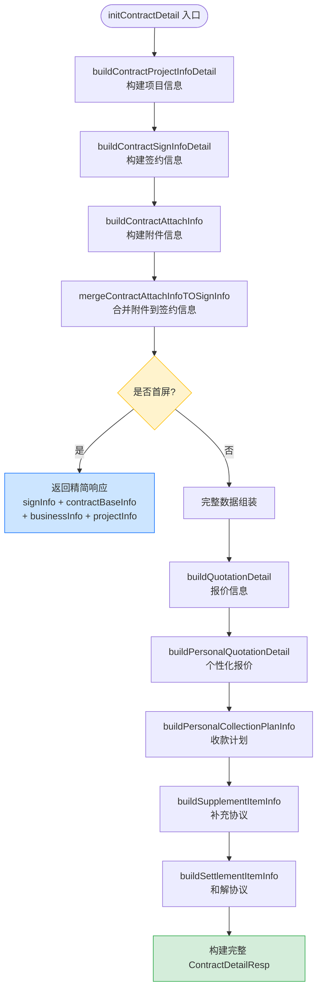

---

## 依赖关系

### 外部服务依赖

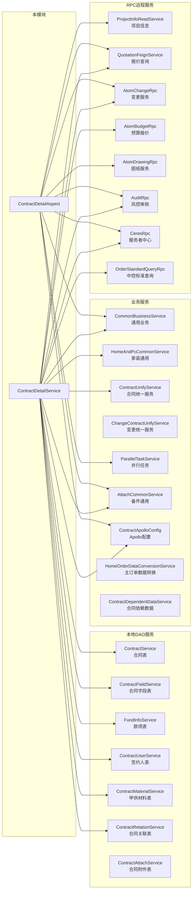

### 模块间依赖

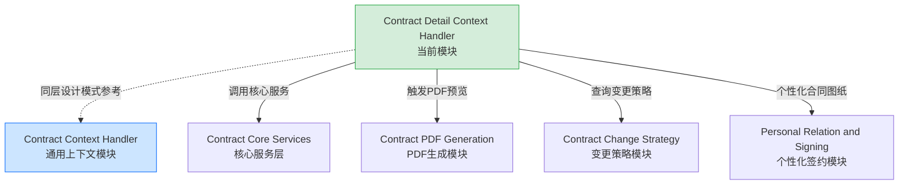

---

## 数据流图

### 请求全链路数据流

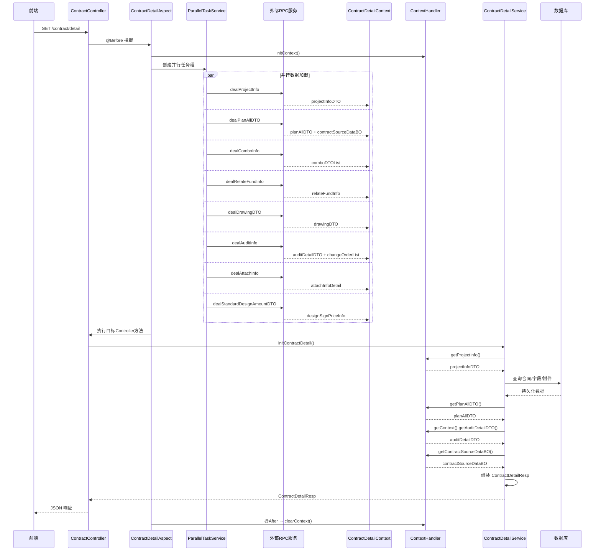

### 报价信息数据流（dealPlanAllDTO 分支路由）

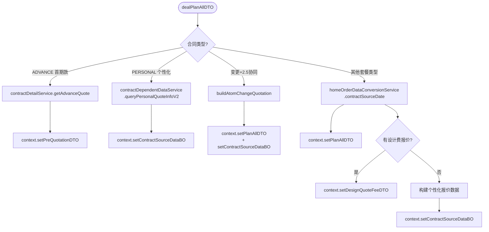

---

## 关键设计模式

### 1. AOP 拦截 + ThreadLocal 上下文（Context Object Pattern）

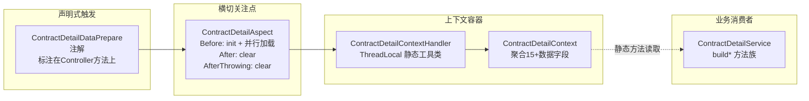

**优势**：
- 业务方法无需感知数据加载细节，只需通过 `ContractDetailContextHandler.getContext()` 获取
- 新增数据源只需在 Aspect 中添加并行任务，下游代码零修改
- ThreadLocal 确保线程安全，AOP 确保生命周期安全

### 2. 首屏/非首屏分层加载

通过 `isFirstScreen` 标志实现渐进式数据加载，首屏仅加载 3 个轻量任务（项目信息、备件信息、设计费），非首屏再追加 5 个重量级 RPC 调用：

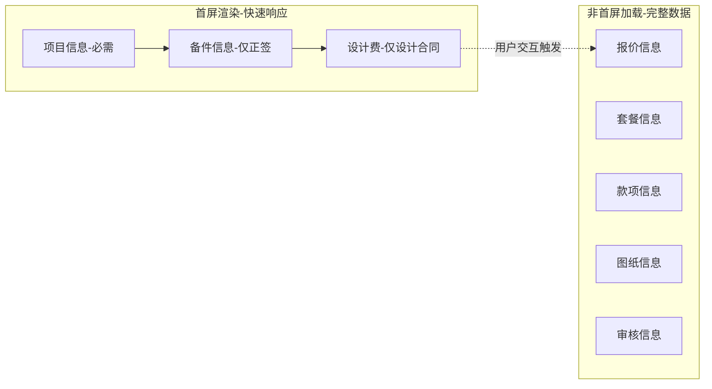

### 3. 条件短路过滤（Guard Clause）

每个数据准备方法内部通过合同类型、业务模式等条件判断是否需要执行，不满足条件直接 `return`，避免无意义的 RPC 调用：

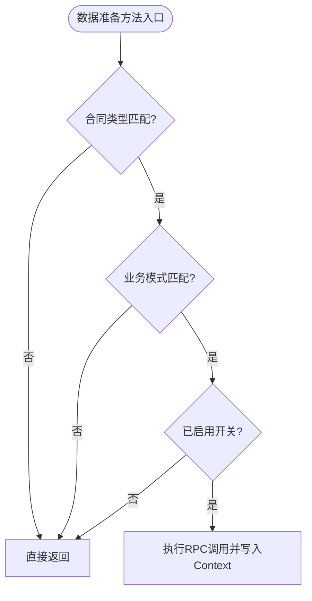

### 4. 并行任务编排

通过 `ParallelTaskService` 实现任务并行化，所有独立的数据加载任务在同一个 `ParallelTasksContext` 中并发执行：

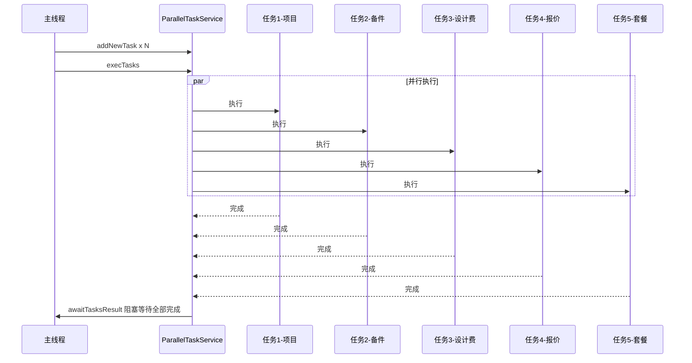

### 5. 多来源数据融合

`ContractDetailService` 的各 build 方法需要融合两种数据：
- **实时数据**：来自 Context 中缓存的 RPC 调用结果
- **持久化数据**：来自数据库中的合同字段（`ContractField` 表以 key-value 形式存储）

初始化时优先使用实时数据，编辑时优先使用已保存的持久化数据（通过 `fieldMap` 回填）：

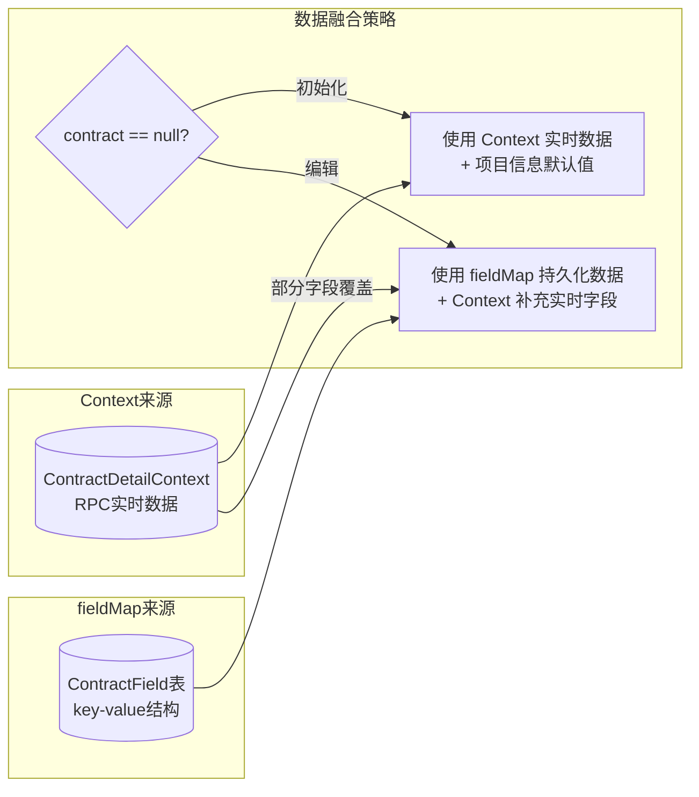

---

## 合同类型支持矩阵

不同合同类型触发不同的数据准备分支和构建逻辑：

| 合同类型 | 报价信息 | 套餐信息 | 图纸信息 | 审核信息 | 设计费 | 款项信息 |
|---------|---------|---------|---------|---------|--------|---------|
| ADVANCE 首期款 | 预报价 | - | - | - | - | 支持 |
| PACKAGE_FORMAL 正签 | 完整报价 | 支持 | 团装2.5 | 2.5协同 | 报价来源 | 支持 |
| PACKAGE_CHANGE 变更 | 变更报价 | 变更套餐 | - | - | - | 支持 |
| PERSONAL 个性化 | 个性化报价 | - | 个性化图纸 | - | - | 支持 |
| DESIGN 设计 | - | - | - | - | 标准设计费 | - |
| DRAWING 施工图纸 | 完整报价 | - | - | - | - | 支持 |

---

## 异常处理策略

| 场景 | 处理方式 | 影响范围 |
|------|---------|---------|
| 项目信息获取失败 | 抛出 `UtopiaBussinessException`，中断所有任务 | 整个请求失败 |
| 风控审核信息获取失败 | `try-catch` 捕获，日志记录，流程信息不展示 | 仅审核流程模块缺失 |
| 报价信息不匹配 | 按合同类型短路返回，不写入 Context | 报价模块不展示 |
| 切面方法异常 | `@AfterThrowing` 确保 Context 被清理 | 无内存泄漏 |
| 设计师职级查询失败 | 抛出 `NrsBusinessException`，提示用户 | 设计费模块不可用 |
