# Contract PDF Generation

## 模块概述

Contract PDF Generation 是合同管理系统中的 PDF 文档生成核心模块，负责将合同数据转化为可签章的 PDF 文件。该模块覆盖多种业务场景（整装正签、团装正签、翻新全案、图纸合同、解约协议、材料清单），通过策略模式实现差异化 PDF 生成逻辑，并提供 PDF 压缩、合并、签章关键字注入、S3 上传等通用文件操作能力。

模块采用分层架构设计：上下文管理层通过 AOP 与 ThreadLocal 为全链路提供统一数据访问；策略层通过工厂模式按合同类型路由到具体生成策略；数据构建层通过反射机制动态组装 PDF 表单数据；文件操作层封装 iText 7 和 Apache PDFBox 实现底层 PDF 操作。

## 架构总览

### 分层架构图

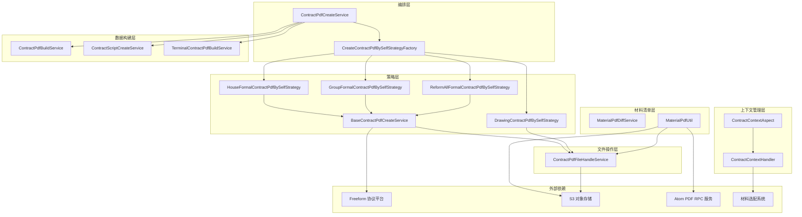

### 组件依赖关系图

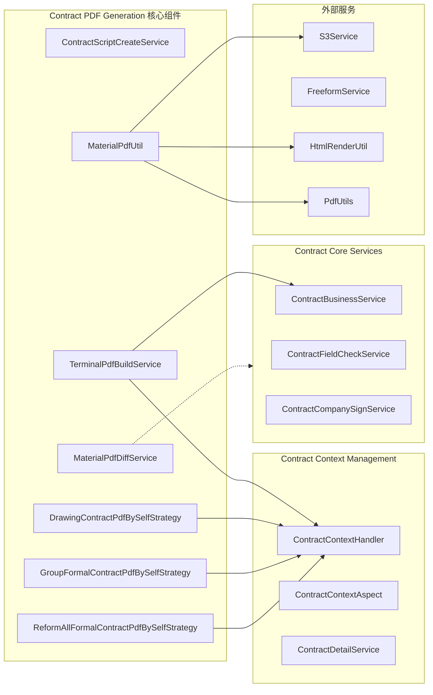

## 核心组件详解

### 1. 策略接口与工厂

#### CreateContractPdfBySelfStrategy — 策略接口

策略模式的顶层接口，定义统一的 PDF 生成契约：

```java
public interface CreateContractPdfBySelfStrategy {
    String createPdf(Contract contract, ContractCityCompanyInfo config, boolean finalVersion) throws Exception;
}
```

- **入参**：合同实体 `Contract`、城市公司配置 `ContractCityCompanyInfo`、是否终版 `finalVersion`
- **返回值**：PDF 在 S3 上的 URL
- **四种实现**：按合同类型与业务类型路由，见下文策略实现

#### CreateContractPdfBySelfStrategyFactory — 策略工厂

基于 Spring `ApplicationContextAware` 自动收集所有 `CreateContractPdfBySelfStrategy` 实现 Bean，运行时通过 `ContractTypeEnum.getContractPdfBySelfStrategy(contractType, businessType)` 定位具体策略。工厂负责屏蔽策略选择细节，编排层只需调用 `factory.getStrategy(contract).createPdf(...)`。

### 2. 模板方法基类 — BaseContractPdfCreateService

为正签类合同（整装、团装、翻新全案）提供共享的 PDF 操作模板方法：

| 方法 | 职责 |
|------|------|
| `getTextPdfUrl(Contract, ContractCityCompanyInfo, boolean)` | 调用 Freeform 协议平台生成合同文本 PDF 并下载到本地 |
| `getFormalBudgetUrlPdf(Contract, String, String, String)` | 下载报价单 PDF，超阈值时压缩，并写入签章关键字 |
| `addFooter(String, String, String, String, String, boolean)` | 在 PDF 指定位置写入签章关键字文本（使用 iText 7 PdfCanvas） |
| `getJiaFangSealKeyword(List, Long)` | 从 Freeform 签章规则中提取甲方签章关键字 |
| `getYiFangSealKeyword(List, Long)` | 从 Freeform 签章规则中提取乙方签章关键字 |
| `getJiaFangAgentSealKeyword(List, Long)` | 从 Freeform 签章规则中提取甲方代理人签章关键字 |
| `getCustomAttach(Contract)` | 根据城市/公司/业务配置获取个性化附件 PDF |

**设计模式**：模板方法模式（Template Method）。基类定义 PDF 生成的骨架流程（获取文本 PDF → 获取附件 PDF → 写签章关键字 → 合并 → 上传 S3 → 关联协议平台），子类通过组合不同的附件获取步骤来实现差异化。

### 3. 策略实现

#### 3.1 HouseFormalContractPdfBySelfStrategy — 整装正签合同

继承 `BaseContractPdfCreateService`，处理整装（被窝/圣都）正式套餐合同的 PDF 生成。

**附件拼接顺序**：
1. 正签文本部分合同 PDF
2. 报价单（最后一页写签章关键字）
3. 个性化附件（可选）

#### 3.2 GroupFormalContractPdfBySelfStrategy — 团装正签合同

继承 `BaseContractPdfCreateService`，处理团装正式套餐合同的 PDF 生成。

**附件拼接顺序**：
1. 正签文本部分合同 PDF
2. 报价单（最后一页写签章关键字）
3. 基础图纸（每页写签章关键字）
4. 个性化附件（可选）

**图纸处理流程**：
- 从 `ContractContextHandler.getDrawingDTO()` 获取全屋图纸（`PlanAttachment.全屋图纸`），过滤 PDF 格式
- 文件总大小 < 5MB：直接下载并合并
- 文件总大小 >= 5MB：调用 `ContractPdfFileHandleService.batchCompressPdf()` 压缩后合并
- 记录文件大小信息到 `ContractFileInfoService`

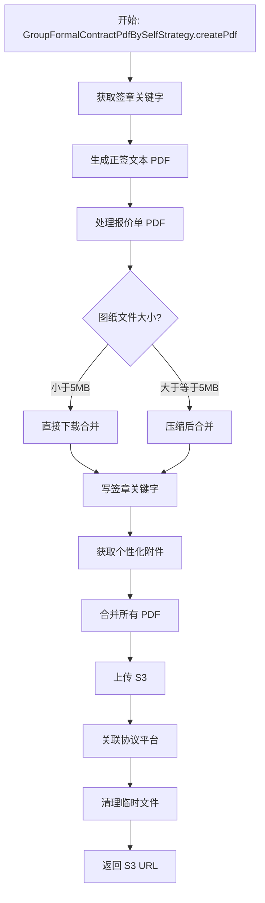

#### 3.3 ReformAllFormalContractPdfBySelfStrategy — 翻新全案正签合同

继承 `BaseContractPdfCreateService`，处理翻新全案正式套餐合同的 PDF 生成。

**附件拼接顺序**：
1. 正签文本部分合同 PDF
2. 报价单（最后一页写签章关键字）
3. 工期说明附件（图片转 PDF，超阈值压缩）
4. 个性化附件（可选）

**工期说明附件处理**：
- 从 `ContractAttachConfigService` 查询工期说明附件图片 URL
- 通过 `ContractPdfFileHandleService.imageToPdfAndUpload()` 将图片转为 PDF
- 文件大小超过 Apollo 配置阈值时压缩（DPI=120）

#### 3.4 DrawingContractPdfBySelfStrategy — 图纸合同

**独立实现**，不继承 `BaseContractPdfCreateService`，因为图纸合同的生成逻辑与正签合同有本质差异：

- 不调用 Freeform 平台生成文本 PDF，直接使用图纸 PDF
- 签章关键字写入方式不同（批量 `addFooterForListInput` 而非逐页 `addFooter`）
- 需要单独的尺寸校验和压缩策略

**核心流程**：

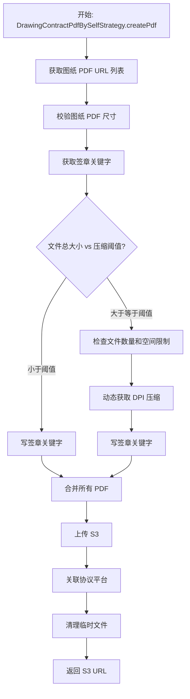

**校验机制**：

| 校验项 | 时机 | 说明 |
|--------|------|------|
| PDF 页面尺寸校验 | 压缩前 | 并行检查所有 PDF 页面宽高，最大面积不得超过 `pdfMaxArea` 配置值 |
| 文件数量限制 | 压缩前 | 图纸页数超过 `drawingCountLimit` 时抛异常 |
| 空间大小限制 | 压缩前 | 文件总大小超过 `drawingSpaceSizeLimit` 时抛异常 |
| 压缩后大小校验 | 压缩后 | 压缩后文件超过 `drawingCompressSize` 时抛异常 |

校验失败统一提示用户联系设计 SSC 调整图纸或线下签署后补录。

**并发模型**：`getPdfPageInfo()` 方法使用 `CompletableFuture` + `pdfHandleExecutor` 线程池并行获取各 PDF 文件的页面尺寸信息，超时 15 秒。

### 4. 动态字段服务 — ContractScriptCreateService

为 PDF 表单提供动态数据字段的并行获取能力。

**核心方法** `getScriptDynamicFieldBs(String contractCode, Set<String> methodNames)`：

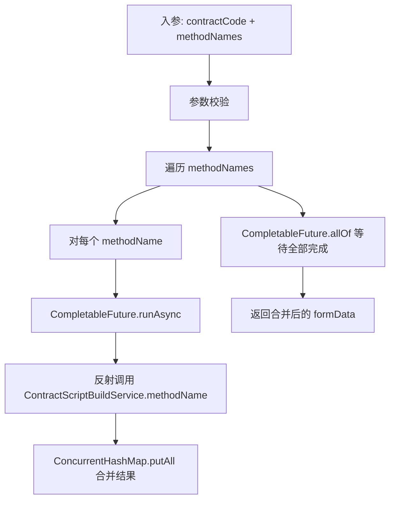

**关键设计**：
- **反射调用**：通过 `Class.getMethod()` + `Method.invoke()` 动态调用 `ContractScriptBuildService` 中以方法名为标识的数据获取方法，每个方法签名为 `Map methodName(String contractCode)`
- **并行执行**：使用自定义线程池 `scriptDynamicFieldExecutor` 避免阻塞主线程
- **线程安全**：结果存储使用 `ConcurrentHashMap`，SkyWalking 链路追踪通过 `RunnableWrapper` 传递
- **容错处理**：单个方法调用失败（`NoSuchMethodException`、`InvocationTargetException` 等）仅记录日志，不影响其他方法的执行

**调用链**：方法名来源于数据库 `ContractProtocolConfig.dealFunction` 配置字段，由编排层解析后传入。

### 5. 解约协议数据构建 — TerminalContractPdfBuildService

专门负责解约协议 PDF 的表单数据构建，提供多个数据获取方法供反射调用。

#### 数据获取方法

| 方法 | 功能 | 数据来源 |
|------|------|----------|
| `getTerminalSecondPartyCompanyInfo()` | 获取乙方公司名称 | 正向合同的 `companyCode` → `ContractCompanyInfoService` |
| `getTerminalProjectContractAddress()` | 获取房屋地址（省-区-小区-楼-单元-层-房） | 正向合同的字段表 `ContractFieldService` |
| `getTerminalSignContractInfo()` | 获取已签署合同及编号 | 已签署合同列表 → 按类型分组拼接 |
| `getTerminalDetailFundInfo()` | 获取单个款项明细 | 退单数据 `CancelOrderService` |
| `getTerminalTotalFundInfo()` | 获取总款项（应收/应付） | 退单数据 → 判断收款/退款模板 |
| `getTerminalRetrieveMaterialDays()` | 乙方可取回剩余材料的天数 | 请求参数 `ContractProjectInfoReq` |
| `getBreachPenaltyAmount()` | 违约金金额 | 请求参数 `ContractProjectInfoReq` |
| `getTerminalRelationHouseFormalInfo()` | 关联正签合同信息（合并发起模式） | 合并发起的合同列表 |

#### 业务类型差异化处理

`getTerminalDetailFundInfo()` 根据 `BusinessTypeEnum` 选择不同的金额模板：

| 业务类型 | 模板内容 |
|----------|----------|
| 团装 (`GROUP_DECORATE`) | 仅含工程款、违约金/定金、实际已发生费用 |
| 整装/局装/翻新 | 含设计服务费、工程款、违约金、实际已发生施工费、设计服务费等 |

`getMainAndChangeContractText()` 根据业务类型和小程序类型生成不同的合同名称：

| 条件 | 合同名称 |
|------|----------|
| 团装 | 家庭居室团体装饰装修合同 |
| 被窝 + 整装/局装 | 室内装饰装修工程施工合同 |
| 圣都 + 整装 | 家庭居室装饰装修施工合同 |
| 圣都 + 局装 | 住宅局部改造装修施工合同 |
| 圣都 + 翻新全案 | 住宅局部翻新装修施工合同 |

#### 退款流程

`getTerminalTotalFundInfo()` 根据 `cancelOrderAmount` 正负判断收款/退款：

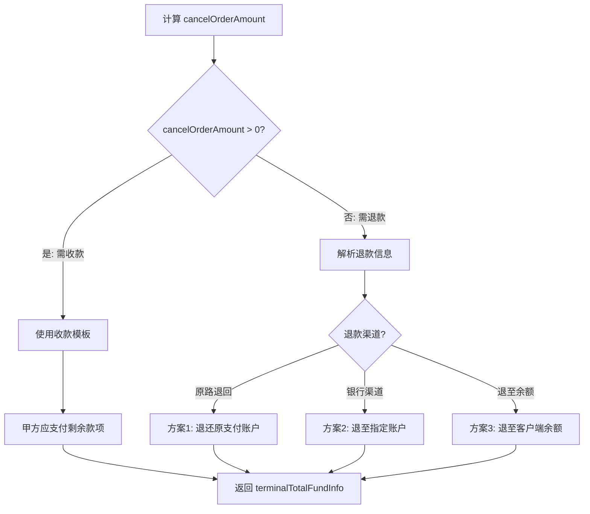

退款时需从 `LaunchRefundReqDTO` 中提取银行卡信息（开户行、户名、账号），账号通过 `CipherService.decrypt()` 解密。

### 6. 材料清单 PDF 服务

#### MaterialPdfDiffService — 数据一致性检查

检查远程实时数据与数据库存储数据是否一致，判断是否需要重新生成材料清单 PDF。

**对比逻辑**：

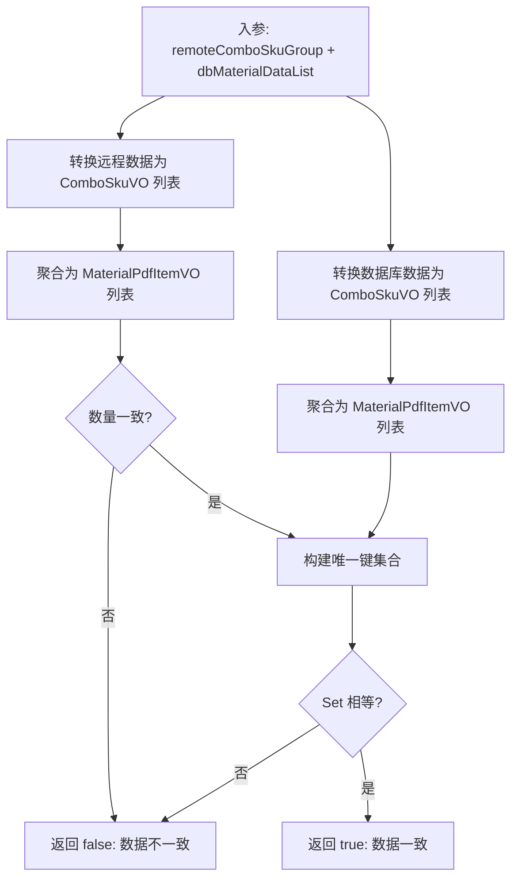

**聚合规则**：
1. 按 `categoryLevel3Code`（三级品类编码）分组
2. 过滤掉品牌名为"其他"的项
3. 同组内品牌名按字母序排列，用 "/" 连接
4. 品牌为空的三级类目不参与展示
5. 结果按 `categoryLevel3Name` 正序排序并编号

**对比键**：`categoryLevel3Name + "|" + brandNames`，基于字符串相等性判定。

**去重策略**：远程数据按 `categoryLevel3Code + "#" + brandCode` 去重，保留第一条（`LinkedHashMap` 保持顺序）。

#### MaterialPdfUtil — PDF 生成与上传

基于 HTML 模板引擎生成材料清单 PDF 并上传至 S3。

**生成流程**：

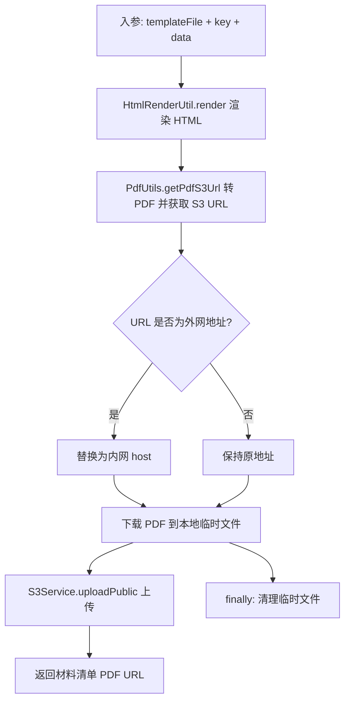

**Host 替换**：为提高内网环境下载速度，将外网地址 `https://file.ljcdn.com` 替换为内网地址 `http://file.media.lianjia.com`。

## 数据流

### 正签合同 PDF 生成全链路

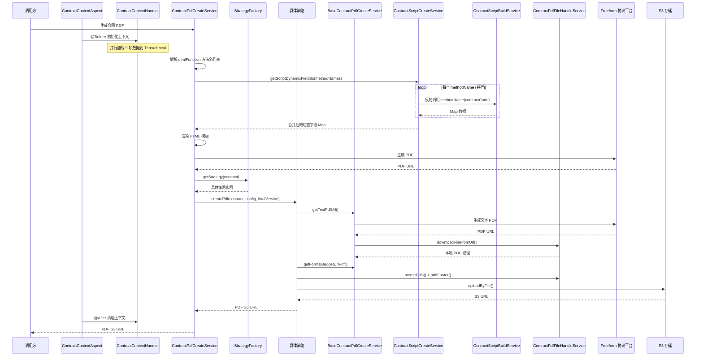

### 材料清单 PDF 生成流程

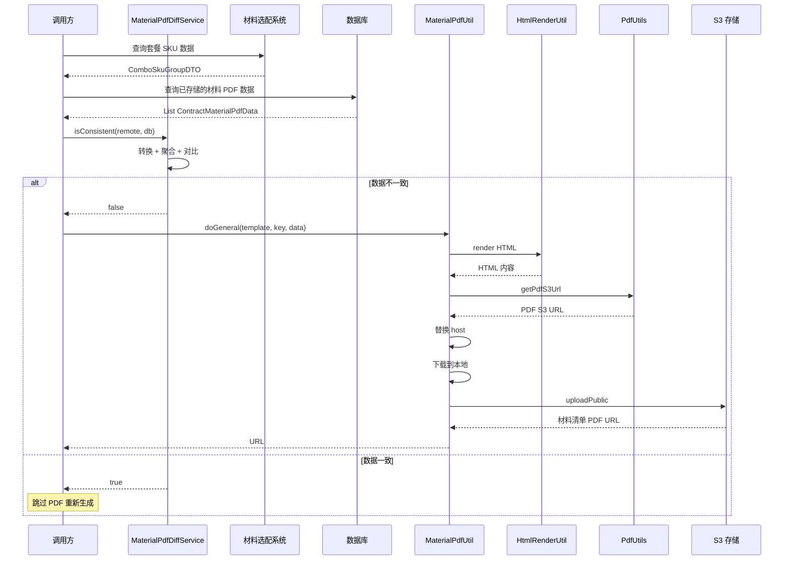

## 关键设计模式

### 策略模式（Strategy Pattern）

```mermaid
classDiagram
    class CreateContractPdfBySelfStrategy {
        <<interface>>
        +createPdf Contract contract ContractCityCompanyInfo config boolean finalVersion String
    }
    class BaseContractPdfCreateService {
        #getTextPdfUrl Contract ContractCityCompanyInfo boolean String
        #getFormalBudgetUrlPdf Contract String String String String
        #addFooter String String String String String boolean String
        #getJiaFangSealKeyword List Long String
        #getYiFangSealKeyword List Long String
        #getCustomAttach Contract String
    }
    class DrawingContractPdfBySelfStrategy {
        +createPdf Contract ContractCityCompanyInfo boolean String
        -getDrawingPdfUrlList List
        +checkDrawingPdfAreaSize List void
        +getPdfPageInfo List List
    }
    class GroupFormalContractPdfBySelfStrategy {
        +createPdf Contract ContractCityCompanyInfo boolean String
        -groupFormalContractCreate Contract ContractCityCompanyInfo boolean String
        -getGroupDrawing Contract String String String
    }
    class ReformAllFormalContractPdfBySelfStrategy {
        +createPdf Contract ContractCityCompanyInfo boolean String
        -reformAllContractCreate Contract ContractCityCompanyInfo boolean String
        -getDurationDescriptionAttachPdfUrl Contract String
    }
    class HouseFormalContractPdfBySelfStrategy {
        +createPdf Contract ContractCityCompanyInfo boolean String
    }

    CreateContractPdfBySelfStrategy <|.. DrawingContractPdfBySelfStrategy
    CreateContractPdfBySelfStrategy <|.. GroupFormalContractPdfBySelfStrategy
    CreateContractPdfBySelfStrategy <|.. ReformAllFormalContractPdfBySelfStrategy
    CreateContractPdfBySelfStrategy <|.. HouseFormalContractPdfBySelfStrategy
    BaseContractPdfCreateService <|-- GroupFormalContractPdfBySelfStrategy
    BaseContractPdfCreateService <|-- ReformAllFormalContractPdfBySelfStrategy
    BaseContractPdfCreateService <|-- HouseFormalContractPdfBySelfStrategy
```

**核心思想**：将合同类型间的 PDF 生成差异封装在独立策略中，编排层通过工厂获取策略实例，无需关心具体实现。工厂通过 `ContractTypeEnum` 的映射关系自动路由，新增合同类型只需添加新的策略实现类。

### 模板方法模式（Template Method）

`BaseContractPdfCreateService` 定义了 PDF 生成的骨架流程：

```
1. 获取签章关键字（从 Freeform 查询）
2. 获取文本 PDF（调用 Freeform 平台）
3. 获取报价单 PDF（下载 + 压缩 + 写关键字）
4. 获取业务特有附件（子类实现差异化）
5. 合并所有 PDF
6. 上传 S3
7. 关联协议平台
8. 清理临时文件
```

子类通过重写步骤 4 来插入各自的附件获取逻辑（图纸、工期说明等），共享其余步骤的实现。

### 上下文模式（Context / ThreadLocal）

`ContractContextHandler` 基于 `ThreadLocal<ContractContext>` 提供请求级别的数据共享：

- **生命周期管理**：由 `ContractContextAspect`（AOP）在方法执行前初始化、执行后清理
- **数据预加载**：Aspect 通过 `ParallelTaskService` 并行加载 9 项数据（项目信息、报价数据、合同来源数据、图纸数据等）
- **静态访问**：所有 getter 为 `static` 方法，任意组件无需注入即可访问上下文数据

相关文档：[Contract Context Management](Contract Context Management.md)

### 反射调用模式

`ContractScriptCreateService` 和 `ContractPdfCreateService` 使用 Java 反射机制实现数据获取的动态路由：

- 方法名存储在数据库配置表中（`ContractProtocolConfig.dealFunction`）
- 运行时通过 `Class.getMethod()` + `Method.invoke()` 动态调用对应方法
- 每个方法统一签名为 `Map<String, Object> methodName(String contractCode)`
- 结果通过 `ConcurrentHashMap.putAll()` 线程安全地合并

**优势**：新增数据字段只需在 `ContractPdfBuildService` 中添加方法并更新数据库配置，无需修改调用方代码。

## 并发与性能

### 线程池配置

| 线程池名称 | 用途 | 使用场景 |
|------------|------|----------|
| `scriptDynamicFieldExecutor` | 脚本动态字段并行获取 | `ContractScriptCreateService.getScriptDynamicFieldBs()` |
| `pdfHandleExecutor` | PDF 文件处理（压缩、尺寸校验） | `DrawingContractPdfBySelfStrategy.getPdfPageInfo()`、`ContractPdfFileHandleService.batchCompressPdf()` |

### 并发策略

- **动态字段获取**：`CompletableFuture.allOf()` + 自定义线程池，所有方法并行执行，结果写入 `ConcurrentHashMap`
- **图纸尺寸校验**：并行下载并解析各 PDF 文件的页面尺寸，超时 15 秒
- **PDF 批量压缩**：`pdfHandleExecutor` 线程池并行压缩多个 PDF 文件
- **链路追踪**：通过 SkyWalking `RunnableWrapper` 确保异步任务的链路上下文正确传递

### 性能优化

- **动态 DPI 压缩**：`DrawingCompressionConfig` 根据文件数量和总大小动态调整压缩 DPI
- **阈值控制**：仅当文件大小超过配置阈值时才执行压缩，避免不必要的处理
- **Host 替换**：`MaterialPdfUtil` 将外网地址替换为内网地址，提高内网环境下载速度
- **Spring Retry**：`ContractPdfFileHandleService.downloadFileFromUrl()` 配置 3 次重试、100ms 间隔

## 文件操作层 — ContractPdfFileHandleService

封装底层 PDF 操作，为上层策略和工具类提供统一的文件操作接口：

| 操作 | 底层技术 | 说明 |
|------|----------|------|
| PDF 合并 | iText 7 `copyPagesTo` | `mergePdfs(List<String>, String)` |
| PDF 文本写入 | iText 7 `PdfCanvas` | `addFooter()` / `addFooterForListInput()` |
| PDF 压缩 | Apache PDFBox | 渲染为图片后重新组装，DPI 可配 |
| PDF 下载 | Spring Retry | 3 次重试、100ms 间隔 |
| 图片转 PDF | — | `imageToPdfAndUpload()` |
| 临时文件清理 | — | `cleanUp()` 在 `finally` 块中调用 |

相关文档：[Contract Core Services](Contract Core Services.md)

## 与关联模块的交互

### 与 Contract Context Management 的交互

PDF 生成的全链路依赖 `ContractContextHandler` 提供的上下文数据：

- `ContractContextHandler.getContractReq()` — 请求参数（项目订单 ID、合同基础信息）
- `ContractContextHandler.getProjectInfo()` — 项目信息（客户房屋、业务类型等）
- `ContractContextHandler.getDrawingDTO()` — 图纸数据（由图纸合同和团装策略使用）
- `ContractContextHandler.getContext()` — 上下文全量数据（合并发起标记、合同提交核心数据等）

上下文数据由 `ContractContextAspect` 在 AOP 切面中并行预加载，确保下游组件可直接使用而无需重复查询。

详细文档：[Contract Context Management](Contract Context Management.md)

### 与 Contract Core Services 的交互

- `ContractBusinessService` — 获取正向合同信息（解约协议场景）、上传 PDF 到协议平台
- `ContractFieldService` — 获取合同字段数据（房屋地址等）
- `ContractCompanyInfoService` — 获取乙方公司信息
- `ContractService` — 获取已签署合同列表
- `CommonContractService` — 获取公司信息、构建合并发起退单 DTO
- `CommonBusinessService` — 获取业务类型、小程序类型

详细文档：[Contract Core Services](Contract Core Services.md)

### 与 Contract Change Strategy 的交互

合同变更策略在变更完成后可能触发 PDF 重新生成。PDF 生成模块作为变更流程的下游消费方，接收变更后的合同数据进行 PDF 构建。

详细文档：[Contract Change Strategy](Contract Change Strategy.md)

### 与 Personal Relation & Signing 的交互

PDF 生成完成后，S3 URL 和协议平台实例 ID 传递给签约流程，由 `PersonalRelationHandler` 协调个人关系绑定和签约操作。

详细文档：[Personal Relation & Signing](Personal Relation & Signing.md)
