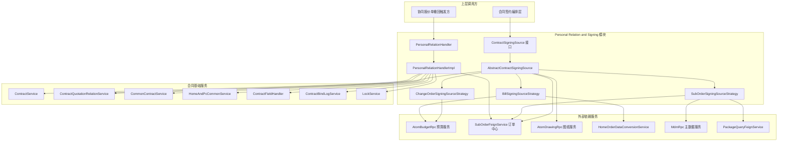
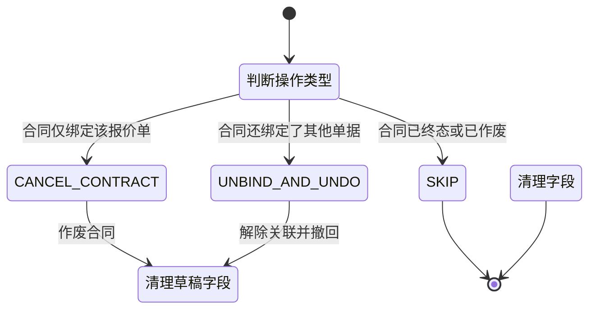
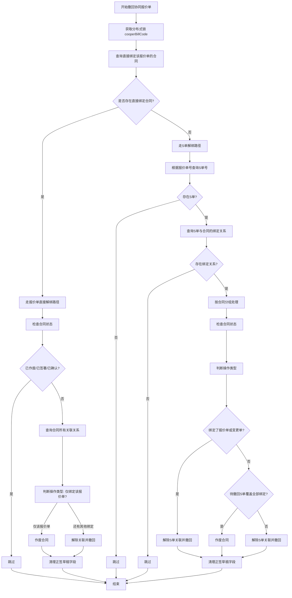
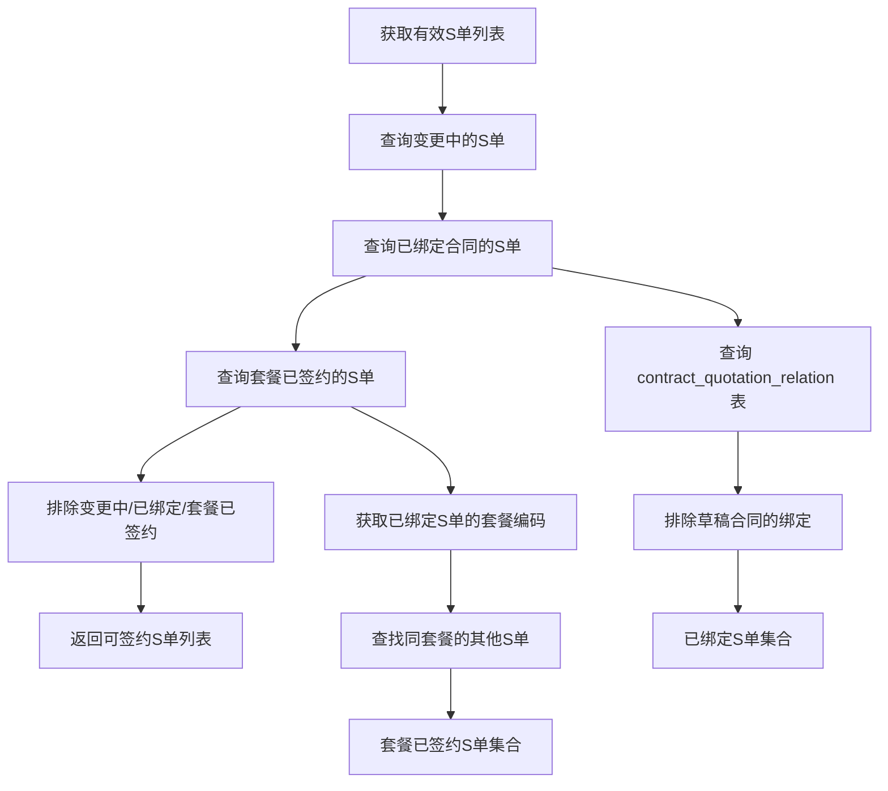
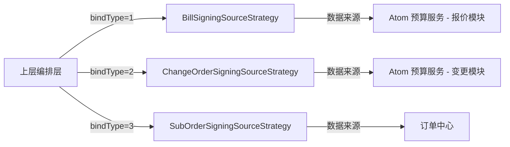
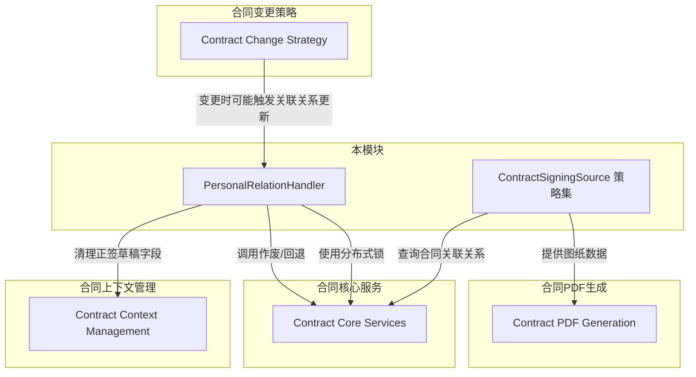
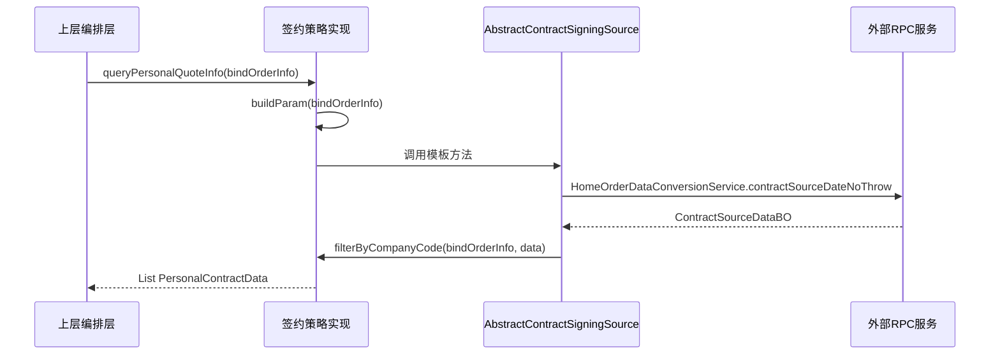
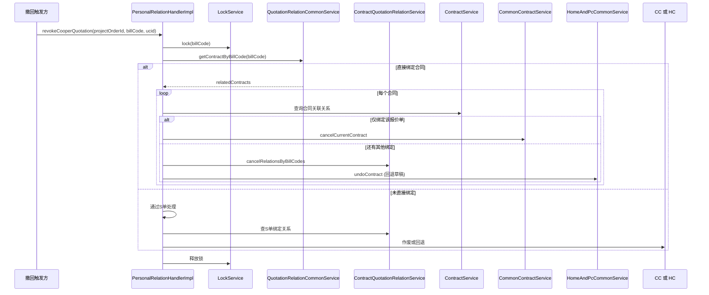

# Personal Relation & Signing

## 模块概述

**Personal Relation & Signing** 模块负责个性化合同的关联关系管理与签约数据源适配。该模块承担两大核心职责：

1. **个性化关联关系处理（PersonalRelationHandler）**：管理销售合同与报价单/S 单之间的绑定与解绑关系，在协同报价单撤回时执行合同作废或状态回退等业务操作。
2. **签约数据源策略（ContractSigningSource Strategy）**：通过策略模式适配三种不同类型的签约单据（报价单、变更单、S 单），为合同签约流程提供统一的数据查询、校验和构建接口。

该模块位于合同服务的个性化业务域中，是合同签约流程的核心数据适配层，向上为合同签约编排层提供统一接口，向下对接订单中心、预算服务、图纸服务等多个外部 RPC 服务。

---

## 架构总览

---

## 核心组件详解

### 1. PersonalRelationHandler — 关联关系处理接口

**职责**：定义个性化合同关联关系的撤回操作契约。

**接口方法**：

| 方法 | 参数 | 说明 |
|------|------|------|
| `revokeCooperQuotation` | projectOrderId, billCode, operatorUcid | 撤回协同报价单，处理合同与报价单/S 单的绑定解除 |

### 2. PersonalRelationHandlerImpl — 关联关系处理实现

**职责**：实现协同报价单撤回时的合同关联关系处理逻辑，包括解绑、作废、状态回退等操作。

**内部枚举**：

`ContractRevocationAction` 枚举定义了三种操作类型：

| 操作类型 | 触发条件 | 执行动作 |
|---------|---------|---------|
| `CANCEL_CONTRACT` | 合同仅绑定了当前要撤回的单据 | 调用 `commonContractService.cancelCurrentContract` 作废合同 |
| `UNBIND_AND_UNDO` | 合同还绑定了其他有效单据 | 解除当前单据的关联关系，回退合同到草稿状态 |
| `SKIP` | 合同已作废、已签署或已确认 | 不执行任何操作 |

**核心流程 — `revokeCooperQuotation`**：

**关键依赖服务**：

| 依赖 | 用途 |
|------|------|
| `LockService` | 基于报价单号的分布式锁，保证撤回与换绑操作互斥 |
| `ContractQuotationRelationService` | 查询/取消合同与单据的关联关系 |
| `CommonContractService` | 执行合同作废操作 |
| `HomeAndPcCommonService` | 执行合同状态回退（undo） |
| `ContractFieldHandler` | 清理正签草稿中的报价单号/S 单号字段 |
| `ContractBindLogService` | 记录解绑操作日志 |
| `SubOrderFeignService` | 通过 RPC 查询报价单对应的 S 单信息 |

**状态过滤规则**（`isContractInInvalidOrFinalStatus`）：

以下状态的合同不做任何处理：
- 已作废（`CANCEL`）
- 已签署（`SIGNED_STATUS_LIST` 中的所有状态）
- 待用户签署且用户已确认（`PENDING_USER_SIGN` + `userConfirmStatus = YES`）

---

### 3. ContractSigningSource — 签约数据源策略接口

**职责**：定义签约数据源的统一契约，抽象不同单据类型的查询、校验、构建逻辑。

**接口方法一览**：

| 方法 | 返回类型 | 说明 |
|------|---------|------|
| `bindType()` | `Integer` | 返回绑定类型编码，用于策略路由 |
| `queryPersonalQuoteInfo(BindOrderInfo)` | `List<PersonalContractData>` | 从主订单获取个性化报价数据 |
| `hasInvalidStatusOrders(BindOrderInfo)` | `boolean` | 校验关联单据是否包含无效状态 |
| `buildGoodsInfo(BindOrderInfo)` | `Map<String, String>` | 构建单据号 → 商品类目信息映射 |
| `buildSignableOrderInfos(String)` | `List<SignableOrderInfo>` | 获取可签约的单据列表（弹窗选择用） |
| `checkPersonalCanCreate(String)` | `boolean` | 校验是否可以发起个性化合同签约 |
| `buildPersonalDrawingImgList(BindOrderInfo)` | `List<String>` | 构建个性化图纸预览 URL 列表 |
| `buildPersonalDrawing(BindOrderInfo, Boolean, Boolean)` | `DrawingDTO` | 构建完整的个性化图纸数据 |
| `hasCPart(BindOrderInfo)` | `boolean` | 是否包含 C 部分商品（客户承担费用） |
| `hasBPart(BindOrderInfo)` | `boolean` | 是否包含 B 部分商品（开发商承担费用） |

### 4. AbstractContractSigningSource — 模板方法抽象基类

**职责**：实现模板方法模式，封装签约数据源的通用流程，将差异化的数据获取逻辑委托给子类实现。

**模板方法（已实现）**：

| 方法 | 流程 |
|------|------|
| `queryPersonalQuoteInfo` | 调用子类 `buildParam` → 调用 `HomeOrderDataConversionService` → 调用子类 `filterByCompanyCode` |
| `buildPersonalDrawingImgList` | 调用 `buildPersonalDrawing` → 提取预览 URL |
| `buildPersonalDrawing` | 调用子类 `buildProductItemCodes` → 调用子类 `buildDrawingQuery` → 调用 `AtomDrawingRpc` → 过滤个性化图纸 |

**抽象钩子方法（子类必须实现）**：

| 方法 | 说明 |
|------|------|
| `buildParam` | 构建个性化报价查询参数 |
| `filterByCompanyCode` | 按单据号 + 公司主体过滤数据 |
| `buildProductItemCodes` | 获取商品唯一标识列表（用于图纸查询） |
| `buildDrawingQuery` | 构造图纸查询参数 |

**通用工具方法**：

| 方法 | 说明 |
|------|------|
| `mergeCategoryNames` | 合并类目名称，最多展示 3 个，超出部分以 "..." 代替 |
| `getHasBoundOrderNos` | 查询已绑定有效合同的单据号集合 |
| `buildPackageCodeMap` | 构建 S 单号 → 套餐实例编码的映射 |
| `isCPart` / `isBPart` | 根据 `PurchaseTypeEnum` 判断商品费用承担方 |

---

### 5. BillSigningSourceStrategy — 报价单签约数据源

**职责**：适配报价单类型（`bindType = 1`）的签约数据源，对接预算服务获取报价单数据。

**策略路由**：`BindTypeEnum.BILL_CODE`（code = 1）

**数据源**：Atom 预算服务（`AtomBudgetRpc`）

**核心逻辑**：

| 方法 | 实现要点 |
|------|---------|
| `hasInvalidStatusOrders` | 校验报价单状态，排除"调整中"、"已删除"、"已取消"的报价单 |
| `buildGoodsInfo` | 通过 SKU 商品的内控类目名称构建商品描述 |
| `buildSignableOrderInfos` | 从正签报价数据中提取个性化报价单，仅处理全屋翻新和房证类型 |
| `checkPersonalCanCreate` | 始终返回 `false`（报价单不单独校验是否可创建） |
| `buildDrawingQuery` | 按项目订单 ID + 产品编码查询图纸 |
| `filterByCompanyCode` | 以 `billCode_organizationCode` 为 key 过滤 |

---

### 6. ChangeOrderSigningSourceStrategy — 变更单签约数据源

**职责**：适配变更单类型（`bindType = 2`）的签约数据源，对接预算服务获取变更单数据。

**策略路由**：`BindTypeEnum.CHANGE_ORDER`（code = 2）

**数据源**：Atom 预算服务变更模块（`AtomBudgetRpc.getChangeApplyDetails`）

**核心逻辑**：

| 方法 | 实现要点 |
|------|---------|
| `hasInvalidStatusOrders` | 校验变更单状态，仅"待签约"和"已完成"允许签约 |
| `buildGoodsInfo` | 通过变更单关联 SKU 商品的类目名称构建商品描述 |
| `buildSignableOrderInfos` | 返回空列表（变更单不参与独立的可签约单据弹窗） |
| `checkPersonalCanCreate` | 始终返回 `false` |
| `buildDrawingQuery` | 按项目订单 ID + 变更单号 + 图纸状态（TEMP）查询 |
| `filterByCompanyCode` | 以 `changeOrderId_organizationCode` 为 key 过滤 |

---

### 7. SubOrderSigningSourceStrategy — S 单签约数据源

**职责**：适配 S 单类型（`bindType = 3`）的签约数据源，对接订单中心获取子单数据。

**策略路由**：`BindTypeEnum.SUB_ORDER`（code = 3）

**数据源**：订单中心（`SubOrderFeignService`、`OrderQueryApi`）

**核心逻辑**：

| 方法 | 实现要点 |
|------|---------|
| `hasInvalidStatusOrders` | 校验 S 单数量和状态，排除无效状态子单 |
| `buildGoodsInfo` | 从 S 单商品项中提取前/后台类目名称，超 50 字符截断 |
| `buildSignableOrderInfos` | 获取有效 S 单 → 排除变更中/已绑定/套餐已签约 → 构建可签约列表 |
| `checkPersonalCanCreate` | 编辑模式下查询可签约 S 单，存在则返回 `true` |
| `buildProductItemCodes` | 从 S 单商品项中提取 `skuUniqueKey` |
| `filterByCompanyCode` | 不做额外过滤，直接返回全部数据 |

**S 单可签约判定流程**：

**额外依赖**：

| 依赖 | 用途 |
|------|------|
| `MdmRpc` | 获取公司主体中文名称 |
| `PackageQueryFeignService` | 查询套餐实例名称 |
| `CommonBusinessService` | 判断是否为团装 2.5 流程 |

---

## 策略路由机制

三种签约数据源策略通过 `BindTypeEnum` 进行路由。上层编排层根据绑定类型选择对应的策略实现：

| BindTypeEnum | 编码 | 策略类 | 数据来源服务 | 典型场景 |
|-------------|------|--------|------------|---------|
| `BILL_CODE` | 1 | `BillSigningSourceStrategy` | AtomBudgetRpc | 正签报价单签约 |
| `CHANGE_ORDER` | 2 | `ChangeOrderSigningSourceStrategy` | AtomBudgetRpc | 变更单签约 |
| `SUB_ORDER` | 3 | `SubOrderSigningSourceStrategy` | SubOrderFeignService | S 单签约 |

---

## 与其他模块的关系

| 关联模块 | 关联方式 | 说明 |
|---------|---------|------|
| [Contract Core Services](Contract Core Services.md) | 依赖 | 本模块调用 `ContractService`、`ContractQuotationRelationService`、`CommonContractService` 等核心服务完成合同的作废、查询和关联管理 |
| [Contract Context Management](Contract Context Management.md) | 协作 | 撤回时通过 `ContractFieldHandler` 清理正签草稿中的字段数据 |
| [Contract Change Strategy](Contract Change Strategy.md) | 触发 | 合同变更流程可能触发关联关系的更新，间接调用本模块的关联关系处理逻辑 |
| [Contract PDF Generation](Contract PDF Generation.md) | 数据提供 | 签约数据源策略为 PDF 生成提供个性化图纸数据 |

---

## 关键设计模式

### 1. 策略模式（Strategy Pattern）

`ContractSigningSource` 接口及三个策略实现类（`BillSigningSourceStrategy`、`ChangeOrderSigningSourceStrategy`、`SubOrderSigningSourceStrategy`）构成典型的策略模式。通过 `bindType()` 方法返回的枚举值实现策略路由，使得新增单据类型时只需添加新的策略实现类，无需修改已有代码。

### 2. 模板方法模式（Template Method Pattern）

`AbstractContractSigningSource` 抽象类封装了通用的数据获取流程（如查询个性化报价、构建图纸），将差异化的参数构建和数据过滤逻辑定义为抽象钩子方法，由子类按需实现。这种方式保证了流程的一致性，同时允许各策略灵活定制。

### 3. 分布式锁保护

`PersonalRelationHandlerImpl.revokeCooperQuotation` 使用 `LockService` 基于报价单号加锁，确保协同报价单撤回与换绑操作之间的互斥性，防止并发场景下的数据不一致。

---

## 数据流概览

### 签约数据查询流

### 协同报价单撤回流

---

## 依赖关系总结

### 外部 RPC 依赖

| 服务 | RPC 类 | 模块 | 用途 |
|------|--------|------|------|
| Atom 预算服务 | `AtomBudgetRpc` | Bill / Change 策略 | 查询报价单、变更单状态和商品信息 |
| 订单中心 | `SubOrderFeignService` / `OrderQueryApi` | SubOrder 策略 / PRH | 查询 S 单信息、变更中的 S 单 |
| Atom 图纸服务 | `AtomDrawingRpc` | AbstractContractSigningSource | 获取个性化图纸数据 |
| 主数据服务 | `MdmRpc` | SubOrder 策略 | 获取公司主体中文名称 |
| 套餐服务 | `PackageQueryFeignService` | SubOrder 策略 | 查询套餐实例名称 |
| 家订单数据转换 | `HomeOrderDataConversionService` | AbstractContractSigningSource / Bill 策略 | 获取正签报价数据 |

### 内部服务依赖

| 服务 | 提供方模块 | 用途 |
|------|----------|------|
| `ContractService` | Contract Core Services | 合同 CRUD |
| `ContractQuotationRelationService` | Contract Core Services | 合同-单据关联关系管理 |
| `ContractRelationService` | Contract Core Services | 合同间关联关系查询 |
| `CommonContractService` | Contract Core Services | 合同作废等通用操作 |
| `HomeAndPcCommonService` | Contract Core Services | 合同状态回退 |
| `LockService` | 通用服务 | 分布式锁 |
| `ContractFieldHandler` | Contract Context Management | 正签草稿字段清理 |
| `ContractBindLogService` | 本模块 | 解绑操作日志记录 |
| `ProductQueryService` | 本模块（quotation 子包） | 报价/变更商品查询 |
| `CommonBusinessService` | 通用服务 | 业务类型判断 |
