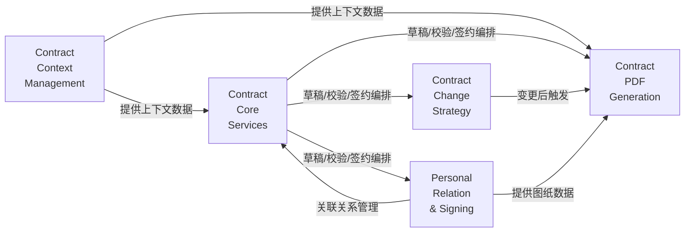

# Contract Service V2 — 仓库概览

## 1. 仓库目的

**Contract Service V2** 是合同管理系统的后端核心服务，负责装修合同全生命周期的业务处理，涵盖合同的创建、草稿保存、提交审批、PDF 生成、签章确认、变更管理以及个性化合同的关联关系维护。

该仓库解决的核心问题：

- **合同类型多样**：支持正签、变更、解约、设计、存管协议、个性化合同等 30 种合同类型，每种类型在数据准备、校验规则、PDF 板式、签章流程上均有差异
- **外部依赖复杂**：一次合同操作涉及十余种外部数据源（项目、报价、图纸、存管、审核、主数据等），需要高效的并行加载和上下文传递机制
- **业务流程长且分支多**：从草稿到签署的完整链路涉及数据准备 → 字段校验 → PDF 生成 → 签章 → 关联关系管理等多个环节，需要清晰的策略分发和模块解耦

---

## 2. 端到端架构

```mermaid
graph TB
    subgraph 前端入口
        FE_APP[移动端 App]
        FE_PC[PC 端]
    end

    subgraph API层
        Ctrl[ContractController]
    end

    subgraph 数据准备层["Contract Context Management"]
        direction TB
        CCH_AOP["ContractContextAspect<br/>@ContractDataPrepare"]
        CDCH_AOP["ContractDetailAspect<br/>@ContractDetailDataPrepare"]
        CCH["ContractContextHandler<br/>ThreadLocal 缓存 · 9 个并行任务"]
        CDCH["ContractDetailContextHandler<br/>首屏/非首屏分层加载"]
        PTS["ParallelTaskService<br/>并行任务编排"]
    end

    subgraph 核心业务层["Contract Core Services"]
        direction TB
        SaveDraft["ContractSaveDraftService<br/>草稿保存"]
        FieldCheck["ContractFieldCheckService<br/>字段校验"]
        ButtonConfig["ContractButtonConfigService<br/>按钮动态配置"]
        CompanySign["ContractCompanySignService<br/>对公签约/授权协议"]
        EscrowSvc["ContractEscrowService<br/>存管合同"]
        SelfSeal["ContractSelfSealService<br/>自主盖章"]
        OrderChange["ContractHomeOrderNoChangeService<br/>主订单号变更"]
        WorkerCheck["WorkerTypeCheckService<br/>工种校验"]
    end

    subgraph 变更策略层["Contract Change Strategy"]
        direction TB
        CSFactory["ChangeContractStrategyFactory"]
        NormalCS["NormalChangeContractStrategy<br/>设计变更"]
        ZQCS["ZQChangeContractStrategy<br/>套餐变更"]
    end

    subgraph PDF生成层["Contract PDF Generation"]
        direction TB
        PDFFactory["StrategyFactory<br/>策略工厂"]
        HousePDF["HouseFormalContractPdfBySelfStrategy<br/>整装正签"]
        GroupPDF["GroupFormalContractPdfBySelfStrategy<br/>团装正签"]
        ReformPDF["ReformAllFormalContractPdfBySelfStrategy<br/>翻新全案"]
        DrawPDF["DrawingContractPdfBySelfStrategy<br/>图纸合同"]
        ScriptSvc["ContractScriptCreateService<br/>动态字段"]
        MaterialPDF["MaterialPdfDiffService<br/>材料清单"]
    end

    subgraph 个性化签约层["Personal Relation & Signing"]
        direction TB
        PRH["PersonalRelationHandler<br/>关联关系管理"]
        BillCSS["BillSigningSourceStrategy<br/>报价单"]
        ChangeCSS["ChangeOrderSigningSourceStrategy<br/>变更单"]
        SubCSS["SubOrderSigningSourceStrategy<br/>S单"]
    end

    subgraph 外部服务
        RPC_Proj["ProjectInfoReadService<br/>项目信息"]
        RPC_Quote["QuotationFeignService<br/>报价查询"]
        RPC_Draw["AtomDrawingRpc<br/>图纸服务"]
        RPC_Escrow["EscrowDomain<br/>存管服务"]
        RPC_Budget["AtomBudgetRpc<br/>预算报价"]
        RPC_MDM["MdmRpc<br/>主数据"]
        RPC_Audit["AuditRpc<br/>风控审核"]
        RPC_Order["SubOrderFeignService<br/>订单中心"]
        RPC_Ceres["CeresRpc<br/>人员信息"]
        Freeform["Freeform 协议平台"]
        S3["S3 对象存储"]
    end

    FE_APP --> Ctrl
    FE_PC --> Ctrl

    Ctrl --> CCH_AOP
    Ctrl --> CDCH_AOP
    CCH_AOP --> CCH
    CDCH_AOP --> CDCH
    CCH --> PTS
    CDCH --> PTS

    PTS --> RPC_Proj
    PTS --> RPC_Quote
    PTS --> RPC_Draw
    PTS --> RPC_Escrow
    PTS --> RPC_Budget
    PTS --> RPC_MDM
    PTS --> RPC_Audit

    Ctrl --> SaveDraft
    Ctrl --> FieldCheck
    Ctrl --> ButtonConfig
    Ctrl --> CompanySign
    Ctrl --> EscrowSvc
    Ctrl --> SelfSeal
    Ctrl --> OrderChange

    Ctrl --> CSFactory
    CSFactory --> NormalCS
    CSFactory --> ZQCS

    SaveDraft --> PDFFactory
    PDFFactory --> HousePDF
    PDFFactory --> GroupPDF
    PDFFactory --> ReformPDF
    PDFFactory --> DrawPDF
    HousePDF --> Freeform
    GroupPDF --> Freeform
    ReformPDF --> Freeform
    DrawPDF --> S3
    ScriptSvc --> Freeform

    SaveDraft --> PRH
    PRH --> BillCSS
    PRH --> ChangeCSS
    PRH --> SubCSS
    BillCSS --> RPC_Budget
    ChangeCSS --> RPC_Budget
    SubCSS --> RPC_Order

    SelfSeal --> S3
    MaterialPDF --> S3
    RPC_Draw --> DrawPDF
    RPC_Ceres --> WorkerCheck
```

---

## 3. 模块总览

| 模块 | 职责 | 核心设计模式 | 关键特征 |
|------|------|-------------|---------|
| **Contract Context Management** | AOP 切面 + ThreadLocal 上下文，并行加载外部数据 | 声明式注解 + 并行任务编排 + Holder 模式 | 9 个并行任务（提交场景）；首屏/非首屏分层加载（详情场景） |
| **Contract Core Services** | 合同核心业务逻辑：草稿、校验、签约、存管、盖章等 | 多维配置 + Aviator 表达式引擎；反射调用；幂等设计 | 8 个核心服务组件，覆盖合同全生命周期的关键业务操作 |
| **Contract Change Strategy** | 合同变更流程的策略分发与执行 | 策略模式 + 工厂模式（Spring IoC 自动注册） | 2 个策略实现：设计变更（不依赖变更单）vs 套餐变更（双维度校验） |
| **Contract PDF Generation** | 合同 PDF 生成，支持多种板式和业务类型 | 策略模式 + 模板方法模式 | 4 个生成策略；iText 7 / PDFBox 底层操作；动态 DPI 压缩 |
| **Personal Relation & Signing** | 个性化合同关联关系管理 + 签约数据源适配 | 策略模式 + 模板方法模式 + 分布式锁 | 3 种签约数据源策略（报价单/变更单/S单）；协同报价单撤回的关联合同作废/回退 |

---

## 4. 模块间协作关系

**数据流向**：
- **Contract Context Management** 是数据准备基础设施层，通过 AOP + ThreadLocal 为 Core Services 和 PDF Generation 提供统一的外部数据访问
- **Contract Core Services** 是核心编排层，协调 Context → 校验 → PDF → 签约的完整流程
- **Contract Change Strategy** 和 **Personal Relation & Signing** 是两个独立的策略分支，分别服务于变更场景和个性化场景
- **Contract PDF Generation** 是文档生成层，消费上游数据并产出可签章的 PDF 文件

---

## 5. 核心模块文档索引

| 模块 | 说明 |
|------|------|
| [Contract Context Management](Contract Context Management.md) | AOP 切面 + ThreadLocal 上下文的数据准备基础设施，含 9 个并行任务和首屏分层加载 |
| [Contract Core Services](Contract Core Services.md) | 8 个核心业务服务：按钮配置、对公签约、存管合同、字段校验、订单变更、草稿保存、自主盖章、工种校验 |
| [Contract PDF Generation](Contract PDF Generation.md) | 4 种 PDF 生成策略（整装/团装/翻新/图纸）+ 材料清单 + 动态字段服务 |
| [Contract Change Strategy](Contract Change Strategy.md) | 变更合同策略分发，含设计变更和套餐变更两种策略实现 |
| [Personal Relation & Signing](Personal Relation & Signing.md) | 个性化合同关联关系管理 + 三种签约数据源策略（报价单/变更单/S单） |

---

## 6. 关键设计模式一览

| 设计模式 | 应用位置 | 作用 |
|---------|---------|------|
| **策略模式 + 工厂模式** | Change Strategy、PDF Generation、Signing Source | 按合同类型/单据类型路由到不同实现，遵循开闭原则 |
| **模板方法模式** | PDF Generation（BaseContractPdfCreateService）、Signing Source（AbstractContractSigningSource） | 定义通用骨架流程，子类实现差异化步骤 |
| **ThreadLocal 上下文** | Contract Context Management | 请求级数据隔离，静态访问，AOP 生命周期管理 |
| **并行任务编排** | ParallelTaskService | 独立 RPC 并发执行，总耗时 ≈ 最慢单个调用 |
| **声明式注解 + AOP** | Contract Context Management | 业务方法添加注解即自动获得数据准备能力，零侵入 |
| **多维配置 + 表达式引擎** | ContractButtonConfigService | 按维度匹配 + Aviator 表达式求值，动态控制按钮显隐 |
| **反射调用** | ContractFieldCheckService、ContractScriptCreateService | 动态路由校验方法和数据获取方法，支持配置驱动 |
| **幂等设计** | ContractEscrowService | 通过查询已有合同状态避免重复生成 |
| **分布式锁** | PersonalRelationHandlerImpl | 保证撤回与换绑操作的互斥性 |