# A2A 模块

A2A（Agent-to-Agent）模块实现了 [Google A2A 协议](https://github.com/google/A2A)，为 Agent 间的标准化通信提供了完整的服务端基础设施。该模块基于 JSON-RPC 2.0 规范，使用 Starlette 作为 HTTP 框架，支持同步任务提交和基于 SSE（Server-Sent Events）的流式任务订阅。

## 1. 架构总览

A2A 模块遵循经典的分层架构：**传输层**（HTTP/SSE）→ **协议层**（JSON-RPC）→ **业务层**（TaskManager），各层职责清晰、单向依赖。

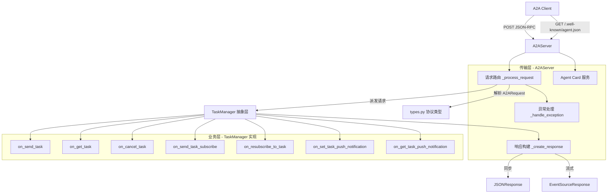

## 2. 核心组件详解

### 2.1 A2AServer

`A2AServer` 是模块的入口，负责 HTTP 服务的启动、请求路由和响应构建。

**初始化参数：**

| 参数 | 类型 | 默认值 | 说明 |
|------|------|--------|------|
| `host` | str | `"0.0.0.0"` | 监听地址 |
| `port` | int | `5000` | 监听端口 |
| `endpoint` | str | `"/"` | JSON-RPC 请求端点 |
| `agent_card` | AgentCard | None | Agent 元数据卡片，用于服务发现 |
| `task_manager` | TaskManager | None | 任务管理器实现，处理具体业务逻辑 |

**暴露的 HTTP 路由：**

| 路由 | 方法 | 说明 |
|------|------|------|
| `{endpoint}` | POST | JSON-RPC 请求入口 |
| `/.well-known/agent.json` | GET | Agent Card 服务发现（遵循 A2A 规范） |

**请求处理流程：**

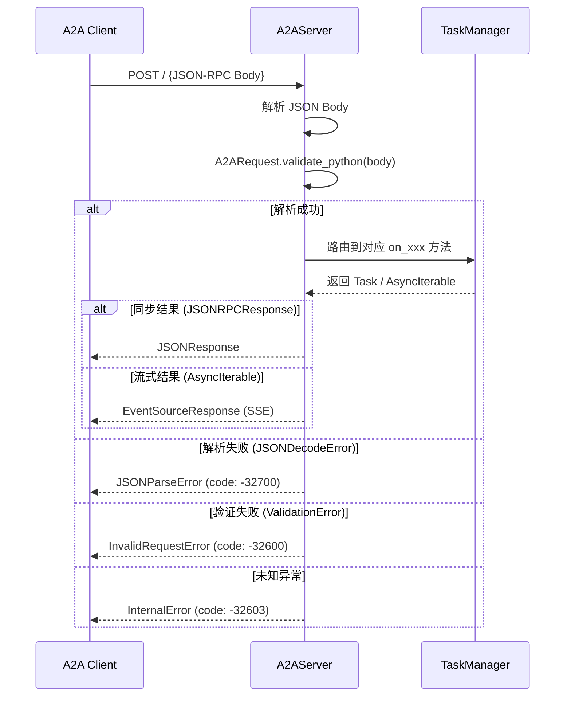

**请求路由逻辑：** `_process_request` 方法根据 `A2ARequest` 的 `method` 字段（discriminator）自动路由到对应的 `TaskManager` 方法：

| JSON-RPC Method | 调用的 TaskManager 方法 | 响应类型 |
|----------------|----------------------|---------|
| `tasks/send` | `on_send_task` | JSONResponse |
| `tasks/sendSubscribe` | `on_send_task_subscribe` | EventSourceResponse (SSE) |
| `tasks/get` | `on_get_task` | JSONResponse |
| `tasks/cancel` | `on_cancel_task` | JSONResponse |
| `tasks/pushNotification/set` | `on_set_task_push_notification` | JSONResponse |
| `tasks/pushNotification/get` | `on_get_task_push_notification` | JSONResponse |
| `tasks/resubscribe` | `on_resubscribe_to_task` | EventSourceResponse (SSE) |

### 2.2 TaskManager

`TaskManager` 是一个抽象基类（ABC），定义了 A2A 协议中任务生命周期的全部操作接口。具体的应用实现（如 [DemoAgent](DemoAgent.md)、[StoryAgent](StoryAgent.md)）需要继承并实现这些方法。

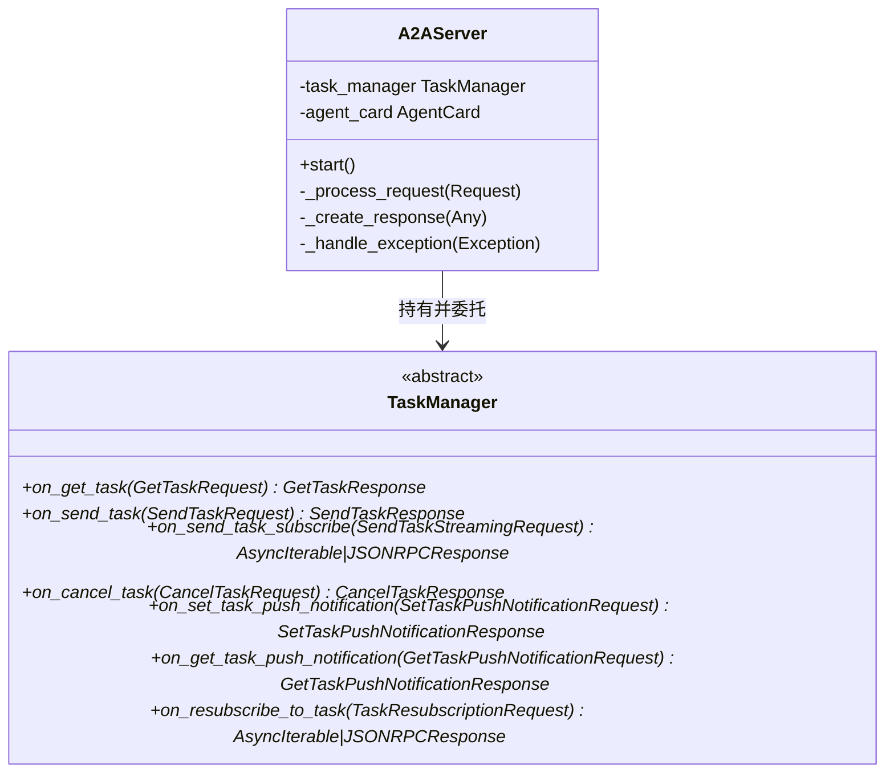

**方法说明：**

| 方法 | 职责 | 返回类型 |
|------|------|---------|
| `on_send_task` | 提交并执行新任务，初始化任务调度 | `Task` |
| `on_get_task` | 查询任务当前状态、参数和历史 | `Task` |
| `on_cancel_task` | 取消正在进行中的任务 | `Task` |
| `on_send_task_subscribe` | 流式订阅任务状态更新（SSE） | `AsyncIterable[TaskStatusUpdateEvent \| TaskArtifactUpdateEvent]` |
| `on_resubscribe_to_task` | 重新订阅已断开的任务更新流 | `AsyncIterable[TaskStatusUpdateEvent \| TaskArtifactUpdateEvent]` |
| `on_set_task_push_notification` | 配置任务的 Webhook 推送通知 | `TaskPushNotificationConfig` |
| `on_get_task_push_notification` | 查询任务的推送通知配置 | `TaskPushNotificationConfig` |

### 2.3 types.py - 协议类型定义

`types.py` 是 A2A 协议的类型系统，定义了所有通信实体、请求/响应结构、错误类型和 Agent 发现模型。使用 Pydantic v2 作为数据验证框架。

#### 2.3.1 任务生命周期模型

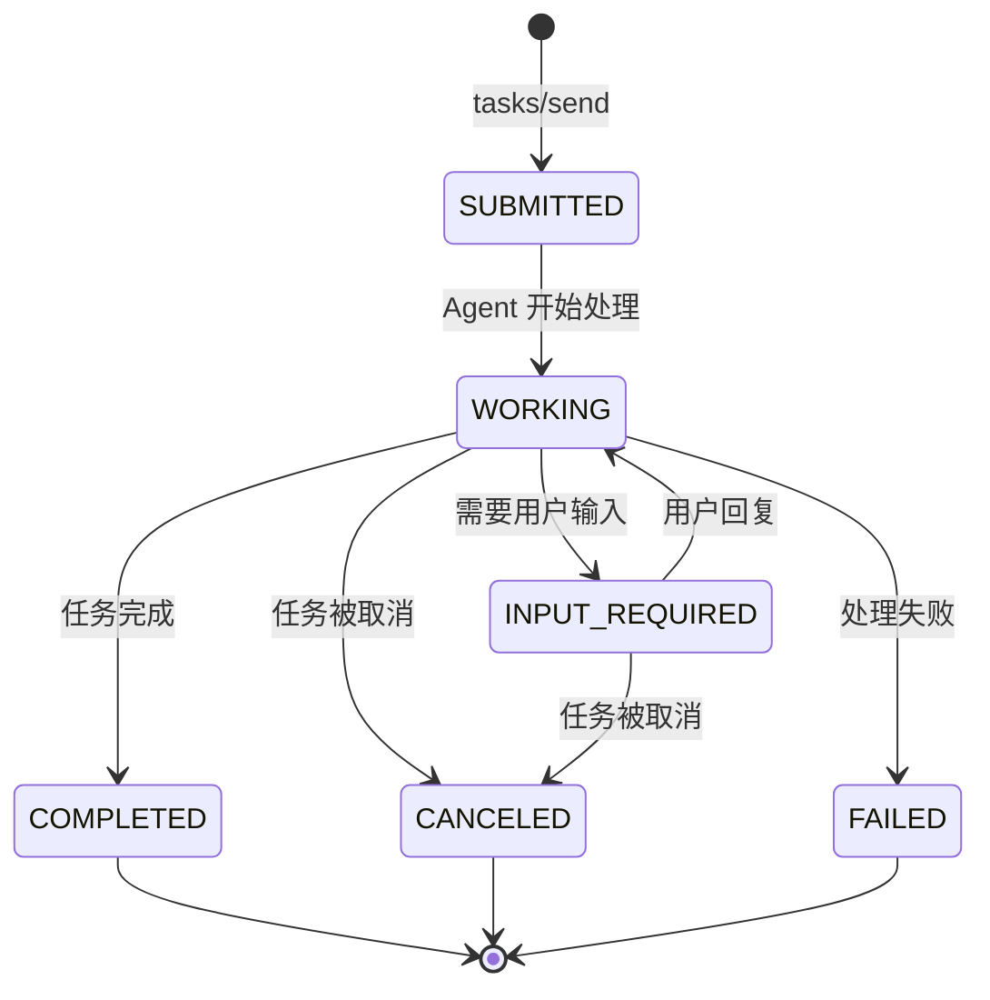

`TaskState` 枚举定义了 7 种状态：

| 状态 | 含义 |
|------|------|
| `SUBMITTED` | 任务已提交，等待处理 |
| `WORKING` | Agent 正在处理任务 |
| `INPUT_REQUIRED` | 需要用户提供额外输入 |
| `COMPLETED` | 任务已成功完成 |
| `CANCELED` | 任务已被取消 |
| `FAILED` | 任务处理失败 |
| `UNKNOWN` | 未知状态 |

#### 2.3.2 消息与内容模型

A2A 协议中的消息由 `Message` 承载，包含一个或多个 `Part`（内容片段）。`Part` 使用联合类型和 discriminator 模式进行多态分派：

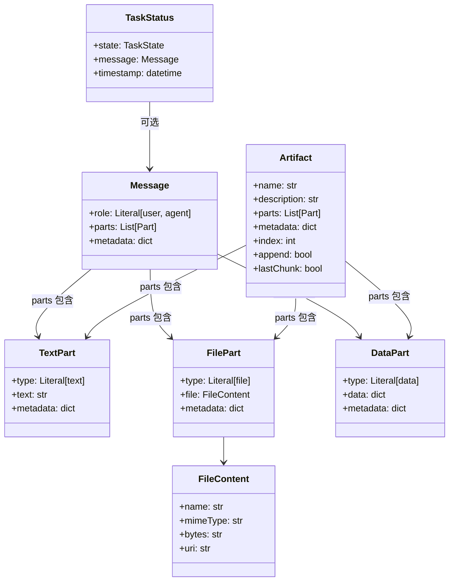

**Part 类型对比：**

| Part 类型 | 承载内容 | 典型用途 |
|-----------|---------|---------|
| `TextPart` | 纯文本字符串 | 对话消息、代码片段 |
| `FilePart` | 文件（二进制字节或 URI） | 图片、文档、音频 |
| `DataPart` | 结构化 JSON 数据 | 表单数据、配置参数 |

> **注意：** `FileContent` 使用 Pydantic model_validator 强制约束：`bytes` 和 `uri` 互斥，必须且只能存在其中一个。

#### 2.3.3 任务与事件模型

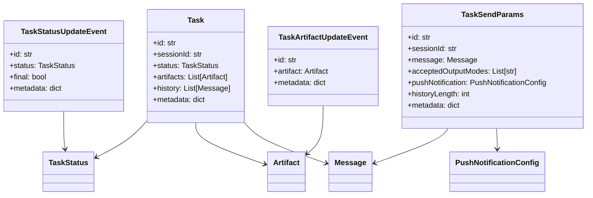

**关键设计决策：**

- `TaskSendParams.sessionId` 默认使用 `uuid4().hex` 自动生成，确保每次请求都有唯一会话标识。
- `TaskStatusUpdateEvent.final` 标记流式更新是否为最后一条，客户端据此判断是否关闭 SSE 连接。
- `Artifact.append` 和 `Artifact.lastChunk` 支持增量式流式产物输出（如逐步生成的文档）。

#### 2.3.4 JSON-RPC 协议层

所有 A2A 请求/响应均遵循 JSON-RPC 2.0 规范。`A2ARequest` 使用 Pydantic `TypeAdapter` + `Field(discriminator="method")` 实现请求的自动类型分派：

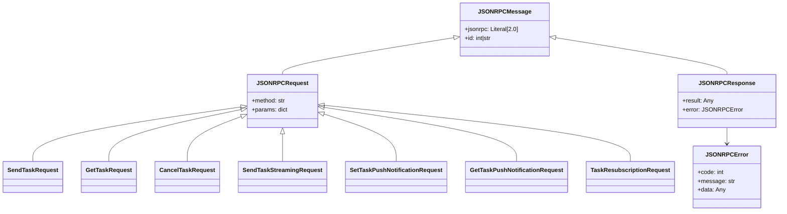

#### 2.3.5 错误码体系

A2A 模块定义了完整的 JSON-RPC 错误码，分为标准错误和 A2A 扩展错误两类：

| 错误码 | 错误类 | 含义 |
|--------|--------|------|
| -32700 | `JSONParseError` | JSON 解析失败 |
| -32600 | `InvalidRequestError` | 请求参数验证失败 |
| -32601 | `MethodNotFoundError` | 方法不存在 |
| -32602 | `InvalidParamsError` | 参数无效 |
| -32603 | `InternalError` | 内部服务器错误 |
| -32001 | `TaskNotFoundError` | 任务不存在 |
| -32002 | `TaskNotCancelableError` | 任务无法取消 |
| -32003 | `PushNotificationNotSupportedError` | 不支持推送通知 |
| -32004 | `UnsupportedOperationError` | 不支持的操作 |
| -32005 | `ContentTypeNotSupportedError` | 内容类型不兼容 |

> A2A 扩展错误码（-32001 ~ -32005）遵循 JSON-RPC 预留的 -32000 ~ -32099 实现定义范围。

#### 2.3.6 Agent Card（服务发现）

`AgentCard` 是 A2A 协议的服务注册模型，通过 `/.well-known/agent.json` 端点对外暴露，实现 Agent 间的自动发现：

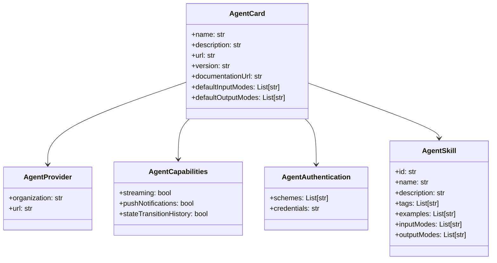

**AgentCard 关键字段：**

| 字段 | 说明 |
|------|------|
| `capabilities.streaming` | 是否支持 SSE 流式响应 |
| `capabilities.pushNotifications` | 是否支持 Webhook 推送通知 |
| `capabilities.stateTransitionHistory` | 是否支持任务状态历史查询 |
| `defaultInputModes` | 支持的输入 MIME 类型，默认 `["text"]` |
| `defaultOutputModes` | 支持的输出 MIME 类型，默认 `["text"]` |
| `skills` | Agent 能力列表，描述支持的技能和输入输出模式 |

## 3. 依赖关系

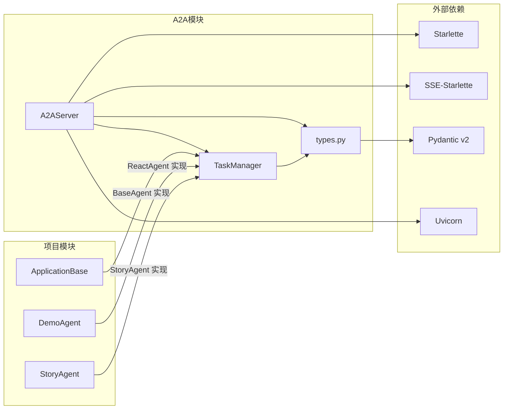

**外部依赖说明：**

| 依赖 | 版本要求 | 用途 |
|------|---------|------|
| Starlette | - | ASGI HTTP 框架，提供路由和请求/响应处理 |
| sse-starlette | - | SSE（Server-Sent Events）扩展，用于流式响应 |
| Pydantic v2 | 2.x | 数据验证和序列化，TypeAdapter 进行请求类型分派 |
| Uvicorn | - | ASGI 服务器，运行 Starlette 应用 |

**项目内部依赖：**

- [ApplicationBase](ApplicationBase.md)：`BaseAgent` 可继承 `TaskManager` 来获得 A2A 兼容性
- [DemoAgent](DemoAgent.md)：`ReactAgent` 实现 `TaskManager` 的具体任务处理逻辑
- [StoryAgent](StoryAgent.md)：故事生成 Agent 的任务处理实现
- [ApiMiddleware](ApiMiddleware.md)：A2A 服务可复用项目的认证和日志中间件能力

## 4. 数据流

### 4.1 同步任务提交流程（tasks/send）

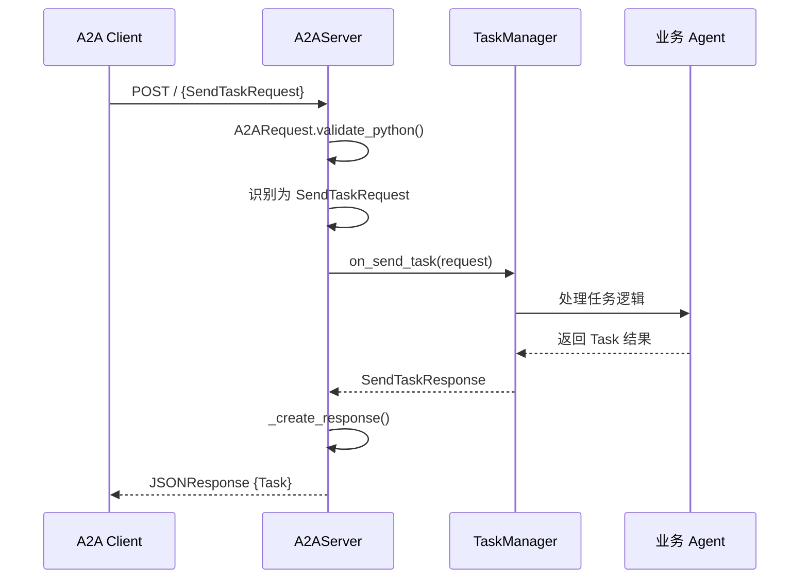

### 4.2 流式任务订阅流程（tasks/sendSubscribe）

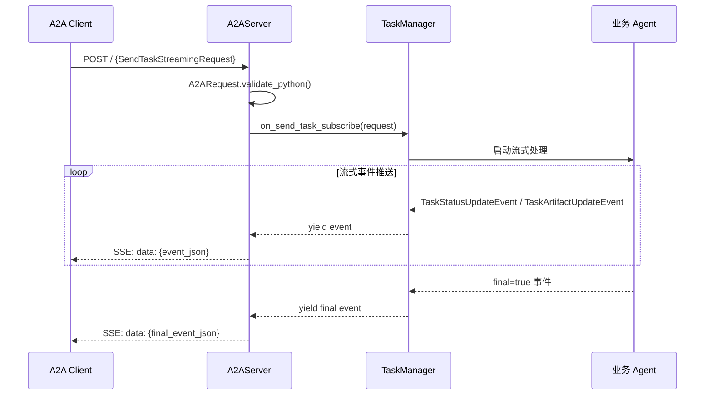

### 4.3 推送通知配置流程

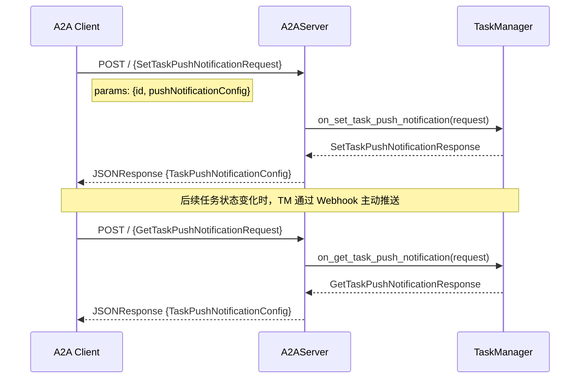

## 5. 关键设计模式

### 5.1 策略模式（Strategy Pattern）

`TaskManager` 作为抽象策略接口，`A2AServer` 持有其引用。不同类型的 Agent（对话型、研究型、故事型）提供不同的 `TaskManager` 实现，服务器本身无需修改即可支持任意业务逻辑。

```
A2AServer (上下文) → TaskManager (策略接口) → 具体 Agent 实现 (具体策略)
```

### 5.2 Discriminated Union（判别联合）

请求类型分派使用 Pydantic v2 的 `TypeAdapter` + `Field(discriminator="method")`，通过 JSON-RPC 的 `method` 字段自动将请求体反序列化为正确的子类型，避免了手动的类型判断和强制转换。

### 5.3 抽象工厂（Abstract Factory）

`AgentCard` 及其嵌套类型（`AgentCapabilities`、`AgentSkill`、`AgentProvider`）共同构成 Agent 的声明式元数据工厂，描述 Agent 的能力边界和通信契约。

### 5.4 错误层次化

错误类型继承自 `JSONRPCError`，每种错误携带固定的错误码和消息。`A2AServer._handle_exception` 将底层异常（JSON 解析错误、Pydantic 验证错误）映射到对应的 JSON-RPC 错误类型，实现异常的协议层标准化。

## 6. 接入指南

### 6.1 实现 TaskManager

要创建一个 A2A 兼容的 Agent，需要继承 `TaskManager` 并实现所有抽象方法：

```python
from core.a2a.task_manager import TaskManager
from core.a2a.types import (
    SendTaskRequest, SendTaskResponse,
    GetTaskRequest, GetTaskResponse,
    Task, TaskStatus, TaskState,
    # ...
)

class MyAgentTaskManager(TaskManager):
    async def on_send_task(self, request: SendTaskRequest) -> SendTaskResponse:
        # 实现任务处理逻辑
        task = Task(
            id=request.params.id,
            status=TaskStatus(state=TaskState.COMPLETED),
        )
        return SendTaskResponse(id=request.id, result=task)

    # ... 实现其他抽象方法
```

### 6.2 启动 A2A Server

```python
from core.a2a.server import A2AServer
from core.a2a.types import AgentCard, AgentCapabilities, AgentSkill

agent_card = AgentCard(
    name="my-agent",
    description="My custom A2A agent",
    url="http://localhost:5000",
    version="1.0.0",
    capabilities=AgentCapabilities(streaming=True),
    skills=[AgentSkill(id="chat", name="Chat", description="General chat")],
)

server = A2AServer(
    host="0.0.0.0",
    port=5000,
    agent_card=agent_card,
    task_manager=MyAgentTaskManager(),
)
server.start()
```

### 6.3 服务发现

启动后，任何 A2A 客户端可通过 `GET /.well-known/agent.json` 获取 Agent Card 元数据，自动发现该 Agent 的能力和技能。
