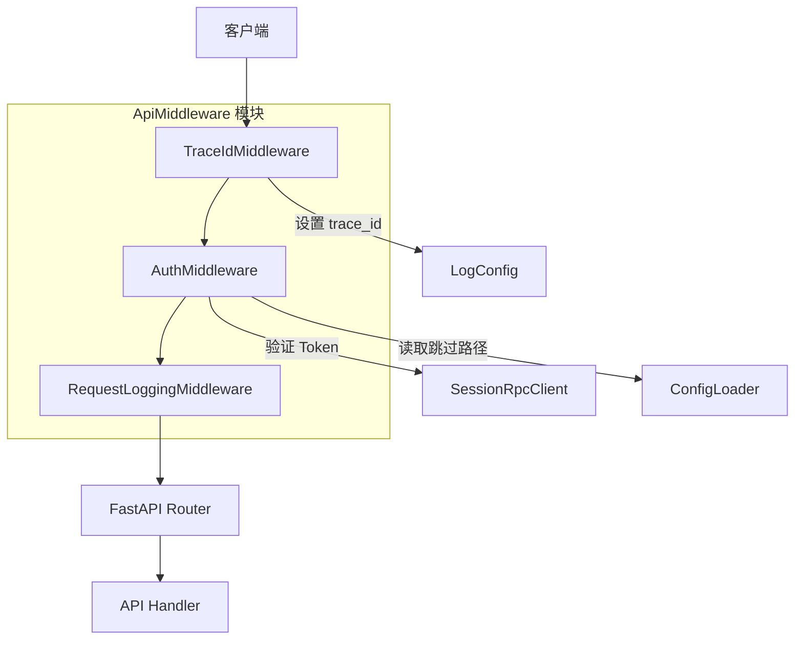
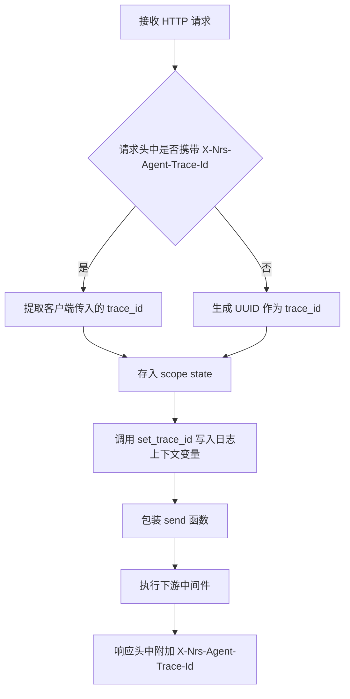
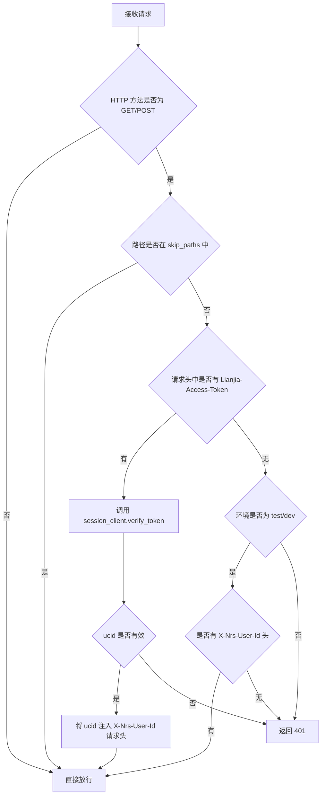
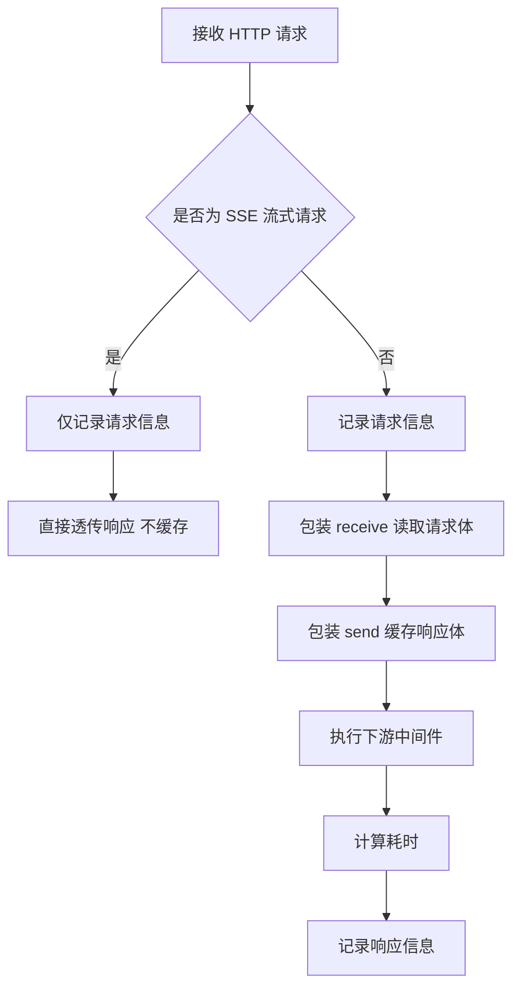
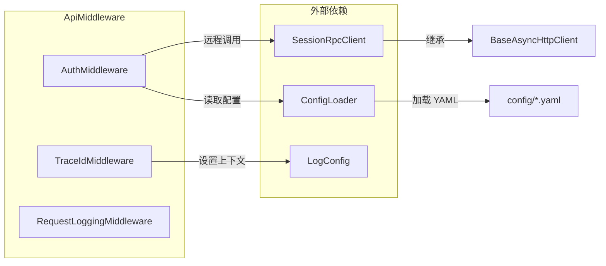
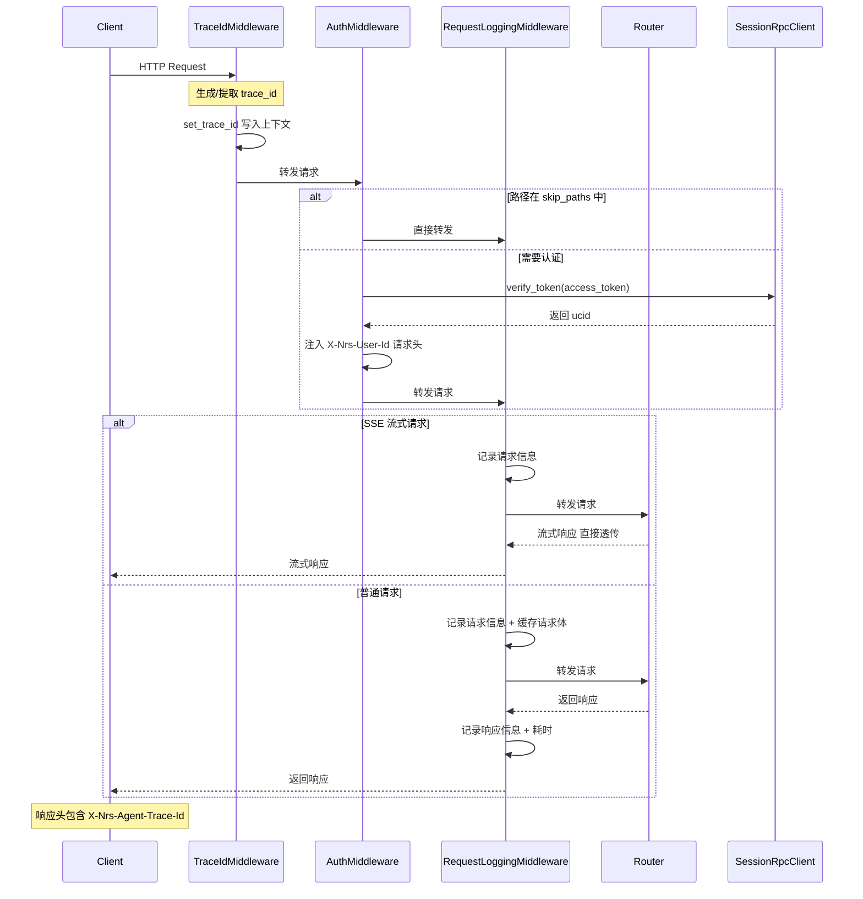
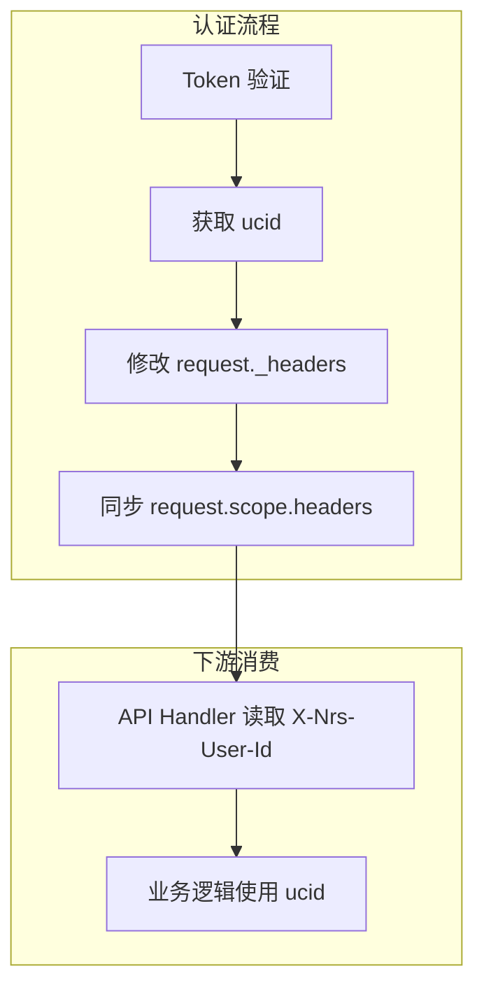
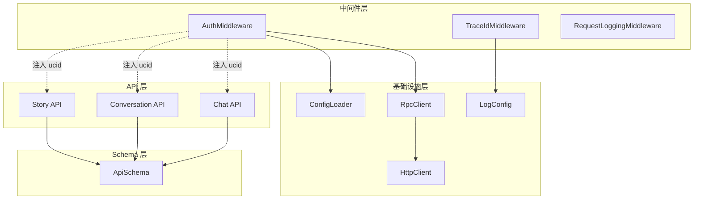

# ApiMiddleware 模块文档

## 模块概述

ApiMiddleware 是基于 Starlette ASGI 框架构建的 HTTP 请求处理中间件层，位于 API 路由处理器之前，为所有进入系统的 HTTP 请求提供统一的横切关注点处理。该模块包含三个中间件组件，分别负责 **请求认证**、**请求日志记录** 和 **链路追踪 ID 生成**，三者协同构成完整的请求预处理管线。

模块的核心设计目标：
- **安全性**：通过 Token 验证确保只有合法用户可访问受保护的 API
- **可观测性**：通过日志记录和 TraceId 实现请求全链路追踪
- **流式兼容**：日志和 TraceId 中间件采用纯 ASGI 实现，避免 `BaseHTTPMiddleware` 与 SSE（Server-Sent Events）流式响应的兼容性问题

## 架构总览

中间件按以下顺序执行（从外到内）：

1. **TraceIdMiddleware** — 最先执行，生成或提取 TraceId 并注入日志上下文
2. **AuthMiddleware** — 校验用户身份，将 `ucid` 注入请求头
3. **RequestLoggingMiddleware** — 记录完整的请求/响应日志

## 核心组件详解

### TraceIdMiddleware

**文件路径**：`api/middlewares/trace_id.py`

**实现方式**：纯 ASGI 中间件（直接实现 `__call__` 协议）

**职责**：为每个 HTTP 请求生成全局唯一的追踪标识符，贯穿请求处理全生命周期。

#### 处理流程

#### 关键设计

| 特性 | 说明 |
|------|------|
| TraceId 传递 | 优先使用客户端传入的 `X-Nrs-Agent-Trace-Id` 头，否则自动生成 UUID |
| 日志上下文集成 | 通过 `contextvars` 实现的 `set_trace_id()` 将 TraceId 绑定到当前协程，确保同一线程/协程内所有日志自动携带该 ID |
| 响应回写 | 包装 `send` 函数，在 `http.response.start` 阶段将 TraceId 追加到响应头，便于客户端关联请求 |
| SSE 兼容 | 仅操作 scope 和 send 包装，不缓存响应体，对流式响应零影响 |

### AuthMiddleware

**文件路径**：`api/middlewares/auth.py`

**实现方式**：继承 `BaseHTTPMiddleware`（Starlette 提供的高层抽象）

**职责**：验证请求身份的合法性，将用户标识（`ucid`）注入请求头供下游使用。

#### 处理流程

#### 关键设计

| 特性 | 说明 |
|------|------|
| Token 来源 | 从 `Lianjia-Access-Token` 请求头提取 |
| 认证绕过 | 通过 `config.auth.skip_paths` 配置无需认证的路径前缀（如健康检查端点） |
| 开发便利性 | test/dev 环境下支持直接通过 `X-Nrs-User-Id` 头传入用户 ID，跳过 Token 验证 |
| 身份注入 | 验证成功后通过修改 `request._headers`（Starlette 私有属性）将 ucid 注入请求头，下游路由可通过 `X-Nrs-User-Id` 获取当前用户 |
| Token 验证 | 调用 [RpcClient](RpcClient.md) 模块的 `SessionRpcClient.verify_token()` 远程验证 Token 有效性 |

#### 环境差异行为

| 环境 | 无 Token 时的行为 |
|------|------------------|
| test / dev | 允许通过 `X-Nrs-User-Id` 头直接指定用户 |
| 其他环境（preview/prod） | 必须提供有效 Token，否则返回 401 |

### RequestLoggingMiddleware

**文件路径**：`api/middlewares/logging.py`

**实现方式**：纯 ASGI 中间件

**职责**：记录完整的请求和响应信息，用于调试和审计。

#### 处理流程

#### 请求日志内容

| 字段 | 来源 | 说明 |
|------|------|------|
| method | `scope["method"]` | HTTP 方法 |
| path | `scope["path"]` | 请求路径 |
| query_string | `scope["query_string"]` | 查询参数 |
| headers | `scope["headers"]` | 请求头（已过滤 authorization、cookie） |
| body | `receive` 包装 | POST/PUT/PATCH 的 JSON 请求体 |

#### 响应日志内容

| 字段 | 来源 | 说明 |
|------|------|------|
| status_code | `http.response.start` | HTTP 状态码 |
| duration_ms | 计算值 | 请求处理耗时（毫秒） |
| body | `http.response.body` 缓存 | JSON 响应体 |

#### SSE 兼容性设计

对于流式请求（路径以 `/stream` 结尾或 Accept 为 `text/event-stream`），中间件采用**单向透传**策略：
- **请求阶段**：记录请求信息（方法、路径、头、体）
- **响应阶段**：直接透传，不缓存响应体，避免内存溢出和流式延迟

## 依赖关系

| 中间件 | 依赖模块 | 依赖方式 | 用途 |
|--------|---------|---------|------|
| AuthMiddleware | [RpcClient](RpcClient.md) | `session_client.verify_token()` | Token 远程验证 |
| AuthMiddleware | [ConfigLoader](ConfigLoader.md) | `config.auth.skip_paths` | 读取免认证路径 |
| TraceIdMiddleware | [LogConfig](LogConfig.md) | `set_trace_id()` | 将 TraceId 写入日志上下文 |
| RequestLoggingMiddleware | loguru | `logger.info()` | 输出结构化日志 |

## 请求处理时序

## 设计模式与关键决策

### 两种 ASGI 实现模式并存

模块中存在两种中间件实现方式，各有其适用场景：

| 实现方式 | 使用者 | 优点 | 缺点 |
|---------|--------|------|------|
| `BaseHTTPMiddleware` | AuthMiddleware | 开发简单，可直接访问 `Request`/`Response` 对象 | 会缓存整个响应体，与 SSE 不兼容 |
| 纯 ASGI 协议 | TraceIdMiddleware、RequestLoggingMiddleware | 完全控制请求/响应生命周期，SSE 友好 | 实现复杂，需手动处理 scope/receive/send |

**决策原因**：AuthMiddleware 仅操作请求头（不涉及响应体缓存），使用 `BaseHTTPMiddleware` 不会导致 SSE 问题；而日志和 TraceId 需要处理响应，必须使用纯 ASGI 以避免阻塞流式传输。

### 认证身份传递机制

AuthMiddleware 通过修改 Starlette 的私有属性 `_headers` 实现请求头注入。这是一种必要的 hack——Starlette 的 `Headers` 对象设计为不可变，标准中间件 API 无法直接修改传入请求的头部。修改 `_headers` 后还需同步更新 `scope["headers"]` 的字节编码格式，确保 ASGI 应用层能正确读取。

### 环境感知的安全策略

AuthMiddleware 通过 `ENVTYPE` 环境变量实现多环境安全策略差异化：
- **生产环境**：严格 Token 验证，无降级路径
- **开发/测试环境**：支持通过 Header 直接传入用户 ID，简化调试流程

该策略的实现位于中间件的 Token 提取阶段，在 Token 缺失时根据环境类型选择不同的降级逻辑。

## 与系统其他模块的关系

中间件作为请求处理管线的前置环节，不直接参与业务逻辑，但通过以下方式影响下游：
- **AuthMiddleware**：通过 `X-Nrs-User-Id` 请求头向 [ApiSchema](ApiSchema.md) 层和业务路由传递用户身份
- **TraceIdMiddleware**：通过日志上下文变量关联同一请求的所有日志记录
- **RequestLoggingMiddleware**：提供请求级的审计日志，辅助问题排查

## 配置项

| 配置路径 | 所属模块 | 说明 |
|---------|---------|------|
| `config.auth.skip_paths` | ConfigLoader | 免认证路径列表（如健康检查、文档端点） |
| `config.rpc.session.base_url` | ConfigLoader | Session 服务地址，用于 Token 验证 |
| `config.rpc.session.source` | ConfigLoader | Token 验证请求来源标识 |
| `config.rpc.session.signature` | ConfigLoader | Token 验证请求签名 |
| `ENVTYPE` 环境变量 | 系统 | 当前环境类型（test/preview/prod），影响认证降级策略 |
