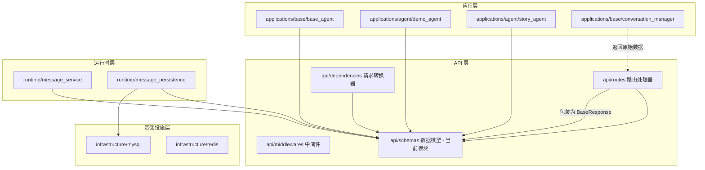
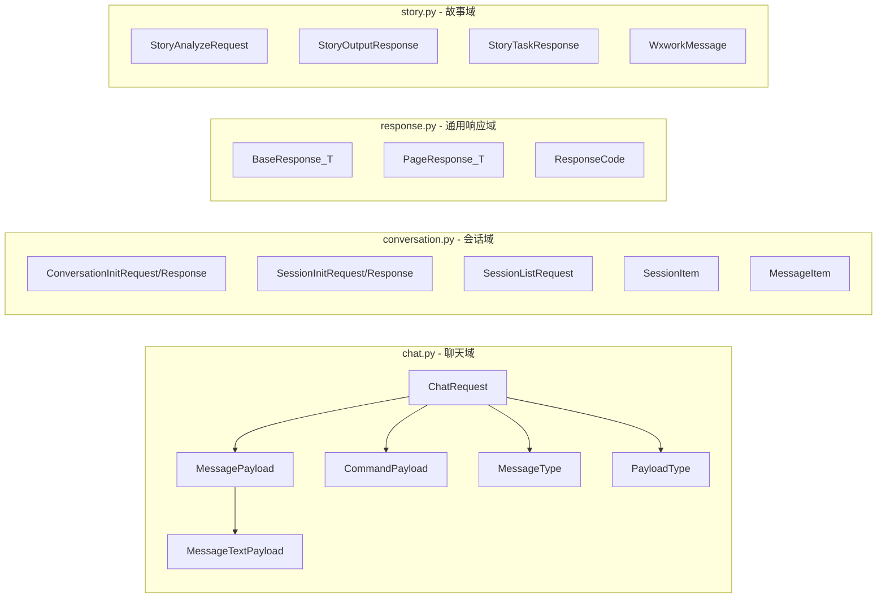
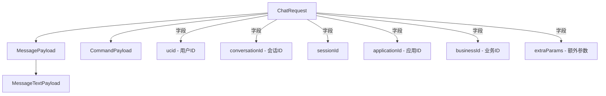
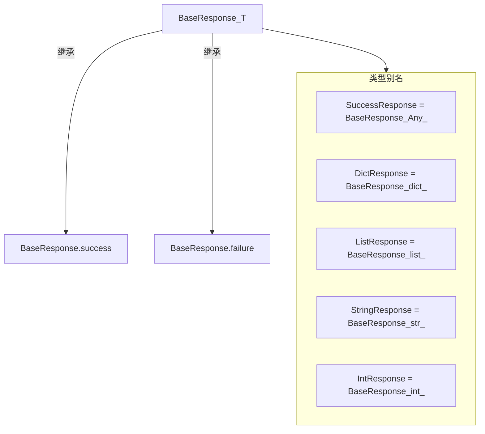
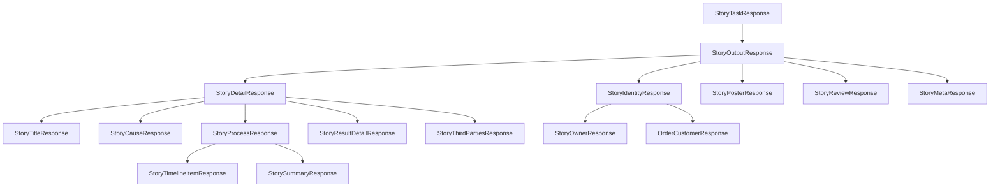
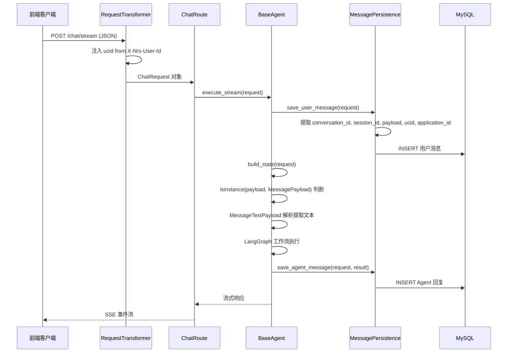
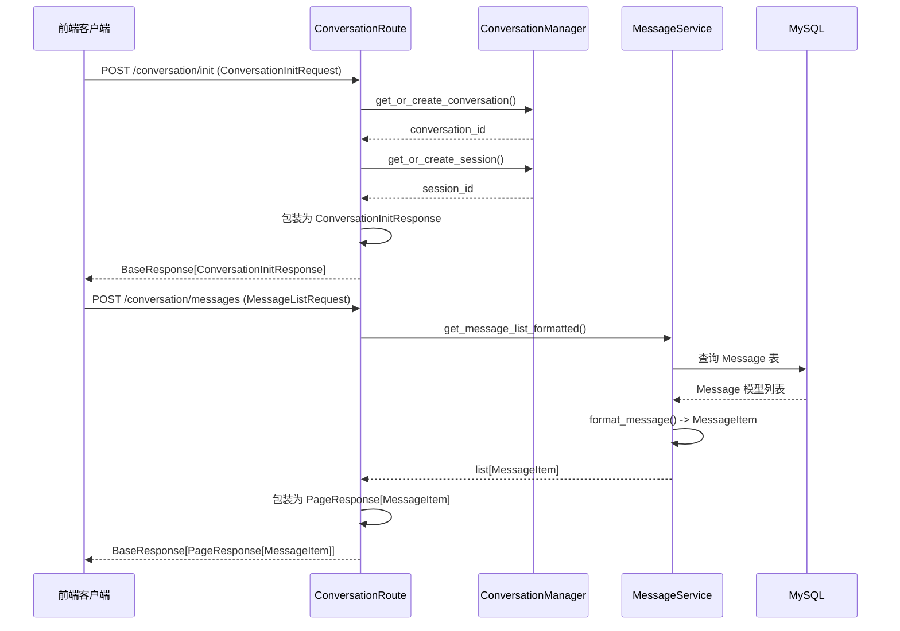
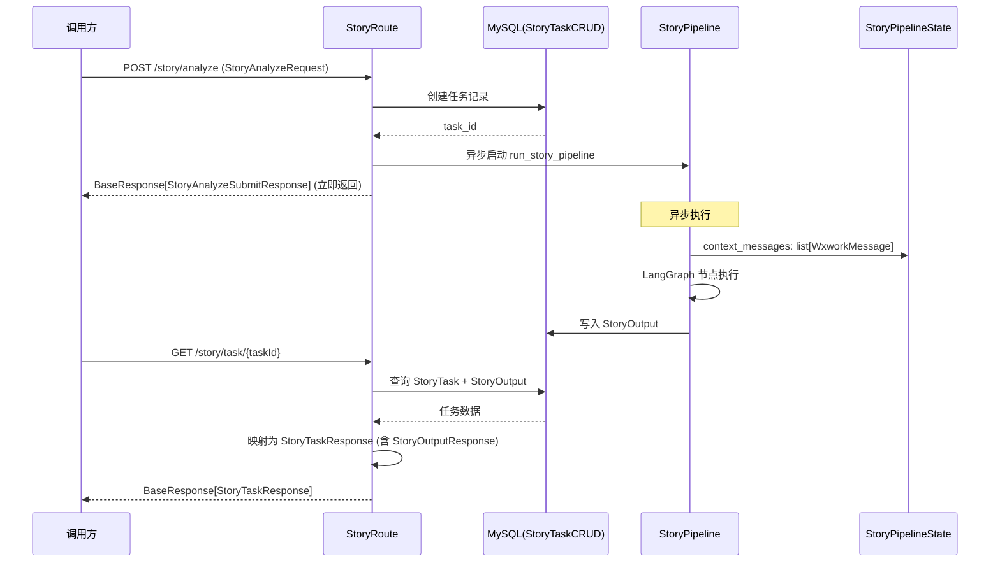

# ApiSchema 模块文档

## 1. 模块概述

ApiSchema 是 AIGC Agent 系统的 **API 数据契约层**，定义了 HTTP 层与业务逻辑层之间所有的请求、响应数据模型。基于 Pydantic BaseModel 实现，承担请求校验、序列化/反序列化、统一响应封装三大职责。

模块包含四个子文件，分别覆盖不同的业务域：

| 文件 | 职责 | 核心组件 |
|------|------|---------|
| `chat.py` | 聊天接口请求/响应模型 | `ChatRequest`, `MessagePayload`, `CommandPayload`, `MessageType`, `PayloadType` |
| `conversation.py` | 会话与消息列表模型 | `ConversationInitRequest/Response`, `SessionItem`, `MessageItem` |
| `response.py` | 统一响应封装与分页模型 | `BaseResponse[T]`, `PageResponse[T]`, `ResponseCode` |
| `story.py` | 故事分析业务的完整请求/响应模型 | `StoryAnalyzeRequest`, `StoryOutputResponse`, `StoryTaskResponse` 等 20+ 模型 |

**核心设计原则**：所有 Schema 只依赖 Pydantic 和 Python 标准库，不反向依赖任何 runtime、infrastructure 或 application 层代码，形成干净的单向依赖关系。

---

## 2. 架构与组件关系

### 2.1 模块在系统中的位置



> 相关模块文档：[ApiMiddleware](ApiMiddleware.md)（请求拦截链）、[ApplicationBase](ApplicationBase.md)（Agent 执行引擎）、[MessageRuntime](MessageRuntime.md)（消息持久化）

### 2.2 四文件职责划分



---

## 3. 核心组件详解

### 3.1 聊天请求模型 (`chat.py`)

#### 枚举类型

| 枚举 | 值 | 说明 |
|------|---|------|
| `PayloadType` | `MESSAGE` / `COMMAND` | 区分普通消息与系统命令 |
| `MessageType` | `TEXT` / `IMAGE` | 消息内容类型，`TEXT` 对应常量 `MESSAGE_TEXT` |

#### 请求模型层次



**ChatRequest** 是整个系统中最核心的数据模型，贯穿从 HTTP 请求到 Agent 执行再到消息持久化的全链路：

| 字段 | 类型 | 别名 | 说明 |
|------|------|------|------|
| `ucid` | `int` | - | 用户唯一标识，从请求头 `X-Nrs-User-Id` 注入 |
| `conversation_id` | `int` | `conversationId` | 会话 ID |
| `session_id` | `int` | `sessionId` | 会话 Session ID |
| `business_id` | `str` | `businessId` | 业务线标识，默认空字符串 |
| `application_id` | `int` | `applicationId` | 应用 ID |
| `payload` | `MessagePayload \| CommandPayload` | - | 请求载荷，联合类型 |
| `extra_params` | `dict \| None` | `extraParams` | 额外扩展参数 |

**Payload 联合类型**设计：`payload` 字段支持两种模式——`MessagePayload`（普通消息，含 `messageType` + 具体 payload）和 `CommandPayload`（系统命令，含 `commandType` + 具体 payload）。FastAPI 在路由层通过 `request_transformer` 依赖进行自动类型转换。

**Pydantic 配置**：`ChatRequest` 启用 `populate_by_name=True`（同时接受 snake_case 和 camelCase）和 `extra="ignore"`（忽略未定义字段），确保前后端字段命名兼容且接口向前兼容。

#### 错误响应

`ChatErrorResponse` 模型包含 `error`（错误类型）、`message`（错误消息）、`detail`（错误详情，可选）三个字段，用于聊天接口的结构化错误返回。

### 3.2 会话与消息模型 (`conversation.py`)

#### 请求模型

| 模型 | 用途 | 关键字段 |
|------|------|---------|
| `ConversationInitRequest` | 初始化会话 | `applicationId`, `extParam` |
| `SessionInitRequest` | 初始化 Session | `conversationId`, `extParam` |
| `SessionListRequest` | 分页查询 Session 列表 | `conversationId`, `currentPage`(>=1), `pageSize`(1-100) |

#### 响应模型

| 模型 | 用途 | 关键字段 |
|------|------|---------|
| `ConversationInitResponse` | 会话初始化结果 | `conversationId`, `sessionId`, `isFirstConversation`, `isFirstSession` |
| `SessionInitResponse` | Session 初始化结果 | `sessionId` |
| `SessionItem` | Session 列表项 | `sessionId`, `title`, `isSelected`, `lastUpdateTime`, `extra` |
| `MessageItem` | 消息列表项 | `id`, `sequence`, `fromUserId`, `toUserId`, `messageType`, `messagePayload`, `status`, `position`, `sendTime` |

**MessageItem** 是消息列表查询的核心返回模型，`position` 字段标识消息来源：`application` 表示应用发送，`user` 表示用户发送。`messagePayload` 使用 `dict[str, Any]` 类型承载异构消息内容。

### 3.3 统一响应封装 (`response.py`)

#### BaseResponse 泛型模型



| 字段 | 类型 | 说明 |
|------|------|------|
| `code` | `int` | 状态码，`ResponseCode.SUCCESS=2000` / `ResponseCode.FAILURE=7000` |
| `message` | `str` | 响应消息 |
| `data` | `T \| None` | 泛型数据载体 |

**工厂方法**：
- `BaseResponse.success(data, message)` — 创建成功响应（默认 code=2000, message="操作成功"）
- `BaseResponse.failure(message, data)` — 创建失败响应（默认 code=7000）

#### PageResponse 分页模型

| 字段 | 别名 | 说明 |
|------|------|------|
| `total` | - | 总条目数 |
| `start_index` | `startIndex` | 起始索引 |
| `total_page` | `totalPage` | 总页数 |
| `page_size` | `pageSize` | 每页数量 |
| `is_more` | `isMore` | 是否有更多数据（0/1） |
| `current_page` | `currentPage` | 当前页码 |
| `list` | - | 泛型数据列表 |
| `title` | - | 标题（可选） |

`PageResponse.create(total, current_page, page_size, items)` 工厂方法自动计算 `total_page`、`start_index`、`is_more`，避免手工计算分页元数据。

### 3.4 故事分析模型 (`story.py`)

story.py 定义了故事分析业务的完整数据模型链，是 Schema 模块中体量最大的文件。

#### 请求模型

| 模型 | 用途 |
|------|------|
| `WxworkMessage` | 企微原始消息，字段使用中文别名（`群聊id`、`消息发送人`等），直接映射 SCRM 数据源 |
| `StoryAnalyzeRequest` | 故事分析提交请求，包含 `chatId`、`msgId`、`praiseTime`，提供 `group_id` / `batch_id` 属性 |

#### 响应模型层次



**StoryTaskResponse** 是任务查询的顶层响应，包含任务状态机（`PENDING` / `PROCESSING` / `COMPLETED` / `FAILED` / `SKIPPED`）和可选的 `StoryOutputResponse` 产出数据。

**StoryDetailResponse** 承载结构化故事内容，按故事叙事结构分解为：标题（`StoryTitleResponse`）、起因（`StoryCauseResponse`）、经过（`StoryProcessResponse`，含时间线和金句）、结果（`StoryResultDetailResponse`）、第三方信息（`StoryThirdPartiesResponse`），并附加评级（`level` / `levelReason`）和核心角色类型。

**StoryIdentityResponse** 处理身份归因，将故事主角（`StoryOwnerResponse`，含置信度和识别依据）与订单主客户（`OrderCustomerResponse`）关联。

**WxworkMessage** 是一个特殊模型——其字段别名使用中文（如 `alias="群聊id"`），直接对接企微 SCRM 系统的原始数据格式，通过 Pydantic 的 `populate_by_name=True` 实现中英文字段双映射。

---

## 4. 依赖关系

### 4.1 出站依赖（被依赖方）

ApiSchema 模块仅依赖：
- **pydantic** — `BaseModel`, `ConfigDict`, `Field`, `field_validator` 等
- **Python 标准库** — `enum.Enum`, `typing`, `datetime`

不依赖任何系统内部模块，是依赖图的叶节点。

### 4.2 入站依赖（依赖方）

```mermaid
graph TD
    subgraph Consumers[依赖方]
        ChatRoute[api/routes/chat.py]
        ConvRoute[api/routes/conversation.py]
        StoryRoute[api/routes/story.py]
        ReqTransformer[api/dependencies/request_transformer]
        BaseAgent[applications/base/base_agent]
        DemoAgent[applications/agent/demo_agent/aigc_agent]
        StoryGraph[applications/agent/story_agent/graph]
        MsgService[runtime/message_service]
        MsgPersist[runtime/message_persistence]
    end

    subgraph SchemaFiles[ApiSchema 模块]
        Chat[chat.py]
        Conv[conversation.py]
        Resp[response.py]
        Story[story.py]
    end

    ChatRoute -->|ChatRequest ChatErrorResponse| Chat
    ReqTransformer -->|ChatRequest| Chat
    BaseAgent -->|ChatRequest MessagePayload MessageTextPayload MESSAGE_TEXT| Chat
    DemoAgent -->|ChatRequest MessageTextPayload| Chat
    MsgPersist -->|ChatRequest CommandPayload| Chat

    ConvRoute -->|ConversationInitRequest/Response SessionItem MessageItem| Conv
    MsgService -->|MessageItem| Conv

    ChatRoute -->|ChatErrorResponse| Resp
    ConvRoute -->|BaseResponse PageResponse| Resp
    StoryRoute -->|BaseResponse| Resp

    StoryRoute -->|StoryAnalyzeRequest StoryTaskResponse 等| Story
    StoryGraph -->|WxworkMessage| Story
```



**关键消费模式**：

| 消费方 | 使用方式 | 涉及 Schema |
|--------|---------|------------|
| `request_transformer` | 将 HTTP JSON 转换为 `ChatRequest`，注入 `ucid` | `ChatRequest` |
| `BaseAgent.execute_stream()` | 解析 payload 类型，提取用户问题文本 | `ChatRequest`, `MessagePayload`, `MessageTextPayload` |
| `MessagePersistence` | 从 `ChatRequest` 提取字段写入 MySQL | `ChatRequest`, `CommandPayload` |
| `MessageService` | 从数据库 `Message` 模型映射为 `MessageItem` | `MessageItem` |
| `ConversationManager` | 返回原始数据，由路由层包装为响应 Schema | `ConversationInitResponse`, `SessionItem` |
| 故事路由 | 接收请求，查询任务状态，返回结构化故事数据 | 全部 story.py 模型 |
| `StoryPipelineState` | 作为 LangGraph 状态的 `context_messages` 类型 | `WxworkMessage` |

---

## 5. 核心数据流

### 5.1 聊天请求全链路



### 5.2 会话初始化与消息查询



### 5.3 故事分析流程



---

## 6. 关键设计模式

### 6.1 Pydantic Alias 双命名映射

所有 Schema 统一使用 `alias` 实现 camelCase（JSON 字段名）与 snake_case（Python 属性名）的双向映射，配合 `populate_by_name=True` 同时接受两种命名：

```python
conversation_id: int = Field(..., alias="conversationId")
```

这使得：
- **前端**使用驼峰命名（`conversationId`）发送 JSON
- **后端**使用蛇形命名（`conversation_id`）操作对象
- **兼容性**：即使前端发 `conversation_id` 也能正常解析

### 6.2 Payload 联合类型与多态分发

`ChatRequest.payload` 使用 `MessagePayload | CommandPayload` 联合类型，在路由层通过 request_transformer 进行实际类型判断，在 Agent 层通过 `isinstance()` 进行多态分发。这种设计使聊天接口同时支持普通消息和系统命令，无需拆分路由。

### 6.3 泛型响应封装

`BaseResponse[T]` 和 `PageResponse[T_Item]` 通过 Python 泛型实现类型安全的响应封装：
- 工厂方法 `success()` / `failure()` / `create()` 封装常用构造逻辑
- 类型别名（`SuccessResponse`, `DictResponse` 等）简化常见场景的类型标注
- `ResponseCode` 常量类集中管理状态码，避免魔法数字

### 6.4 中文别名的 SCRM 数据桥接

`WxworkMessage` 使用中文字段别名（`alias="群聊id"`）直接对接企微 SCRM 数据源，避免额外的数据转换层。配合 `populate_by_name=True`，同一模型既能接收中文键的原始数据，也能在代码中使用英文属性名。

### 6.5 分层工厂方法

`PageResponse.create()` 自动计算分页元数据（总页数、起始索引、是否有更多），调用方只需传入总数、页码、每页数量和数据列表，降低了路由层的计算负担和出错概率。

---

## 7. 设计要点总结

| 设计要点 | 说明 |
|---------|------|
| **零内部依赖** | Schema 仅依赖 Pydantic 和标准库，是依赖图的叶节点 |
| **单向依赖** | runtime/applications 层依赖 Schema，Schema 不反向依赖 |
| **类型安全** | Pydantic BaseModel + 泛型确保运行时类型校验和 IDE 类型提示 |
| **前后端兼容** | alias 机制统一 camelCase JSON 与 snake_case Python |
| **业务域隔离** | 四个文件分别对应聊天、会话、通用响应、故事四个业务域 |
| **统一响应格式** | 所有 API 返回 `BaseResponse` 包装，状态码集中管理 |
