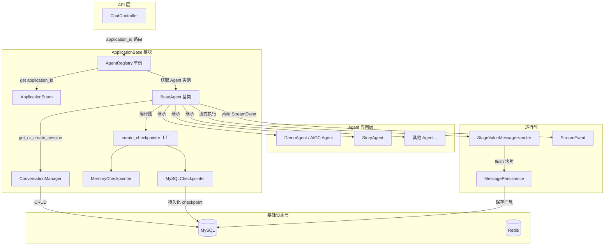
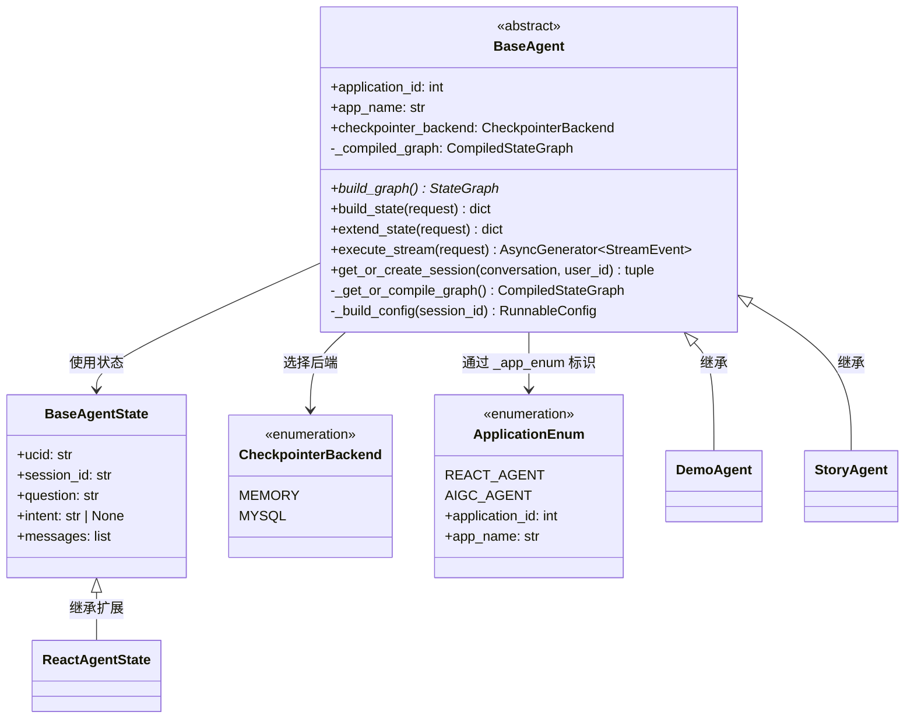
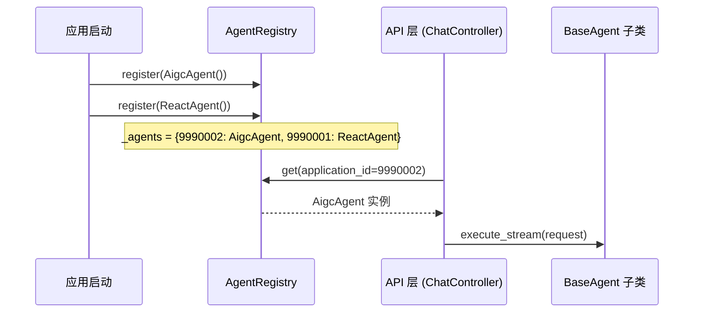
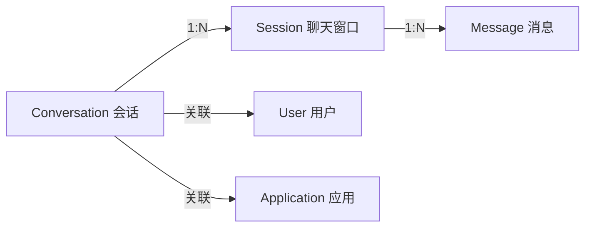
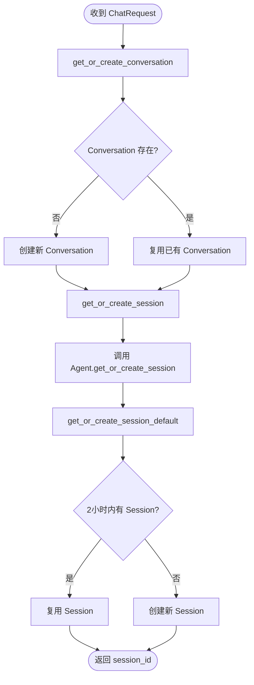
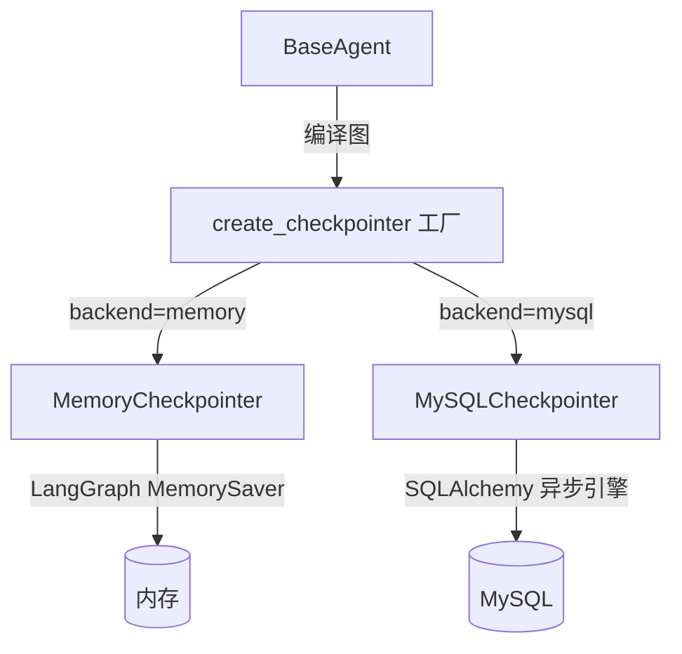
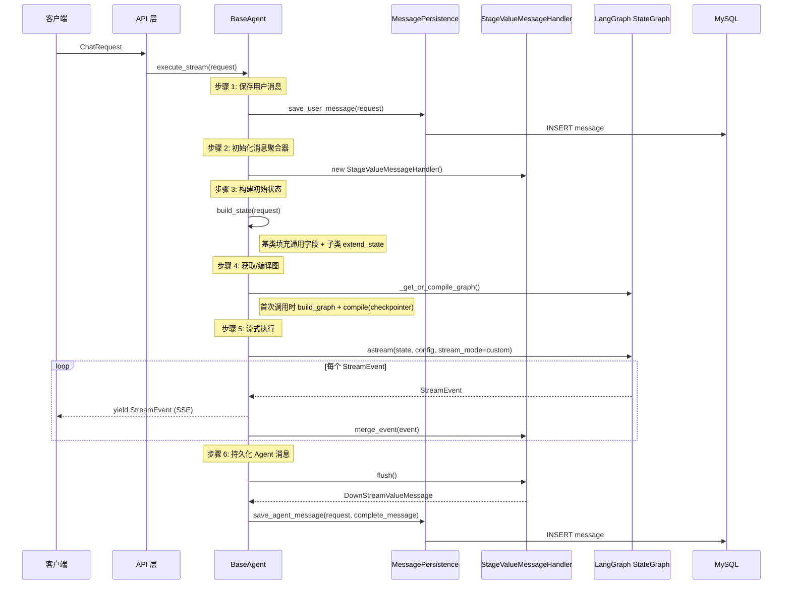
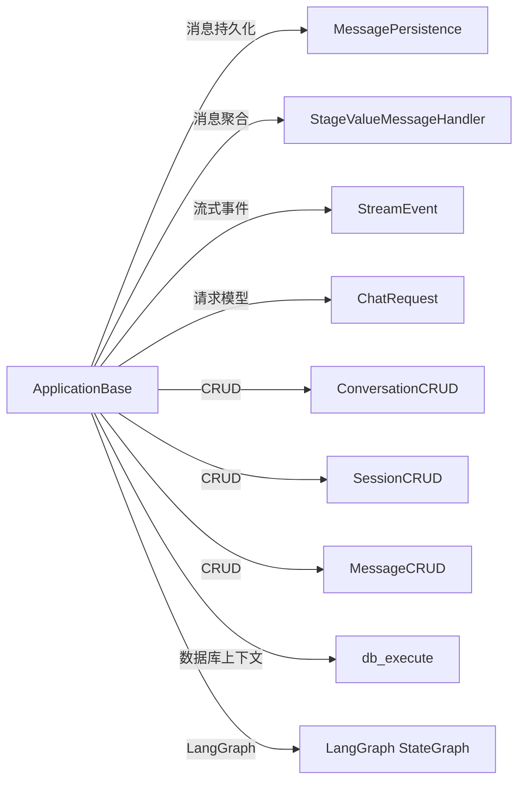

# ApplicationBase — Agent 应用基础框架

## 模块概述

ApplicationBase 是 AIGC Agent 系统的**核心基础设施模块**，为所有 Agent 应用提供统一的基类、会话管理、记忆持久化和应用注册能力。它是整个 Agent 体系的"骨架"——任何新的 Agent 应用只需继承 `BaseAgent`，实现 `build_graph()` 即可获得完整的会话管理、流式执行和消息持久化能力，无需重复编写基础设施代码。

### 核心职责

| 职责 | 关键类 | 说明 |
|------|--------|------|
| Agent 基类定义 | `BaseAgent`、`BaseAgentState` | 统一的生命周期、状态管理和 LangGraph 编排 |
| 应用标识枚举 | `ApplicationEnum` | 为每个 Agent 分配唯一 application_id |
| 应用注册路由 | `AgentRegistry` | 根据 application_id 路由到对应 Agent 实例 |
| 会话生命周期 | `ConversationManager` | Conversation/Session 的创建、复用、分页查询 |
| 记忆持久化 | `MemoryCheckpointer`、`MySQLCheckpointer` | LangGraph checkpoint 的多后端存储 |

---

## 架构总览



---

## 核心组件详解

### 1. BaseAgent — Agent 基类

`BaseAgent` 是整个框架的核心抽象类，定义了 Agent 应用的**完整生命周期**。所有 Agent 必须继承此类。

#### 类图



#### 核心职责划分

| 方法 | 访问级别 | 子类行为 | 说明 |
|------|---------|---------|------|
| `build_graph()` | abstract | **必须实现** | 构建 LangGraph StateGraph（节点 + 边） |
| `extend_state(request)` | 可选覆盖 | 返回自定义字段 | 基类自动合并通用字段（ucid/session_id/question） |
| `execute_stream(request)` | 基类实现 | 通常不覆盖 | 完整的流式执行管道（保存消息→构建状态→执行图→持久化） |
| `get_or_create_session()` | 可选覆盖 | 自定义 Session 逻辑 | 默认 2 小时时间窗口复用 Session |

#### 子类开发协议

一个新 Agent 只需完成以下步骤：

1. **定义 State**（继承 `BaseAgentState`）
2. **定义枚举值**（在 `ApplicationEnum` 中新增条目）
3. **继承 `BaseAgent`**，设置 `_app_enum`
4. **实现 `build_graph()`**，定义节点和边
5. **可选**：实现 `extend_state()` 返回自定义状态字段
6. **在启动时注册**：`agent_registry.register(MyAgent())`

---

### 2. ApplicationEnum — 应用标识枚举

为系统中每个 Agent 应用分配**全局唯一**的 `application_id`，同时携带应用名称等元信息。

| 枚举值 | application_id | 名称 |
|--------|---------------|------|
| `REACT_AGENT` | 9990001 | REACT AGENT |
| `AIGC_AGENT` | 9990002 | AIGC AGENT |

#### 关键方法

- `get_by_id(application_id) -> ApplicationEnum | None`：反向查询，根据 ID 获取枚举实例
- `is_valid(application_id) -> bool`：校验 ID 是否合法

> [!NOTE]
> ApplicationEnum 是系统的应用路由基础——API 层通过 `application_id` 路由请求到正确的 Agent 实例，AgentRegistry 和 ConversationManager 都依赖此枚举。

---

### 3. AgentRegistry — Agent 注册中心

**全局单例**，维护 `application_id -> BaseAgent 实例` 的映射表，是 API 层到 Agent 实例的**唯一路由中枢**。

#### 注册与路由流程



#### 接口清单

| 方法 | 说明 |
|------|------|
| `register(agent)` | 注册 Agent 实例，校验是否继承 BaseAgent |
| `get(application_id)` | 根据 ID 获取实例，未注册抛 KeyError |
| `is_valid(application_id)` | 判断 ID 是否已注册 |
| `get_all()` | 获取所有已注册 Agent 的副本 |
| `get_all_ids()` | 获取所有已注册的 application_id 列表 |
| `clear()` | 清空注册表（测试用途） |

---

### 4. ConversationManager — 会话管理器

负责 Conversation 和 Session 的**业务生命周期管理**，是 Agent 与持久化层之间的桥梁。

#### 数据模型关系



- **Conversation**：一个用户与一个 Agent 应用之间的长期对话记录
- **Session**：一次会话窗口，默认 2 小时内复用同一 Session
- **Message**：单条消息，关联到具体 Session

#### 会话管理流程



#### 核心方法

| 方法 | 说明 |
|------|------|
| `get_or_create_conversation(application_id, user_id)` | 获取或创建 Conversation，返回 `ConversationResult` |
| `get_or_create_session(application_id, conversation, user_id)` | 委托给 Agent 的 Session 策略 |
| `get_or_create_session_default(conversation_id, user_id, time_window_hours=2)` | 默认 2 小时窗口策略 |
| `get_session_list(conversation_id, current_page, page_size)` | 分页查询 Session 列表 |
| `init_session(conversation_id, user_id)` | 强制创建新 Session（取消旧 Session 选中状态） |

---

### 5. Checkpointer 持久化层

为 LangGraph 的 checkpoint 机制提供**可插拔的存储后端**，通过工厂方法 `create_checkpointer()` 创建。

#### 架构



#### 后端对比

| 特性 | MemoryCheckpointer | MySQLCheckpointer |
|------|-------------------|-------------------|
| 存储位置 | 进程内存 | MySQL 5.7+ 数据库 |
| 持久性 | 进程重启后丢失 | 永久持久化 |
| 性能 | 最快（零 I/O） | 受数据库延迟影响 |
| 序列化 | 无需序列化 | pickle + base64 |
| 适用环境 | 开发/测试 | 生产环境 |
| 外部依赖 | 无 | MySQL + SQLAlchemy |

#### MySQLCheckpointer 存储结构

`langgraph_checkpoints` 表结构：

| 字段 | 类型 | 说明 |
|------|------|------|
| `thread_id` | VARCHAR | 线程 ID（对应 session_id） |
| `checkpoint_id` | VARCHAR | checkpoint 唯一标识 |
| `checkpoint_data` | TEXT | 序列化的 checkpoint（base64 编码） |
| `metadata` | TEXT | 元数据（JSON 字符串） |
| `parent_checkpoint_id` | VARCHAR | 父 checkpoint ID（可选） |
| `ctime` | DATETIME | 创建时间 |

---

## 执行流程 — BaseAgent.execute_stream

`execute_stream()` 是 BaseAgent 中最核心的方法，它定义了从请求接收到流式响应完成的**完整执行管道**。



#### 关键设计要点

1. **消息实时推送 + 延迟持久化**：流式事件先 yield 给客户端（实时性），同时在内存中聚合（效率），流结束后一次性持久化（可靠性）
2. **通用字段与自定义字段分离**：`build_state()` 自动处理通用字段（ucid/session_id/question），子类只需通过 `extend_state()` 添加自定义字段
3. **图编译缓存**：`_get_or_compile_graph()` 首次调用时编译并缓存 CompiledStateGraph，后续直接复用
4. **Checkpointer 自动装配**：图编译时根据 `checkpointer_backend` 自动注入对应的 checkpointer 实现

---

## 依赖关系

### 上游依赖（本模块依赖）



| 依赖模块 | 依赖的类/接口 | 用途 |
|---------|-------------|------|
| [ChatMessage](ChatMessage.md) | `StreamEvent`、`StreamEventType` | 流式事件模型定义 |
| [ApiSchema](ApiSchema.md) | `ChatRequest`、`MessagePayload`、`MessageTextPayload` | 请求数据模型 |
| [Runtime: MessageRuntime](MessageRuntime.md) | `StageValueMessageHandler`、`MessagePersistence` | 消息聚合与持久化 |
| [MysqlPersistence](MysqlPersistence.md) | `ConversationCRUD`、`SessionCRUD`、`MessageCRUD`、`db_execute` | 数据库 CRUD 操作 |
| LangGraph | `StateGraph`、`CompiledStateGraph`、`MemorySaver`、`BaseCheckpointSaver` | 工作流编排引擎 |

### 下游依赖（依赖本模块的模块）

| 依赖方 | 使用的接口 | 用途 |
|-------|-----------|------|
| [DemoAgent](DemoAgent.md) | 继承 `BaseAgent`，使用 `BaseAgentState` | 实现具体的 Agent 业务逻辑 |
| [StoryAgent](StoryAgent.md) | 继承 `BaseAgent` | 故事生成 Agent |
| API 层 | `AgentRegistry.get()`、`ConversationManager` | 路由请求、管理会话 |

---

## 关键设计模式

### 1. 模板方法模式 (Template Method)

`BaseAgent.execute_stream()` 是典型的模板方法——定义了固定的执行骨架（保存消息→构建状态→编译图→流式执行→持久化），子类通过 `build_graph()` 和 `extend_state()` 两个钩子方法定制行为，无需重写整个流程。

```
execute_stream()          ← 基类定义，不可覆盖（模板方法）
  ├── build_state()       ← 基类实现通用字段
  │     └── extend_state()  ← 子类可选覆盖（钩子）
  ├── _get_or_compile_graph()
  │     └── build_graph()    ← 子类必须实现（抽象方法）
  └── astream()           ← 基类统一流式执行
```

### 2. 单例模式 (Singleton)

`AgentRegistry` 和 `LLMManager` 都采用单例模式，确保全局唯一实例：

- `AgentRegistry._instance`：应用级单例，维护全局 Agent 注册表
- `agent_registry = AgentRegistry()`：模块级全局变量，直接导出单例

### 3. 工厂方法模式 (Factory Method)

`create_checkpointer(backend)` 是工厂方法，根据字符串参数创建不同的 Checkpointer 实例：

```python
# 工厂路由逻辑
"memory" → MemoryCheckpointer.create()   # 内存实现
"mysql"  → MySQLCheckpointer.from_config() # MySQL 实例
其他     → MemoryCheckpointer.create()   # 回退默认
```

### 4. 策略模式 (Strategy)

`CheckpointerBackend` 枚举 + 工厂方法共同实现策略模式——BaseAgent 子类通过设置 `checkpointer_backend` 类属性选择存储策略，编译图时自动装配对应的 checkpointer，无需感知具体实现。

### 5. 注册表模式 (Registry)

`AgentRegistry` 实现注册表模式，解耦 Agent 的定义与使用：
- **注册端**：应用启动时注册所有 Agent 实例
- **使用端**：API 层根据 `application_id` 动态查找 Agent

---

## 模块文件结构

```
applications/base/
├── __init__.py                           # 导出 BaseAgent, BaseAgentState, CheckpointerBackend
├── application_enums.py                  # ApplicationEnum — 应用标识枚举
├── base_agent.py                         # BaseAgent — Agent 基类（核心）
├── checkpoint/
│   ├── __init__.py                       # 导出 create_checkpointer 工厂
│   ├── factory.py                        # create_checkpointer() 工厂方法
│   ├── memory.py                         # MemoryCheckpointer — 内存实现
│   └── mysql.py                          # MySQLCheckpointer — MySQL 实现（5.7+）
├── conversation/
│   └── conversation_manager.py           # ConversationManager — 会话管理器
└── registry/
    └── agent_registry.py                 # AgentRegistry — Agent 注册中心
```

---

## 扩展指南

### 新增 Agent 应用

```python
# 1. 在 application_enums.py 中添加枚举值
class ApplicationEnum(Enum):
    MY_AGENT = (9990003, "MY AGENT")

# 2. 定义自定义 State
class MyAgentState(BaseAgentState):
    custom_field: str

# 3. 继承 BaseAgent
class MyAgent(BaseAgent):
    _app_enum = ApplicationEnum.MY_AGENT
    checkpointer_backend = CheckpointerBackend.MYSQL

    async def build_graph(self):
        graph = StateGraph(MyAgentState)
        graph.add_node("process", self._process_node)
        graph.add_edge(START, "process")
        graph.add_edge("process", END)
        return graph

    async def extend_state(self, request):
        return {"custom_field": "value"}

    async def _process_node(self, state, config):
        # 业务逻辑...
        return {"custom_field": "processed"}

# 4. 注册（在应用启动时）
agent_registry.register(MyAgent())
```

### 新增 Checkpointer 后端

1. 在 `checkpoint/` 下创建新实现（如 `redis.py`），继承 `BaseCheckpointSaver`
2. 实现 `aget_tuple`、`aput`、`alist` 等异步方法
3. 在 `CheckpointerBackend` 枚举中添加新值
4. 在 `factory.py` 的 `create_checkpointer()` 中添加分支
