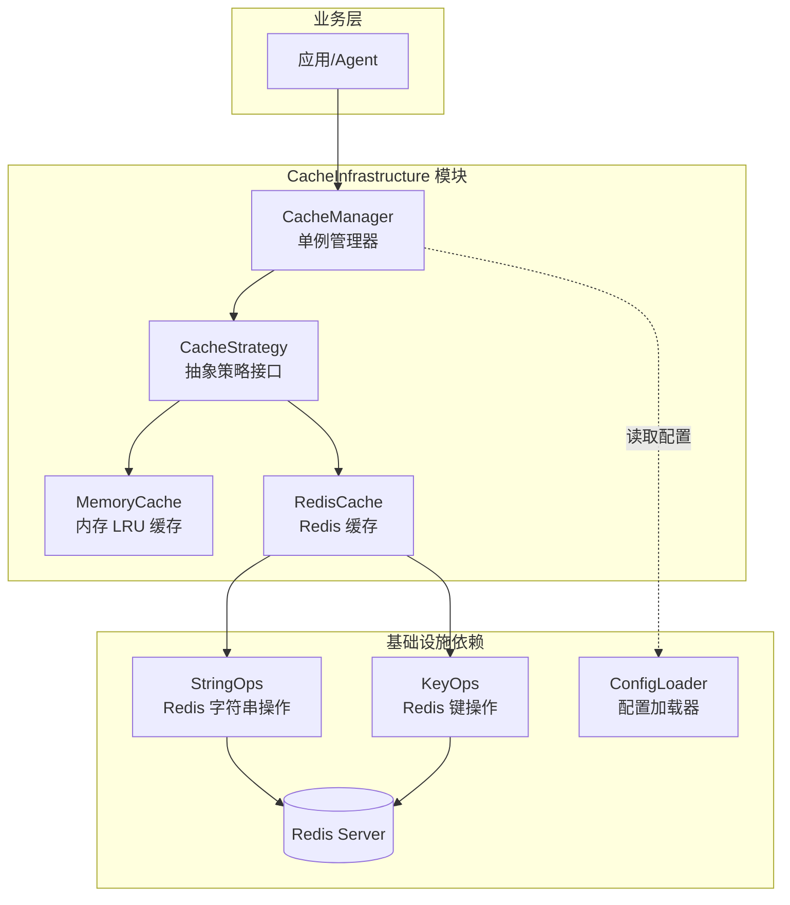
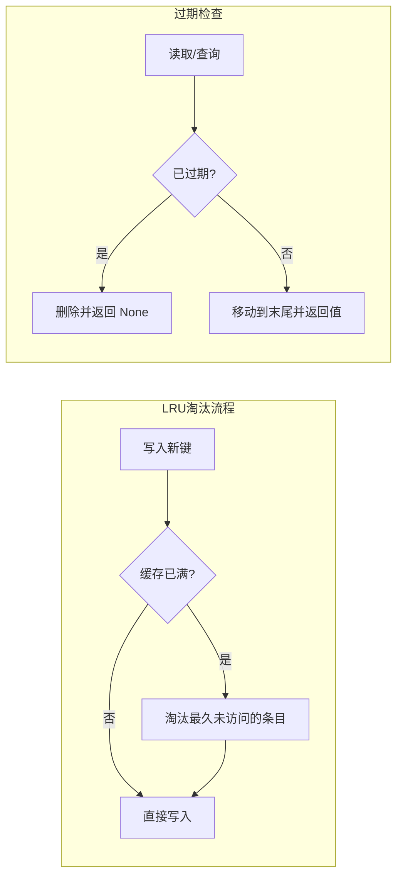
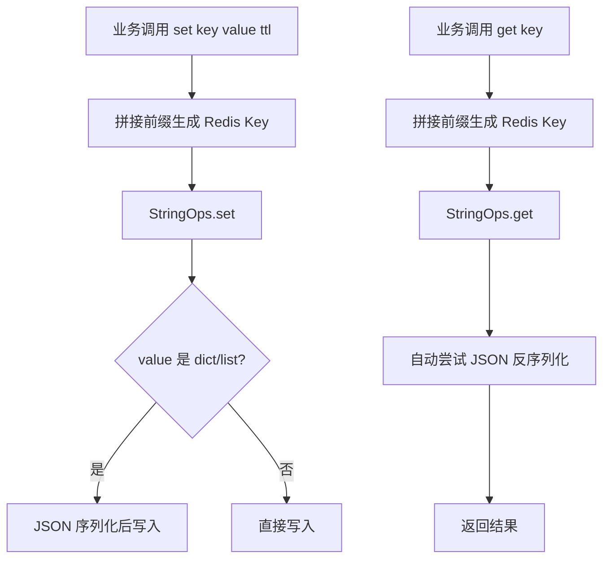
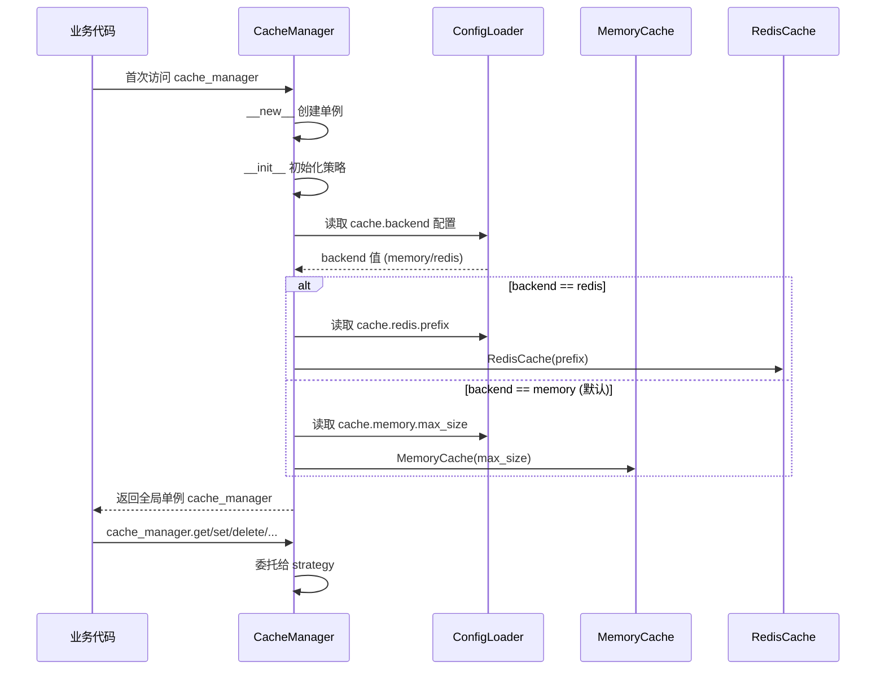
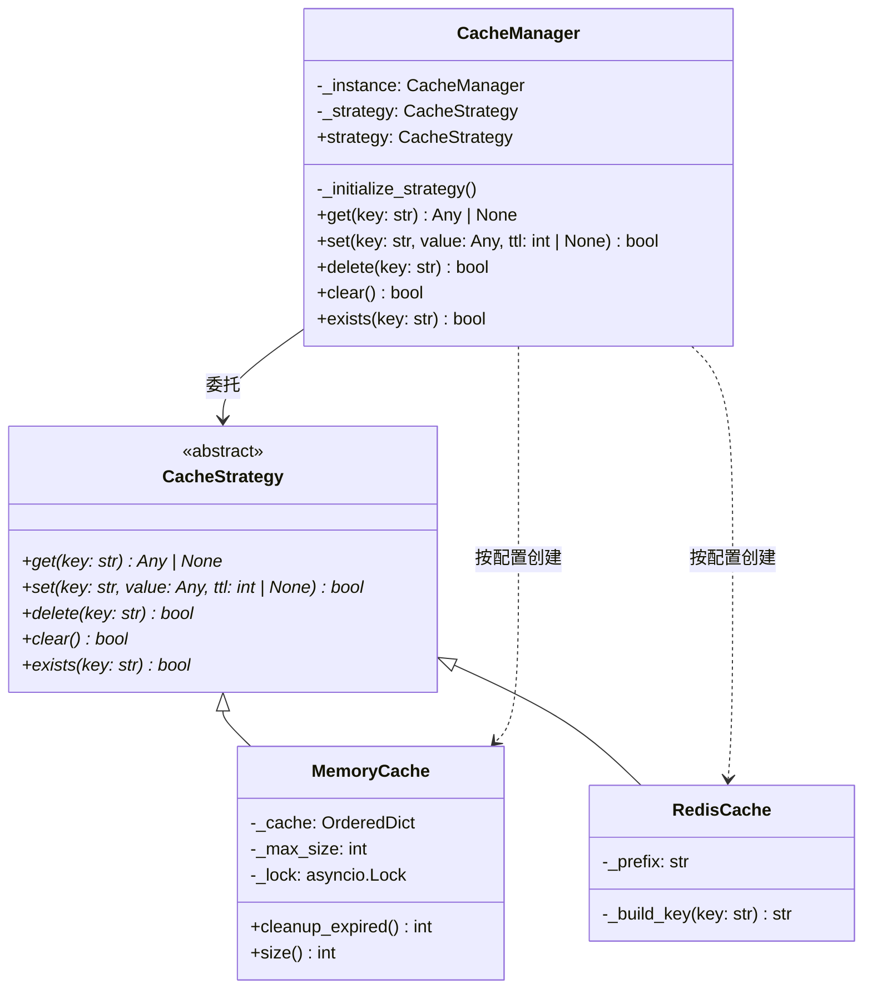
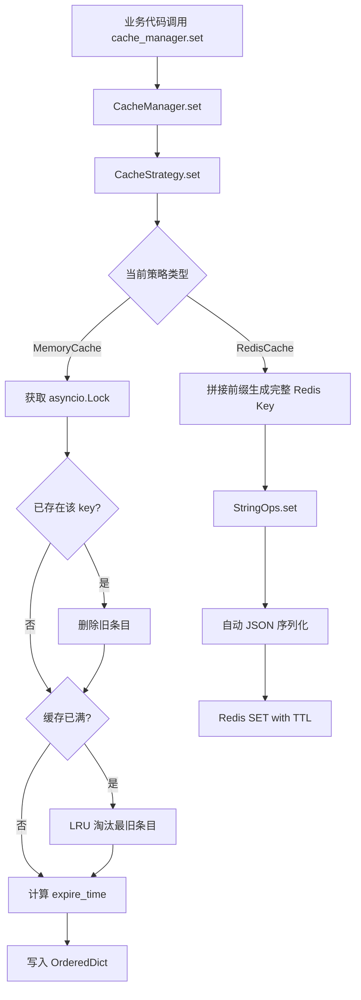
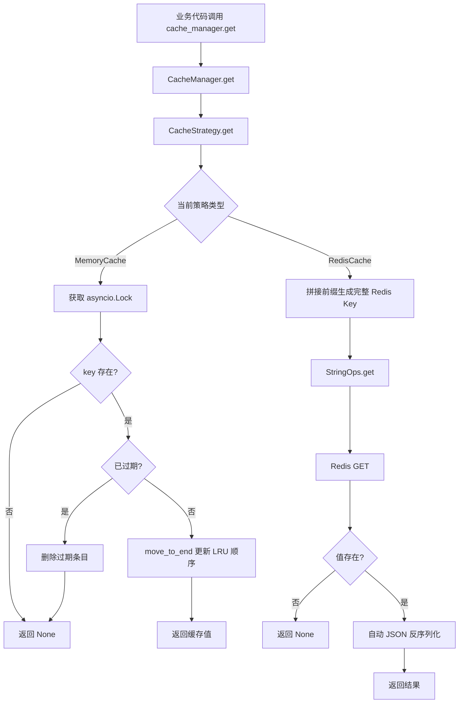
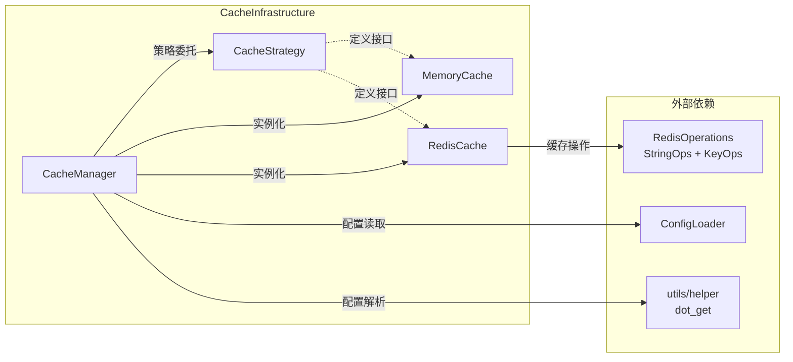

# CacheInfrastructure

## 模块概述

CacheInfrastructure 是 aigc-agent 系统的**缓存基础设施层**，为上层应用提供统一的缓存访问接口。模块采用**策略模式（Strategy Pattern）** 抽象缓存实现细节，支持运行时通过配置切换内存缓存或 Redis 缓存后端，对业务层完全透明。

核心职责：
- 定义统一的缓存操作抽象接口（`CacheStrategy`）
- 提供内存缓存（LRU + 异步过期检查）和 Redis 缓存两种实现
- 通过 `CacheManager` 单例根据 [ConfigLoader](ConfigLoader.md) 配置自动选择缓存后端
- 为 [RedisOperations](RedisOperations.md) 模块的 `StringOps`、`KeyOps` 提供高层缓存语义封装

## 架构总览



## 核心组件详解

### 1. CacheStrategy — 缓存策略抽象接口

**文件**: `infrastructure/cache/strategy.py`

`CacheStrategy` 是整个缓存模块的抽象基类，定义了所有缓存实现必须遵循的统一接口。采用 **ABC（Abstract Base Class）** 机制确保子类实现完整。

#### 接口契约

| 方法 | 签名 | 说明 |
|------|------|------|
| `get` | `async get(key: str) -> Any \| None` | 获取缓存值，不存在或已过期返回 `None` |
| `set` | `async set(key: str, value: Any, ttl: int \| None = None) -> bool` | 设置缓存值，`ttl` 为过期秒数，`None` 表示永不过期 |
| `delete` | `async delete(key: str) -> bool` | 删除指定键，返回是否成功 |
| `clear` | `async clear() -> bool` | 清空所有缓存 |
| `exists` | `async exists(key: str) -> bool` | 判断键是否存在 |

所有方法均为 `async`，确保接口在异步上下文中统一使用，无论底层是内存操作还是网络 I/O。

### 2. MemoryCache — 内存缓存实现

**文件**: `infrastructure/cache/impl/memory_cache.py`

基于 Python `collections.OrderedDict` 实现的进程内缓存，具备 **LRU（Least Recently Used）淘汰策略** 和 **异步过期检查**。

#### 核心机制



**关键设计细节**：

- **线程安全**：所有操作通过 `asyncio.Lock` 保护，支持并发异步访问
- **LRU 实现**：利用 `OrderedDict.move_to_end()` 在每次 `get` 时将访问项移到末尾，淘汰时通过 `popitem(last=False)` 移除最旧条目
- **过期机制**：惰性过期 — 在 `get`/`exists` 时检查，同时提供 `cleanup_expired()` 方法供后台定时任务主动清理
- **容量控制**：构造时指定 `max_size`（默认 1000），超出时自动触发 LRU 淘汰

#### 构造参数

| 参数 | 类型 | 默认值 | 说明 |
|------|------|--------|------|
| `max_size` | `int` | `1000` | 最大缓存条目数 |

#### 独有方法

| 方法 | 说明 |
|------|------|
| `cleanup_expired() -> int` | 清理所有已过期条目，返回清理数量。适合后台定时任务调用 |
| `size() -> int` | 获取当前缓存条目数量（同步方法） |

### 3. RedisCache — Redis 缓存实现

**文件**: `infrastructure/cache/impl/redis_cache.py`

基于 [RedisOperations](RedisOperations.md) 模块的 `StringOps` 和 `KeyOps` 实现的分布式缓存。自动处理 JSON 序列化/反序列化，支持键前缀隔离。

#### 核心机制



**关键设计细节**：

- **键前缀隔离**：所有缓存键自动添加前缀（默认 `agent:cache:`），避免与 Redis 中其他业务键冲突
- **JSON 自动序列化**：底层 `StringOps.set` 自动将 `dict`/`list` 序列化为 JSON 字符串；`StringOps.get` 自动尝试 JSON 反序列化
- **TTL 透传**：`set` 方法的 `ttl` 参数直接传递给 Redis 的 `ex` 参数，由 Redis 服务端管理过期
- **clear 实现**：通过前缀通配符 `KEYS` 命令匹配并删除所有缓存键

#### 构造参数

| 参数 | 类型 | 默认值 | 说明 |
|------|------|--------|------|
| `prefix` | `str` | `"agent:cache:"` | Redis 键前缀 |

#### 依赖关系

RedisCache 直接依赖 [RedisOperations](RedisOperations.md) 模块的两个操作类：

- **`StringOps`**：用于 `get`（读取）、`set`（写入，支持 TTL 和自动 JSON 序列化）
- **`KeyOps`**：用于 `delete`（删除单个键）、`exists`（判断存在）、`clear`（按前缀批量删除）

### 4. CacheManager — 缓存管理器

**文件**: `infrastructure/cache/manager.py`

`CacheManager` 是缓存模块的**门面（Facade）** 和**单例入口**，负责根据配置初始化具体的缓存策略，并对业务层暴露统一的异步缓存接口。

#### 单例与初始化流程



#### 配置项

配置通过 [ConfigLoader](ConfigLoader.md) 从 YAML 文件加载，支持点号路径访问：

| 配置路径 | 类型 | 默认值 | 说明 |
|----------|------|--------|------|
| `cache.backend` | `string` | `"memory"` | 缓存后端类型，`"memory"` 或 `"redis"` |
| `cache.memory.max_size` | `int` | `1000` | 内存缓存最大条目数 |
| `cache.redis.prefix` | `string` | `"agent:cache:"` | Redis 缓存键前缀 |

#### 代理方法

`CacheManager` 完全代理了 `CacheStrategy` 的五个核心方法（`get`、`set`、`delete`、`clear`、`exists`），业务代码通过全局实例 `cache_manager` 直接调用即可，无需关心底层实现。

#### 全局实例

模块在加载时自动创建全局单例：

```python
cache_manager = CacheManager()
```

业务代码直接 `from agent.infrastructure.cache.manager import cache_manager` 使用。

## 组件关系图



## 数据流

### 缓存写入流程



### 缓存读取流程



## 依赖关系



| 组件 | 依赖模块 | 依赖方式 |
|------|----------|----------|
| `CacheStrategy` | 无 | 纯抽象接口 |
| `MemoryCache` | `CacheStrategy` | 继承实现 |
| `RedisCache` | `CacheStrategy`、[RedisOperations](RedisOperations.md) | 继承实现 + 调用 `StringOps`/`KeyOps` |
| `CacheManager` | `CacheStrategy`、`MemoryCache`、`RedisCache`、[ConfigLoader](ConfigLoader.md) | 策略选择 + 配置读取 |

## 关键设计模式

### 1. 策略模式（Strategy Pattern）

模块的核心架构模式。`CacheStrategy` 定义统一接口，`MemoryCache` 和 `RedisCache` 分别提供不同实现，`CacheManager` 在运行时根据配置选择具体策略。业务代码面向 `CacheStrategy` 接口编程，切换缓存后端无需修改任何业务代码。

### 2. 单例模式（Singleton Pattern）

`CacheManager` 使用 `__new__` 实现单例，确保全局只有一个缓存管理器实例。配合模块级变量 `cache_manager`，所有业务代码共享同一实例和底层策略。

### 3. 门面模式（Facade Pattern）

`CacheManager` 封装了策略选择、配置读取、实例化等内部细节，对外只暴露简洁的五方法接口（`get`/`set`/`delete`/`clear`/`exists`）。调用方无需了解底层是内存缓存还是 Redis。

### 4. 惰性过期 vs 服务端过期

两种缓存实现采用不同的过期管理策略：

| 特性 | MemoryCache | RedisCache |
|------|-------------|------------|
| 过期管理 | 惰性检查（读取时判断）+ 主动清理（`cleanup_expired`） | 依赖 Redis 服务端 TTL 自动过期 |
| 内存占用 | 进程内，受 `max_size` 约束 | Redis 服务端，不受应用进程限制 |
| 持久性 | 进程重启丢失 | 依赖 Redis 持久化配置 |
| 并发安全 | `asyncio.Lock`（单进程） | Redis 原子操作（多进程/多服务） |

## 与其他模块的关系

| 相关模块 | 关系说明 |
|----------|----------|
| [ConfigLoader](ConfigLoader.md) | CacheManager 从 ConfigLoader 读取 `cache.*` 配置项决定使用哪种缓存后端 |
| [RedisOperations](RedisOperations.md) | RedisCache 依赖 `StringOps` 和 `KeyOps` 执行实际的 Redis 读写操作 |
| [ApplicationBase](ApplicationBase.md) | 应用层 Agent 可通过 `cache_manager` 缓存对话状态、工具调用结果等 |
| [LLMManager](LLMManager.md) | LLM 调用结果等频繁访问的数据适合通过缓存基础设施加速 |
