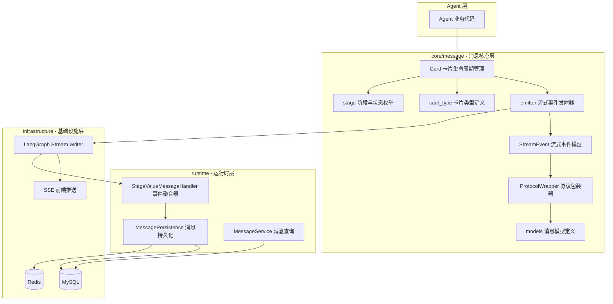
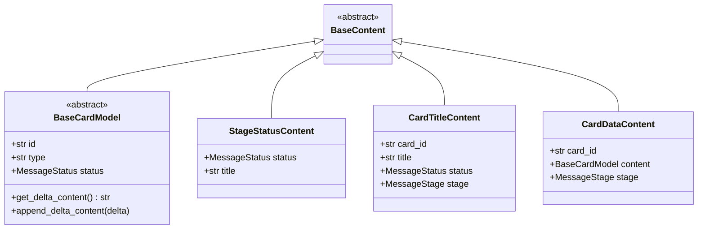
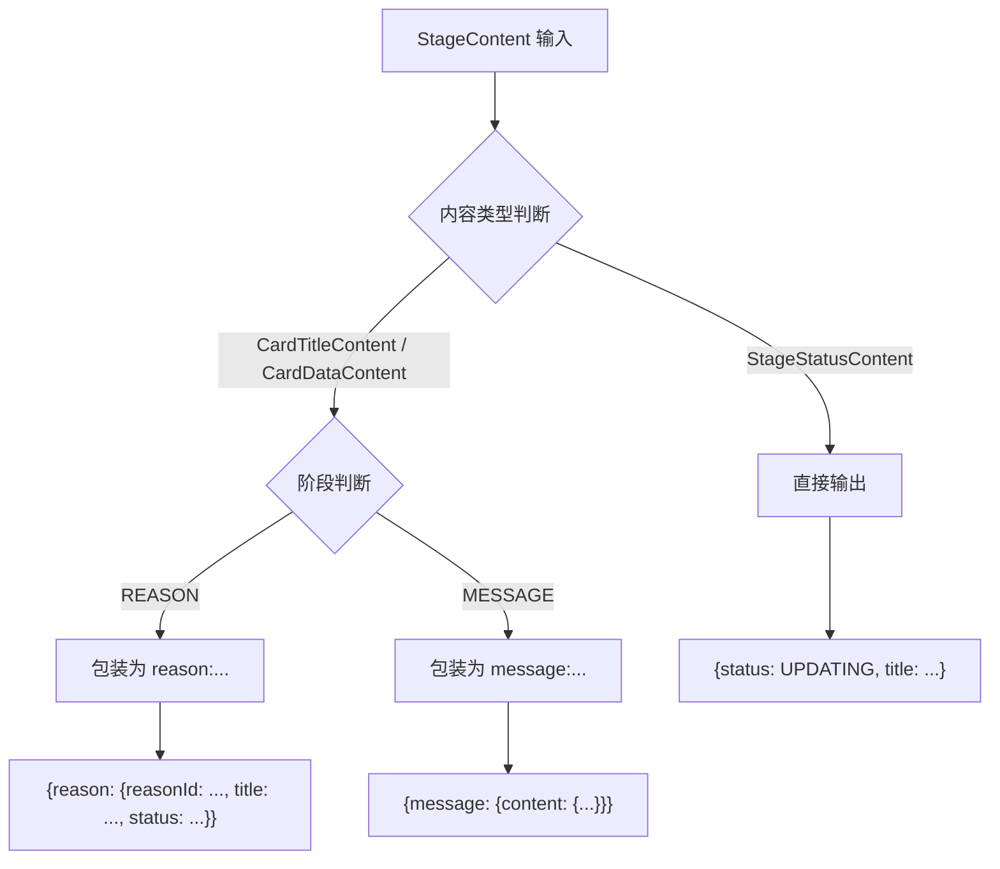
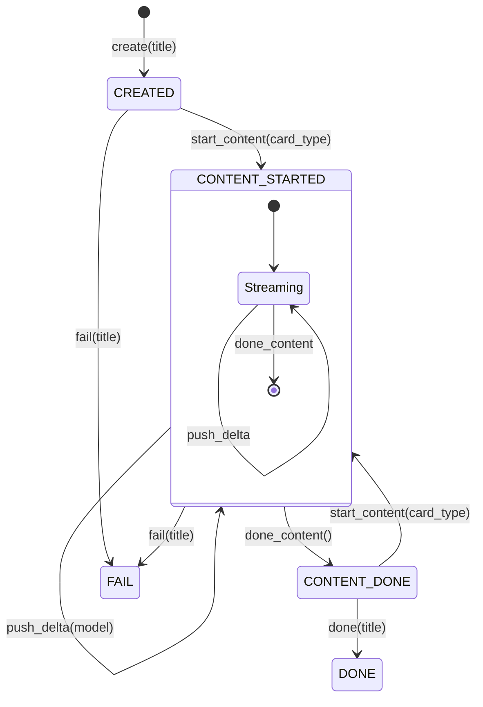
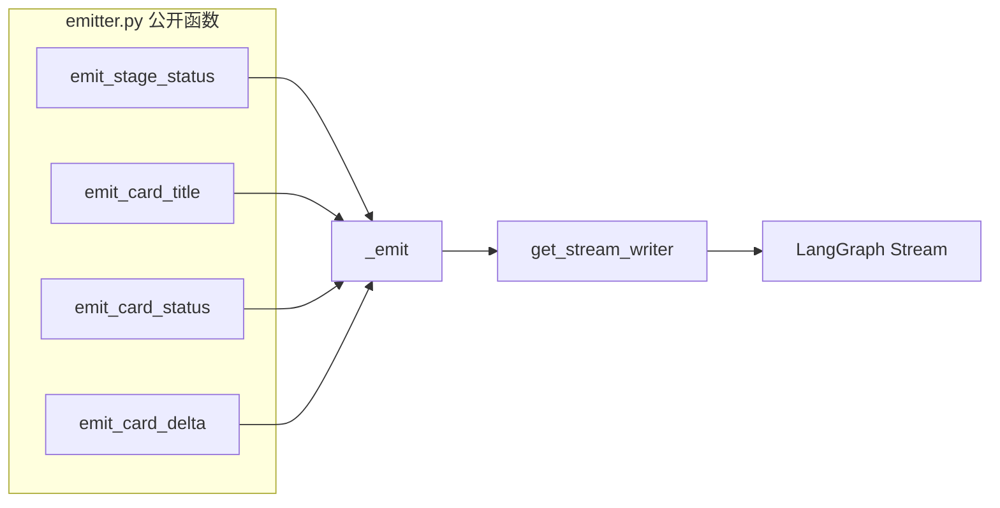
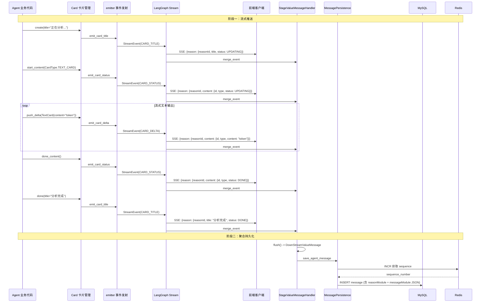
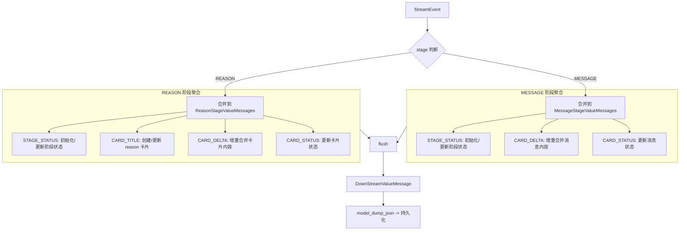
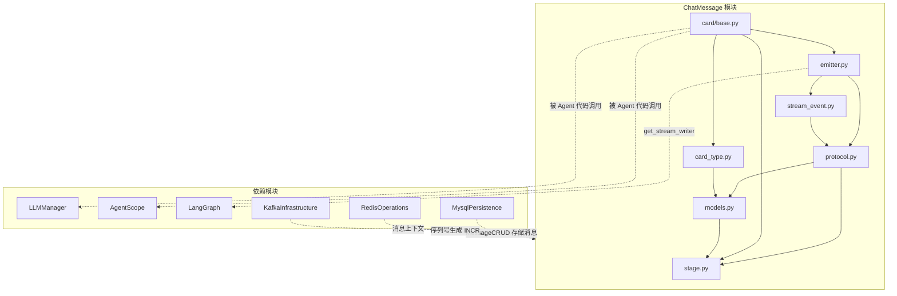

# ChatMessage 模块文档

## 模块概述

ChatMessage 模块是 AIGC-Agent 系统的**消息基础设施层**，负责从 Agent 内部生成结构化消息，经流式协议封装后推送至前端，并在流完成后聚合持久化到数据库。该模块是连接 Agent 推理逻辑与用户界面的核心桥梁。

模块围绕**卡片（Card）**这一核心概念构建：一个 Card 是一个消息容器，内部可包含多个 Content 块，支持流式增量更新。整套消息体系分为两个阶段（REASON 和 MESSAGE），四种事件类型（stage.status、card.title、card.status、card.delta），通过自定义序列化器保证输出协议与前端契约完全一致。

## 模块架构



## 核心组件详解

### 1. 阶段与状态枚举（stage.py）

定义消息流转的两个基础维度：

| 枚举 | 值 | 含义 |
|------|------|------|
| `MessageStage.REASON` | `"reason"` | 思考/推理阶段 — 工具调用、任务规划、问题分析 |
| `MessageStage.MESSAGE` | `"message"` | 主要消息内容阶段 — 最终回答、结果展示 |
| `MessageStatus.UPDATING` | `"UPDATING"` | 正在更新（流式输出中） |
| `MessageStatus.DONE` | `"DONE"` | 已完成 |
| `MessageStatus.FAIL` | `"FAIL"` | 失败 |

### 2. 消息模型（models.py）

模块的类型契约层，定义了所有消息内容的 Pydantic 数据结构：



**关键设计点：**

- `BaseCardModel` 通过自定义 `@model_serializer` 自动过滤 `None` 值字段，避免协议层输出空字段
- `CardTitleContent` 根据 `stage` 动态序列化 `card_id` 为 `reasonId`（REASON）或 `messageId`（MESSAGE）
- `CardDataContent` 根据 `stage` 动态生成嵌套结构：REASON 阶段包含 `reasonId`，MESSAGE 阶段直接输出 `content`
- `StageContent` 类型别名是三种内容模型的 Union，供 `ProtocolWrapper` 使用

### 3. 卡片类型（card_type.py）

定义支持的卡片内容格式：

| 枚举值 | 前端协议标识 | 模型类 | 适用阶段 |
|--------|-------------|--------|---------|
| `TEXT_CARD` | `"textCard"` | `TextCard` | REASON（富文本，支持 Markdown） |
| `PLAIN_TEXT_CARD` | `"plainTextCard"` | `PlainTextCard` | MESSAGE（纯文本） |

每个模型类都实现了 `BaseCardModel` 的两个抽象方法：

- `get_delta_content()` — 返回增量内容字符串（用于聚合器合并）
- `append_delta_content(delta)` — 将增量内容追加到自身

`CardType` 枚举采用 `(type_str, model_class)` 的复合值设计，通过 `get_card_model_class()` 函数按类型获取模型类，实现了类型字符串与模型类的双向映射。

### 4. 协议包装器（protocol.py）

`ProtocolWrapper` 负责将内部消息模型转换为前端协议格式，是序列化层的核心：



**两种消息类型的输出格式对比：**

| 消息类型 | REASON 阶段输出 | MESSAGE 阶段输出 |
|---------|----------------|-----------------|
| `StageStatusContent` | `{status: "UPDATING", title: "正在思考"}` | `{status: "UPDATING", title: "正在回答"}` |
| `CardTitleContent` | `{reason: {reasonId: "xxx", title: "...", status: "..."}}` | `{message: {messageId: "xxx", title: "...", status: "..."}}` |
| `CardDataContent` | `{reason: {reasonId: "xxx", content: {id: "...", type: "textCard", ...}}}` | `{message: {content: {id: "...", type: "plainTextCard", ...}}}` |

### 5. 流式事件（stream_event.py）

定义了 SSE 事件的完整模型：

| 类 | 职责 |
|----|------|
| `StreamEventType` | 枚举四种事件类型：`stage.status`、`card.title`、`card.status`、`card.delta` |
| `StreamEventPayload` | 事件载荷，包含 `stage` 和 `content`（ProtocolWrapper） |
| `StreamEvent` | 最终事件对象，提供 `.event`（SSE 事件名）和 `.data`（JSON 序列化载荷）属性 |

`StreamEvent` 通过 `@property` 兼容 SSE 协议要求，可直接作为 Server-Sent Event 的数据源。

### 6. 卡片生命周期管理（card/base.py — Card）

`Card` 类是面向 Agent 开发者的**高层 API**，封装了卡片容器的完整生命周期：



**Card 的核心属性：**

| 属性 | 说明 |
|------|------|
| `card_id` | Card 容器 ID（reasonId），创建后固定不变 |
| `stage` | 所属阶段（REASON 或 MESSAGE） |
| `current_content_id` | 当前 Content ID，每次 `start_content()` 生成新 UUID |
| `current_content_type` | 当前内容类型（CardType 枚举） |
| `text` | 累积的文本内容（所有 Content 的文本合并） |

**每个方法的副作用：**

| 方法 | 发射事件 | 推送内容 |
|------|---------|---------|
| `create(title)` | `emit_card_title` | 卡片标题 + UPDATING 状态 |
| `start_content(card_type)` | `emit_card_status` | 新 Content 的 id/type + UPDATING 状态 |
| `push_delta(model)` | `emit_card_delta` | 增量数据（无 status 字段） |
| `done_content()` | `emit_card_status` | 当前 Content 的 DONE 状态 |
| `done(title)` | `emit_card_title` | 卡片标题 + DONE 状态 |
| `fail(title)` | `emit_card_title` | 卡片标题 + FAIL 状态 |
| `update_title(title)` | `emit_card_title` | 新标题 + 当前状态 |

**类型安全保证：** `push_delta()` 会在运行时校验传入的 `card_model` 类型是否与 `start_content()` 指定的 `CardType` 匹配，不匹配则抛出 `TypeError`。

### 7. 事件发射器（emitter.py）

底层流式推送层，封装 LangGraph 的 `get_stream_writer()`：



所有发射函数遵循统一流程：构造内容模型 → 包装 ProtocolWrapper → 构建 StreamEventPayload → 构建 StreamEvent → 调用 `_emit()` 推入 LangGraph 流。

`emit_final()` 是特殊的终结函数，将 `StreamEvent` 转换为 `sse_starlette.ServerSentEvent` 用于最终 SSE 输出。

## 数据流

### 完整消息生命周期



### 事件聚合过程

`StageValueMessageHandler` 在流式推送过程中同步聚合所有事件，构建完整的持久化数据结构：



**聚合结构（DownStreamValueMessage）：**

```json
{
  "reasonModule": {
    "title": "分析完成",
    "status": "DONE",
    "reasons": [
      {
        "reason_id": "xxx",
        "title": "正在分析问题",
        "status": "DONE",
        "content": { "id": "yyy", "type": "textCard", "content": "完整推理文本..." }
      }
    ]
  },
  "messageModule": {
    "status": "DONE",
    "messages": [
      {
        "content": { "id": "zzz", "type": "plainTextCard", "content": { "text": "最终回答..." } }
      }
    ]
  }
}
```

## 模块间依赖关系



### 上游依赖

| 依赖模块 | 依赖方式 | 说明 |
|---------|---------|------|
| [LLMManager](LLMManager.md) | Agent 代码中使用 Card | LLM 推理过程中通过 Card 推送推理步骤 |
| LangGraph | `get_stream_writer()` | 底层流式推送通道，emitter 依赖其 API |

### 下游依赖

| 依赖模块 | 依赖方式 | 说明 |
|---------|---------|------|
| [MysqlPersistence](MysqlPersistence.md) | `MessageCRUD` | 消息持久化存储，`DownStreamValueMessage` 序列化后写入 |
| [RedisOperations](RedisOperations.md) | `INCR` 命令 | 消息序列号生成（`chat:conversation:{id}:{session}`） |
| [KafkaInfrastructure](KafkaInfrastructure.md) | 消息上下文 | Kafka 消息处理中引用消息模型 |

## 关键设计模式

### 1. 事件溯源模式（Event Sourcing）

Card 的每个状态变更都通过发射器生成不可变事件，事件既是前端推送的数据源，也是聚合器构建持久化快照的输入源。同一份事件流同时服务于两个消费者：

- **前端**：实时接收事件渲染 UI
- **聚合器**：累积事件构建完整消息快照用于持久化

### 2. 组合模式（Composite）

Card 采用容器-内容的两层结构：一个 Card 容器可包含多个 Content 块，每个 Content 块可以是不同类型（TextCard、PlainTextCard）。这允许在单个卡片内混合不同类型的内容。

### 3. 模板方法模式（Template Method）

`BaseCardModel` 定义了 `get_delta_content()` 和 `append_delta_content()` 两个抽象方法，具体卡片类型（TextCard、PlainTextCard）各自实现增量内容的提取和追加逻辑。聚合器通过这两个多态方法统一合并所有类型的卡片内容。

### 4. 序列化多态（Serializer Polymorphism）

`ProtocolWrapper` 和 `models.py` 中的自定义 `@model_serializer` 根据 `stage` 字段动态选择序列化结构（`reasonId` vs `messageId`、嵌套层级差异），保证一个模型类输出两种协议格式，无需运行时类型判断或分支序列化器。

### 5. Builder 模式（链式调用）

`Card` 的所有生命周期方法都返回 `self`，支持链式调用：

```python
card = Card(stage=MessageStage.REASON)
await card.create(title="正在分析...")
await card.start_content(CardType.TEXT_CARD)
await card.push_delta(TextCard(content="推理过程"))
await card.done_content()
await card.done(title="分析完成")
```
