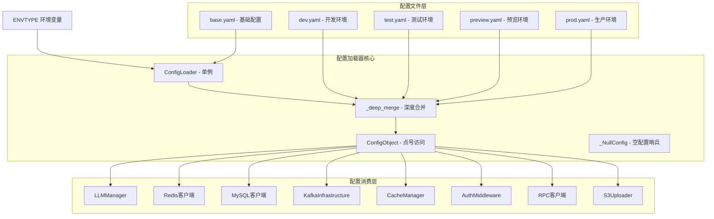
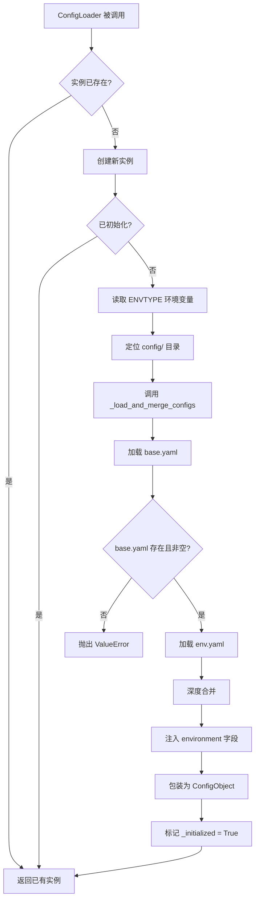
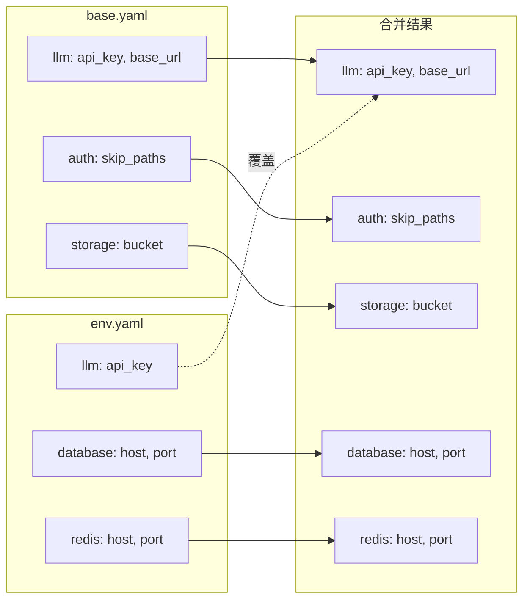
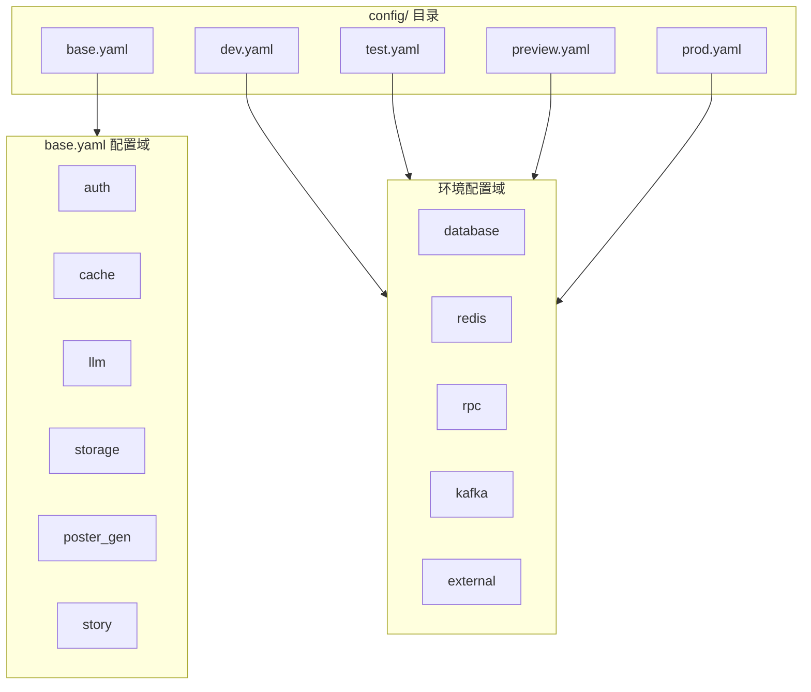
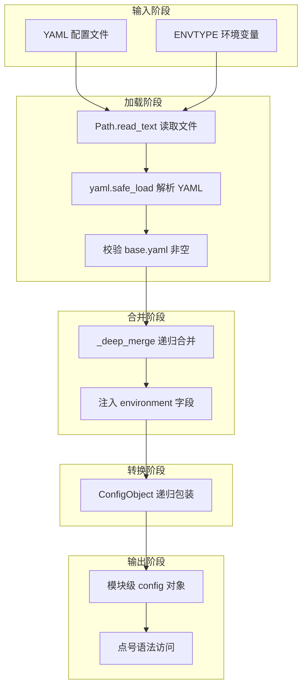
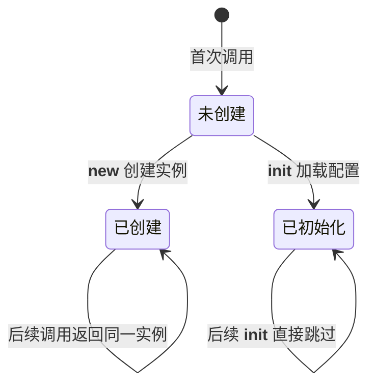
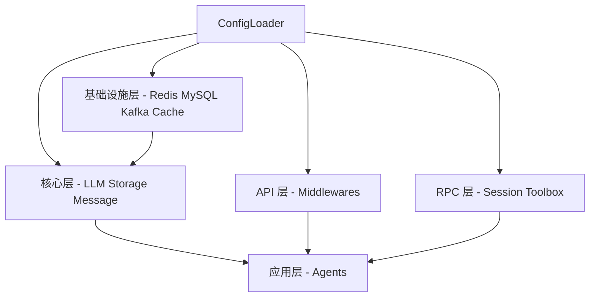

# ConfigLoader 模块文档

## 模块概述

ConfigLoader 是 aigc-agent 系统的**全局配置中心**，负责从 YAML 配置文件中加载、合并并暴露应用配置。它采用单例模式确保全局唯一实例，支持多环境（dev/test/preview/prod）配置切换，通过 `ENVTYPE` 环境变量控制。加载后的配置以点号语法（`config.server.host`）对外暴露，是整个系统中被引用最广泛的基础设施模块。

### 核心职责

- 从 YAML 文件加载基础配置和环境特定配置
- 深度合并环境配置覆盖基础配置
- 将嵌套字典转换为支持点号语法访问的 `ConfigObject`
- 通过单例模式保证全局配置一致性

---

## 架构总览



---

## 核心组件详解

### ConfigLoader

`ConfigLoader` 是模块的核心入口，实现了**单例模式**，确保整个应用生命周期内只存在一个配置实例。

**关键设计：**

| 特性 | 实现方式 |
|------|---------|
| 单例保证 | `__new__` 方法重写 + `_initialized` 标志位 |
| 环境切换 | 读取 `ENVTYPE` 环境变量，默认 `dev` |
| 配置文件定位 | 基于 `__file__` 路径向上 4 层到达项目根目录的 `config/` |
| 防重复初始化 | `__init__` 中检查 `_initialized` 标志 |

**初始化流程：**



**配置合并策略：**

加载顺序决定了优先级——环境配置始终覆盖基础配置：

1. **第一层**：`config/base.yaml` — 所有环境共享的默认值
2. **第二层**：`config/{ENVTYPE}.yaml` — 环境特定配置，深度合并后覆盖同名键

深度合并规则：
- 两层都是字典 → 递归合并子键
- 否则 → 环境配置直接覆盖基础配置的值



### ConfigObject

`ConfigObject` 将嵌套字典递归转换为支持点号语法访问的对象，是配置消费端的主要交互接口。

**转换规则：**

| 值类型 | 转换行为 |
|--------|---------|
| `dict` | 递归转换为 `ConfigObject` |
| `list` | 列表内每个 `dict` 元素转换为 `ConfigObject` |
| 其他类型 | 直接赋值（str、int、bool 等） |

**访问不存在的属性：** `__getattr__` 返回 `None`，不会抛出 `AttributeError`，但需注意这可能导致下游 `NoneType` 错误。

**使用示例：**

```python
from agent.core.config import config

# 直接访问嵌套配置
api_key = config.llm.api_key
db_host = config.database.host
kafka_config = config.kafka

# 访问不存在的配置项返回 None（不会报错）
missing = config.nonexistent  # None
```

### _NullConfig

`_NullConfig` 实现了**空对象模式（Null Object Pattern）**，设计意图是提供安全的链式访问——对不存在的配置键持续返回自身而非抛出异常。

**关键特性：**

- `__getattr__` 始终返回 `self`，支持无限链式调用
- `__bool__` 返回 `False`，可通过布尔判断检测
- `__str__` 返回空字符串

**当前状态：** `_NullConfig` 及其实例 `_NULL_CONFIG` 在当前代码库中属于**未使用代码**。`ConfigObject.__getattr__` 返回 `None` 而非 `_NullConfig` 实例，因此空对象模式并未实际生效。它可能是为未来安全访问场景预留的扩展点。

---

## 配置文件结构

系统通过 5 个 YAML 文件管理配置：



| 文件 | 加载条件 | 覆盖关系 |
|------|---------|---------|
| `base.yaml` | 始终加载 | 基础层，所有环境共享 |
| `dev.yaml` | `ENVTYPE=dev`（默认） | 覆盖 base.yaml 中的同名键 |
| `test.yaml` | `ENVTYPE=test` | 覆盖 base.yaml 中的同名键 |
| `preview.yaml` | `ENVTYPE=preview` | 覆盖 base.yaml 中的同名键 |
| `prod.yaml` | `ENVTYPE=prod` | 覆盖 base.yaml 中的同名键 |

---

## 配置消费关系

ConfigLoader 通过模块级导出 `config` 对象被全系统引用。`__init__.py` 在导入时即触发单例初始化：

```python
# agent/core/config/__init__.py
config = ConfigLoader().config
```

下表列出所有配置消费模块及其依赖的配置域：

```mermaid
graph TD
    CONFIG[ConfigLoader - config对象]

    subgraph core_layer[core 层]
        LLM[LLMManager]
        S3[S3Uploader]
        POSTER[PosterPipeline]
    end

    subgraph api_layer[API 层]
        AUTH[AuthMiddleware]
    end

    subgraph infra_layer[基础设施层]
        REDIS_C[Redis客户端]
        MYSQL_C[MySQL客户端]
        KAFKA_C[KafkaConfigAdapter]
        KAFKA_S[KafkaStartupManager]
        CACHE_C[CacheManager]
    end

    subgraph rpc_layer[RPC 层]
        SESSION[SessionRpcClient]
        TOOLBOX[ToolboxRpcClient]
    end

    subgraph app_layer[应用层]
        STORY[StoryAgent Graph]
    end

    CONFIG --> LLM
    CONFIG --> S3
    CONFIG --> POSTER
    CONFIG --> AUTH
    CONFIG --> REDIS_C
    CONFIG --> MYSQL_C
    CONFIG --> KAFKA_C
    CONFIG --> KAFKA_S
    CONFIG --> CACHE_C
    CONFIG --> SESSION
    CONFIG --> TOOLBOX
    CONFIG --> STORY
```



| 消费模块 | 依赖的配置键 | 所属层 |
|---------|-------------|-------|
| [LLMManager](LLMManager.md) | `config.llm.api_key`、`config.llm.base_url` | core |
| S3Uploader | `config.storage` | core |
| PosterPipeline | `config.storage.upload_base_url`、`config.poster_gen` | core |
| AuthMiddleware | `config.auth.skip_paths` | API |
| Redis 客户端 | `config.redis`（host、port、db、password 等） | infrastructure |
| MySQL 客户端 | `config.database`（host、port、user、password 等） | infrastructure |
| [KafkaInfrastructure](KafkaInfrastructure.md) | `config.kafka.*`、`config.environment` | infrastructure |
| [CacheInfrastructure](CacheInfrastructure.md) | `config`（缓存策略相关） | infrastructure |
| SessionRpcClient | `config.rpc.session.*` | RPC |
| ToolboxRpcClient | `config.rpc.toolbox.*` | RPC |
| StoryAgent Graph | `config.external.scrm.base_url`、`config.external.customer.base_url` | application |

---

## 数据流

配置数据从文件系统到消费模块的完整流转过程：



**关键数据转换点：**

1. **YAML → dict**：`yaml.safe_load` 将文本解析为 Python 字典
2. **dict → 合并 dict**：`_deep_merge` 递归合并基础配置与环境配置
3. **dict → ConfigObject**：递归包装嵌套字典，使属性可通过点号访问
4. **ConfigObject → 消费方**：各模块通过 `config.xxx.yyy` 读取具体配置值

---

## 关键设计模式

### 1. 单例模式（Singleton）



`ConfigLoader` 使用类变量 `_instance` 和 `_initialized` 实现双重保护：
- `__new__` 保证对象唯一
- `__init__` 中的标志位防止重复初始化

**优势**：应用启动后无论多少模块引用配置，都共享同一份已加载的配置数据，避免重复文件 I/O。

### 2. 空对象模式（Null Object）

`_NullConfig` 旨在替代 `None` 检查，通过返回自身实现安全链式访问。当前虽未启用，但设计意图清晰——防止 `config.a.b.c` 在 `a` 或 `b` 不存在时抛出 `AttributeError`。

### 3. 装饰器模式（Decorator / Wrapper）

`ConfigObject` 将原始字典逐层包装为对象，不改变数据内容，只改变访问方式（从 `d["key"]` 变为 `d.key`），是对数据访问接口的装饰。

---

## 与其他模块的关系

ConfigLoader 位于系统依赖链的**最底层**，几乎所有模块都直接或间接依赖它：



ConfigLoader 不依赖系统中的任何其他业务模块，是一个**纯基础设施组件**。它的变更（如配置键重命名、结构调整）会波及全系统 14+ 个消费模块，因此配置结构的变更需谨慎评估影响范围。

---

## 使用指南

### 添加新配置项

1. 在 `config/base.yaml` 中添加通用默认值
2. 在各环境配置文件（`dev.yaml`、`prod.yaml` 等）中添加环境特定值
3. 在代码中通过 `config.section.key` 访问

### 切换运行环境

设置 `ENVTYPE` 环境变量即可切换：

```bash
export ENVTYPE=prod    # 生产环境
export ENVTYPE=test    # 测试环境
export ENVTYPE=dev     # 开发环境（默认）
```

### 注意事项

- **基础配置必须存在**：`base.yaml` 缺失或为空会导致启动失败（抛出 `ValueError`）
- **环境配置可选**：环境特定文件不存在时返回空字典，不会报错
- **深度合并而非浅合并**：嵌套字典会递归合并，不会整体替换
- **属性访问返回 None**：访问不存在的配置键返回 `None`，不会抛异常，需注意下游空值处理
- **配置只读**：运行时不支持热更新，配置在启动时一次性加载
