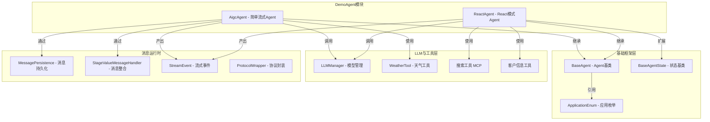
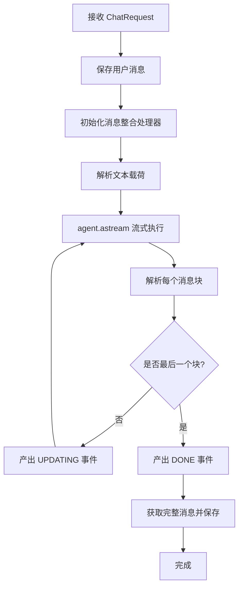
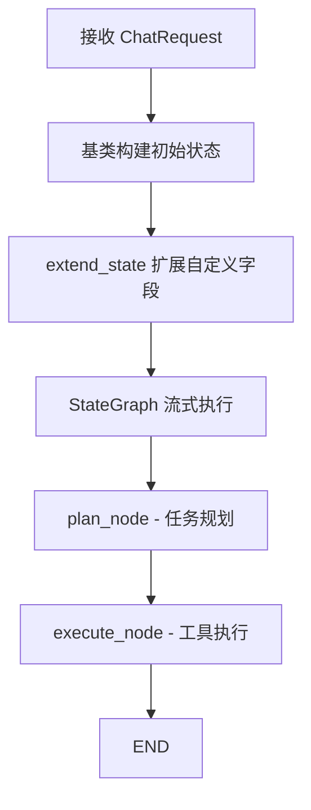
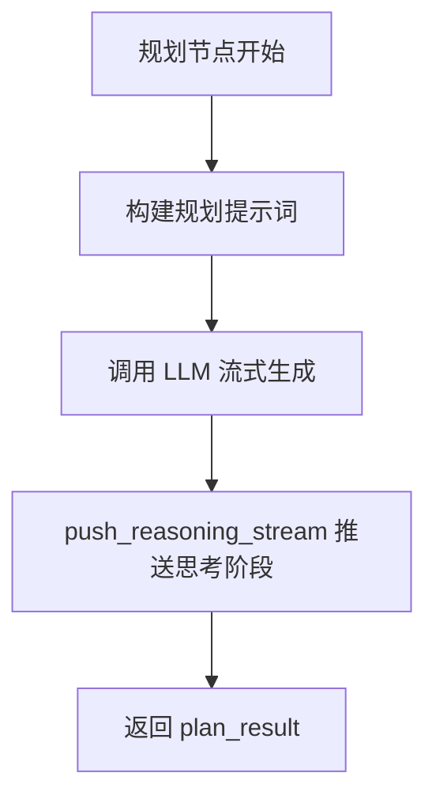
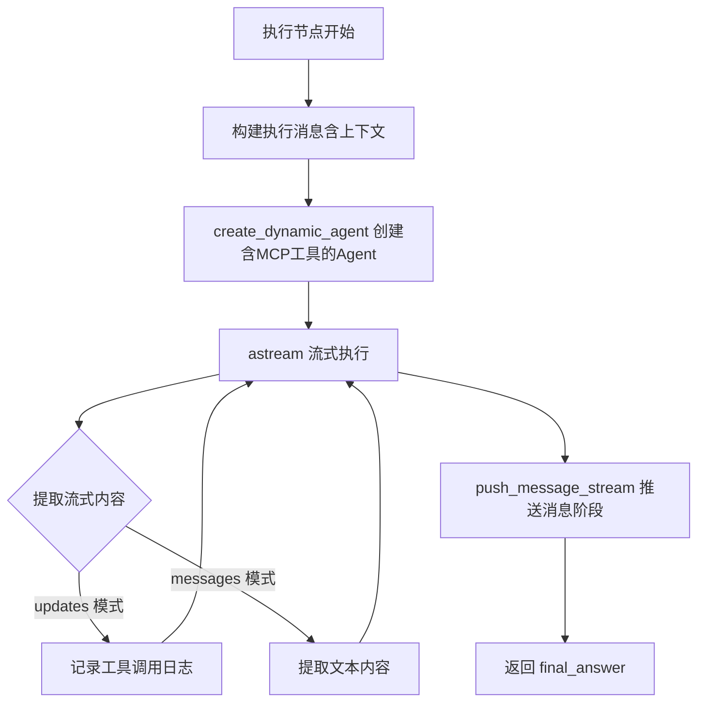
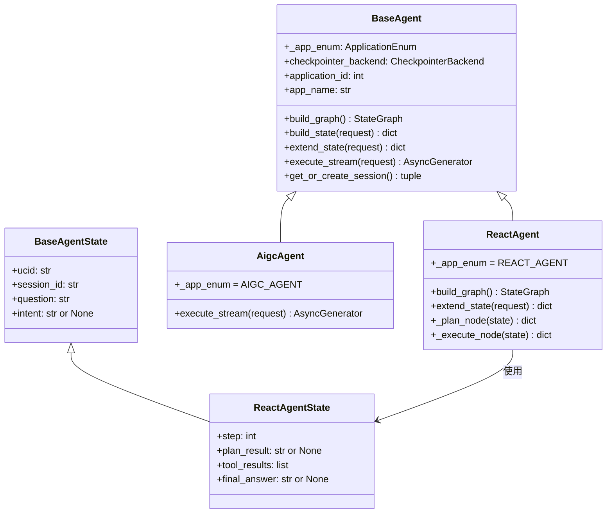
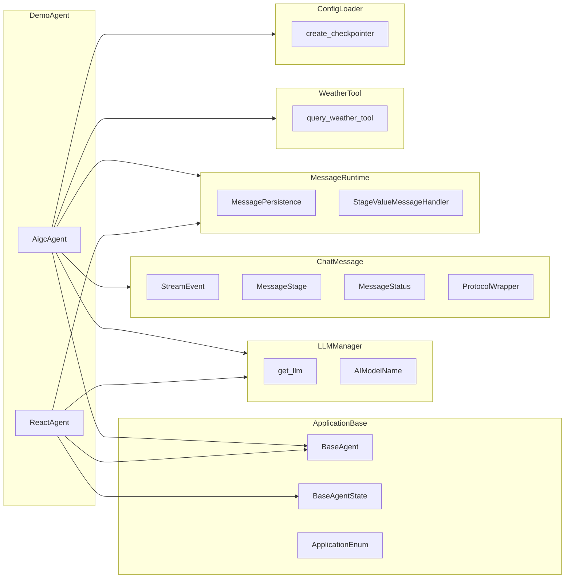
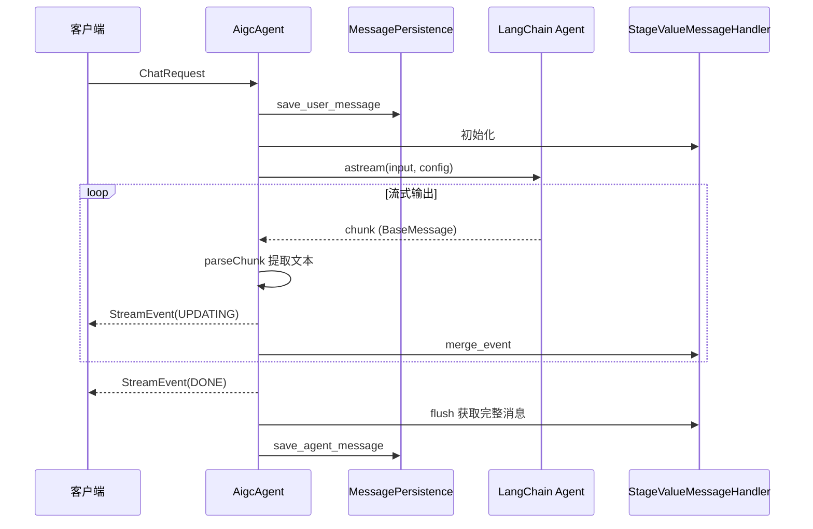
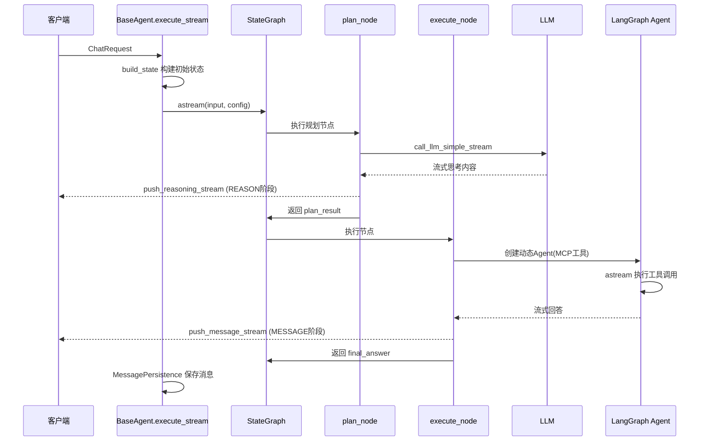

# DemoAgent 模块

DemoAgent 是系统的示例 Agent 模块，包含两个演示性的 AI Agent 实现：**AigcAgent** 和 **ReactAgent**。它们分别展示了两种不同的 Agent 构建模式——简单流式 Agent 和基于 LangGraph 的 React 模式 Agent，为开发者提供了可参考的 Agent 开发模板。

## 架构总览

## 核心组件

### AigcAgent

AigcAgent 是一个**简单流式 Agent**，直接使用 LangChain 的 `create_agent` 创建 Agent 实例并以流式模式执行。它不使用 LangGraph 的 StateGraph 编排，而是直接遍历 Agent 的流式输出并转换为系统内部的 `StreamEvent`。

**关键特性：**
- 使用 `Deepseek-Chat` 模型
- 集成天气查询工具（`query_weather_tool`）
- 使用内存 Checkpointer 保持对话上下文
- 自行管理消息聚合和持久化（不走基类的 `execute_stream` 流程）

**执行流程：**

> **注意：** AigcAgent **重写**了基类的 `execute_stream` 方法，直接调用 `agent.astream()` 而非通过 LangGraph StateGraph 执行。这是因为简单 Agent 无需复杂的图编排。

### ReactAgent

ReactAgent 是一个基于 **LangGraph StateGraph** 的 React 模式（Reasoning + Acting）Agent，实现了完整的思考-执行两阶段工作流。

**关键特性：**
- 使用 `Deepseek-V3.1` 模型
- 动态加载 MCP 搜索工具
- 两阶段节点：`plan_node`（规划）→ `execute_node`（执行）
- 使用 `push_reasoning_stream` 和 `push_message_stream` 便捷方法简化消息推送

**执行流程：**

**plan_node 内部逻辑：**

**execute_node 内部逻辑：**

## 两种 Agent 的对比

| 维度 | AigcAgent | ReactAgent |
|------|-----------|------------|
| **图编排** | 无，直接调用 LangChain Agent | LangGraph StateGraph |
| **模型** | Deepseek-Chat | Deepseek-V3.1 |
| **工具** | 天气查询（静态） | 客户信息 + MCP 搜索（动态） |
| **阶段** | 单阶段（直接流式输出） | 双阶段（规划 → 执行） |
| **execute_stream** | 自行重写 | 使用基类默认实现 |
| **消息推送** | 手动构建 StreamEvent | 使用 `push_*_stream` 便捷方法 |
| **应用 ID** | 9990002 | 9990001 |
| **适用场景** | 简单问答、快速原型 | 复杂推理、多工具协作 |

## 继承体系

## 依赖关系

### 外部依赖模块说明

| 依赖模块 | 用途 | 文档链接 |
|---------|------|---------|
| [ApplicationBase](ApplicationBase.md) | 提供 `BaseAgent`、`BaseAgentState`、`ApplicationEnum` 基础框架 | ApplicationBase.md |
| [LLMManager](LLMManager.md) | 提供 `get_llm()` 获取 LLM 模型实例、`AIModelName` 模型名称枚举 | LLMManager.md |
| [ChatMessage](ChatMessage.md) | 提供 `StreamEvent`、`MessageStage`、`MessageStatus` 等消息协议类型 | ChatMessage.md |
| [MessageRuntime](MessageRuntime.md) | 提供 `MessagePersistence` 消息持久化和 `StageValueMessageHandler` 消息聚合 | MessageRuntime.md |
| [WeatherTool](WeatherTool.md) | 提供 `query_weather_tool` 天气查询工具 | WeatherTool.md |

## 数据流

### AigcAgent 数据流

### ReactAgent 数据流

## 关键设计模式

### 1. 模板方法模式

`BaseAgent` 定义了 Agent 执行的骨架流程（`execute_stream`），子类通过覆盖 `build_graph()`、`extend_state()` 等钩子方法定制具体行为。AigcAgent 则更进一步，完全重写 `execute_stream` 以适配非图编排的场景。

### 2. 状态扩展模式

通过 `extend_state()` 钩子，基类负责通用字段（`ucid`、`session_id`、`question`），子类只需返回自定义字段，两者自动合并。ReactAgent 利用此模式添加 `step`、`plan_result`、`tool_results` 等 React 模式专属状态。

### 3. 便捷消息推送

ReactAgent 使用 `push_reasoning_stream` 和 `push_message_stream` 两个便捷方法，将 StreamEvent 的构建、发送和聚合封装为一行调用，显著简化了节点代码。而 AigcAgent 由于重写了 `execute_stream`，需要手动构建 `StreamEvent` 对象。

### 4. 动态工具加载

ReactAgent 的 `create_dynamic_agent()` 在执行阶段动态获取 MCP 搜索工具并注入 Agent，支持运行时工具集变化。AigcAgent 则使用静态工具列表。
