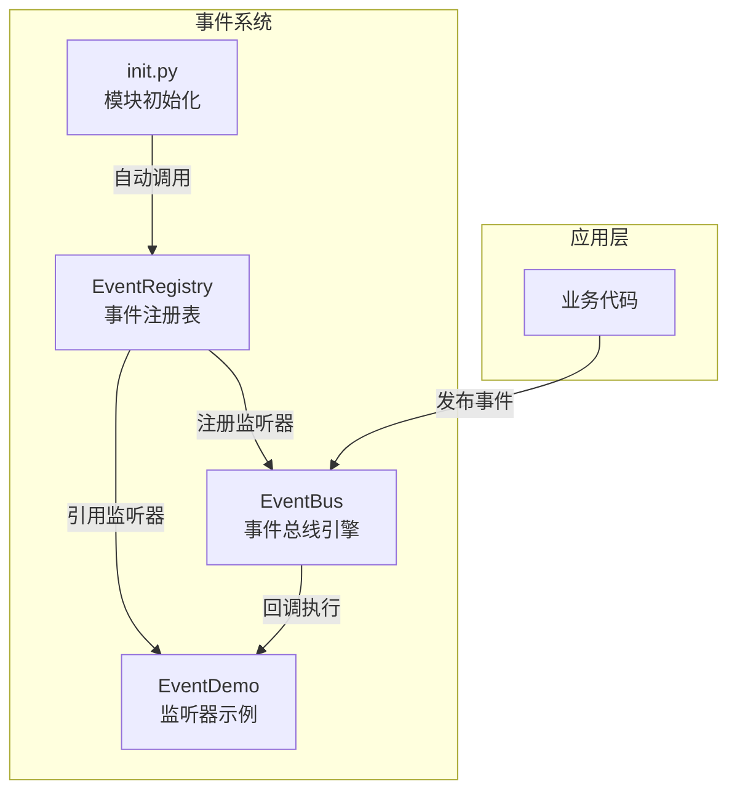
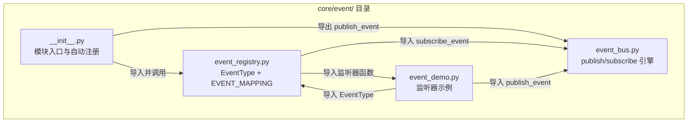
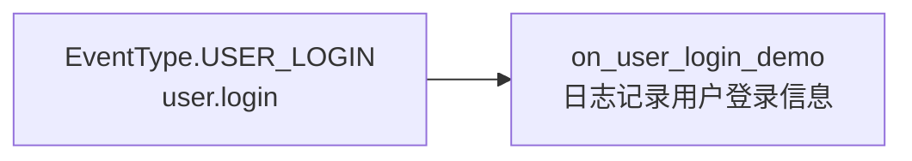
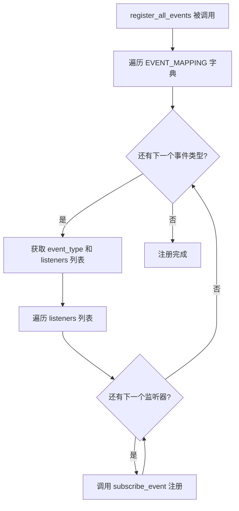
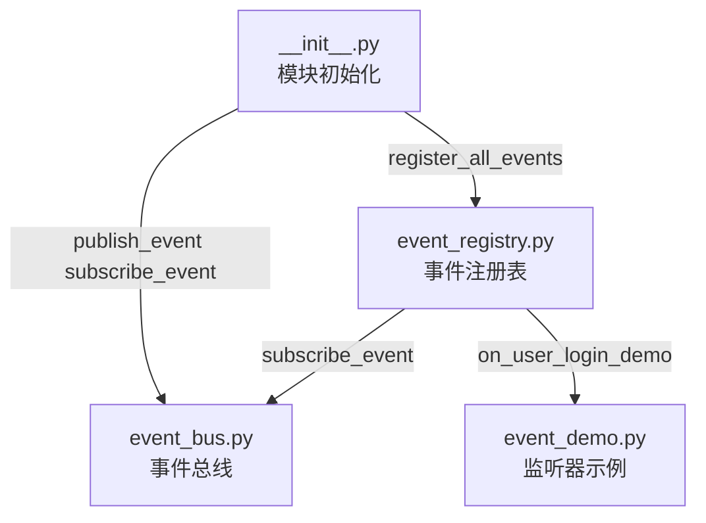
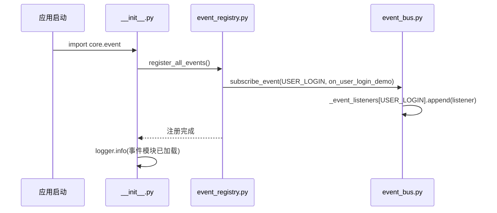
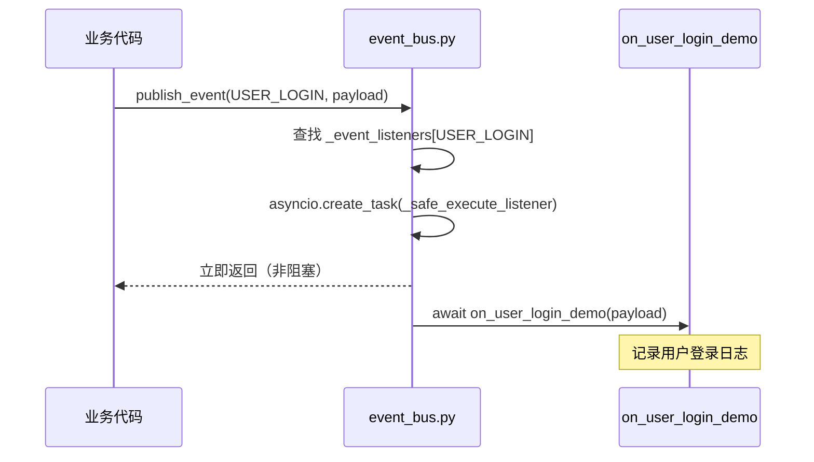
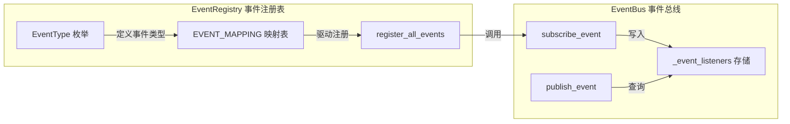
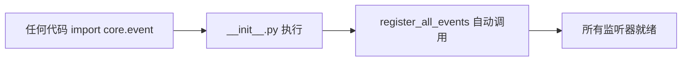

# EventRegistry — 事件注册表模块

## 模块概述

EventRegistry 是 aigc-agent 事件系统的核心配置层，承担**事件类型定义**与**监听器映射注册**的职责。它与 [EventBus](EventBus.md)（事件总线引擎）协同工作，共同构成一套轻量级的异步发布-订阅（Pub/Sub）事件系统。

EventRegistry 模块的设计哲学是**集中式声明**：所有事件类型的枚举定义、事件与监听器的映射关系，以及全局注册入口，全部集中在一个文件中维护。业务方只需在此文件中添加事件类型和对应的监听器列表，即可完成新事件的接入，无需关心底层调度细节。

### 核心职责

| 职责 | 说明 |
|------|------|
| 事件类型枚举定义 | 通过 `EventType` 枚举集中管理所有事件类型的字符串标识，避免魔法字符串散落 |
| 事件-监听器映射 | 通过 `EVENT_MAPPING` 字典声明每个事件类型对应的监听器列表 |
| 全局注册入口 | `register_all_events()` 函数遍历映射表，将所有监听器注册到事件总线 |
| 自动注册触发 | 由 `__init__.py` 在模块导入时自动调用 `register_all_events()`，实现零配置注册 |

---

## 系统架构

### 事件系统整体架构

EventRegistry 位于事件系统的**配置层**，向上被应用代码引用，向下驱动 EventBus 的订阅注册。



### 模块内部组件关系



> **注意**：Demo 模块与 Registry 模块之间存在**双向引用**——Registry 导入 Demo 的监听器函数，Demo 导入 Registry 的 EventType 枚举。这种设计是可行的，因为 Python 在运行时解析导入，且不存在循环初始化依赖。

---

## 核心组件详解

### EventType 枚举

`EventType` 是一个继承自 `str` 和 `Enum` 的双重基类枚举，既可以用作类型标识的枚举常量，也可以直接作为字符串参与字典键的查找和比较。

**设计特点**：

- **`str, Enum` 双继承**：枚举成员既是枚举实例也是字符串，可直接作为字典键、JSON 序列化值，无需额外的 `.value` 转换
- **点分命名规范**：事件类型值采用 `domain.action` 格式（如 `user.login`），具有良好的可读性和命名空间隔离效果
- **分类注释**：通过分隔注释（如 `# ==================== 用户事件 ====================`）对事件类型进行逻辑分组

**当前已定义的事件类型**：

| 枚举成员 | 字符串值 | 说明 |
|---------|---------|------|
| `USER_LOGIN` | `"user.login"` | 用户登录事件，当用户成功登录时触发 |

**扩展示例**：

```python
class EventType(str, Enum):
    # ==================== 用户事件 ====================
    USER_LOGIN = "user.login"
    USER_LOGOUT = "user.logout"

    # ==================== 对话事件 ====================
    CONVERSATION_CREATED = "conversation.created"
    MESSAGE_RECEIVED = "message.received"
```

### EVENT_MAPPING 映射表

`EVENT_MAPPING` 是一个模块级字典变量，类型签名为 `dict[str, list[Callable[[dict[str, Any]], Awaitable[None]]]]`，即事件类型字符串到异步监听器列表的映射。

**当前映射关系**：



**扩展方式**：

```python
EVENT_MAPPING: dict[str, list[Callable[[dict[str, Any]], Awaitable[None]]]] = {
    EventType.USER_LOGIN: [on_user_login_demo, on_user_login_analytics],
    EventType.USER_LOGOUT: [on_user_logout_cleanup],
}
```

每个事件类型可以映射到多个监听器，所有监听器在事件发布时会并发执行。

### register_all_events() 函数

`register_all_events()` 是模块的注册入口函数，职责单一：遍历 `EVENT_MAPPING` 中的每一个事件类型及其监听器列表，逐一调用 [EventBus](EventBus.md) 的 `subscribe_event()` 方法完成注册。

**执行流程**：



**调用时机**：此函数由 `core/event/__init__.py` 在模块导入时自动执行，确保应用启动后所有事件监听器立即就绪。

---

## 依赖关系

### 模块依赖图



### 外部依赖

| 依赖 | 来源 | 用途 |
|------|------|------|
| `collections.abc.Awaitable` | Python 标准库 | 类型注解，表示异步可等待对象 |
| `collections.abc.Callable` | Python 标准库 | 类型注解，表示可调用对象 |
| `enum.Enum` | Python 标准库 | 枚举基类 |
| `typing.Any` | Python 标准库 | 通用类型注解 |
| `subscribe_event` | [EventBus](EventBus.md) | 将监听器注册到事件总线 |
| `on_user_login_demo` | EventDemo | 用户登录事件的示例监听器 |

### 被依赖关系

| 消费方 | 引用内容 | 说明 |
|--------|---------|------|
| `__init__.py` | `register_all_events` | 模块导入时自动触发注册 |
| `event_demo.py` | `EventType` 枚举 | 监听器示例中引用事件类型 |
| 业务代码（如 Kafka 监听器） | `EventType` 枚举 | 发布事件时使用事件类型标识 |

---

## 数据流

### 事件注册流程（应用启动时）



### 事件发布与消费流程（运行时）



---

## 与其他模块的协作

### 与 EventBus 的关系

EventRegistry 是 EventBus 的**配置上游**。两者职责划分清晰：



| 维度 | EventRegistry | EventBus |
|------|---------------|----------|
| 定位 | 配置层：声明"有哪些事件"和"谁来处理" | 引擎层：负责事件的发布、路由和安全执行 |
| 关注点 | 事件类型定义、监听器映射 | 异步调度、并发执行、异常隔离 |
| 修改频率 | 随业务需求变更（新增事件/监听器时修改） | 极少修改（基础设施稳定性） |

### 与 EventDemo 的关系

EventDemo 是 EventRegistry 中注册监听器的**参考实现**。业务方开发新的事件监听器时，应参照 `event_demo.py` 中的模式：

1. 编写异步监听器函数，签名为 `async def listener(payload: dict[str, Any]) -> None`
2. 在 `event_registry.py` 的 `EVENT_MAPPING` 中添加映射
3. 如果需要新的事件类型，在 `EventType` 枚举中添加成员

---

## 关键设计模式

### 1. 集中式事件注册（Centralized Registration）

所有事件类型和监听器映射集中在一个文件中维护，而非分散到各个业务模块中。这种模式的优点：

- **可审计性**：单一文件即可看到系统中所有事件的全景视图
- **可维护性**：新增/移除事件只需修改一个文件
- **避免遗漏**：集中的 `EVENT_MAPPING` 使得事件覆盖情况一目了然

### 2. 自动注册（Auto-Registration）

通过 `__init__.py` 的模块导入副作用实现自动注册，应用代码无需显式调用注册函数：



这种方式确保事件系统在应用启动后即处于可用状态，消除了"忘记注册"的人为错误风险。

### 3. 枚举驱动的事件类型（Enum-Driven Event Types）

使用 `str, Enum` 双继承枚举定义事件类型，同时获得：

- **类型安全**：IDE 可以自动补全事件类型，编译期可发现拼写错误
- **字符串兼容**：枚举成员可以直接用于字符串比较和字典查找
- **集中定义**：所有事件类型在同一位置声明，便于全局搜索和管理

### 4. 多监听器并发执行（Concurrent Listener Execution）

一个事件类型可以注册多个监听器，EventBus 会在事件发布时通过 `asyncio.create_task` 并发执行所有监听器。EventRegistry 的 `EVENT_MAPPING` 列表结构天然支持这一模式，业务方只需向列表追加新的监听器即可。

---

## 快速上手

### 新增事件类型

```python
# 1. 在 EventType 枚举中添加新成员
class EventType(str, Enum):
    USER_LOGIN = "user.login"
    ORDER_CREATED = "order.created"  # 新增

# 2. 编写监听器（可在 event_demo.py 或新建文件）
async def on_order_created(payload: dict[str, Any]):
    order_id = payload.get("order_id")
    logger.info(f"订单创建: {order_id}")

# 3. 在 EVENT_MAPPING 中添加映射
EVENT_MAPPING = {
    EventType.USER_LOGIN: [on_user_login_demo],
    EventType.ORDER_CREATED: [on_order_created],  # 新增
}
```

### 发布事件

```python
from agent.core.event import publish_event
from agent.core.event.event_registry import EventType

await publish_event(EventType.ORDER_CREATED, {"order_id": "ORD-001", "amount": 99.9})
```

---

## 模块文件清单

| 文件 | 核心产物 | 职责 |
|------|---------|------|
| `event_registry.py` | `EventType`, `EVENT_MAPPING`, `register_all_events()` | 事件类型定义、监听器映射、注册入口 |
| `event_bus.py` | `publish_event()`, `subscribe_event()` | 事件发布与订阅引擎 |
| `event_demo.py` | `on_user_login_demo()` | 监听器编写参考示例 |
| `__init__.py` | 模块入口 | 自动注册触发、公共 API 导出 |
