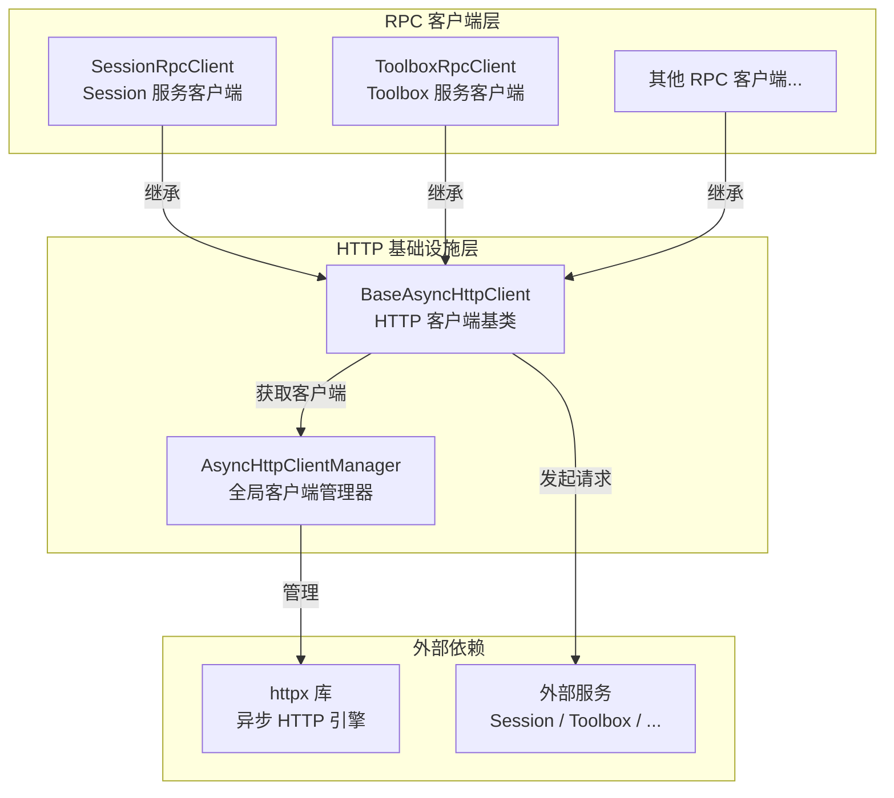
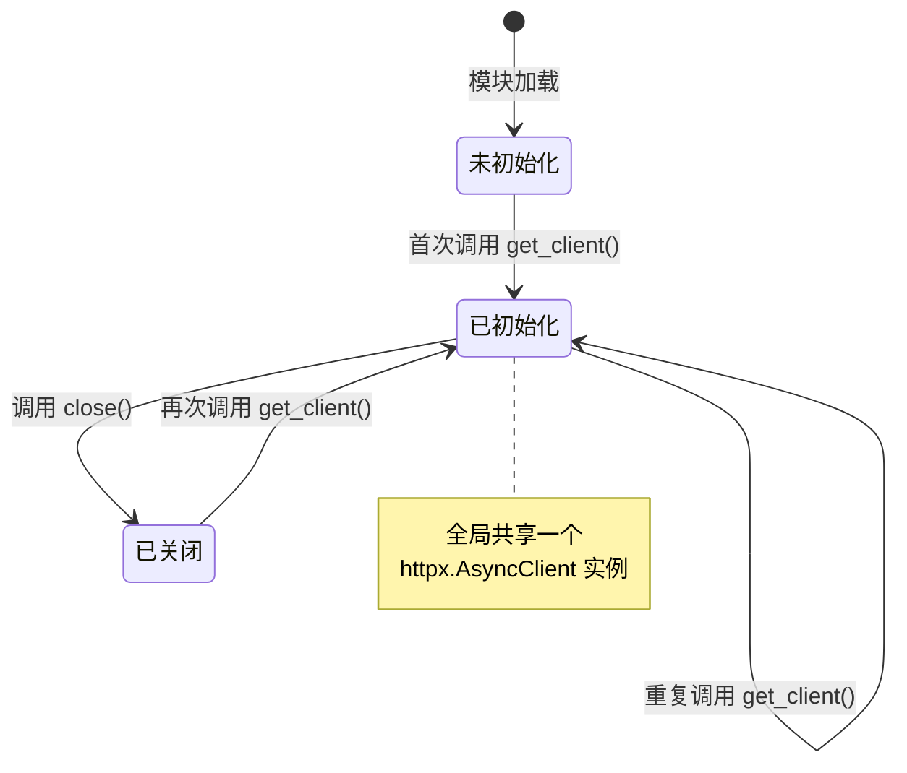
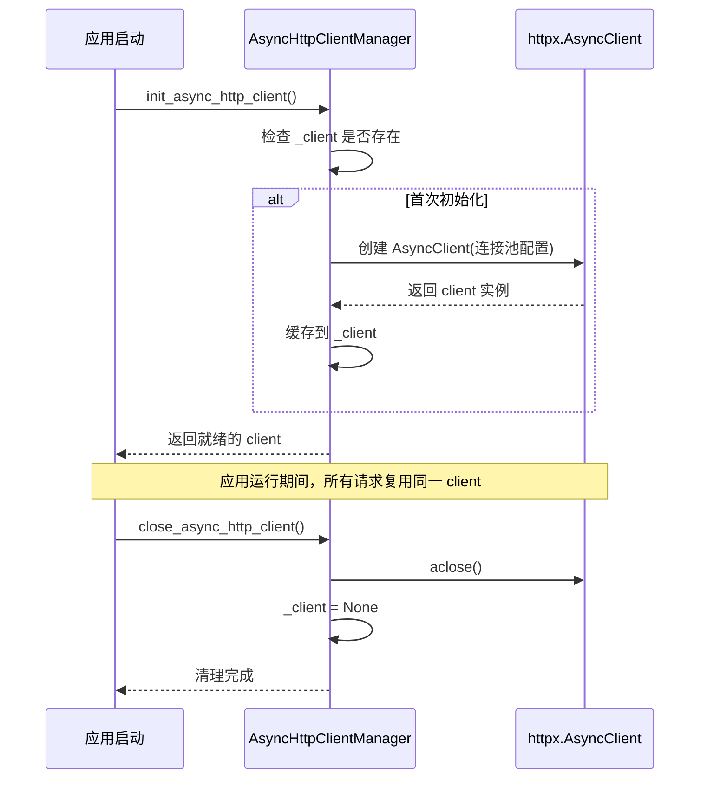
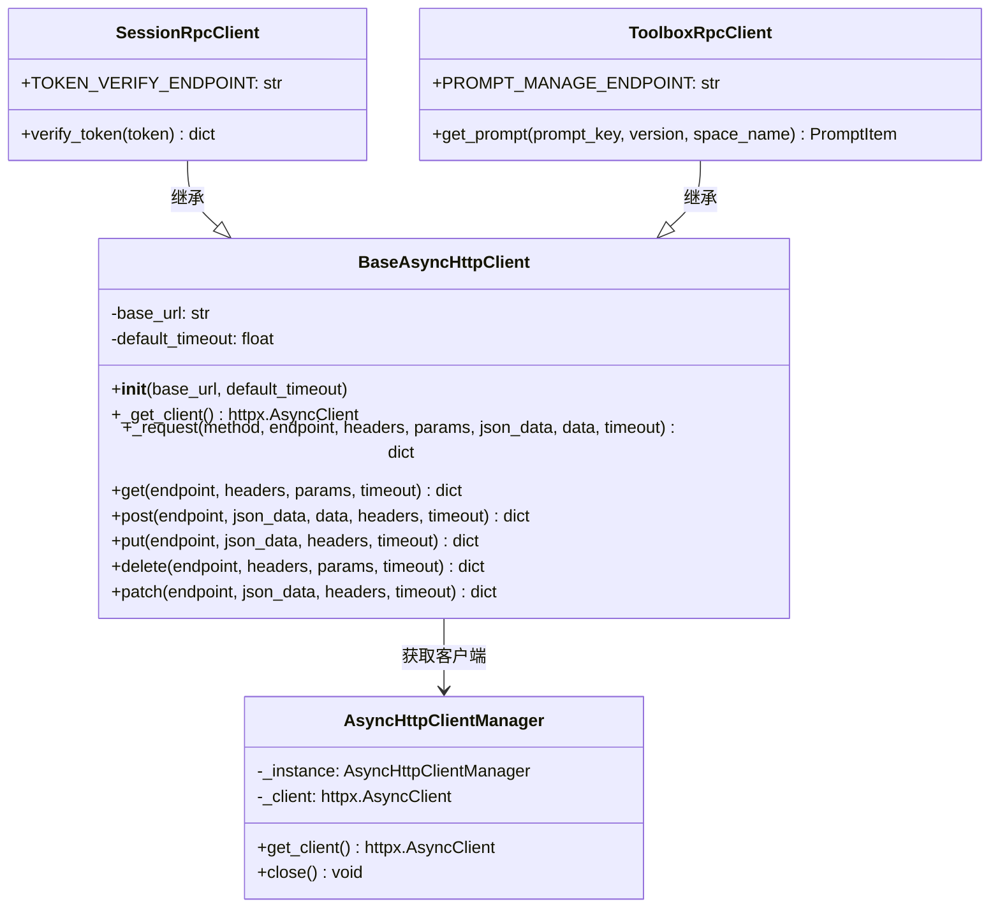
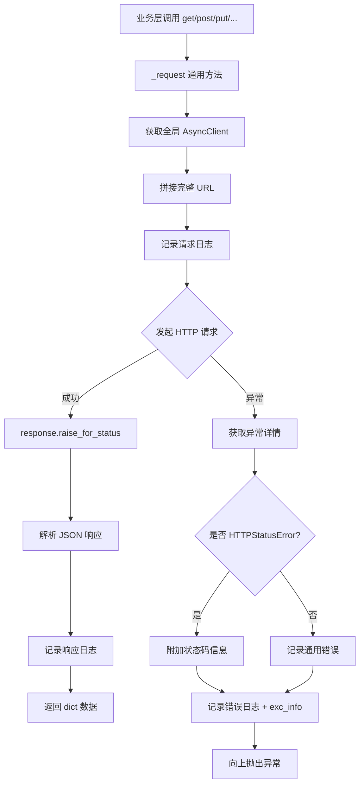
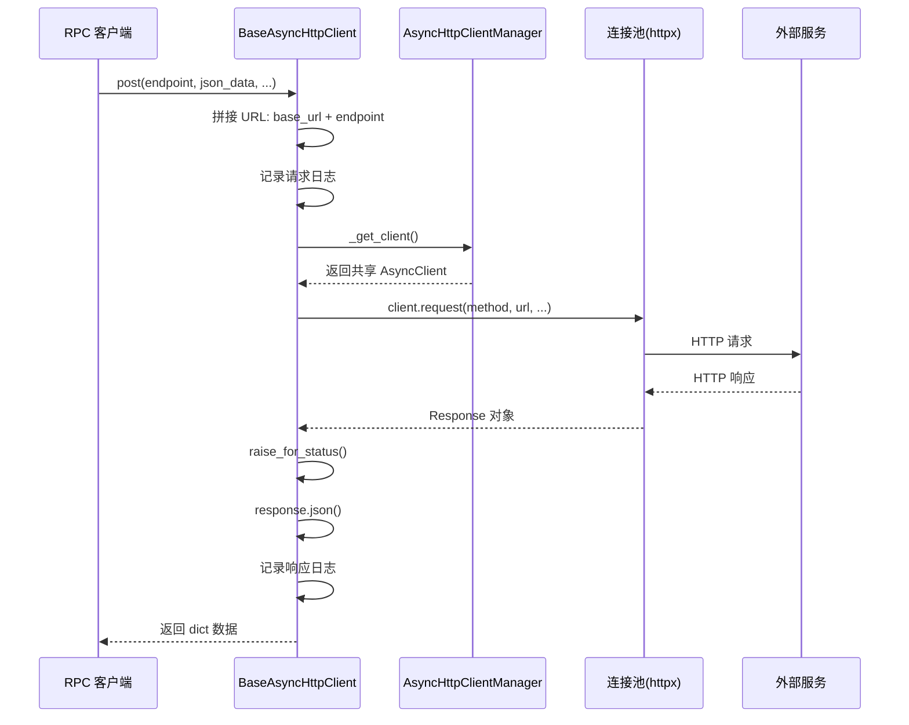
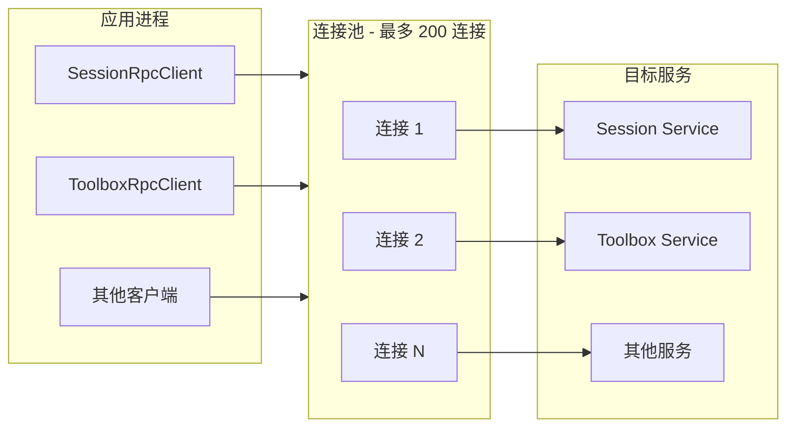
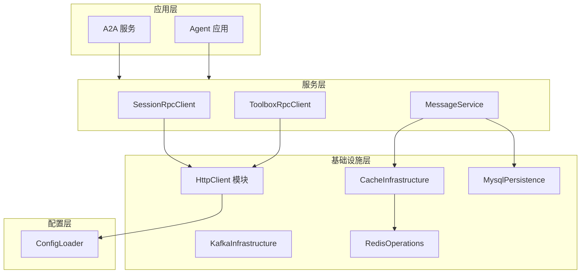
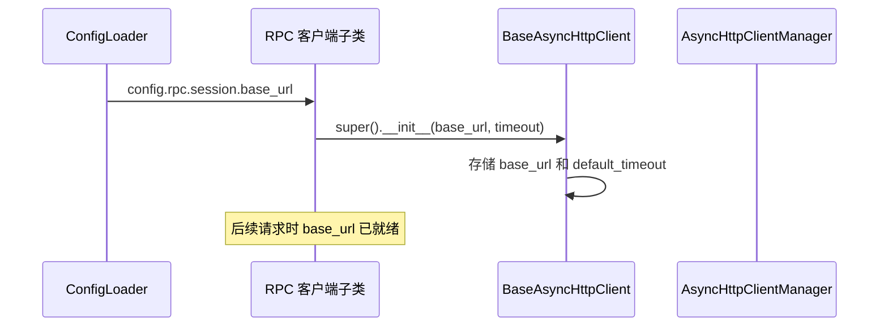
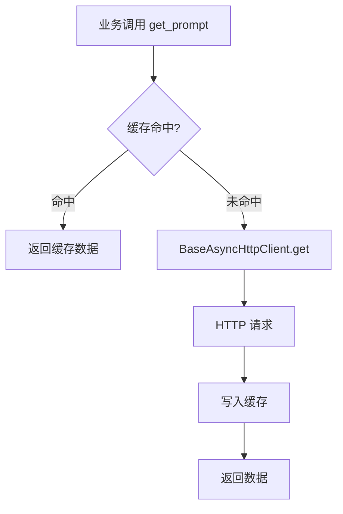

# HttpClient 模块

## 模块概述

HttpClient 模块是 AIGC Agent 系统的异步 HTTP 客户端基础设施层，位于 `infrastructure/http/` 目录下。该模块基于 [httpx](https://www.python-httpx.org/) 库构建，提供统一的异步 HTTP 客户端管理和连接池复用能力，是系统中所有外部 HTTP 调用的底层支撑。

模块包含两个核心组件：

- **AsyncHttpClientManager**：全局单例管理器，统一管理 httpx.AsyncClient 实例和连接池配置
- **BaseAsyncHttpClient**：异步 HTTP 客户端基类，封装通用的 HTTP 请求方法、日志记录和错误处理

该模块在系统架构中处于基础设施层（Infrastructure Layer），为上层 RPC 客户端（如 [RpcClient](RpcClient.md)）提供 HTTP 通信能力，同时依赖 [ConfigLoader](ConfigLoader.md) 获取配置信息，与 [CacheInfrastructure](CacheInfrastructure.md)、[MysqlPersistence](MysqlPersistence.md) 等模块共同构成系统的基础设施层。

## 架构总览



## 核心组件详解

### AsyncHttpClientManager

**文件路径**：`infrastructure/http/client.py`

全局异步 HTTP 客户端管理器，采用单例模式确保整个应用生命周期内只有一个 httpx.AsyncClient 实例，所有 HTTP 连接通过统一的连接池进行复用。

#### 设计模式

采用经典的单例模式实现，通过 `__new__` 方法控制实例创建：



#### 连接池配置

| 参数 | 值 | 说明 |
|------|-----|------|
| `max_keepalive_connections` | 100 | 最大 keep-alive 连接数 |
| `max_connections` | 200 | 最大总连接数 |
| `keepalive_expiry` | 30.0s | keep-alive 过期时间 |
| 默认超时 | 30.0s | 请求总超时时间 |
| 连接超时 | 5.0s | TCP 连接建立超时 |
| `follow_redirects` | True | 自动跟随重定向 |
| `http2` | False | 禁用 HTTP/2 |

#### 核心方法

| 方法 | 类型 | 说明 |
|------|------|------|
| `get_client()` | classmethod, async | 获取全局 httpx.AsyncClient 实例，首次调用时创建 |
| `close()` | classmethod, async | 关闭全局 HTTP 客户端，释放连接池资源 |

#### 生命周期管理

模块提供两个顶层异步函数用于应用级生命周期管理：

| 函数 | 说明 | 调用时机 |
|------|------|---------|
| `init_async_http_client()` | 初始化全局客户端 | 应用启动时 |
| `close_async_http_client()` | 关闭全局客户端 | 应用关闭时 |



### BaseAsyncHttpClient

**文件路径**：`infrastructure/http/client.py`

异步 HTTP 客户端基类，为具体业务 API 客户端提供标准化的 HTTP 请求方法。子类只需指定 `base_url` 即可获得完整的 HTTP 调用能力。

#### 类结构



#### 请求方法

BaseAsyncHttpClient 提供五个 HTTP 方法的便捷封装，所有方法最终通过 `_request()` 通用方法执行：

| 方法 | HTTP Method | 支持参数 |
|------|-------------|---------|
| `get()` | GET | headers, params, timeout |
| `post()` | POST | json_data, data, headers, timeout |
| `put()` | PUT | json_data, headers, timeout |
| `delete()` | DELETE | headers, params, timeout |
| `patch()` | PATCH | json_data, headers, timeout |

#### 请求流程



#### 错误处理策略

`_request()` 方法对所有异常进行统一捕获和日志记录：

- **httpx.HTTPStatusError**：HTTP 状态码错误（4xx/5xx），额外记录响应状态码
- **httpx.RequestError**：请求层面错误（网络超时、DNS 解析失败等）
- **其他异常**：记录异常类型和详细信息

所有异常均携带完整的 `exc_info` 堆栈信息，便于问题排查。异常捕获后向上层重新抛出，由业务层决定具体的容错策略。

#### 日志记录规范

每个 HTTP 请求的生命周期产生两条日志：

| 阶段 | 级别 | 内容 |
|------|------|------|
| 请求发出 | INFO | method, url, params, headers, body |
| 响应返回 | INFO | url, status_code, response_data |
| 请求异常 | ERROR | method, url, error_type, status_code, error_message, exc_info |

## 数据流

### 请求-响应数据流



### 连接复用机制



所有 BaseAsyncHttpClient 子类共享同一个 AsyncHttpClientManager 实例，底层连接池统一管理。这意味着：

- 对同一目标服务的多次请求会复用 keep-alive 连接，减少 TCP 握手开销
- 连接总数受 `max_connections=200` 限制，防止资源耗尽
- 空闲连接在 30 秒后自动回收

## 系统集成

### 在分层架构中的位置



### 与 RpcClient 模块的关系

[RpcClient](RpcClient.md) 模块中的所有 RPC 客户端均继承自 BaseAsyncHttpClient：

| RPC 客户端 | 目标服务 | 调用的 HTTP 方法 | 特殊配置 |
|-----------|---------|----------------|---------|
| SessionRpcClient | Session 服务 | post (表单提交) | 使用 x-www-form-urlencoded 格式 |
| ToolboxRpcClient | Toolbox 服务 | get (查询参数) | 自定义超时 + 缓存装饰器 |

子类的典型使用模式：

1. 在 `__init__` 中从 [ConfigLoader](ConfigLoader.md) 读取 `base_url` 和 `timeout` 配置
2. 定义 API 端点常量
3. 通过 `self.get()` / `self.post()` 等方法封装具体业务接口调用
4. 在业务方法中处理响应结构、错误码校验等逻辑

### 与 ConfigLoader 模块的协作

HttpClient 模块本身不直接依赖配置，但其子类通过 [ConfigLoader](ConfigLoader.md) 获取运行时配置：



### 与 CacheInfrastructure 的协作

部分 RPC 客户端（如 ToolboxRpcClient）在 HTTP 调用外层使用 [CacheInfrastructure](CacheInfrastructure.md) 的缓存装饰器 `@cache(ttl=900)`，实现请求结果缓存。缓存层位于 HttpClient 之上，对 BaseAsyncHttpClient 透明：



## 关键设计模式

### 1. 单例模式（Singleton）

AsyncHttpClientManager 使用单例模式确保全局唯一的连接池管理：

- **实现方式**：通过 `__new__` 方法控制实例创建
- **线程安全**：在 asyncio 单线程模型下天然安全
- **目的**：避免多实例导致的连接池碎片化，最大化连接复用

系统中的 [ConfigLoader](ConfigLoader.md) 和 [CacheManager](CacheInfrastructure.md) 也采用相同的单例模式，保持架构一致性。

### 2. 模板方法模式（Template Method）

BaseAsyncHttpClient 的 `_request()` 方法是模板方法的体现：

- 定义了请求的固定流程：拼接 URL → 记录日志 → 发起请求 → 处理响应/异常
- 子类通过 `base_url` 和方法参数定制具体行为
- 所有 HTTP 方法（get/post/put/delete/patch）都委托给 `_request()`

### 3. 连接池复用模式

通过 httpx.AsyncClient 的内置连接池管理，实现：

- **连接复用**：同一目标的多个请求共享 TCP 连接
- **资源限制**：最大 200 连接上限防止资源耗尽
- **自动回收**：30 秒超时的 keep-alive 连接自动清理

### 4. 基类继承模式

BaseAsyncHttpClient 作为抽象基类，为业务 HTTP 客户端提供标准化模板：

```
BaseAsyncHttpClient（通用 HTTP 能力）
    ├── SessionRpcClient（Session 服务客户端）
    ├── ToolboxRpcClient（Toolbox 服务客户端）
    └── 未来扩展的其他 RPC 客户端
```

新增 RPC 客户端只需继承 BaseAsyncHttpClient，配置 `base_url`，即可获得完整的 HTTP 请求、日志记录和错误处理能力，无需重复编写基础设施代码。
