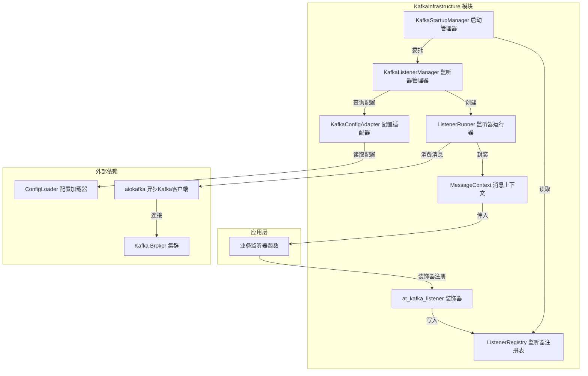
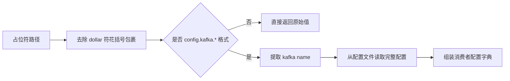
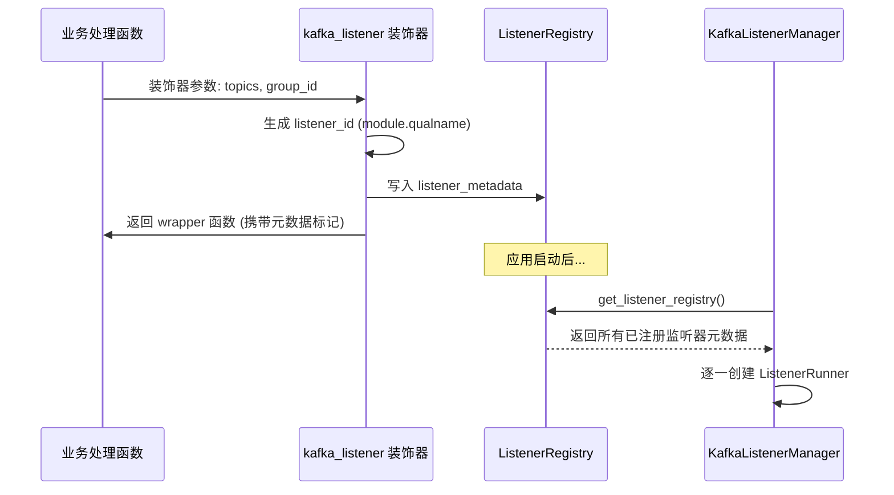
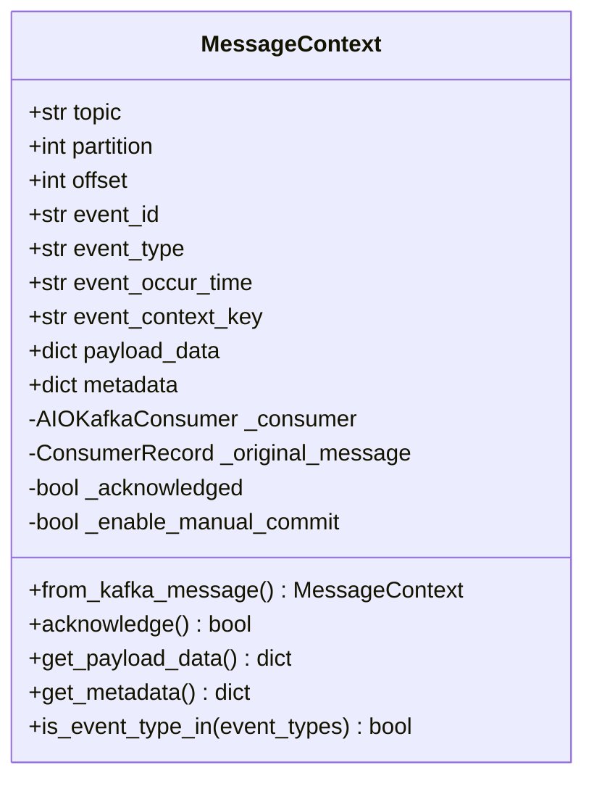
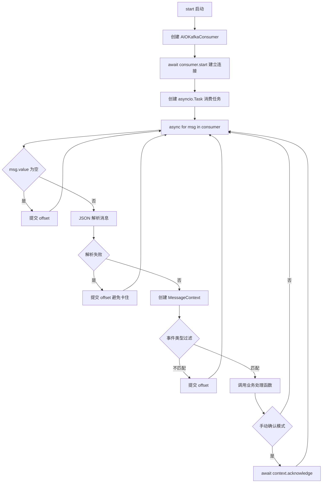
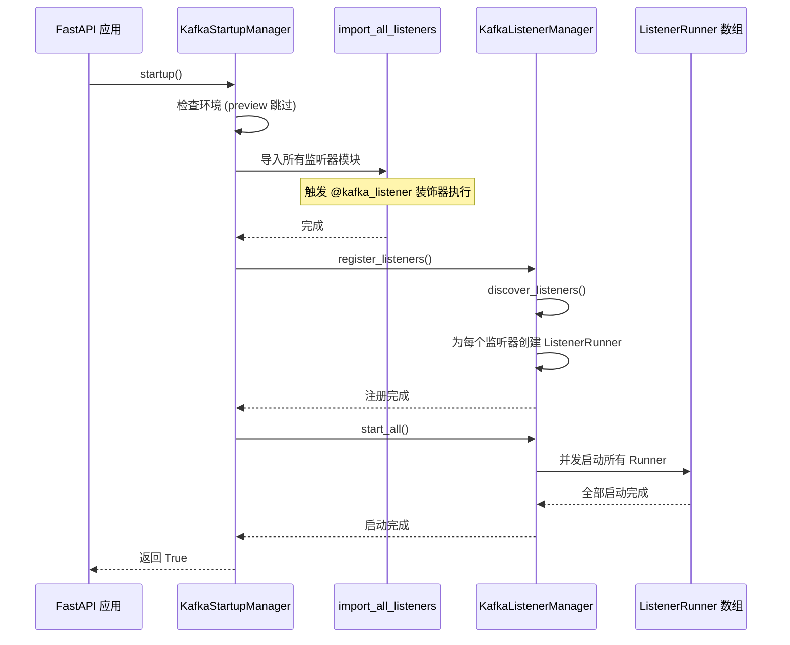
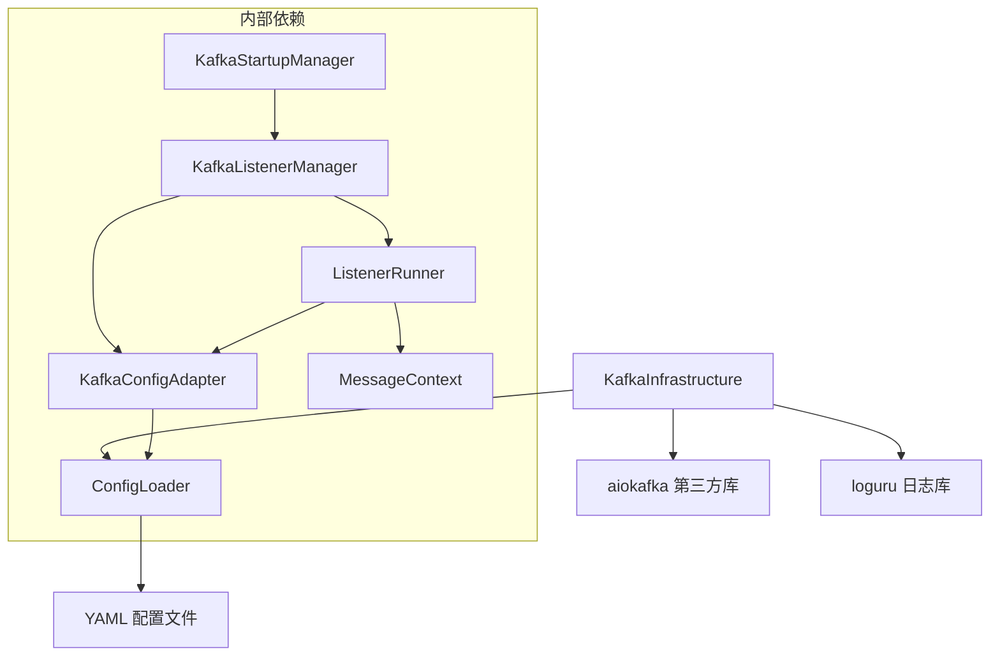
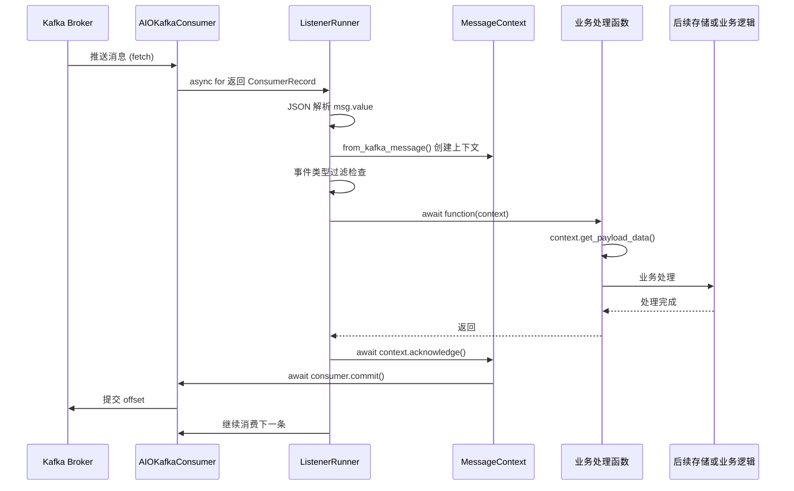

# KafkaInfrastructure

## 模块概述

KafkaInfrastructure 是系统的 Kafka 消息消费基础设施层，提供基于 `aiokafka` 的完全异步 Kafka 消费者管理能力。该模块借鉴了 Java Spring Kafka 的 `@KafkaListener` 注解模式，通过装饰器声明式注册消息监听器，由启动管理器统一管理监听器的生命周期，实现了配置驱动、声明式注册、全异步消费的架构设计。

模块的核心职责包括：
- **配置适配**：从 YAML 配置文件中读取 Kafka 连接参数，支持占位符解析和多环境配置
- **监听器注册与发现**：通过 `@kafka_listener` 装饰器声明式注册消息处理函数，运行时自动发现所有监听器
- **消息消费管理**：封装 `AIOKafkaConsumer`，提供全异步的消息拉取、处理、确认流程
- **生命周期管理**：统一管理所有监听器的启动、运行、停止，与应用生命周期联动

## 系统架构



## 核心组件详解

### 1. KafkaConfigAdapter — 配置适配器

**文件**：`infrastructure/kafka/config_adapter.py`

配置适配器是模块的配置中心，负责将 YAML 配置文件中的 Kafka 配置转化为 `aiokafka` 消费者所需的参数字典。

**核心能力**：

| 方法 | 职责 |
|------|------|
| `resolve_config_path()` | 解析占位符路径（如 `${config.kafka.test-demo.consumer.topics}`），提取 Kafka 配置名称和完整配置字典 |
| `resolve_topics()` | 从占位符解析出 topic 列表，支持字符串和列表两种配置格式 |
| `get_consumer_config()` | 组装完整的 aiokafka 消费者配置字典，包含 bootstrap_servers、group_id、拉取策略等全部参数 |

**配置解析流程**：



**配置优先级**：参数传入 > 配置文件 > 默认值。例如 `group_id` 参数若在装饰器中显式指定则优先使用，否则从配置文件的 `kafka.{name}.consumer.group-id` 读取，最终回退到 `"default-group"`。

**默认参数**：

| 参数 | 默认值 | 说明 |
|------|--------|------|
| `session_timeout_ms` | 30000 | 会话超时 30 秒 |
| `heartbeat_interval_ms` | 10000 | 心跳间隔 10 秒 |
| `fetch_min_bytes` | 1 | 有消息立即返回 |
| `fetch_max_wait_ms` | 500 | Broker 等待凑消息最大 500ms |
| `max_partition_fetch_bytes` | 1048576 | 单分区最大拉取 1MB |
| `auto_offset_reset` | latest | 默认从最新位置消费 |

配置适配器以单例模式运行，通过 `get_kafka_config_adapter()` 获取全局实例。

### 2. @kafka_listener 装饰器 — 声明式监听器注册

**文件**：`infrastructure/kafka/kafka_decorators.py`

装饰器系统提供类似 Java Spring Kafka 的 `@KafkaListener` 注解功能，是声明式编程的核心。

**注册机制**：



**注册元数据结构**：

| 字段 | 类型 | 说明 |
|------|------|------|
| `function` | Callable | 原始业务处理函数 |
| `topics` | str | topic 占位符路径 |
| `group_id` | str or None | 消费者组 ID，None 表示从配置读取 |
| `module` | str | 函数所在模块路径 |
| `qualname` | str | 函数限定名 |

装饰器在被应用时立即执行注册（模块导入时），而非运行时动态注册，这保证了所有监听器在应用启动前就已进入注册表。

### 3. MessageContext — 消息上下文

**文件**：`infrastructure/kafka/message_context.py`

消息上下文是对 Kafka 消息的结构化封装，为业务监听器提供统一的消息访问接口。

**数据模型**：



**消息确认机制**：

- 当 `enable_auto_commit=False` 时，上下文进入手动确认模式
- 业务函数处理完毕后，由 `ListenerRunner` 自动调用 `acknowledge()` 提交 offset
- 如果业务函数抛出异常，offset 不会被提交，消息将在消费者重启后被重新消费（at-least-once 语义）
- 非手动确认模式下，`acknowledge()` 返回 `False` 且不执行操作

### 4. ListenerRunner — 监听器运行器

**文件**：`infrastructure/kafka/listener_manager.py`

ListenerRunner 是单个监听器的运行时实体，封装了 `AIOKafkaConsumer` 的完整生命周期。

**消息消费流程**：



**关键设计决策**：

- **顺序消费**：消息逐条处理（`await self._process_message(msg)`），处理完一条再拉取下一条，保证消息顺序性
- **解析失败不阻塞**：JSON 解析失败的消息也会提交 offset，避免消费者卡在同一条损坏消息上
- **异常隔离**：单条消息处理异常不会终止整个消费循环
- **优雅关闭**：通过 `asyncio.Task` 取消实现，支持 `CancelledError` 清理

### 5. KafkaListenerManager — 监听器管理器

**文件**：`infrastructure/kafka/listener_manager.py`

管理器负责监听器的发现、注册和集群管理。

**核心职责**：

| 方法 | 职责 |
|------|------|
| `discover_listeners()` | 从装饰器全局注册表获取所有已注册的监听器元数据 |
| `register_listeners()` | 遍历元数据，为每个监听器创建 `ListenerRunner` 并完成配置解析 |
| `start_all()` | 并发启动所有 `ListenerRunner`（`asyncio.gather`） |
| `stop_all()` | 并发停止所有 `ListenerRunner`（`asyncio.gather`） |

### 6. KafkaStartupManager — 启动管理器

**文件**：`infrastructure/kafka/startup.py`

启动管理器是模块与应用生命周期的集成点。

**启动流程**：



**环境控制**：
- `preview` 环境跳过 Kafka 启动，避免重复消费生产数据
- 其他环境正常启动

## 模块间依赖关系



**依赖模块说明**：

| 依赖模块 | 依赖方式 | 说明 |
|---------|---------|------|
| [ConfigLoader](ConfigLoader.md) | 配置读取 | 通过 `config` 全局对象获取 Kafka 集群地址、消费者参数等配置 |
| `aiokafka` | 底层客户端 | 异步 Kafka 消费者实现，提供 `AIOKafkaConsumer` 和 `ConsumerRecord` |
| `loguru` | 日志 | 全模块统一使用 loguru 进行结构化日志记录 |

**被依赖关系**：

KafkaInfrastructure 作为基础设施层模块，不被其他 infrastructure 模块直接依赖。业务层通过以下方式使用：
1. 使用 `@kafka_listener` 装饰器注册消息处理函数
2. 在应用启动时调用 `start_kafka_service()` / `stop_kafka_service()` 管理生命周期

## 完整数据流



## 关键设计模式

### 1. 单例模式

模块中所有管理器类均采用单例模式，通过模块级 `_global_*` 变量和 `get_*()` 工厂函数实现：

- `get_kafka_config_adapter()` — 全局配置适配器
- `get_kafka_listener_manager()` — 全局监听器管理器
- `get_kafka_startup_manager()` — 全局启动管理器

这保证了全应用只有一套 Kafka 消费者管理实例，避免重复消费和资源浪费。

### 2. 装饰器注册模式

采用 Python 装饰器实现声明式监听器注册，类比 Java Spring Kafka 的注解体系：

| Java Spring Kafka | 本模块 |
|-------------------|--------|
| `@KafkaListener(topics="...")` | `@kafka_listener(topics="...")` |
| `@EnableKafka` + 自动扫描 | `_import_all_listeners()` + 注册表发现 |
| `Acknowledgment.acknowledge()` | `context.acknowledge()` |
| `ConsumerRecord` | `MessageContext` |

### 3. 配置驱动模式

所有 Kafka 配置集中管理在 YAML 配置文件中，代码中通过占位符引用而非硬编码：

```yaml
# config/dev.yaml
kafka:
  test-demo:
    bootstrap-servers:
      - broker0.kafka-test.ke.com:3001
    consumer:
      group-id: test
      enable-auto-commit: false
      topics: my-topic
```

装饰器只需引用路径：`@kafka_listener(topics="config.kafka.test-demo.consumer.topics")`，实现了配置与代码的解耦。

### 4. 全异步架构

模块从底层到上层完全基于 Python `asyncio`：
- `AIOKafkaConsumer` 提供原生异步消费能力
- `async for` 迭代消息，不阻塞事件循环
- `asyncio.create_task` 启动消费循环，与 FastAPI 请求处理并发执行
- `asyncio.gather` 并发管理多个监听器的启停

### 5. at-least-once 语义

通过手动 offset 提交实现消息至少一次消费：
- 消息处理成功后才提交 offset
- 处理失败则不提交，消息在消费者重启后重新投递
- 配置 `enable-auto-commit: false` 启用手动确认模式
