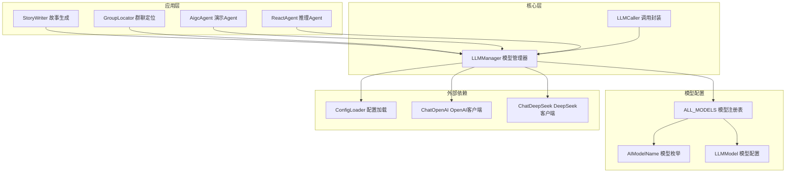
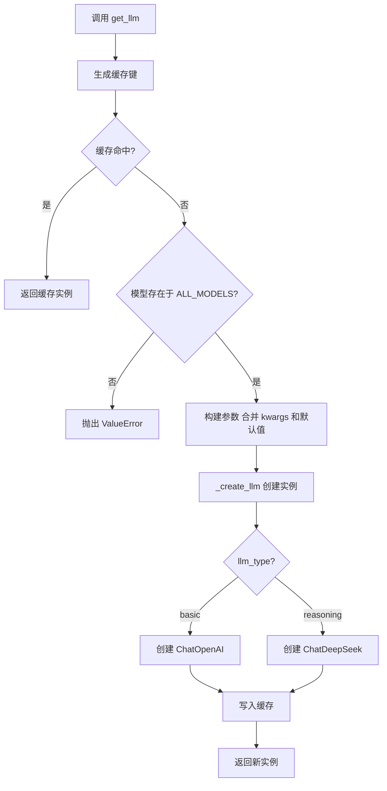
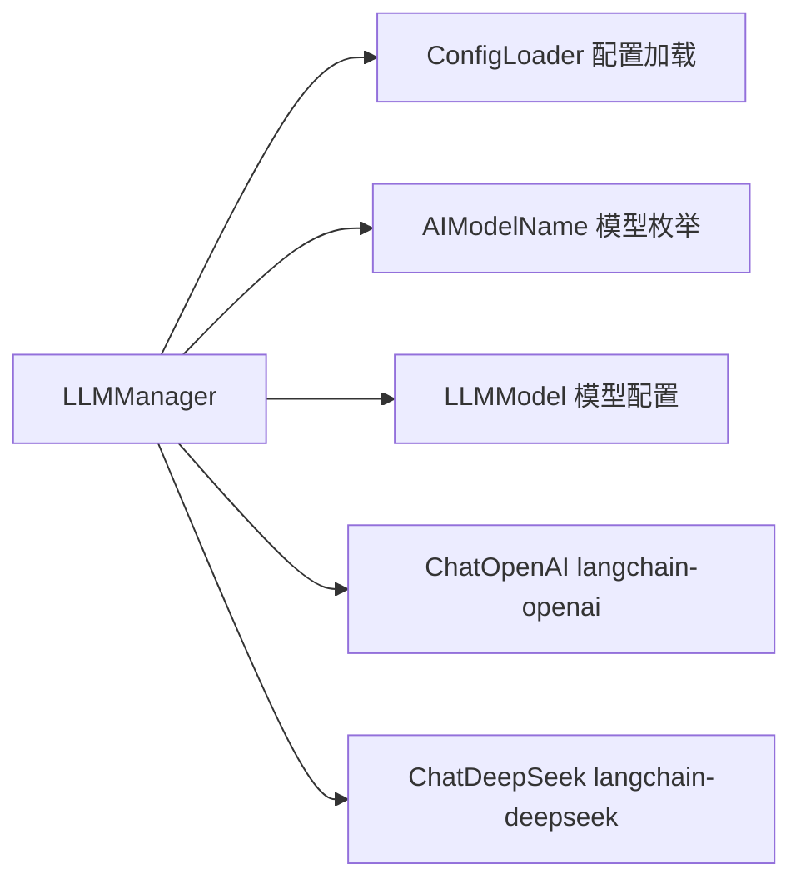
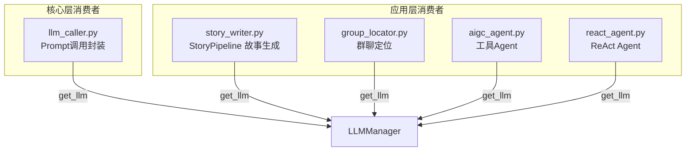
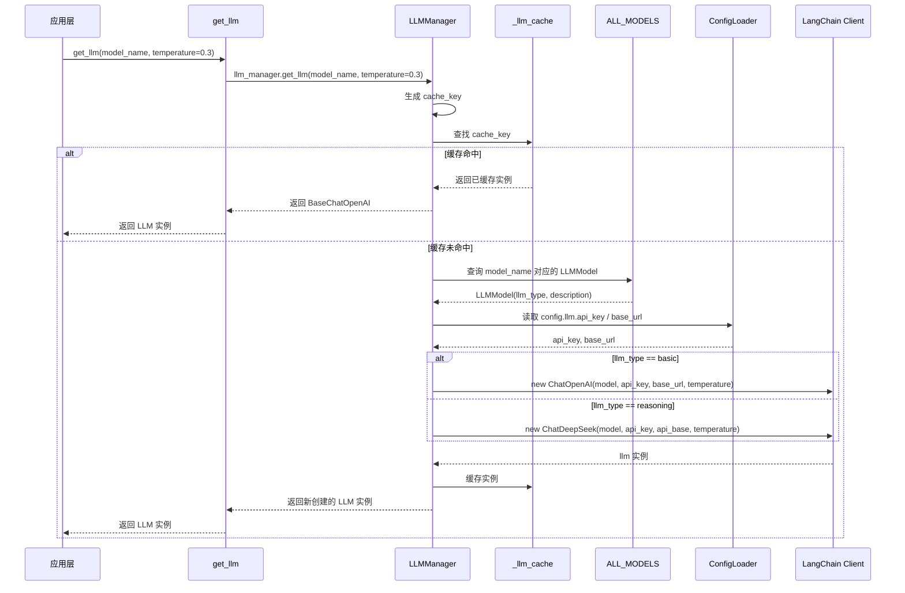

# LLMManager 模块

## 模块概述

LLMManager 是 AIGC-Agent 系统的 **大语言模型统一管理模块**，位于 `core/llm/` 包下，负责 LLM 实例的创建、缓存和生命周期管理。它向上层应用提供统一的 LLM 获取接口，屏蔽了不同模型供应商（OpenAI、豆包、通义千问、DeepSeek）的底层实现差异，是整个系统中所有 AI 推理调用的基础设施层。

核心设计目标：

- **单一入口**：所有模块通过 `get_llm()` 函数获取 LLM 实例，无需关心创建细节
- **实例缓存**：基于模型名称和参数组合的缓存策略，避免重复创建开销
- **多供应商适配**：通过 `LLMType` 区分基础模型（`basic`）和推理模型（`reasoning`），自动路由到对应的 LangChain 实现类
- **配置驱动**：API Key、Base URL 等敏感信息从 [ConfigLoader](ConfigLoader.md) 加载，不硬编码在代码中

## 架构总览



## 核心组件详解

### AIModelName — 模型名称枚举

`AIModelName` 是一个 `StrEnum` 枚举类，定义了系统支持的所有 LLM 模型标识。模型按供应商分组：

| 供应商 | 模型系列 | 模型数量 | LLMType |
|--------|---------|---------|---------|
| OpenAI | GPT-4o / GPT-4o-mini / GPT-5.5 | 3 | basic |
| 字节豆包 | Doubao-1.5-pro / lite / Seed-1.6 系列 | 6 | basic + reasoning |
| 阿里通义 | Qwen-Turbo / Plus / Max / QwQ / Qwen3 系列 | 9 | basic + reasoning |
| DeepSeek | Chat / V3.1 / V3.2 / Reasoner | 4 | basic + reasoning |

`AIModelName` 的字符串值即为传给 LLM API 的 `model` 参数（如 `"gpt-4o"`、`"deepseek-chat"`），保证了枚举值与实际 API 调用参数的一致性。

### LLMModel — 模型配置实体

`LLMModel` 是一个 Pydantic BaseModel，描述单个模型的元数据：

```
LLMModel
├── model_name: AIModelName    # 模型标识
├── llm_type: LLMType          # "basic" 或 "reasoning"
└── description: str            # 可读描述
```

`llm_type` 字段决定了 LLMManager 使用哪个 LangChain 客户端类来创建实例。

### ALL_MODELS — 模型注册表

`ALL_MODELS` 是一个 `dict[AIModelName, LLMModel]` 类型的全局字典，充当模型注册表。LLMManager 在创建实例前会先在此字典中校验模型是否存在。新增模型支持需要在此字典中添加对应条目。

### LLMManager — 模型管理器

`LLMManager` 是模块的核心类，采用 **单例模式** 实现。其内部维护一个模块级缓存字典 `_llm_cache`，以 `model_name:kwargs_json` 为键存储已创建的 LLM 实例。

#### 关键流程



#### 缓存策略

缓存键由 `model_name` 和 `kwargs` 的 JSON 序列化拼接而成：

```python
cache_key = f"{model_name}:{kwargs_str}"
```

这意味着：
- 相同模型 + 相同参数 → 返回同一实例（命中缓存）
- 相同模型 + 不同 `temperature` → 创建新实例（不同缓存条目）
- 缓存为进程级内存缓存，生命周期与应用进程一致

#### 模型路由逻辑

`_create_llm` 方法根据 `LLMModel.llm_type` 字段进行路由：

| llm_type | 实现类 | 说明 |
|----------|-------|------|
| `"basic"` | `langchain_openai.ChatOpenAI` | 通用对话模型，兼容 OpenAI 协议 |
| `"reasoning"` | `langchain_deepseek.ChatDeepSeek` | 推理增强模型，使用 DeepSeek 私有协议 |

所有实例共享同一组 `api_key` 和 `base_url`（来自 [ConfigLoader](ConfigLoader.md)），通过 `model` 参数区分具体模型。

#### 公开接口

模块对外暴露三层 API，但推荐使用顶层便捷函数：

| 接口 | 类型 | 推荐度 | 说明 |
|------|------|--------|------|
| `get_llm(model_name, **kwargs)` | 顶层函数 | 推荐 | 所有消费者统一使用此接口 |
| `llm_manager` | 模块变量 | 不推荐 | LLMManager 单例实例，内部使用 |
| `LLMManager` | 类 | 不推荐 | 仅在需要直接操作单例时使用 |

## 模块依赖关系

### 上游依赖



| 依赖 | 来源模块 | 依赖内容 |
|------|---------|---------|
| [ConfigLoader](ConfigLoader.md) | Core / Config | 读取 `config.llm.api_key` 和 `config.llm.base_url` |
| AIModelName | 本模块 `models.py` | 模型标识枚举 |
| ALL_MODELS | 本模块 `models.py` | 模型注册表，校验模型合法性 |
| ChatOpenAI | langchain-openai | OpenAI 兼容协议的 LLM 客户端 |
| ChatDeepSeek | langchain-deepseek | DeepSeek 推理模型客户端 |

### 下游消费者



各消费者的典型调用模式：

| 消费者 | 调用示例 | 用途 |
|--------|---------|------|
| LLMCaller | `get_llm(model_name, **kwargs)` | 通用 Prompt 调用，含重试逻辑 |
| StoryWriter | `get_llm(AIModelName.GPT_5_5, temperature=0.3)` | 结构化故事内容生成 |
| GroupLocator | `get_llm(AIModelName.DOUBAO_SEED_1_6, temperature=0.1)` | 群聊消息分类定位 |
| AigcAgent | `get_llm(AIModelName.DEEPSEEK_CHAT)` | 带工具调用的演示 Agent |
| ReactAgent | `get_llm(AIModelName.DEEPSEEK_V3_1)` | ReAct 推理模式 Agent |

## 数据流

### LLM 实例获取的完整数据流



## 关键设计模式

### 单例模式（Singleton）

`LLMManager` 通过 `__new__` 方法实现单例，确保整个进程内只有一个管理器实例：

```python
class LLMManager:
    _instance: "LLMManager | None" = None

    def __new__(cls):
        if cls._instance is None:
            cls._instance = super().__new__(cls)
        return cls._instance
```

模块级变量 `llm_manager = LLMManager()` 进一步保证了实例的全局可访问性。配合 `get_llm()` 便捷函数，消费者无需感知单例的存在。

### 工厂模式（Factory）

`_create_llm` 方法是工厂方法，根据 `llm_type` 参数创建不同类型的 LLM 客户端。当前支持两种产品：

- `ChatOpenAI`：兼容 OpenAI 协议的基础模型客户端
- `ChatDeepSeek`：DeepSeek 推理模型专用客户端

新增 LLM 供应商时，只需：1) 在 `AIModelName` 中添加模型标识；2) 在 `ALL_MODELS` 中注册配置；3) 在 `_create_llm` 中添加新的类型分支。

### 代理缓存模式（Cache-Aside）

缓存采用经典的 Cache-Aside 策略：
1. **读取时**：先查缓存，命中则直接返回
2. **未命中时**：创建新实例，写入缓存后返回
3. **无主动失效**：LLM 实例本身是无状态的（不持有会话上下文），因此缓存无需过期机制

## 扩展指南

### 新增模型支持

1. 在 `AIModelName` 枚举中添加新的模型标识
2. 在 `ALL_MODELS` 字典中注册对应的 `LLMModel` 配置
3. 如果使用新的 LangChain 客户端，在 `_create_llm` 中添加 `llm_type` 分支

### 新增 LLM 供应商

1. 添加依赖包（如 `langchain-anthropic`）
2. 定义新的 `LLMType` 值（如 `"reasoning_v2"`）
3. 在 `_create_llm` 中添加对应的客户端实例化逻辑
