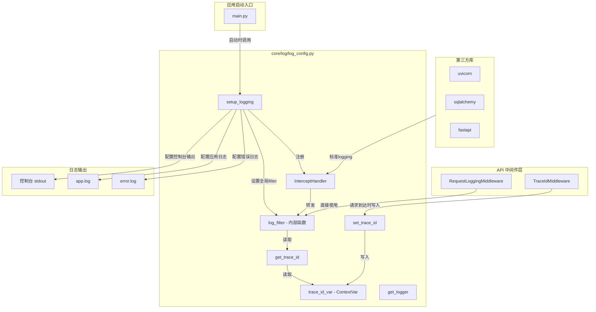
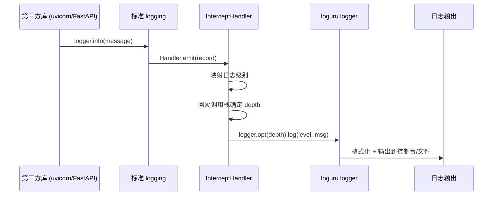
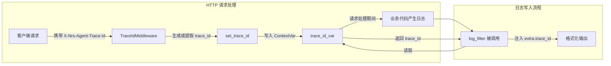
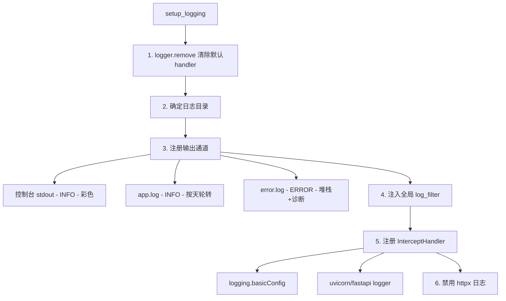
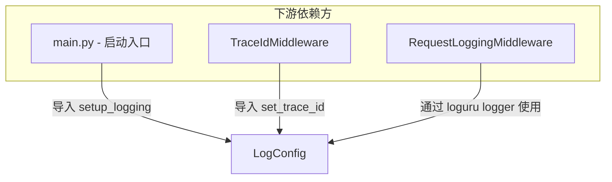
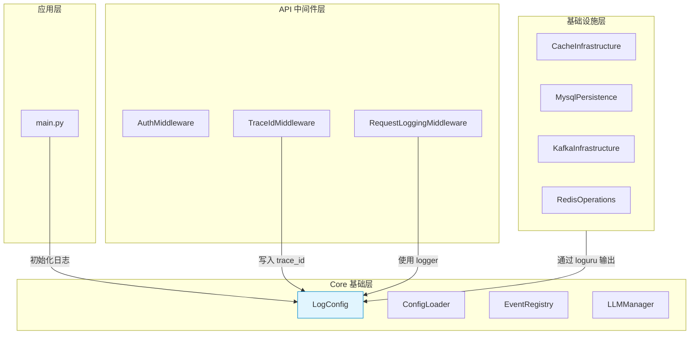
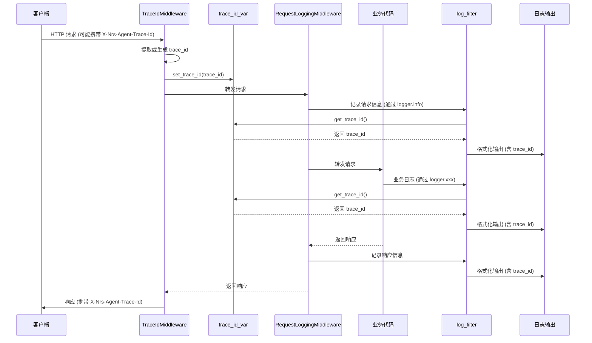

# LogConfig — 统一日志配置模块

## 1. 模块概述

LogConfig 是 agent 系统的**日志基础设施层**，基于 [loguru](https://github.com/Delgan/loguru) 构建，提供统一的日志管理能力。它承担三项核心职责：

1. **日志系统初始化** — 替换 loguru 默认 handler，配置控制台输出与文件输出（应用日志、错误日志），支持按天轮转与自动清理。
2. **第三方库日志拦截** — 通过 `InterceptHandler` 捕获 uvicorn、SQLAlchemy、FastAPI 等使用标准 `logging` 模块的第三方库日志，统一汇入 loguru 管道。
3. **Trace ID 上下文传播** — 利用 Python `contextvars` 实现请求级 trace_id 注入，使同一请求链路的所有日志可关联追踪。

模块位于 `core/log/` 目录，属于系统分层架构中的 **Core 层（基础层）**，被上层的 API 中间件和应用启动入口直接依赖。

---

## 2. 架构总览



---

## 3. 核心组件详解

### 3.1 `InterceptHandler`

**文件**: `core/log/log_config.py`
**类型**: `logging.Handler` 子类

`InterceptHandler` 是连接 Python 标准 `logging` 与 loguru 的桥接器。它拦截所有通过 `logging.Handler.emit()` 输出的日志记录，将其转发到 loguru 的统一管道中。

**工作原理**:

1. 接收标准 `logging.LogRecord` 对象。
2. 将 `record.levelname` 映射为 loguru 日志级别名称（找不到映射时回退到 `record.levelno` 数值级别）。
3. 通过 `sys._getframe(6)` 向上回溯调用栈，跳过 logging 模块自身的帧，定位到真正的调用者。
4. 使用 `logger.opt(depth=..., exception=...)` 将日志转发到 loguru，保持原始调用位置和异常信息。

**注册时机**: 在 `setup_logging()` 中通过 `logging.basicConfig(handlers=[InterceptHandler()], force=True)` 全局替换默认 handler，并为 uvicorn / FastAPI 的 logger 单独设置。



---

### 3.2 `trace_id_var` — Trace ID 上下文变量

**类型**: `contextvars.ContextVar[str | None]`

基于 Python `contextvars.ContextVar` 实现的请求级上下文变量，存储当前请求的 trace_id。

| 函数 | 说明 |
|------|------|
| `get_trace_id()` | 读取当前上下文的 trace_id，未设置时返回 `"N/A"` |
| `set_trace_id(trace_id)` | 写入当前上下文的 trace_id |

**关键设计**:

- `ContextVar` 是 Python 原生的协程安全上下文变量，每个 asyncio Task 拥有独立的上下文副本，天然支持并发场景下不同请求的日志隔离。
- trace_id 的**写入方**是 [TraceIdMiddleware](api/middlewares/trace_id.py)（在请求到达时从 HTTP 头读取或生成 UUID）。
- trace_id 的**读取方**是 `setup_logging()` 内部的 `log_filter` 函数，在每条日志写入时自动注入到 `record["extra"]["trace_id"]`。



---

### 3.3 `setup_logging()` — 日志系统初始化

**参数**:

| 参数 | 类型 | 默认值 | 说明 |
|------|------|--------|------|
| `retention` | `int` | `10` | 日志文件保留天数 |

**初始化流程**:

1. **清除默认 handler** — 调用 `logger.remove()` 移除 loguru 默认的 stderr handler。
2. **确定日志目录** — 从环境变量 `MATRIX_APPLOGS_DIR` 读取，未设置时使用 `/tmp`。
3. **注册三个输出通道**:

| 通道 | 文件 | 级别 | 特性 |
|------|------|------|------|
| 控制台 | `sys.stdout` | INFO | 彩色输出，异步队列 |
| 应用日志 | `{log_dir}/app.log` | INFO | 按天轮转，UTF-8 编码，异步队列 |
| 错误日志 | `{log_dir}/error.log` | ERROR | 按天轮转，完整堆栈+诊断模式，异步队列 |

4. **注入全局 filter** — 所有通道共享 `log_filter` 函数，自动注入 `trace_id` 和完整文件路径。
5. **拦截标准 logging** — 通过 `InterceptHandler` 捕获第三方库日志。
6. **禁用 httpx 日志** — 将 httpx logger 级别设为 WARNING，避免 HTTP 请求的重复打印。



---

### 3.4 `get_logger(name)` — Logger 实例获取

返回绑定了自定义 `name` 标签的 loguru logger 实例。通过 `logger.bind(name=name)` 实现，可在日志格式中通过 `{extra[name]}` 引用。

> **注意**: 当前代码中日志格式未显式使用 `{extra[name]}`，此函数主要作为预留扩展点，便于未来按模块名过滤日志。

---

### 3.5 `format_record(record)` — 日志格式化（保留函数）

将完整文件绝对路径注入到 `record["extra"]["file_path"]`。该函数定义在模块中但**未被 `setup_logging()` 使用**——实际路径注入逻辑由 `log_filter` 内联完成。此函数可能用于 loguru 的 `format` 参数（`logger.add(format=format_record)` 形式），当前代码选择通过 filter 方式实现。

---

## 4. 依赖关系

### 4.1 被依赖关系（下游消费者）



| 消费者 | 使用的接口 | 说明 |
|--------|-----------|------|
| `main.py` | `setup_logging()` | 应用启动时初始化日志系统 |
| `TraceIdMiddleware` | `set_trace_id()` | 请求到达时写入 trace_id 到上下文 |
| `RequestLoggingMiddleware` | `loguru.logger` | 直接使用已配置的 loguru logger 记录请求/响应 |

### 4.2 主动依赖（上游提供方）

| 依赖 | 类型 | 说明 |
|------|------|------|
| `loguru` | 第三方库 | 核心日志引擎 |
| `contextvars` | 标准库 | 协程安全的上下文变量 |
| `logging` | 标准库 | 被拦截的标准日志模块 |
| `sys` | 标准库 | `sys._getframe` 用于调用栈回溯 |
| `os` / `pathlib` | 标准库 | 日志目录和文件路径处理 |

### 4.3 模块在整体架构中的位置



LogConfig 处于系统**最底层的基础层**，是所有模块的日志输出通道。基础设施层（MySQL、Redis、Kafka 等）虽然不直接导入 LogConfig，但其日志通过 `InterceptHandler` 的标准 logging 拦截机制被统一纳入 loguru 管道。

---

## 5. 数据流

### 5.1 请求链路中的日志数据流



### 5.2 日志输出格式

**控制台格式**（带 ANSI 颜色）:
```
2026-07-10 14:30:45.123 | INFO     | abc-123-def | /path/to/file.py:42 - 日志消息
```

**文件格式**（纯文本）:
```
2026-07-10 14:30:45.123 | INFO     | abc-123-def | /path/to/file.py:42 - 日志消息
```

格式组成:

| 字段 | 说明 |
|------|------|
| `{time:YYYY-MM-DD HH:mm:ss.SSS}` | 时间戳，精确到毫秒 |
| `{level: <8}` | 日志级别，左对齐 8 字符 |
| `{extra[trace_id]}` | 请求追踪 ID（来自 `log_filter` 注入） |
| `{extra[file_path]}:{line}` | 源文件绝对路径 + 行号 |
| `{message}` | 日志内容 |

---

## 6. 关键设计模式

### 6.1 ContextVar 模式 — 协程安全的请求上下文

LogConfig 使用 `contextvars.ContextVar` 而非线程局部变量（`threading.local`）来存储 trace_id。这是 FastAPI/ASGI 异步架构的正确选择：

- **协程隔离**: 每个 asyncio Task 继承创建时的上下文副本，不同请求的 trace_id 互不干扰。
- **自动传播**: `ContextVar` 的值在 `await` 切换时自动跟随，无需手动传递。
- **零侵入**: 业务代码无需显式传递 trace_id 参数，只需在请求入口设置一次。

### 6.2 Handler 拦截模式 — 统一日志管道

通过 `InterceptHandler` 实现"日志门面"（Facade）模式：

- **对上层透明**: 业务代码使用 `loguru.logger` 直接输出。
- **对第三方透明**: uvicorn、SQLAlchemy 等通过标准 `logging` 输出，无需修改代码。
- **统一出口**: 所有日志最终经过相同的 filter、格式化、输出通道。

### 6.3 Filter 注入模式 — 隐式上下文增强

`log_filter` 函数作为所有日志通道的共享 filter，在日志写入时自动注入上下文信息（trace_id、文件路径）。这种模式的优势：

- **日志格式中可引用 `extra` 字段**: 无需在每条日志中手动附加 trace_id。
- **集中维护**: 修改日志格式只需改 `setup_logging()` 一处。

### 6.4 异步队列模式 — `enqueue=True`

所有 `logger.add()` 调用均使用 `enqueue=True`，启用 loguru 的异步写入队列。日志写入操作在独立线程中执行，不阻塞主事件循环，对 SSE 流式响应等长连接场景尤为重要。

---

## 7. 环境配置

| 环境变量 | 作用 | 默认值 |
|----------|------|--------|
| `MATRIX_APPLOGS_DIR` | 日志文件输出目录 | `/tmp` |

日志保留策略由 `setup_logging(retention)` 参数控制，默认保留 10 天，通过 loguru 的 `retention` 参数实现自动清理。
