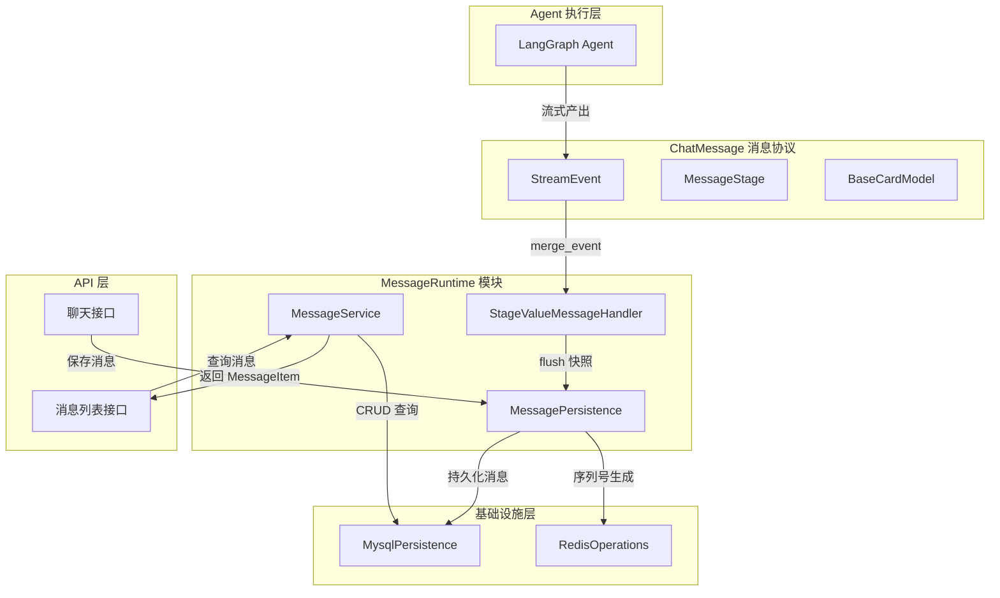
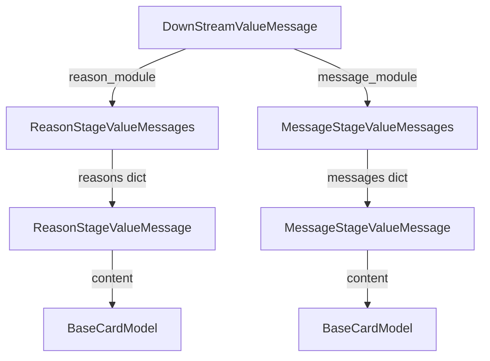
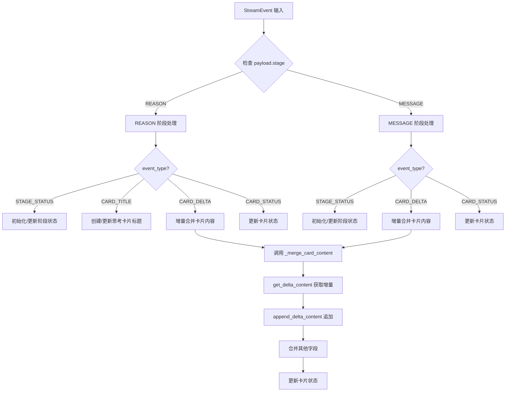
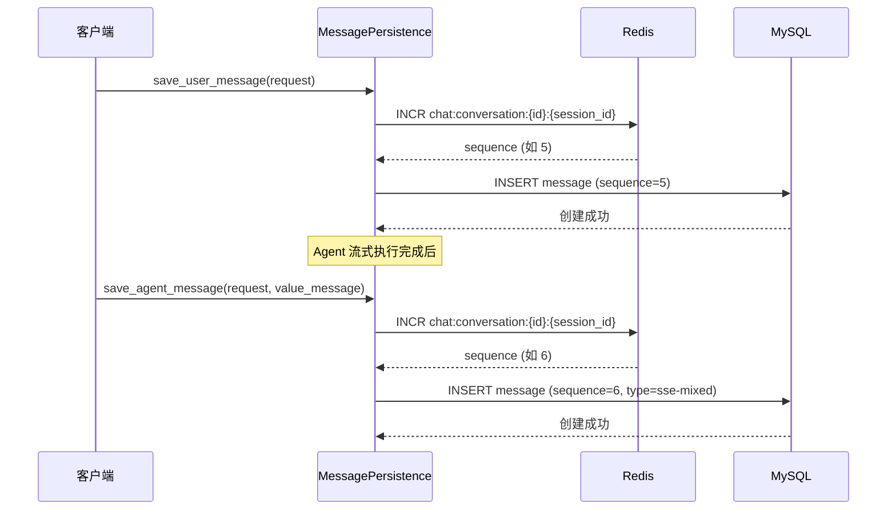
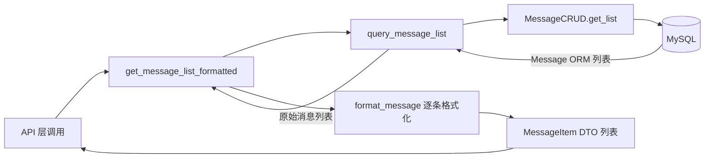
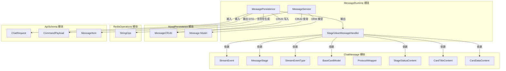
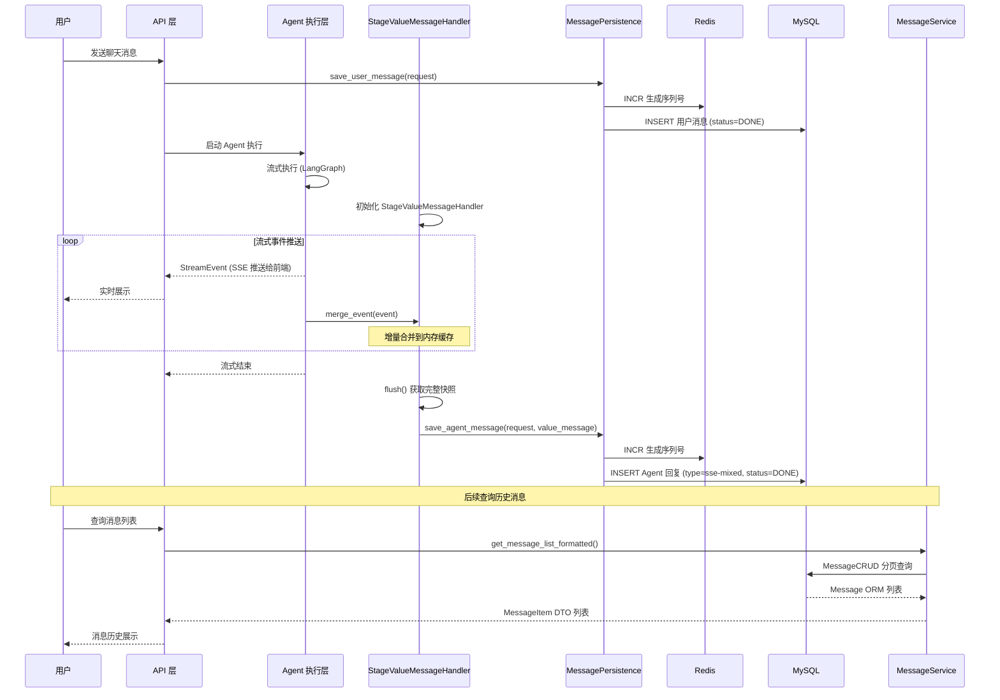

# MessageRuntime 模块

## 模块概述

MessageRuntime 是 aigc-agent 系统的**消息运行时层**，负责流式消息的实时聚合、持久化和查询服务。它位于 Agent 执行层与基础设施层之间，是连接"流式消息产出"和"消息持久化存储"的核心枢纽。

该模块解决的核心问题是：Agent 以流式方式（SSE）输出结构化消息（包含思考过程和最终回复），这些增量消息需要在推送前端的同时被聚合成完整快照，最终持久化到 MySQL，同时支持历史消息的分页查询和格式化输出。

## 系统定位

MessageRuntime 在整体架构中处于 **runtime 层**，上层对接 Agent 执行流水线产出的 `StreamEvent`，下层调用 [MysqlPersistence](MysqlPersistence.md) 和 [RedisOperations](RedisOperations.md) 进行数据存储。

## 核心组件

MessageRuntime 模块由三个核心类组成，各自承担不同的职责：

| 组件 | 文件 | 职责 |
|------|------|------|
| `StageValueMessageHandler` | `message_aggregator.py` | 流式消息聚合器，将增量事件合并为完整快照 |
| `MessagePersistence` | `message_persistence.py` | 消息持久化管理器，负责序列号生成和数据库写入 |
| `MessageService` | `message_service.py` | 消息业务服务，提供查询、格式化等业务逻辑 |

## StageValueMessageHandler — 流式消息聚合器

### 设计思想

StageValueMessageHandler 采用**增量聚合**模式：在 Agent 流式执行过程中，每产出一个 `StreamEvent` 就立即合并到内存缓存，流式结束后通过 `flush()` 获取完整消息快照。这种设计避免了事后回放或二次解析，实现"边推送、边聚合"。

### 聚合数据模型

聚合器内部维护的数据结构按 [ChatMessage](ChatMessage.md) 模块的 `MessageStage` 分为两个阶段：

| 数据模型 | 用途 | 关键字段 |
|---------|------|---------|
| `DownStreamValueMessage` | 持久化入口，包含两个阶段的完整消息 | `reason_module`, `message_module` |
| `ReasonStageValueMessages` | REASON 阶段消息容器 | `title`, `status`, `reasons: dict[str, ReasonStageValueMessage]` |
| `MessageStageValueMessages` | MESSAGE 阶段消息容器 | `status`, `messages: dict[str, MessageStageValueMessage]` |
| `ReasonStageValueMessage` | 单个思考步骤卡片 | `reason_id`, `title`, `status`, `content` |
| `MessageStageValueMessage` | 单个回复消息卡片 | `content: BaseCardModel` |

### 事件处理流程

`StageValueMessageHandler.merge_event()` 根据事件类型（[ChatMessage](ChatMessage.md) 中定义的 `StreamEventType`）执行不同的合并策略：

### 关键设计：卡片增量合并

REASON 阶段支持 `CARD_TITLE` 事件（创建新思考步骤），而 MESSAGE 阶段不支持——这是因为 REASON 阶段可能有多个思考卡片（如多步推理），而 MESSAGE 阶段通常只有一个回复卡片。

增量合并通过 `BaseCardModel` 的两个抽象方法实现（参见 [ChatMessage](ChatMessage.md)）：
- `get_delta_content()`：从增量卡片中提取增量字符串
- `append_delta_content(delta)`：将增量字符串追加到已缓存卡片

这使得不同卡片类型（`TextCard`、`PlainTextCard` 等）可以自定义合并策略，聚合器无需感知具体卡片实现。

### 序列化策略

聚合器的输出模型使用 Pydantic 的 `@field_serializer` 实现特定的序列化规则：
- `ReasonStageValueMessages.reasons`：字典转数组（`dict → list`），便于前端统一处理
- `MessageStageValueMessages.messages`：字典转数组
- `MessageStageValueMessage.content`：手动调用 `model_dump()` 确保子类字段被正确序列化

## MessagePersistence — 消息持久化管理器

### 核心职责

1. **序列号生成**：基于 Redis `INCR` 实现会话内消息序号自增
2. **用户消息保存**：将用户发送的消息写入数据库
3. **Agent 回复保存**：将聚合后的完整消息快照写入数据库

### 序列号生成机制

Redis Key 设计：`chat:conversation:{conversation_id}:{session_id}`，无过期时间，确保序列号持久递增。

### 消息方向映射

| 消息类型 | from_user_id | to_user_id | message_type |
|---------|-------------|-----------|-------------|
| 用户消息 | `request.ucid`（用户 ID） | `request.application_id`（应用 ID） | 原始 payload 类型 |
| Agent 回复 | `request.application_id`（应用 ID） | `request.ucid`（用户 ID） | `sse-mixed` |

### 异常处理

持久化操作采用**非阻塞容错**策略：保存失败时记录日志但不抛出异常，避免消息持久化失败影响流式消息的前端推送。这是一种合理的"尽力而为"设计，因为持久化是后置操作，不应阻塞实时交互。

## MessageService — 消息业务服务

### 核心职责

1. **分页查询**：按 `conversation_id` + `session_id` 查询消息列表
2. **格式化转换**：将数据库 `Message` 模型转换为 API 层 `MessageItem` DTO
3. **位置判断**：根据 `from_user_id` 判断消息是用户发送还是应用发送

### 消息位置判断逻辑

通过 `APPLICATION_USER_ID_PREFIX = "999"` 前缀判断：如果 `from_user_id` 包含 "999" 前缀，则判定为应用消息（Agent 回复），否则为用户消息。

### 查询与格式化流程

`format_message` 的转换要点：
- `message_payload`：JSON 字符串 → Python 字典
- `ctime`：`datetime` → `"YYYY-MM-DD HH:MM:SS"` 字符串
- `position`：根据 `from_user_id` 前缀判断，附加 `APPLICATION` 或 `USER` 标记

## 模块依赖关系

### 依赖说明

| 被依赖模块 | 依赖组件 | 用途 |
|-----------|---------|------|
| [ChatMessage](ChatMessage.md) | `StreamEvent`, `StreamEventType`, `MessageStage`, `MessageStatus`, `BaseCardModel`, `CardDataContent`, `CardTitleContent`, `StageStatusContent` | 流式事件模型和消息协议定义 |
| [MysqlPersistence](MysqlPersistence.md) | `MessageCRUD`, `Message` | 消息数据库读写 |
| [RedisOperations](RedisOperations.md) | `StringOps.incr` | 消息序列号自增 |
| [ApiSchema](ApiSchema.md) | `ChatRequest`, `CommandPayload`, `MessageItem` | 请求模型和 DTO 定义 |

## 端到端数据流

从用户发送消息到 Agent 回复完成，MessageRuntime 参与的完整数据流如下：

## 关键设计模式

### 1. 聚合器模式（Aggregator Pattern）

`StageValueMessageHandler` 作为聚合器，在流式消费过程中维护完整的中间状态，避免事后重建。核心优势：
- **零延迟聚合**：事件到达即合并，无需额外遍历
- **内存友好**：仅维护一个缓存字典，按阶段分组
- **序列化可控**：通过 Pydantic serializer 自定义输出格式

### 2. 策略模式（Strategy Pattern）

卡片增量合并通过 `BaseCardModel` 的抽象方法实现策略多态：
- `TextCard`：字符串追加 (`content += delta`)
- `PlainTextCard`：嵌套字段追加 (`content.text += delta`)
- 其他卡片类型可自行定义合并策略

聚合器无需感知具体卡片类型，遵循开闭原则。

### 3. 乐观写入（Optimistic Write）

消息持久化采用非阻塞容错：写入失败仅记录日志，不影响主流程。这种设计基于以下权衡：
- 消息已通过 SSE 实时推送前端，用户已看到内容
- 持久化失败不应阻断交互流程
- 可通过日志进行事后排查和补偿

### 4. Redis 自增序列号

使用 Redis `INCR` 而非数据库自增 ID 生成消息序列号，原因：
- 序列号需要按 `conversation_id + session_id` 维度隔离
- Redis `INCR` 是原子操作，保证并发安全
- 无过期时间设计，序列号永久递增，支持历史消息排序
