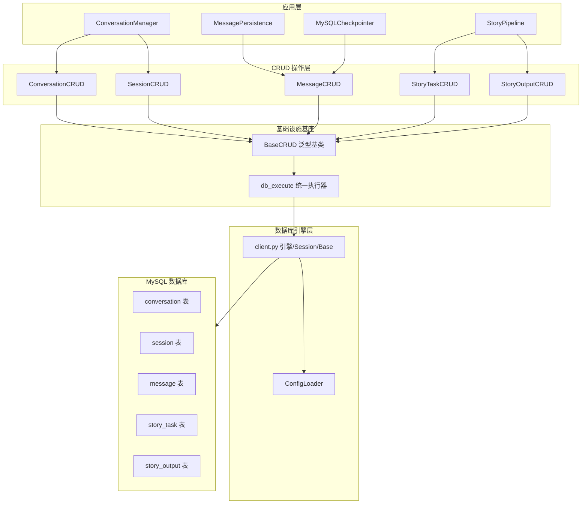
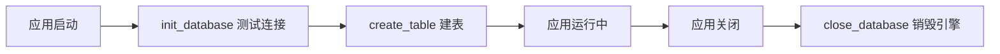
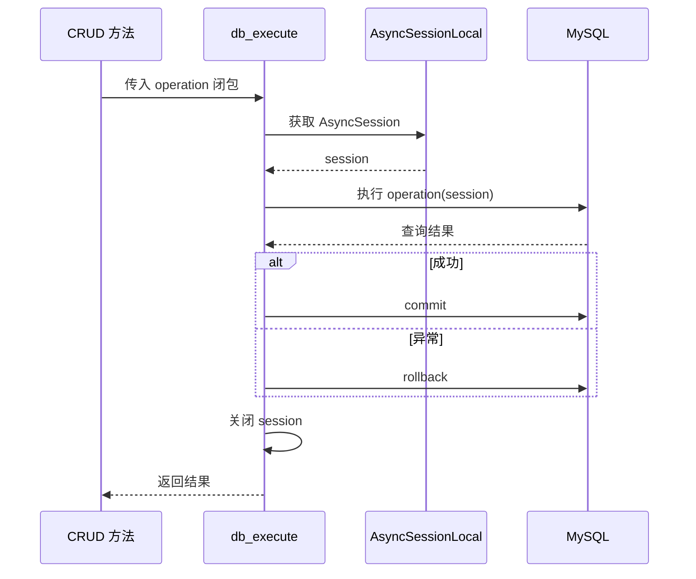
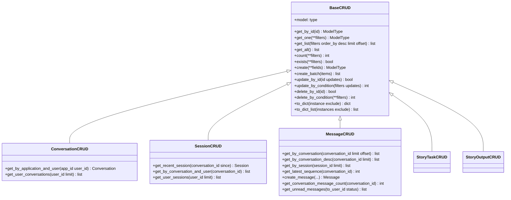
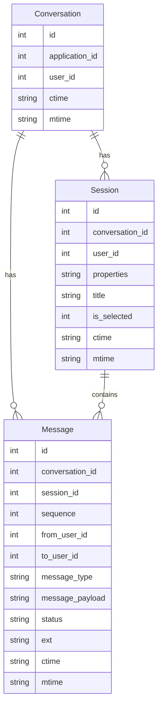
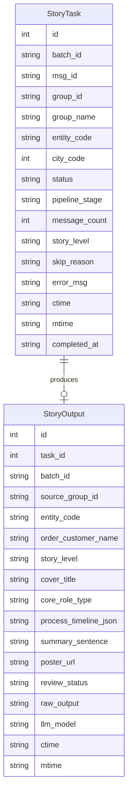
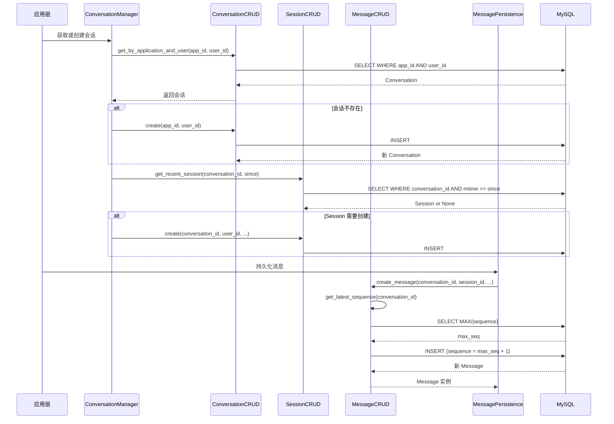
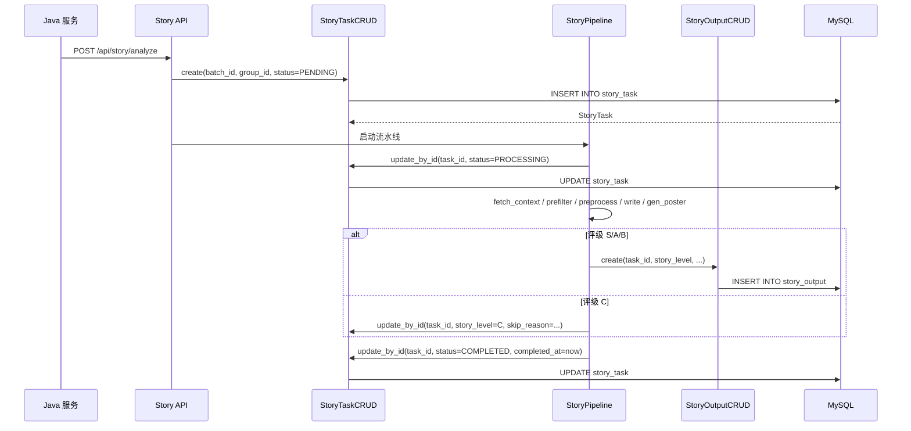
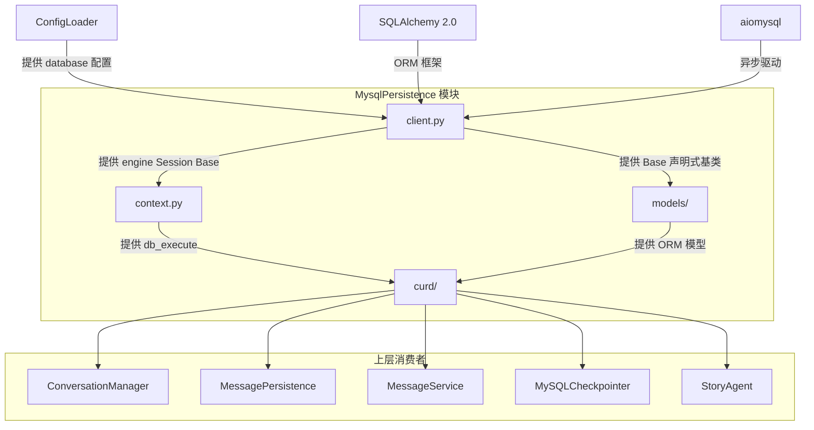

# MysqlPersistence

MySQL 持久化基础设施模块，基于 SQLAlchemy 2.0 异步引擎提供完整的数据库访问能力。采用三层架构设计——连接管理层、通用 CRUD 层、业务模型层——为整个 aigc-agent 系统提供会话、消息、Session 及故事任务的持久化存储。

## 架构总览



## 模块目录结构

```
infrastructure/mysql/
├── client.py                          # 异步引擎、Session 工厂、声明式基类
├── context.py                         # db_execute 统一事务执行器
├── models/
│   ├── __init__.py                    # 导出 Conversation, Message, Session
│   ├── must_model/
│   │   ├── conversation.py            # Conversation ORM 模型
│   │   ├── message.py                 # Message ORM 模型
│   │   └── session.py                 # Session ORM 模型
│   └── story/
│       ├── story_task.py              # StoryTask ORM 模型
│       └── story_output.py            # StoryOutput ORM 模型
└── curd/
    ├── __init__.py                    # 导出所有 CRUD 类
    ├── base.py                        # BaseCRUD 泛型 CRUD 基类
    ├── must_crud/
    │   ├── conversation.py            # ConversationCRUD
    │   ├── message.py                 # MessageCRUD
    │   └── session.py                 # SessionCRUD
    └── story_crud/
        ├── story_task_crud.py         # StoryTaskCRUD
        └── story_output_crud.py       # StoryOutputCRUD
```

## 核心组件详解

### 引擎层：client.py

引擎层是整个持久化模块的入口，负责数据库连接的生命周期管理。

**核心产物：**

| 产物 | 类型 | 说明 |
|------|------|------|
| `engine` | `AsyncEngine` | SQLAlchemy 异步引擎，配置了连接池（pool_size、max_overflow、pool_recycle）及 `pool_pre_ping=True` 防止连接断开 |
| `AsyncSessionLocal` | `async_sessionmaker` | 异步 Session 工厂，配置 `expire_on_commit=False`、`autoflush=False`、`autocommit=False` |
| `Base` | `DeclarativeBase` | 所有 ORM 模型的声明式基类 |
| `get_db()` | async generator | FastAPI 依赖注入用的数据库会话生成器 |
| `get_db_session()` | async context manager | 非 FastAPI 场景下的数据库会话上下文管理器 |

**生命周期管理：**



- `init_database()`：应用启动时调用，测试数据库连接可用性
- `create_table()`：通过 `metadata.create_all` 创建 Conversation、Session、Message 表
- `close_database()`：应用关闭时调用，释放连接池资源

**连接池配置：** 数据库 URL 通过 `build_database_url()` 从 [ConfigLoader](ConfigLoader.md) 读取配置并拼接为 `mysql+aiomysql://...` 格式，使用 aiomysql 作为异步驱动。

### 执行器层：context.py

`db_execute` 是整个持久化模块最核心的单一入口函数，所有数据库操作都必须通过它执行。

```python
async def db_execute[T](operation: Callable[[AsyncSession], Awaitable[T]]) -> T
```

**职责：**
- 从 `AsyncSessionLocal` 获取数据库连接
- 将 `operation` 闭包中的操作包装在事务中
- 自动 commit（成功时）或 rollback（异常时）
- 确保 Session 在使用后正确关闭

**使用模式：**



这种设计确保了：
- **事务一致性**：所有 CRUD 操作天然在事务内执行
- **资源安全**：Session 不会泄漏，即使出现异常
- **代码简洁**：CRUD 方法只需关注业务逻辑，无需处理连接管理

### CRUD 基类：BaseCRUD

`BaseCRUD` 是一个基于 Python 泛型（`Generic[ModelType]`）设计的通用 CRUD 基类。子类只需设置 `model` 属性即可继承全部通用数据库操作。



**泛型方法分类：**

| 类别 | 方法 | 说明 |
|------|------|------|
| 查询 | `get_by_id` | 主键精确查询，返回单条或 None |
| 查询 | `get_one` | 条件精确查询，返回单条或 None |
| 查询 | `get_list` | 列表查询，支持 filters/order_by/desc/limit/offset |
| 查询 | `get_all` | 全量查询 |
| 查询 | `count` / `exists` | 聚合统计 / 存在性判断 |
| 创建 | `create` | 单条插入，自增 ID 在 commit 后自动填充 |
| 创建 | `create_batch` | 批量插入 |
| 更新 | `update_by_id` | 按主键更新，返回 bool |
| 更新 | `update_by_condition` | 条件批量更新，返回更新行数 |
| 删除 | `delete_by_id` | 按主键删除，返回 bool |
| 删除 | `delete_by_condition` | 条件批量删除，返回删除行数 |
| 工具 | `to_dict` / `to_dict_list` | ORM 实例转字典 |

**关键设计细节：**
- 所有方法都是 `@classmethod`，无需实例化即可调用
- 每个方法内部通过闭包将操作传递给 `db_execute`，确保事务安全
- `get_list` 的 `filters` 参数为 `dict[str, Any]`，动态构建 WHERE 条件

## ORM 数据模型

### 核心业务模型（must_model）

核心模型构成系统的基础对话数据结构，三者之间的关系如下：



**Conversation 表：**
- 唯一约束：`(application_id, user_id)` 确保同一应用下同一用户只有一个会话
- 索引：`uniq_application_id_user_id`（BTREE）

**Session 表：**
- 一次对话会话的元数据容器，包含 `properties`（JSON 文本）、`title`、`is_selected` 状态
- 索引：`idx_conversation_id_user_id`（联合索引）

**Message 表：**
- 消息通过 `sequence` 字段保证同会话内消息有序
- `MessageCRUD.create_message()` 自动计算最新 sequence 并 +1，保证序号连续递增
- `message_type` 区分消息类型（如用户消息、系统消息、Agent 响应等）
- `message_payload` 存储消息内容（Text 类型，无长度限制）
- 索引：`idx_conversation_id`、`idx_conversation_id_sequence`

### 故事业务模型（story）

Story 模型支撑企微群聊故事分析流水线（StoryAgent），与核心对话模型独立。



**StoryTask 表：**
- 每次 Java 服务调用 `/api/story/analyze` 创建一条记录（一群一任务）
- `status` 状态流转：`PENDING` → `PROCESSING` → `COMPLETED` / `FAILED` / `SKIPPED` / `POSTER_FAILED`
- `pipeline_stage` 记录流水线推进到的节点，便于定位卡点：`fetch_context` / `prefilter` / `preprocess` / `fetch_customer` / `write` / `gen_poster` / `poster` / `done`
- 索引：`idx_group_id`、`idx_status`、`idx_ctime`、`idx_entity_code`

**StoryOutput 表：**
- 仅 S/A/B 级故事写入，C 级跳过
- 存储 LLM 生成的完整结构化故事内容，包含封面标题、起因经过结果、标绿词、海报物料等
- `review_status` 审核状态流转：`PENDING_REVIEW` → `APPROVED` / `REJECTED` / `PUBLISHED`
- `raw_output` 保留 LLM 原始输出 JSON，用于审计回溯与海报重渲染
- 索引：`idx_task_id`（唯一）、`idx_batch_level`、`idx_review_status`、`idx_entity_code`

## 数据流

### 对话消息持久化流程



### 故事任务持久化流程



## 外部依赖关系



| 依赖方向 | 模块 | 关系说明 |
|---------|------|---------|
| ← 依赖 | [ConfigLoader](ConfigLoader.md) | 读取 `config.database` 获取连接 URL、连接池参数 |
| ← 依赖 | SQLAlchemy 2.0 | ORM 框架，使用 `Mapped`/`mapped_column` 新语法 |
| ← 依赖 | aiomysql | MySQL 异步驱动 |
| → 被依赖 | [MessageRuntime](MessageRuntime.md) | `MessagePersistence` 和 `MessageService` 通过 `MessageCRUD` 持久化消息 |
| → 被依赖 | [ApplicationBase](ApplicationBase.md) | `ConversationManager` 管理会话/Session 生命周期；`MySQLCheckpointer` 存储 Agent 检查点 |
| → 被依赖 | [StoryAgent](StoryAgent.md) | 故事流水线通过 `StoryTaskCRUD`/`StoryOutputCRUD` 读写任务和产出 |

## 关键设计模式

### 1. 泛型仓库模式（Generic Repository）

`BaseCRUD[ModelType]` 通过 Python 泛型实现了仓库模式，消除了传统 CRUD 层的大量样板代码：

```python
class ConversationCRUD(BaseCRUD[Conversation]):
    model = Conversation  # 仅需指定模型类型，即继承全部通用方法
```

子类可以：
- 直接使用继承的通用方法（`get_by_id`、`get_list`、`create` 等）
- 添加业务特化方法（如 `ConversationCRUD.get_by_application_and_user`）

### 2. 单一执行入口（Single Funnel）

所有数据库操作统一经过 `db_execute` 函数，形成一个"漏斗"结构：

```
CRUD 方法 → db_execute → AsyncSession → MySQL
```

这种设计带来以下优势：
- **事务管理集中化**：commit/rollback 逻辑只存在于一处
- **资源管理安全**：Session 生命周期由 `db_execute` 统一管理
- **可观测性**：未来可在 `db_execute` 中统一添加日志、监控、慢查询告警

### 3. 闭包传递操作（Closure-based Operation）

CRUD 方法通过闭包将数据库操作传递给 `db_execute`：

```python
@classmethod
async def get_by_id(cls, id: int) -> ModelType | None:
    async def _query(session: AsyncSession):
        result = await session.execute(select(cls.model).where(cls.model.id == id))
        return result.scalar_one_or_none()

    return await db_execute(_query)
```

这种模式保持了 `db_execute` 的通用性，同时允许每个方法定义自己的查询逻辑。

### 4. 时间字段自动管理

所有 ORM 模型的 `ctime` 和 `mtime` 字段均使用 MySQL 的 `server_default` 自动填充：
- `ctime`：`CURRENT_TIMESTAMP`（创建时自动填充）
- `mtime`：`CURRENT_TIMESTAMP ON UPDATE CURRENT_TIMESTAMP`（更新时自动刷新）

这使得应用层无需关心记录的创建和更新时间，完全由数据库引擎保证。
