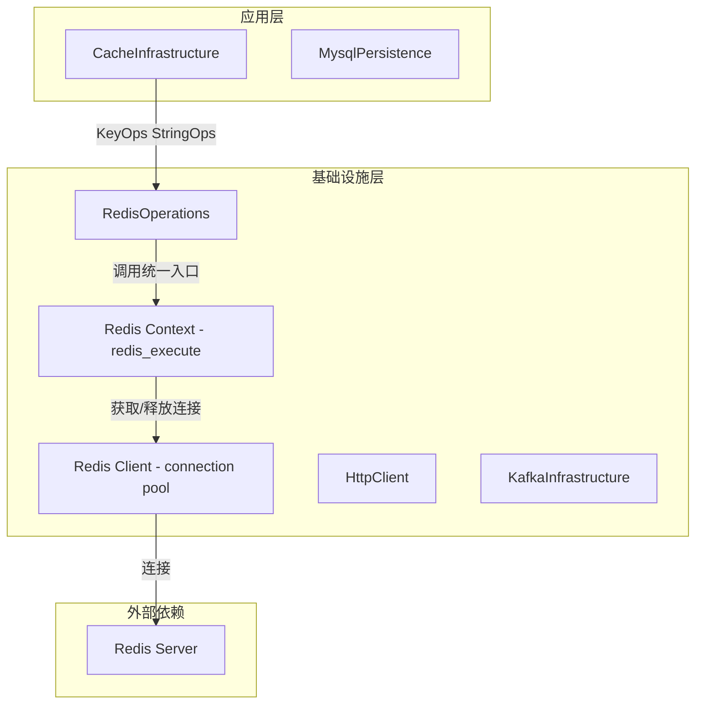
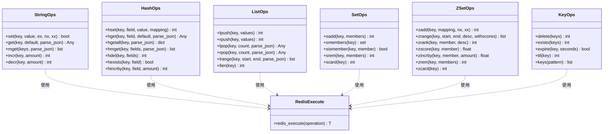
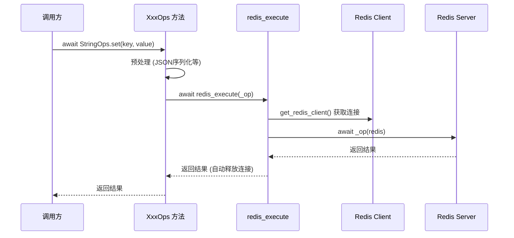
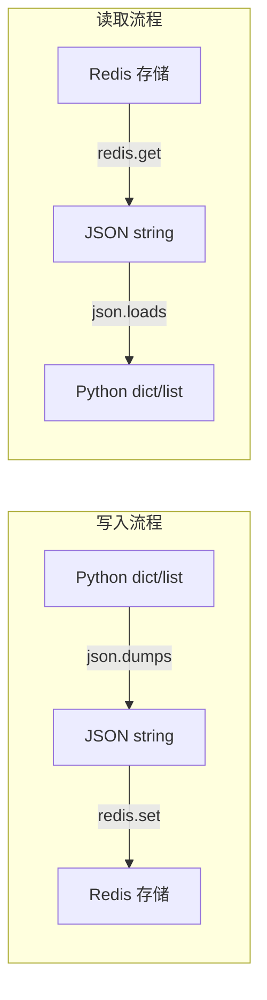
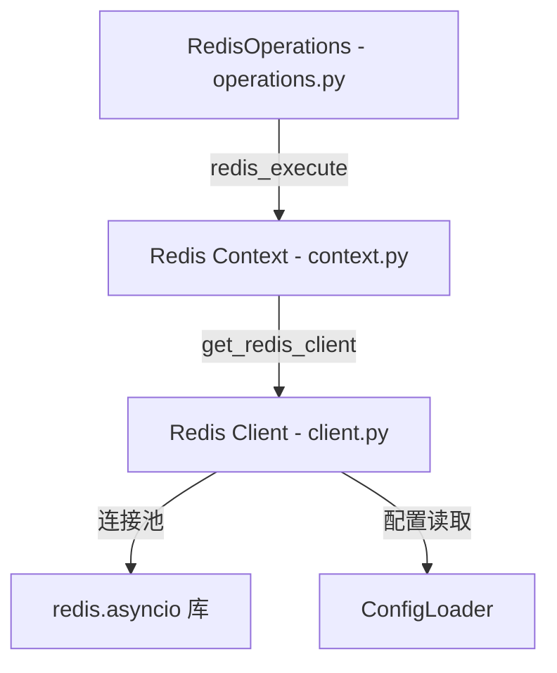

# RedisOperations 模块文档

## 1. 模块概述

RedisOperations 是 aigc-agent 系统的 **Redis 数据操作层**，位于 `infrastructure/redis/operations.py`。该模块以静态方法的形式封装了 Redis 五种核心数据结构（String、Hash、List、Set、ZSet）的常用操作，并提供统一的 Key 管理操作。

模块的设计目标是：

- **简化调用**：上层业务通过一行 `await StringOps.set(...)` 即可完成 Redis 操作，无需关心连接管理
- **统一入口**：所有操作经由 `redis_execute()` 统一执行，自动处理连接获取、异常捕获和连接释放
- **透明序列化**：自动对 `dict` / `list` 类型进行 JSON 序列化与反序列化，减少业务层重复代码

该模块不直接管理 Redis 连接，而是依赖 `redis_execute`（来自 [CacheInfrastructure](CacheInfrastructure.md) 同层的 `context.py`），后者又依赖 `client.py` 的连接池管理。这种分层使得操作逻辑与连接管理完全解耦。

## 2. 架构设计

### 2.1 模块在系统中的位置



### 2.2 分层职责

| 层级 | 文件 | 职责 |
|------|------|------|
| **操作层** | `operations.py` | 封装 Redis 命令的业务友好接口 |
| **上下文层** | `context.py` | 提供 `redis_execute` 统一执行入口，管理连接生命周期 |
| **连接层** | `client.py` | 管理 Redis 连接池，提供 `get_redis_client()` 上下文管理器 |

## 3. 核心组件详解

### 3.1 组件总览



### 3.2 StringOps - 字符串操作

封装 Redis `STRING` 类型操作，是最基础也最常用的操作类。

| 方法 | Redis 命令 | 说明 | 特殊能力 |
|------|-----------|------|---------|
| `set` | `SET` | 设置键值 | 支持 `ex`（TTL）、`nx`/`xx` 条件写入，dict/list 自动 JSON 序列化 |
| `get` | `GET` | 获取值 | `parse_json=True` 时自动反序列化 JSON |
| `mget` | `MGET` | 批量获取 | 保持键顺序返回 |
| `incr` | `INCRBY` | 自增计数器 | 可指定增量 |
| `decr` | `DECRBY` | 自减计数器 | 可指定减量 |

**典型使用场景**：

```python
# 简单缓存
await StringOps.set("config:feature_flags", {"dark_mode": True}, ex=3600)

# 分布式锁（nx 模式）
acquired = await StringOps.set("lock:task:123", "holder_id", ex=10, nx=True)

# 访问计数
count = await StringOps.incr("page:views:home")
```

### 3.3 HashOps - 哈希操作

封装 Redis `HASH` 类型操作，适合存储结构化对象数据。

| 方法 | Redis 命令 | 说明 |
|------|-----------|------|
| `hset` | `HSET` | 设置字段（支持单字段和批量 mapping 两种模式） |
| `hget` | `HGET` | 获取单个字段 |
| `hgetall` | `HGETALL` | 获取所有字段 |
| `hmget` | `HMGET` | 批量获取指定字段 |
| `hdel` | `HDEL` | 删除字段 |
| `hexists` | `HEXISTS` | 判断字段是否存在 |
| `hincrby` | `HINCRBY` | 字段计数器增加 |

**典型使用场景**：

```python
# 存储用户对象
await HashOps.hset("user:100", mapping={"name": "Alice", "age": 25, "city": "Beijing"})

# 读取用户对象
user = await HashOps.hgetall("user:100")
# 返回: {"name": "Alice", "age": 25, "city": "Beijing"}

# 检查字段是否存在
exists = await HashOps.hexists("user:100", "email")
```

### 3.4 ListOps - 列表操作

封装 Redis `LIST` 类型操作，适合队列、栈、时间线等场景。

| 方法 | Redis 命令 | 说明 |
|------|-----------|------|
| `lpush` | `LPUSH` | 左端插入（可用于实现栈） |
| `rpush` | `RPUSH` | 右端插入（可用于实现队列） |
| `lpop` | `LPOP` | 左端弹出 |
| `rpop` | `RPOP` | 右端弹出 |
| `lrange` | `LRANGE` | 范围查询 |
| `llen` | `LLEN` | 获取列表长度 |

**典型使用场景**：

```python
# 消息队列（FIFO：rpush + lpop）
await ListOps.rpush("queue:tasks", {"task_id": 1, "type": "email"})
task = await ListOps.lpop("queue:tasks")

# 获取最新 10 条消息
messages = await ListOps.lrange("messages:user:100", 0, 9)
```

### 3.5 SetOps - 集合操作

封装 Redis `SET` 类型操作，适合去重、标签、关系等场景。

| 方法 | Redis 命令 | 说明 |
|------|-----------|------|
| `sadd` | `SADD` | 添加成员 |
| `smembers` | `SMEMBERS` | 获取所有成员 |
| `sismember` | `SISMEMBER` | 判断成员是否存在 |
| `srem` | `SREM` | 移除成员 |
| `scard` | `SCARD` | 获取成员数量 |

**典型使用场景**：

```python
# 用户标签管理
await SetOps.sadd("user:100:tags", "python", "redis", "fastapi")
tags = await SetOps.smembers("user:100:tags")
has_tag = await SetOps.sismember("user:100:tags", "python")
```

### 3.6 ZSetOps - 有序集合操作

封装 Redis `ZSET`（Sorted Set）类型操作，适合排行榜、优先队列等需要按分数排序的场景。

| 方法 | Redis 命令 | 说明 |
|------|-----------|------|
| `zadd` | `ZADD` | 添加成员及分数 |
| `zrange` | `ZRANGE` / `ZREVRANGE` | 范围查询，支持升序/降序 |
| `zrank` | `ZRANK` / `ZREVRANK` | 获取排名 |
| `zscore` | `ZSCORE` | 获取成员分数 |
| `zincrby` | `ZINCRBY` | 增加分数 |
| `zrem` | `ZREM` | 删除成员 |
| `zcard` | `ZCARD` | 获取成员数量 |

**典型使用场景**：

```python
# 排行榜
await ZSetOps.zadd("leaderboard", {"user:100": 1000, "user:200": 950})
top10 = await ZSetOps.zrange("leaderboard", 0, 9, desc=True, withscores=True)
rank = await ZSetOps.zrank("leaderboard", "user:100", desc=True)
```

### 3.7 KeyOps - 键管理操作

提供跨数据结构的通用键操作，不绑定特定数据类型。

| 方法 | Redis 命令 | 说明 |
|------|-----------|------|
| `delete` | `DEL` | 删除一个或多个键 |
| `exists` | `EXISTS` | 判断键是否存在（返回存在的键数量） |
| `expire` | `EXPIRE` | 设置键的 TTL |
| `ttl` | `TTL` | 获取键的剩余 TTL（-1=永久，-2=不存在） |
| `keys` | `KEYS` | 按模式查找键（生产环境慎用） |

## 4. 统一执行模型

### 4.1 redis_execute 模式

所有操作类的方法均遵循统一的执行模式，这是理解该模块运作机制的关键：



### 4.2 执行模式的核心特征

**闭包传参**：每个操作方法内部定义一个 `_op(redis)` 闭包，接收 `redis` 客户端参数，然后将其传递给 `redis_execute` 执行。这种模式确保：

1. **连接自动管理**：`redis_execute` 使用 `async with` 上下文管理器，操作完成后自动释放连接
2. **统一异常处理**：所有异常经由 `redis_execute` 捕获并记录日志
3. **业务代码简洁**：调用方无需关心连接的获取和释放

```python
# operations.py 中每个方法的标准模式
@staticmethod
async def some_op(key: str, ...) -> ReturnType:
    # 1. 预处理（序列化等）
    
    async def _op(redis):           # 2. 定义闭包
        return await redis.some_command(...)
    
    return await redis_execute(_op) # 3. 统一执行
```

## 5. 数据流与序列化策略

### 5.1 自动 JSON 序列化

模块对复杂类型（`dict`、`list`）提供透明的 JSON 序列化和反序列化：



### 5.2 parse_json 参数

读取操作（`get`、`hget`、`lrange` 等）均提供 `parse_json` 参数（默认 `True`）：

| 设置 | 行为 | 适用场景 |
|------|------|---------|
| `parse_json=True`（默认） | 自动尝试 `json.loads`，失败则返回原始字符串 | 读取结构化数据 |
| `parse_json=False` | 直接返回原始字符串 | 读取纯文本、避免解析开销 |

解析采用 **容错策略**：`json.loads` 失败时不抛异常，而是降级返回原始字符串，确保不会因数据格式问题中断业务流程。

## 6. 依赖关系

### 6.1 上游依赖



### 6.2 下游消费者

| 消费方 | 使用的操作类 | 用途 |
|--------|------------|------|
| [CacheInfrastructure](CacheInfrastructure.md) - RedisCache | `StringOps`、`KeyOps` | 作为缓存策略的 Redis 后端实现 |

RedisOperations 通过 `infrastructure/redis/__init__.py` 的 barrel 导出提供给上层使用。所有消费者均通过包级别导入（`from agent.infrastructure.redis import ...`），而非直接导入 `operations` 模块。

## 7. 关键设计模式

### 7.1 静态工具类模式

所有操作类（`StringOps`、`HashOps` 等）均采用 **纯静态方法** 设计，无实例状态：

- 不需要实例化，直接通过类名调用（`StringOps.set(...)`）
- 无状态意味着天然线程安全
- 每个类只负责一种 Redis 数据结构，职责单一

### 7.2 策略模式的隐式应用

各操作类虽然没有显式的策略接口，但遵循相同的编码模式——每个方法都：

1. 接受业务友好的参数
2. 进行必要的预处理（序列化）
3. 定义 `_op(redis)` 闭包
4. 通过 `redis_execute(_op)` 统一执行

这种一致性使得整个模块的可预测性和可维护性很高。

### 7.3 防御性编程

模块在多个层面体现了防御性编程：

- **参数校验**：如 `HashOps.hset` 要求必须提供 `field+value` 或 `mapping`
- **类型安全**：使用 `isinstance(value, dict | list)` 精确判断需要序列化的类型
- **解析容错**：`json.loads` 失败时 catch `JSONDecodeError`、`TypeError`、`ValueError` 三种异常，降级返回原始值
- **空值处理**：所有读取操作对 `None` 返回值做保护，返回 `default` 参数指定的默认值

## 8. 使用注意事项

### 8.1 生产环境注意

- **`KeyOps.keys()` 谨慎使用**：`KEYS` 命令在键空间较大时会阻塞 Redis，生产环境应使用 `SCAN` 替代
- **`StringOps.set()` 的 `nx`/`xx` 参数**：用于实现简单的分布式锁，但不具备 Redlock 等高级分布式锁的特性

### 8.2 性能建议

- **批量操作优先**：使用 `mget` 替代多次 `get`，使用 `hgetall` 替代多次 `hget`
- **`parse_json=False` 减少开销**：当确定值为纯字符串时，关闭 JSON 解析可减少 CPU 消耗
- **利用 `ex` 参数设置 TTL**：避免缓存数据无限增长
