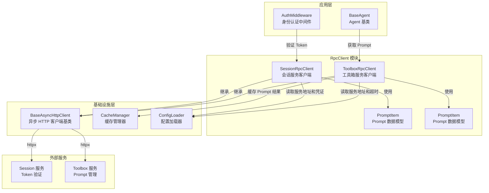
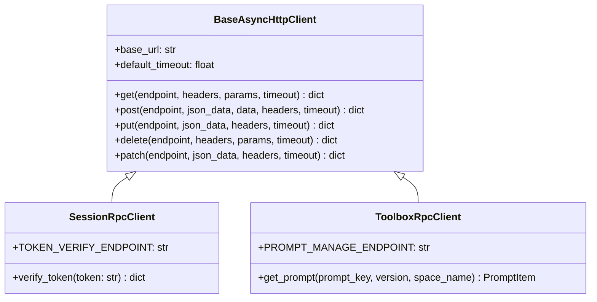
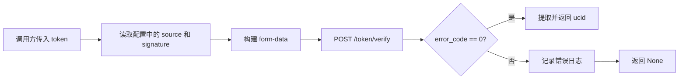
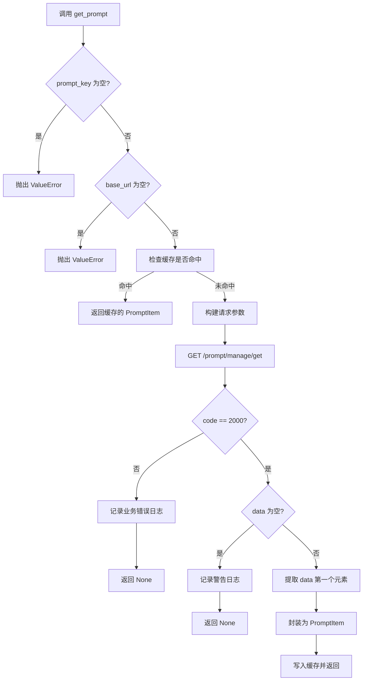
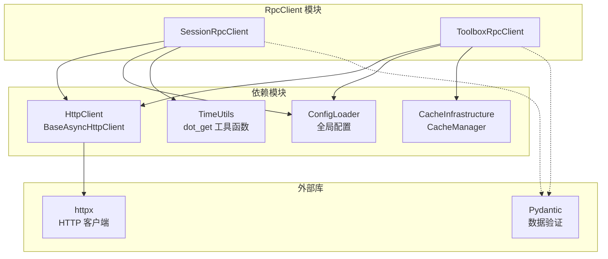
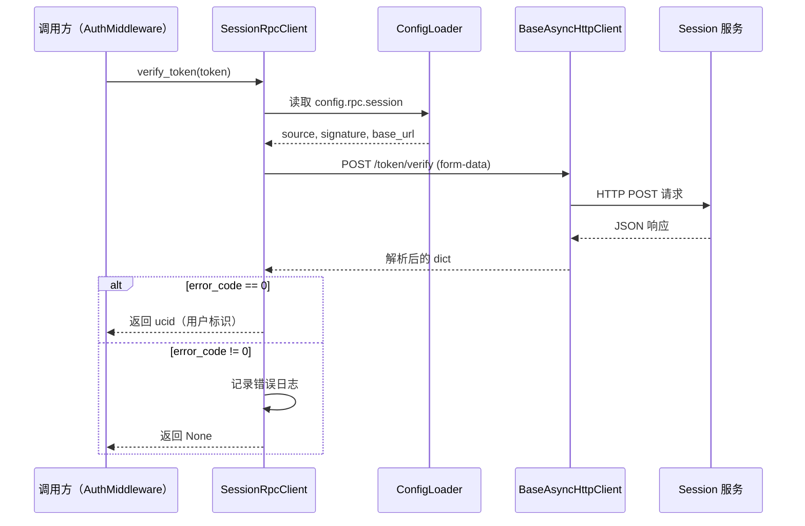
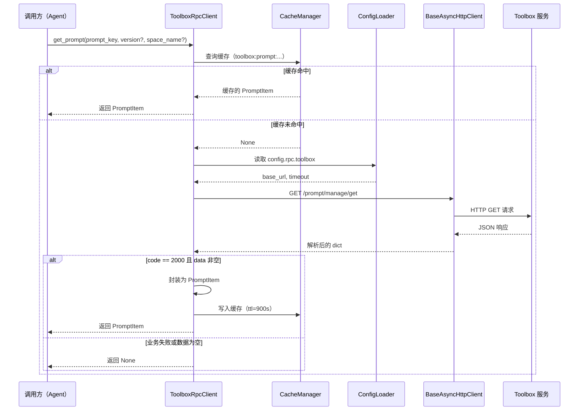
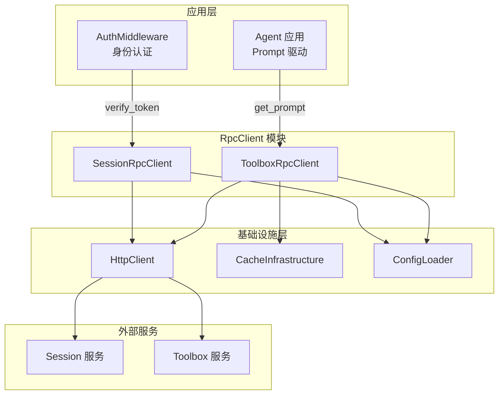

# RpcClient

## 模块概述

RpcClient 模块是 Agent 系统的**远程服务通信层**，负责封装对外部 RPC 服务的 HTTP 调用。该模块包含两个独立的客户端实现，分别对接不同的后端服务：

- **SessionRpcClient**：与 Session 服务交互，提供用户身份令牌（Token）验证能力。
- **ToolboxRpcClient**：与 Toolbox 服务交互，提供 Prompt 模板的远程获取能力。

两个客户端均继承自 [HttpClient](HttpClient.md) 模块的 `BaseAsyncHttpClient`，复用统一的异步 HTTP 请求基础设施、错误处理和日志记录机制。

## 架构总览



## 核心组件详解

### PromptItem

两个客户端文件中各定义了一个同名的 `PromptItem` 数据模型，均使用 Pydantic `BaseModel`，结构完全一致：

| 字段 | 类型 | 说明 |
|------|------|------|
| `role` | `str` | 消息角色（如 `system`、`user`、`assistant`） |
| `content` | `str` | Prompt 内容文本 |

> **注意**：两个文件中的 `PromptItem` 是独立定义的重复类，功能等价。消费方按需从各自模块导入即可。

### SessionRpcClient

`SessionRpcClient` 是与 **Session 服务**通信的异步 HTTP 客户端，核心职责为**用户 Token 验证**。

#### 类继承关系



#### 初始化

```python
def __init__(self):
    base_url = config.rpc.session.base_url
    super().__init__(base_url=base_url)
```

- 从 [ConfigLoader](ConfigLoader.md) 加载的全局配置中读取 `config.rpc.session.base_url` 作为服务端点
- 使用基类默认超时（30 秒）

#### 核心方法：`verify_token(token: str) -> dict | None`

验证用户身份令牌的有效性，返回用户标识（`ucid`）或 `None`。

**请求构造流程：**

1. 从配置中读取 `source` 和 `signature` 作为认证凭证
2. 构建表单数据：`{ source, signature, token }`
3. 以 `application/x-www-form-urlencoded` 格式发送 POST 请求至 `/token/verify`

**响应处理：**

- `error_code == 0`：验证成功，通过 `dot_get(data, "data.token_info.ucid")` 提取用户唯一标识
- `error_code != 0`：验证失败，记录错误日志，返回 `None`

**数据流图：**



### ToolboxRpcClient

`ToolboxRpcClient` 是与 **Toolbox 服务**通信的异步 HTTP 客户端，核心职责为**远程获取 Prompt 模板数据**。

#### 初始化

```python
def __init__(self):
    base_url = config.rpc.toolbox.base_url
    timeout = config.rpc.toolbox.timeout
    super().__init__(base_url=base_url, default_timeout=timeout)
```

- 从配置中读取 `config.rpc.toolbox.base_url`（服务地址）和 `config.rpc.toolbox.timeout`（自定义超时）
- 将自定义超时传递给基类，覆盖默认的 30 秒超时

#### 核心方法：`get_prompt(prompt_key, version?, space_name?) -> PromptItem | None`

获取远程 Prompt 管理平台中的 Prompt 模板数据。

**参数说明：**

| 参数 | 类型 | 必填 | 说明 |
|------|------|------|------|
| `prompt_key` | `str` | 是 | Prompt 模板的唯一标识键 |
| `version` | `str \| None` | 否 | 指定版本号，不传则获取最新版本 |
| `space_name` | `str \| None` | 否 | 命名空间，不传则使用配置默认值 |

**缓存策略：**

方法使用 `@cache` 装饰器，自动缓存请求结果：

```python
@cache(ttl=900, prefix="toolbox:prompt")
async def get_prompt(self, prompt_key, version, space_name):
```

- **TTL**：900 秒（15 分钟），避免频繁调用远程服务
- **缓存前缀**：`toolbox:prompt`
- **缓存键构成**：前缀 + 方法参数（`prompt_key` + `version` + `space_name`）
- **缓存后端**：由 [CacheInfrastructure](CacheInfrastructure.md) 模块统一管理，支持内存缓存和 Redis 两种策略

**请求与响应处理流程：**



**错误处理策略：**

| 场景 | 处理方式 |
|------|----------|
| `prompt_key` 为空 | 抛出 `ValueError`（快速失败） |
| `base_url` 未配置 | 抛出 `ValueError`（快速失败） |
| 业务响应码非 2000 | 记录错误日志，返回 `None` |
| 响应 `data` 为空数组 | 记录警告日志，返回 `None` |
| 网络/解析异常 | 捕获 `Exception`，记录错误日志，返回 `None` |

## 依赖关系



**依赖模块说明：**

| 依赖模块 | 引用关系 | 说明 |
|----------|----------|------|
| [HttpClient](HttpClient.md) | 继承 `BaseAsyncHttpClient` | 复用异步 HTTP 请求能力，包括请求/响应日志、错误处理、连接池管理 |
| [ConfigLoader](ConfigLoader.md) | 读取 `config.rpc.*` | 从 YAML 配置文件加载服务地址、超时时间、认证凭证等 |
| [CacheInfrastructure](CacheInfrastructure.md) | `@cache` 装饰器 | ToolboxRpcClient 的 `get_prompt` 方法利用缓存减少远程调用频次 |
| [TimeUtils](TimeUtils.md) | `dot_get` 函数 | SessionRpcClient 使用嵌套字典安全取值工具提取深层响应字段 |

## 组件交互时序

### Token 验证流程



### Prompt 获取流程



## 系统集成

RpcClient 模块在系统中位于**基础设施层**与**应用层**之间的桥梁位置，向上为业务逻辑提供语义化的远程调用接口，向下依赖统一的 HTTP 通信和配置管理基础设施。



## 设计模式与最佳实践

### 1. 模块级单例实例化

两个客户端在模块末尾各创建了一个全局单例实例：

```python
session_client = SessionRpcClient()   # session_client.py
toolbox_client = ToolboxRpcClient()   # toolbox_client.py
```

Python 模块本身就是单例，因此模块级实例天然具备单例语义——整个应用进程中只存在一个客户端实例，共享底层的 HTTP 连接池（由 `AsyncHttpClientManager` 管理），避免连接资源浪费。

### 2. 继承复用

两个客户端均继承 `BaseAsyncHttpClient`，获得：
- 统一的 GET/POST/PUT/DELETE/PATCH 方法
- 自动化的请求/响应日志记录
- 标准化的异常处理和 `raise_for_status`
- 共享 httpx 异步连接池

### 3. 配置驱动

所有可变参数（服务地址、超时时间、认证凭证）均从 YAML 配置文件中读取，通过 [ConfigLoader](ConfigLoader.md) 单例统一管理。客户端代码中不存在硬编码的 URL 或密钥，支持通过环境变量（`ENVTYPE`）切换不同环境配置。

### 4. 缓存加速

`ToolboxRpcClient.get_prompt` 通过 `@cache` 装饰器实现透明缓存，调用方无需感知缓存逻辑。TTL 设为 15 分钟，在 Prompt 模板变更不频繁的场景下，有效减少远程服务调用次数，降低延迟。

### 5. 优雅降级

两个客户端在异常场景下采用"记录日志 + 返回 None"的降级策略，而非抛出异常向上冒泡。这使得调用方可以在 RPC 失败时执行备选逻辑（如使用默认 Prompt），保证系统整体可用性。
