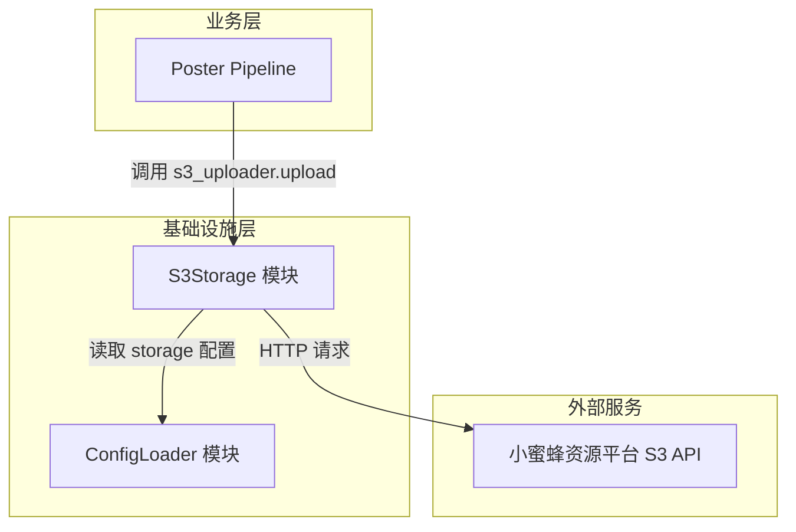
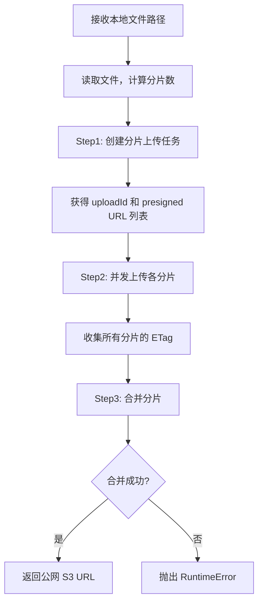
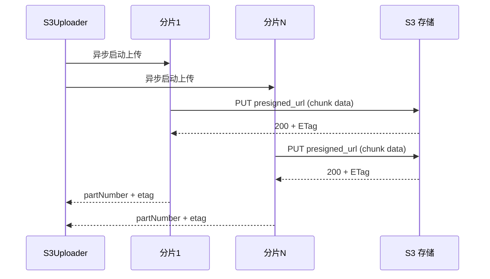
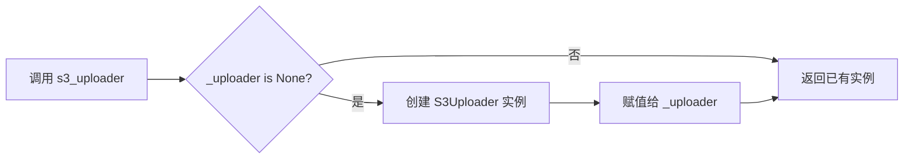
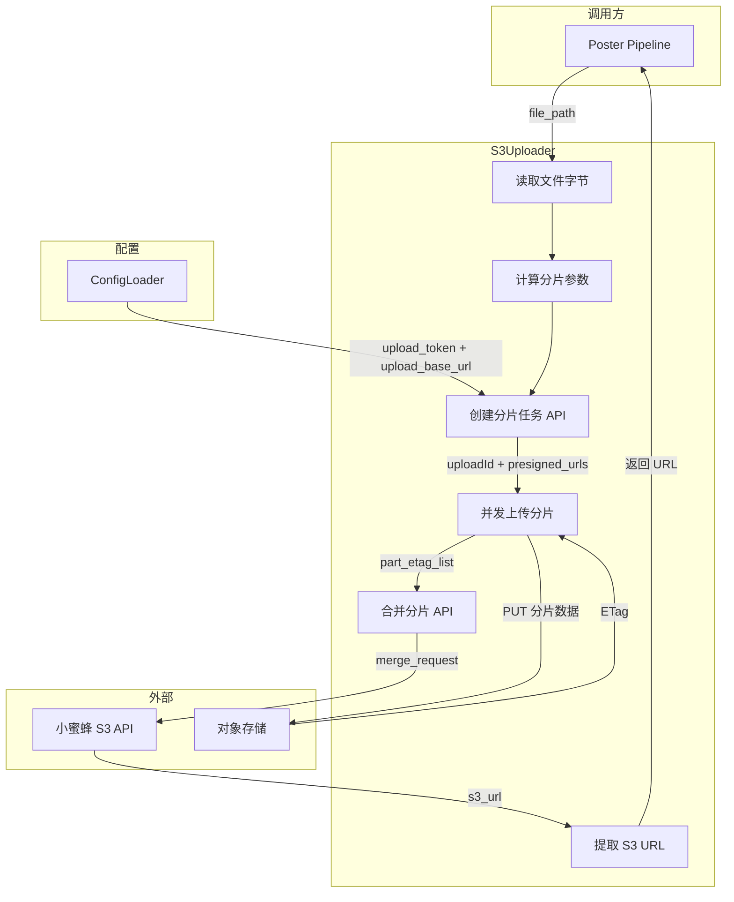

# S3Storage 模块

## 模块概述

S3Storage 模块是 aigc-agent 系统中的**文件存储基础设施层**组件，封装了与"小蜜蜂资源平台"S3 兼容对象存储服务的交互逻辑。该模块基于 HTTP 分片上传协议，为系统提供可靠的大文件上传能力，生成可访问的公网 URL。

当前模块仅包含一个核心类 `S3Uploader`，采用**懒加载单例**模式对外暴露，供上游模块通过 `s3_uploader()` 工厂函数获取实例。

### 核心职责

- 封装 S3 分片上传的三步协议（创建任务 → 上传分片 → 合并分片）
- 管理上传认证 Token 和 API 端点配置
- 提供并发分片上传与失败重试机制
- 将本地文件路径转换为公网可访问的 S3 URL

---

## 架构设计

### 系统定位

S3Storage 位于系统基础设施层，向上为业务层（StoryAgent 海报生成流水线）提供文件上传能力，向下依赖配置中心（ConfigLoader）和外部 S3 API。



### 模块依赖关系

| 方向 | 依赖模块 | 依赖说明 |
|------|---------|---------|
| 上游依赖 | [StoryAgent](StoryAgent.md) / Poster Pipeline | 唯一的业务调用方，海报生成完成后调用上传 |
| 下游依赖 | [ConfigLoader](ConfigLoader.md) | 从 YAML 配置中读取 `upload_token` 和 `upload_base_url` |
| 外部依赖 | `httpx` | 异步 HTTP 客户端，与 S3 API 通信 |
| 外部依赖 | `loguru` | 结构化日志输出 |

---

## 核心组件详解

### S3Uploader 类

`S3Uploader` 是模块的唯一公开组件，位于 `core/storage/s3_uploader.py`。

#### 初始化与配置

```python
def __init__(self):
    cfg = config.storage
    self._token = cfg.upload_token    # 认证 Token
    self._base_url = cfg.upload_base_url  # API 基础地址
```

构造函数从全局 `ConfigLoader` 实例中读取 `storage` 配置节，提取以下两个关键参数：

| 配置项 | 来源 | 说明 |
|--------|------|------|
| `upload_token` | `config.storage.upload_token` | 请求头 `Utopia-User-Token` 的值，用于 API 鉴权 |
| `upload_base_url` | `config.storage.upload_base_url` | S3 API 的基础地址，所有端点路径基于此拼接 |

配置文件路径：`config/base.yaml`，所有环境（dev/test/preview/prod）共享同一份 `storage` 配置。

#### 上传协议：三步分片上传

`upload(file_path)` 方法实现了完整的分片上传流程，适用于任意大小的文件：



**Step 1：创建分片任务**

调用 `/open/resource/file/create-multipart-upload` 端点，提交以下参数：

| 参数 | 说明 |
|------|------|
| `needParts` | 分片总数，由 `ceil(file_size / 1MB)` 计算 |
| `mime` | 文件 MIME 类型，通过 `mimetypes.guess_type` 推断 |
| `fileName` | 原始文件名 |

响应返回 `uploadId`（上传任务标识）和 `presigned` 列表（每个分片的预签名 URL 和分片编号）。

**Step 2：并发上传分片**

通过 `asyncio.gather` 并发执行所有分片的上传：



每个分片上传具备**重试机制**：

- 最大重试次数：`MAX_RETRIES = 3`
- 单分片超时：60 秒
- 重试时记录 `WARNING` 级别日志
- 最终失败时向上抛出异常

**Step 3：合并分片**

调用 `/open/resource/file/complete-multipart-upload` 端点，提交 `uploadId` 和所有分片的 `partNumber + etag` 列表。服务端校验通过后返回合并结果和最终的 S3 公网 URL。

#### 关键常量

| 常量 | 值 | 说明 |
|------|------|------|
| `PART_SIZE` | 1 MB (1,048,576 bytes) | 每个分片的大小 |
| `MAX_RETRIES` | 3 | 单分片上传最大重试次数 |

#### 方法签名

| 方法 | 参数 | 返回值 | 说明 |
|------|------|--------|------|
| `upload(file_path)` | `str \| Path` - 本地文件路径 | `str` - S3 公网 URL | 异步方法，执行完整的分片上传流程 |

---

## 工厂函数与单例模式

模块通过模块级变量 `_uploader` 和工厂函数 `s3_uploader()` 实现懒加载单例：



```python
_uploader: S3Uploader | None = None

def s3_uploader() -> S3Uploader:
    global _uploader
    if _uploader is None:
        _uploader = S3Uploader()
    return _uploader
```

这种设计的优势：
- **延迟初始化**：仅在首次调用时创建实例，避免启动时加载未使用的配置
- **全局唯一**：整个进程共享一个上传器实例，避免重复读取配置
- **线程安全**：由于 Python GIL 和 asyncio 单线程事件循环的特性，在异步场景下是安全的

---

## 数据流

### 文件上传完整数据流



### 请求头协议

所有创建/合并分片的 API 请求均携带以下认证头：

| Header | 值 | 说明 |
|--------|------|------|
| `Content-Type` | `application/json` | 请求体格式 |
| `Utopia-User-Token` | `{upload_token}` | 用户认证令牌，用于 API 鉴权 |

分片上传（PUT 请求）直接使用 S3 预签名 URL，无需额外认证头。

---

## 错误处理

| 异常场景 | 处理方式 | 异常类型 |
|---------|---------|---------|
| 文件不存在 | 预检阶段抛出 | `FileNotFoundError` |
| 创建分片任务失败 | HTTP 状态码非 2xx 时抛出 | `httpx.HTTPStatusError` |
| 单分片上传失败 | 最多重试 3 次，全部失败后抛出 | 原始异常 |
| 合并分片失败 | HTTP 状态码非 2xx 时抛出 | `httpx.HTTPStatusError` |
| 合并分片业务失败 | `success` 字段为 false 时抛出 | `RuntimeError` |
| 网络超时 | 创建/合并 30s，分片上传 60s | `httpx.TimeoutException` |

---

## 关键设计模式

### 1. 基于预签名 URL 的分片上传

模块不直接持有 S3 凭证，而是通过"小蜜蜂资源平台"的中间层 API 获取预签名 URL，将分片数据直接上传至 S3 存储。这种设计实现了**凭证隔离**——上传 Token 仅用于管理 API，实际存储访问由预签名 URL 控制，有效期有限。

### 2. 并发上传与重试

使用 `asyncio.gather` 实现分片级别的并发上传，在网络不稳定环境下通过 `MAX_RETRIES` 重试机制保障上传可靠性。每个分片独立重试，不会影响其他分片的上传进度。

### 3. 懒加载单例

`S3Uploader` 不在模块导入时初始化，而是首次调用 `s3_uploader()` 时创建，确保配置已就绪且避免不必要的资源占用。
