# StoryAgent — 客户故事自动分析与产出模块

## 模块概述

StoryAgent 是 aigc-agent 系统中负责**自动从企微群聊消息中挖掘、评级、生成客户故事并输出海报物料**的核心业务模块。它以 LangGraph 状态图驱动的多节点流水线为骨架，将原始群聊数据转化为适合小红书/朋友圈传播的结构化故事内容和品牌海报。

### 核心能力

| 能力 | 说明 |
|------|------|
| **群聊上下文采集** | 通过 SCRM API 获取企微群消息历史，定位夸赞原文并构建上下文窗口 |
| **多级硬过滤** | 基于规则的预过滤器，拦截无效/高风险/非夸夸消息 |
| **LLM 故事生成** | 调用 GPT-5.5 生成结构化故事（起因/经过/结果三段式），自动评级 S/A/B/C |
| **客户信息补全** | 联动订单系统与客户系统，获取业主姓名、性别、城市等身份信息 |
| **海报自动产出** | A/S 级故事自动触发海报生成流水线（插画生成 → HTML 模板 → Playwright 截图 → S3 上传） |
| **故事群定位** | 独立能力，从大批量多群消息中用 LLM 语义判断哪些群具备故事潜力 |
| **任务生命周期管理** | 全程跟踪任务状态（PENDING → PROCESSING → COMPLETED/SKIPPED/FAILED） |

---

## 系统架构

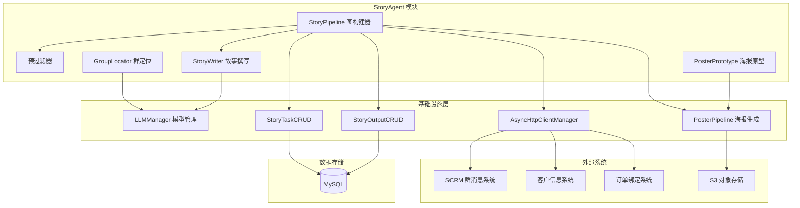

### 与系统其他模块的关系

| 模块 | 交互方式 | 说明 |
|------|---------|------|
| [LLMManager](core/llm/manager.py) | `get_llm(AIModelName.GPT_5_5)` | 故事生成使用 GPT-5.5，群定位使用 doubao-seed-1.6 |
| [AsyncHttpClientManager](infrastructure/http/client.py) | HTTP 请求封装 | 与 SCRM、订单、客户三个外部系统交互 |
| [MysqlPersistence](infrastructure/mysql/curd/) | CRUD 操作 | `StoryTaskCRUD` 管理任务表，`StoryOutputCRUD` 管理产出表 |
| [PosterPipeline](core/poster/pipeline.py) | 异步调用 | A/S 级故事触发海报生成（插画 → HTML → 截图 → 上传） |
| [WxworkEmoji](core/tools/wxwork_emoji.py) | 文本预处理 | 将企微表情占位符替换为标准 emoji |
| [BaseAgent](applications/base/base_agent.py) | 未直接继承 | StoryAgent 作为独立流水线运行，不走 BaseAgent 的交互式对话流 |

---

## LangGraph 流水线架构

StoryAgent 的核心是一条基于 LangGraph `StateGraph` 构建的**有向无环图流水线**。每个节点专注单一职责，节点间通过 `StoryPipelineState` 传递状态。

### 图拓扑

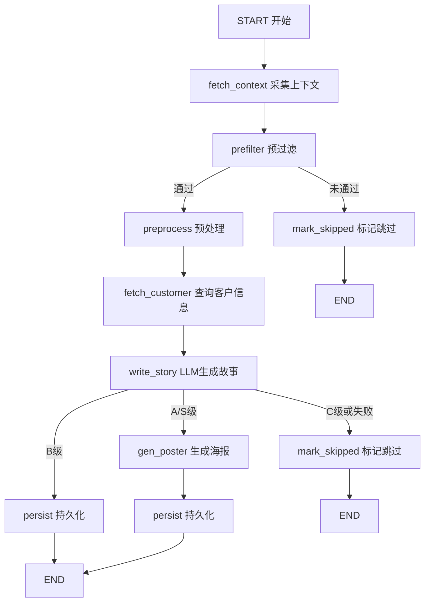

### 条件路由逻辑

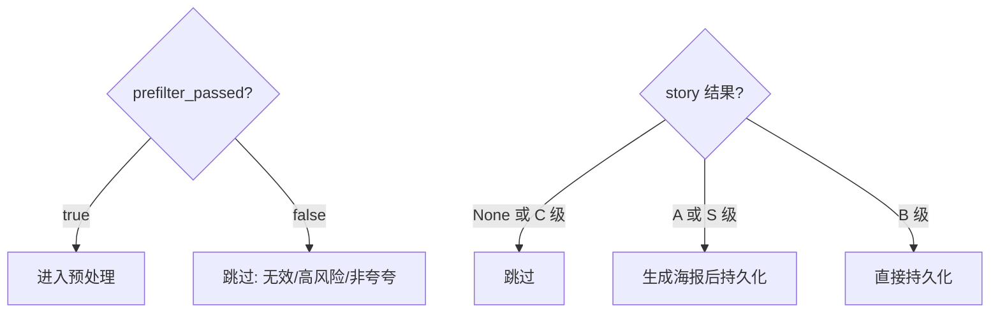

---

## 核心状态定义

流水线状态 `StoryPipelineState` 是一个 `TypedDict`，所有节点通过读写该状态进行协作：

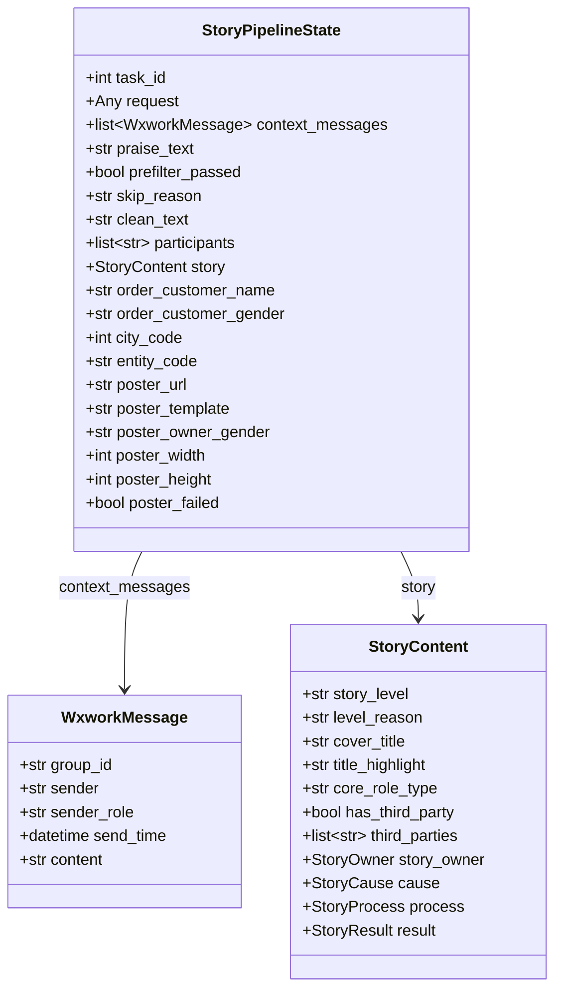

**状态流转规则：**

| 字段 | 写入节点 | 说明 |
|------|---------|------|
| `context_messages`, `praise_text` | fetch_context | 从 SCRM 获取原始消息并定位夸赞文本 |
| `prefilter_passed`, `skip_reason` | prefilter | 基于规则判断是否继续 |
| `clean_text`, `participants` | preprocess | 清洗文本、提取参与人列表 |
| `order_customer_*`, `city_code`, `entity_code` | fetch_customer | 从订单/客户系统补全身份信息 |
| `story` | write_story | LLM 生成的结构化故事内容 |
| `poster_*`, `poster_failed` | gen_poster | 海报生成结果（仅 A/S 级触发） |

---

## 节点详解

### 1. fetch_context — 上下文采集

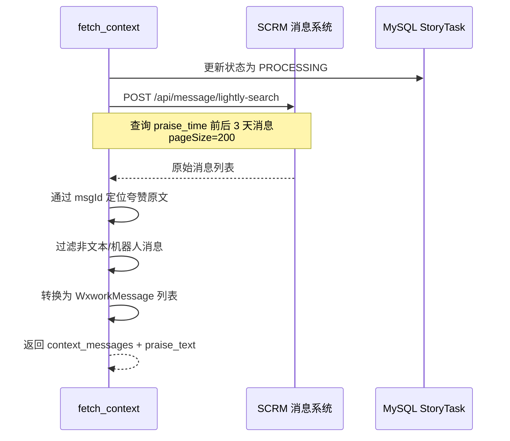

**核心逻辑：**
- 以 `praise_time` 为中心，查询前后 3 天的群消息
- 通过 `msgId` 精确匹配夸赞消息原文
- 过滤条件：仅保留文本类型消息（`msgType=1`）、非机器人消息（`role≠50000000`）
- 将企微时间戳（毫秒级）转换为 `datetime`

### 2. prefilter — 预过滤

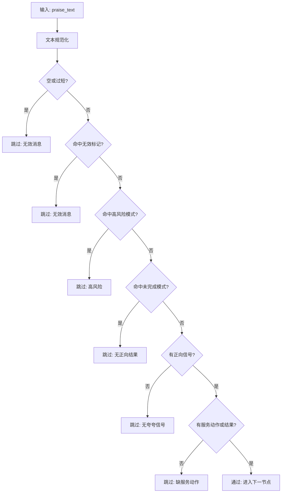

**过滤规则（硬编码，非 LLM）：**

| 规则类型 | 判定条件 | 示例 |
|---------|---------|------|
| 无效消息 | 空白、≤2字、精确匹配无效词 | "收到"、"好的"、"ok" |
| 无效标记 | 含媒体占位符 | [图片]、[视频]、[语音] |
| 高风险 | 正则匹配法律/安全事故关键词 | 起诉、报警处理、诈骗 |
| 未完成 | 仅有未来期望无已完成结果 | "希望后面负责"、"还在沟通中" |
| 缺信号 | 无正向词 + 无服务动作/结果词 | 无"感谢/满意"且无"上门/处理" |

**设计原则：** 保守硬过滤，只拦截明显无效/高风险消息，避免误杀有价值故事。

### 3. preprocess — 文本预处理

- 拼接消息为上下文文本：`[时间][角色]发送人: 内容`
- 提取参与人列表（排除"业主"角色）
- 对文本执行企微表情替换（`replace_wxwork_emoji`）
- 更新任务的消息计数

### 4. fetch_customer — 客户信息补全

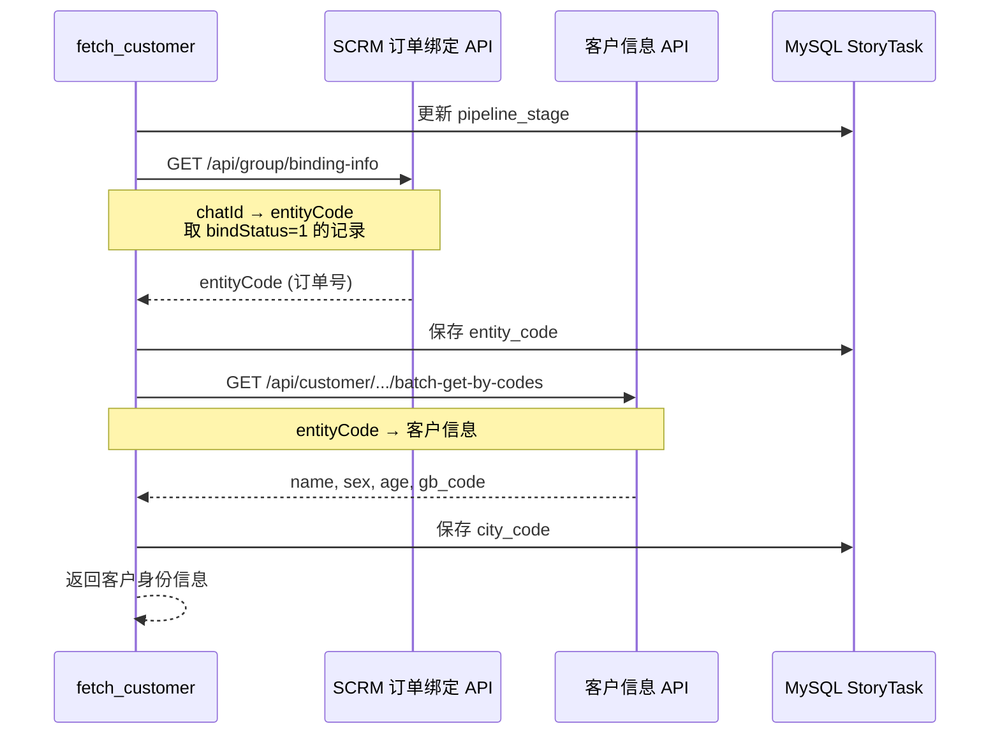

**解析链路：** 群 ID → 订单号（entityCode）→ 客户姓名/性别/城市编码

### 5. write_story — LLM 故事生成

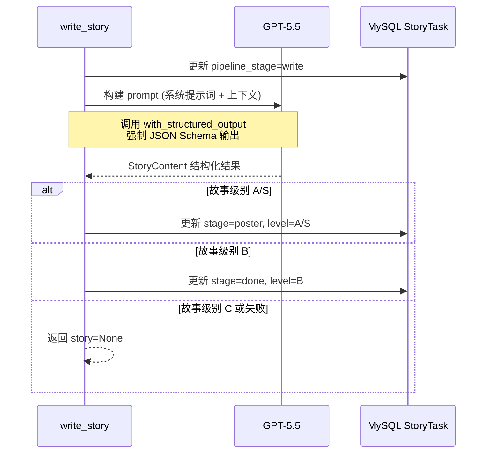

**LLM 调用配置：**
- 模型：`GPT-5.5`（`gpt-5.5`）
- 温度：0.3（较低随机性，保证故事结构稳定）
- 输出格式：`with_structured_output(StoryContent, method="json_mode")`
- 上下文窗口截断：`clean_text[:4000]`

**提示词设计要点（v1.1 规范）：**
- 黑名单检查优先：高风险事件直接 C 级
- 五要素完备性要求：起因/经过/结果/故事弧线/评级
- 同一事项一致性校验（A/S 级必须通过）
- 72 小时历史链路回看
- 时间强制模糊化（精确时间 → "M.D 时段"）
- 客户姓名脱敏（姓氏 + 先生/女士）
- 高亮词视觉三连锚：痛点 → 行动 → 信任

### 6. gen_poster — 海报生成

**触发条件：** 仅 A/S 级故事触发

**执行流程：**
1. 解析故事主角信息（`_resolve_poster_owner`）
2. 调用 `run_poster_pipeline` 生成海报：
   - Step1：并发生成 4 张插画（场景图）
   - Step2：模板替换生成 HTML
   - Step3：Playwright 截图生成最终海报
   - Step4：上传至 S3
3. 海报失败不阻断流程（标记 `poster_failed`，故事仍会持久化）

**模板风格映射：**

| 模板 ID | 风格 |
|---------|------|
| template_001 | 温暖插画风 |
| template_002 | 趣味贴纸风 |
| template_003 | 真实实拍风 |

### 7. persist — 持久化

- 写入 `story_output` 表：完整的结构化故事数据 + 海报物料 URL
- 更新 `story_task` 表状态：
  - 正常完成：`COMPLETED`
  - 海报失败：`POSTER_FAILED`（待重试）
- 保存 LLM 元信息（模型名、prompt 版本）用于审计回溯

### 8. mark_skipped — 标记跳过

两种触发场景：
- **prefilter 未通过：** 硬过滤拦截的无效/高风险/非夸夸消息
- **write_story 结果为 C 级或生成失败：** LLM 判定为不值得输出的故事

任务状态置为 `SKIPPED`，记录 `skip_reason`。

---

## 独立能力：GroupLocator 群定位

`GroupLocator` 是 StoryAgent 的独立子能力，不接入主流水线，可单独调用。

### 功能定位

从大批量多群消息中，用 LLM 语义判断哪些群具备挖掘客户故事的潜力。

### 处理流程

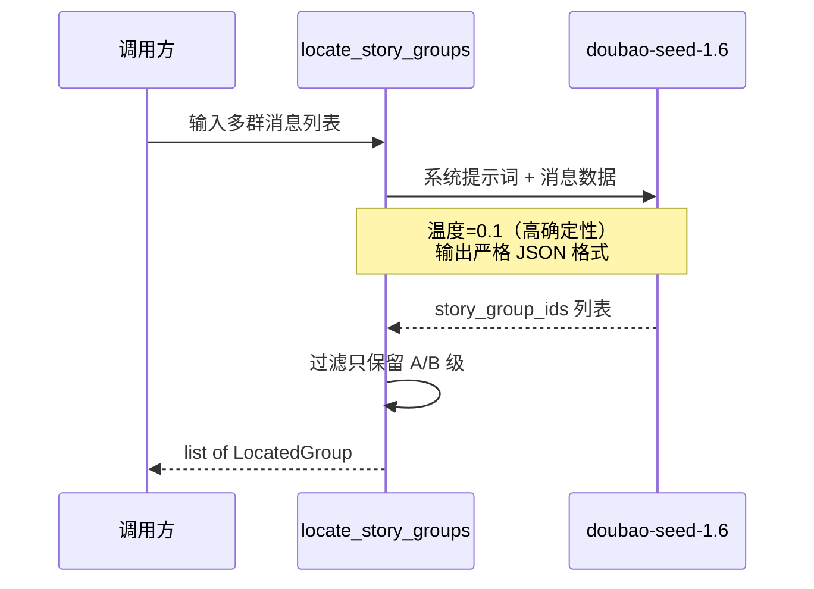

### 评级规则

| 等级 | 标准 | 处理 |
|------|------|------|
| A | 完整起因-经过-结果弧线，≥2 个服务角色，有可引用的感谢原话 | 优先输出 |
| B | 弧线基本完整但一环偏弱 | 备用候选 |
| C | 单薄或只是礼貌性表达 | 不输出 |

### 输出结构

`LocatedGroup` 包含：
- `group_id`：群聊 ID
- `customer`：客户标识
- `grade`：评级（A/B）
- `reason`：推荐理由
- `core_role_type`：核心参与角色（施工角色/设计角色）

---

## 数据模型

### 故事内容结构（StoryContent）

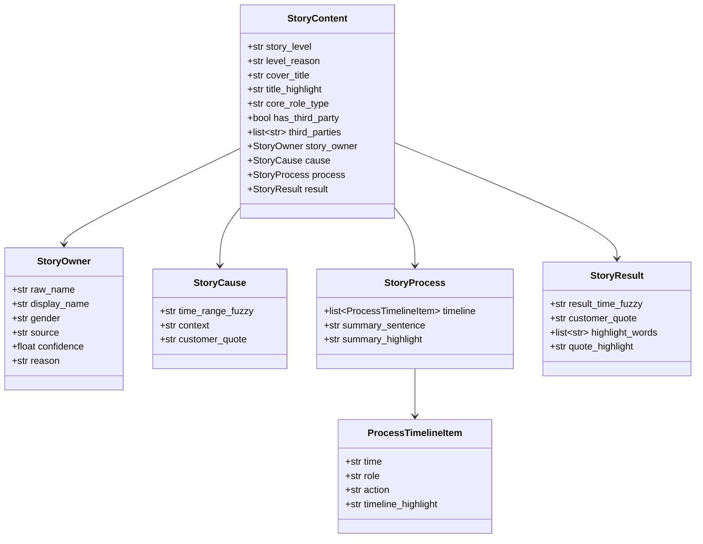

### 任务生命周期

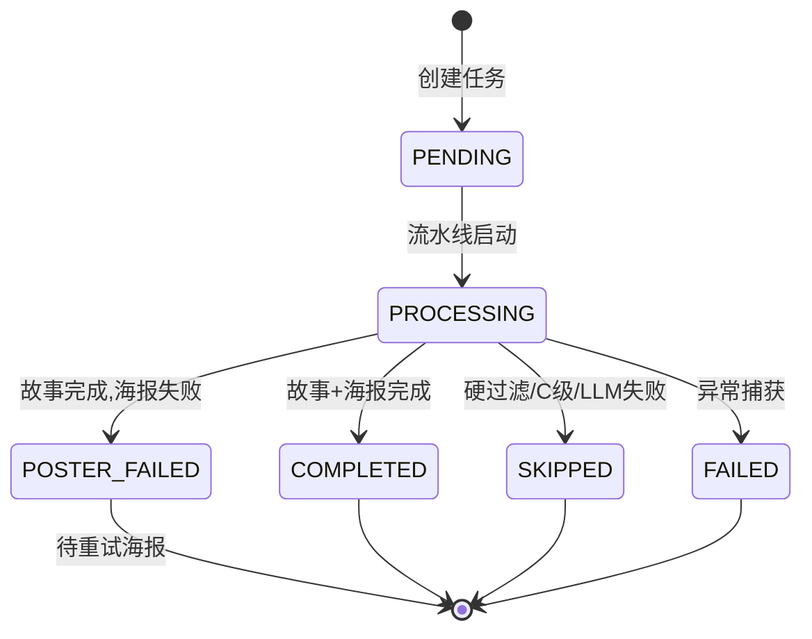

**状态含义：**

| 状态 | 含义 | 写入时机 |
|------|------|---------|
| `PENDING` | 等待处理 | 任务创建时 |
| `PROCESSING` | 流水线执行中 | 流水线启动后首个节点 |
| `COMPLETED` | 正常完成 | persist 节点成功 |
| `SKIPPED` | 被跳过 | 硬过滤 / C 级 / LLM 失败 |
| `FAILED` | 执行异常 | run_story_pipeline 异常捕获 |
| `POSTER_FAILED` | 海报失败 | 故事完成但海报生成失败，可重试 |

**pipeline_stage 追踪：**

```
fetch_context → prefilter → preprocess → fetch_customer → write → poster → done
```

### 持久化表结构

| 表 | 用途 | 关键字段 |
|------|------|---------|
| `story_task` | 任务表（一行 = 一次分析请求） | `batch_id`, `group_id`, `status`, `pipeline_stage`, `story_level` |
| `story_output` | 产出表（一行 = 一个已评级故事） | `task_id`, `story_level`, `cover_title`, `poster_url`, `raw_output` |

两表通过 `story_output.task_id = story_task.id` 关联。

---

## 外部系统交互

### 交互全景

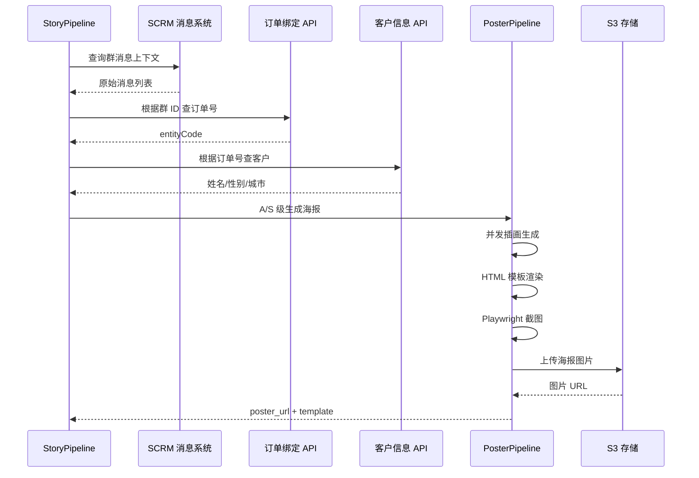

### API 端点

| 外部系统 | 端点 | 方法 | 用途 |
|---------|------|------|------|
| SCRM 消息 | `/api/message/lightly-search` | POST | 查询群消息上下文 |
| SCRM 订单 | `/api/group/binding-info` | GET | 群 ID → 订单号 |
| 客户系统 | `/api/customer/customer-commissions/batch-get-by-codes` | GET | 订单号 → 客户信息 |

---

## 关键设计模式

### 1. 状态图驱动的流水线编排

采用 LangGraph `StateGraph` 实现节点编排，具备：
- **声明式图定义**：节点与边通过 `add_node`/`add_edge`/`add_conditional_edges` 声明
- **条件路由**：prefilter 和 write_story 后的条件边实现多分支
- **全局状态**：`StoryPipelineState` 作为节点间唯一通信媒介
- **异常兜底**：`run_story_pipeline` 统一捕获异常并置 task FAILED

### 2. 保守硬过滤 + LLM 精细评级

两级过滤策略降低 LLM 调用成本：
- **第一级（规则）**：prefilter 用正则/关键词拦截明显无效消息，零 LLM 成本
- **第二级（LLM）**：write_story 用 GPT-5.5 进行语义级评级和故事生成

### 3. 故事评级驱动的分支处理

流水线根据 `story_level` 动态决定后续路径：

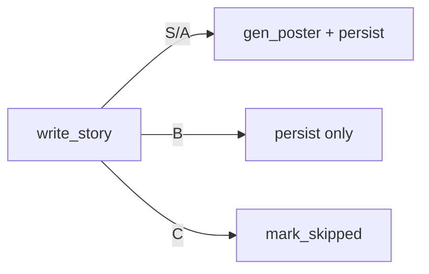

A/S 级享受完整产出链路（故事 + 海报），B 级仅输出故事结构，C 级直接跳过。

### 4. 海报失败不阻断

`gen_poster` 节点的异常被捕获后设置 `poster_failed=True`，`persist` 节点检测到该标记时将任务状态设为 `POSTER_FAILED`（而非 FAILED），保留已产出的故事数据，支持单独重试海报。

### 5. 结构化输出约束

LLM 故事生成使用 `with_structured_output(StoryContent, method="json_mode")`，强制输出符合 Pydantic 模型的 JSON，避免自由文本解析失败。

### 6. 单例编译缓存

`_get_compiled()` 对编译后的 StateGraph 进行全局缓存，避免重复编译开销。

---

## 配置与常量

### 硬编码规则词典

模块内嵌多组关键词/正则常量，用于预过滤和故事分析：

| 常量 | 用途 | 示例 |
|------|------|------|
| `_INVALID_EXACT_TEXTS` | 无效短消息精确匹配 | "收到"、"好的"、"ok" |
| `_INVALID_MARKERS` | 无效消息标记 | "[图片]"、"[视频]"、"撤回了一条消息" |
| `_POSITIVE_WORDS` | 正向夸夸信号词 | "感谢"、"专业"、"靠谱"、"细心" |
| `_SERVICE_ACTION_WORDS` | 服务动作词 | "上门"、"维修"、"施工"、"验收" |
| `_RESULT_WORDS` | 完成结果词 | "解决"、"完成"、"竣工"、"确认" |
| `_RISK_PATTERNS` | 高风险正则 | 起诉/法院/律师函、诈骗/骗钱 |
| `_UNFINISHED_PATTERNS` | 未完成正则 | "希望后面负责"、"还在沟通中" |
| `_TPL_STYLE` | 海报模板风格映射 | template_001 → "温暖插画风" |

### LLM 模型配置

| 用途 | 模型 | 温度 |
|------|------|------|
| 故事生成 | GPT-5.5 | 0.3 |
| 群定位 | doubao-seed-1.6 | 0.1 |

---

## 异常处理策略

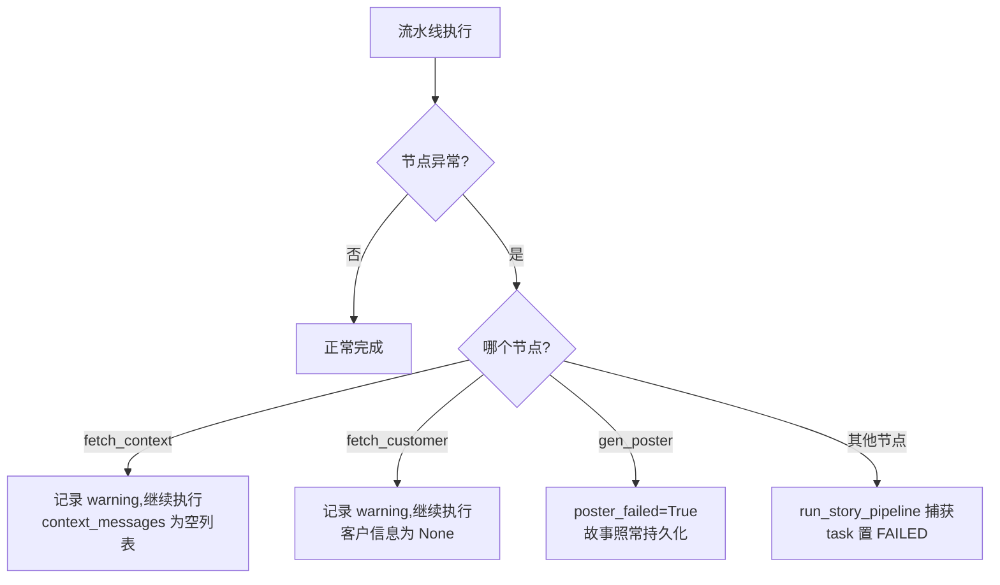

**分层异常处理：**
- **节点级**：`fetch_context` 和 `fetch_customer` 的查询失败被局部捕获，不影响后续节点
- **海报级**：`gen_poster` 失败不阻断故事持久化，支持独立重试
- **全局级**：`run_story_pipeline` 的 `try/except` 兜底所有未处理异常

---

## 文件结构

```
applications/agent/story_agent/
├── graph.py                    # 流水线图定义、状态、所有节点实现、入口函数
├── group_locator.py            # 独立群定位能力
├── poster_prototype.py         # 海报原型图配置与加载
├── assets/
│   └── prototypes/             # 海报原型图文件（cover.png, cause.png 等）
└── nodes/
    └── story_writer.py         # LLM 故事撰写节点、输出数据模型定义
```
