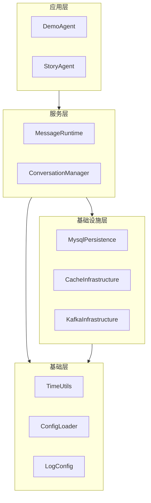
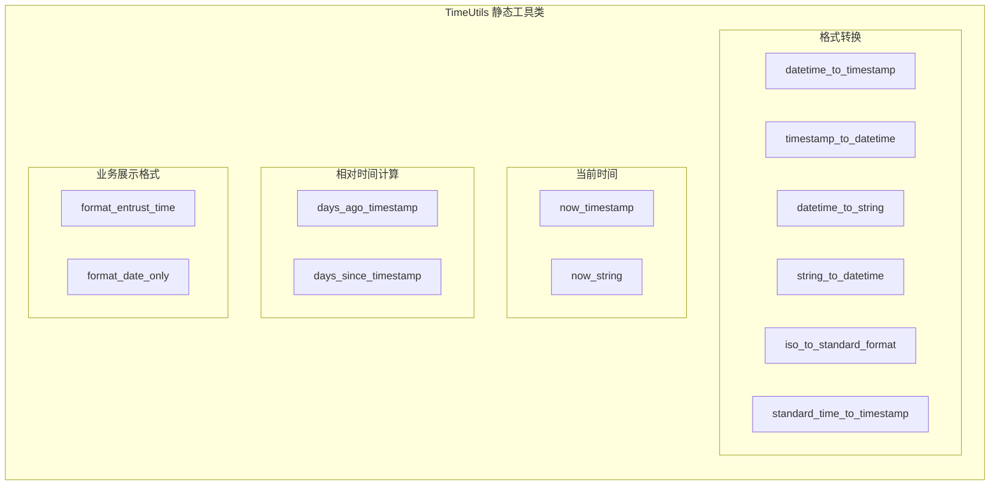
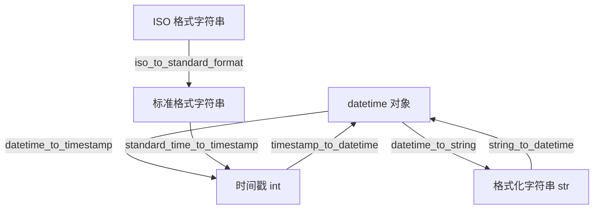
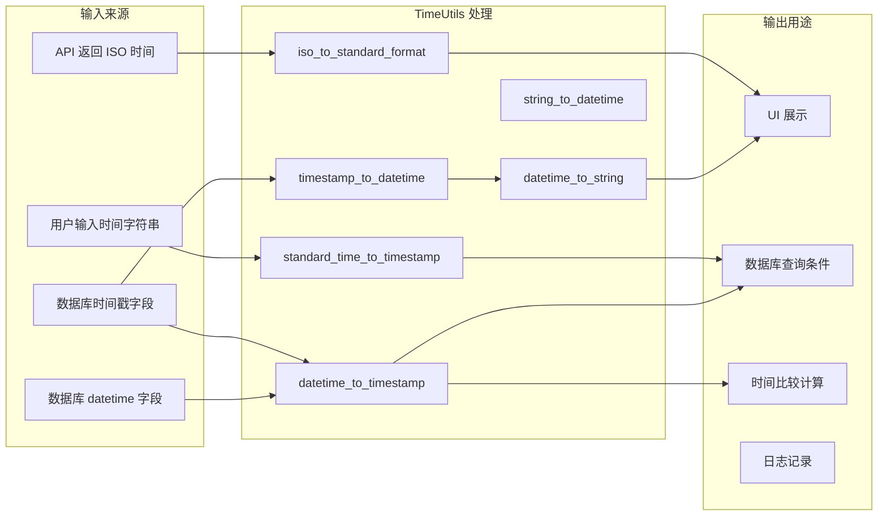
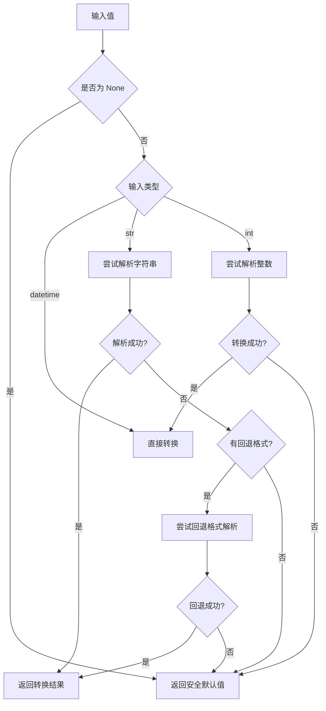

# TimeUtils 模块文档

## 模块概述

TimeUtils 是一个纯基础工具模块，提供时间戳、`datetime` 对象和格式化字符串之间的相互转换能力。该模块位于系统分层架构的 **基础层（utils/）**，不依赖任何业务模块或上层组件，仅使用 Python 标准库 `datetime`，可被系统中任意层调用。

模块的核心设计目标是统一项目中的时间处理逻辑，消除各处散落的 `datetime` 转换代码，并优雅地处理 `None`、非法字符串、越界时间戳等边界情况——所有解析失败均返回安全的默认值（时间戳返回 `0`，`datetime` 返回 `1970-01-01 08:00:01`，字符串返回空串），保证调用方不会因格式异常而抛出运行时错误。

## 系统定位



TimeUtils 处于架构最底层的工具层，与 [ConfigLoader](ConfigLoader.md)、[LogConfig](LogConfig.md) 同级，为上层的所有模块提供无状态的时间转换服务。

## 核心组件详解

### TimeUtils 类

`TimeUtils` 是一个纯静态工具类（所有方法均为 `@staticmethod`），无需实例化即可使用。类内按功能可分为四个方法组：



#### 1. 格式转换方法组

该组方法负责在 `datetime` 对象、时间戳（秒级 `int`）和格式化字符串（`str`）三种表示之间相互转换。



| 方法 | 输入 | 输出 | 失败默认值 |
|------|------|------|-----------|
| `datetime_to_timestamp` | `datetime \| str \| None` | `int` 秒级时间戳 | `0` |
| `timestamp_to_datetime` | `int \| str \| None` | `datetime` | `1970-01-01 08:00:01` |
| `datetime_to_string` | `datetime \| None`, 格式 | `str` | `""` |
| `string_to_datetime` | `str \| None`, 格式 | `datetime` | `1970-01-01 08:00:01` |
| `iso_to_standard_format` | ISO 字符串 | `YYYY-MM-DD HH:MM:SS` | `""` |
| `standard_time_to_timestamp` | `YYYY-MM-DD HH:MM:SS` | `int` 秒级时间戳 | `0` |

**容错设计要点：**

- `datetime_to_timestamp` 接受 `datetime` 对象、ISO 格式字符串（含 `Z` 后缀的 UTC 时间）或 `None`，通过统一的 `if/elif` 分支逐一尝试解析。
- `timestamp_to_datetime` 支持 `int` 和 `str` 两种时间戳输入，对字符串先做 `int()` 转换，再调用 `datetime.fromtimestamp()`，捕获 `ValueError` 和 `OSError`（处理极端时间戳）。
- `string_to_datetime` 先尝试用户指定的 `fmt` 格式解析，失败后自动回退到 ISO 格式（`fromisoformat`），提高对混合格式数据的兼容性。

#### 2. 当前时间方法组

| 方法 | 返回值 | 说明 |
|------|--------|------|
| `now_timestamp()` | `int` | 当前时间的秒级时间戳 |
| `now_string(fmt)` | `str` | 当前时间的格式化字符串，默认 `YYYY-MM-DD HH:MM:SS` |

#### 3. 相对时间计算方法组

| 方法 | 参数 | 返回值 | 说明 |
|------|------|--------|------|
| `days_ago_timestamp(days)` | `int` 天数 | `int` | N 天前的时间戳 |
| `days_since_timestamp(timestamp)` | `int` 时间戳 | `int` | 时间戳距今的天数 |

`days_since_timestamp` 对无效时间戳（`<= 0`）返回 `999999`，使调用方可以通过 `> N` 判断"数据是否过期"而无需额外的空值检查。

#### 4. 业务展示格式方法组

| 方法 | 输入 | 输出 | 示例 |
|------|------|------|------|
| `format_entrust_time(time_str, fmt)` | 标准时间字符串 | `MM-dd HH:mm` | `"2025-09-18 15:59:43"` → `"09-18 15:59"` |
| `format_date_only(time_str)` | 标准时间字符串 | `YYYY-MM-DD` | `"2025-10-09 14:46:49"` → `"2025-10-09"` |

这两个方法内部组合调用 `string_to_datetime` + `datetime_to_string`，体现了工具方法间的复用关系。

### 模块级快捷函数

文件末尾导出了一组模块级函数，是 `TimeUtils` 静态方法的薄包装，便于通过 `from utils.time_utils import now_timestamp` 直接使用，省略类名前缀：

```python
now_timestamp()          → TimeUtils.now_timestamp()
now_string(fmt)          → TimeUtils.now_string(fmt)
datetime_to_timestamp()  → TimeUtils.datetime_to_timestamp()
timestamp_to_datetime()  → TimeUtils.timestamp_to_datetime()
standard_time_to_timestamp() → TimeUtils.standard_time_to_timestamp()
datetime_to_string()     → TimeUtils.datetime_to_string()
format_entrust_time()    → TimeUtils.format_entrust_time()
```

> **注意：** `days_ago_timestamp`、`days_since_timestamp`、`format_date_only`、`iso_to_standard_format` 四个方法未提供模块级快捷函数，调用时需使用 `TimeUtils.method_name()` 形式。

## 方法调用关系

```mermaid
graph TD
    ISO2STD[iso_to_standard_format] --> STR2DT[string_to_datetime]
    ISO2STD --> DT2STR[datetime_to_string]
    FORMAT_ET[format_entrust_time] --> STR2DT
    FORMAT_ET --> DT2STR
    FORMAT_DATE[format_date_only] --> STR2DT
    FORMAT_DATE --> DT2STR

    %% 快捷函数委托
    FN_NOW_TS[now_timestamp] -->|委托| NOW_TS[TimeUtils.now_timestamp]
    FN_NOW_STR[now_string] -->|委托| NOW_STR[TimeUtils.now_string]
    FN_DT2TS[datetime_to_timestamp] -->|委托| DT2TS[TimeUtils.datetime_to_timestamp]
    FN_TS2DT[timestamp_to_datetime] -->|委托| TS2DT[TimeUtils.timestamp_to_datetime]
    FN_STD2TS[standard_time_to_timestamp] -->|委托| STD2TS[TimeUtils.standard_time_to_timestamp]
    FN_DT2STR[datetime_to_string] -->|委托| DT2STR2[TimeUtils.datetime_to_string]
    FN_FORMAT_ET[format_entrust_time] -->|委托| FORMAT_ET2[TimeUtils.format_entrust_time]
```



高阶方法（`iso_to_standard_format`、`format_entrust_time`、`format_date_only`）通过组合调用 `string_to_datetime` 和 `datetime_to_string` 实现，避免重复的解析与格式化逻辑。

## 数据流

### 典型数据转换流程



### 容错处理流程



## 依赖关系

### 外部依赖

| 依赖 | 类型 | 用途 |
|------|------|------|
| `datetime`（Python 标准库） | 内置模块 | 核心时间处理，`datetime` 类、`timedelta`、`fromtimestamp`、`strftime`/`strptime` |

### 内部依赖

无。TimeUtils 不依赖项目内的任何其他模块。

### 被依赖情况

目前 TimeUtils 尚未被项目内其他模块导入使用。根据其设计意图，预期将被以下模块使用：

| 预期使用模块 | 使用场景 |
|-------------|---------|
| [MysqlPersistence](MysqlPersistence.md) | ORM 模型中 `datetime` 字段与时间戳之间的序列化/反序列化 |
| [MessageRuntime](MessageRuntime.md) | 消息时间戳的格式化展示 |
| [ApplicationBase](ApplicationBase.md) | 会话创建时间、最后活跃时间的计算 |
| [ApiMiddleware](ApiMiddleware.md) | 请求日志中时间戳的格式化 |
| [CacheInfrastructure](CacheInfrastructure.md) | 缓存过期时间的计算 |

## 关键设计模式

### 1. 安全默认值模式

所有公共方法对无效输入（`None`、空字符串、格式错误、越界值）均返回类型安全的默认值而非抛出异常：

- 时间戳类方法返回 `0`
- `datetime` 类方法返回 `datetime(1970, 1, 1, 8, 0, 1)`（东八区 Unix 纪元）
- 字符串类方法返回 `""`

该设计遵循基础层"不向上层抛异常"的原则，简化了调用方的错误处理逻辑。

### 2. 静态工具类模式

`TimeUtils` 采用纯静态方法设计，不持有任何实例状态，所有方法均为幂等的纯函数（输入相同则输出相同，无副作用）。模块级快捷函数进一步降低了调用成本。

### 3. 渐进式解析策略

`string_to_datetime` 方法采用渐进式解析：先尝试调用方指定的格式，失败后自动回退到 ISO 格式。`datetime_to_timestamp` 则依次尝试直接对象转换和 ISO 字符串解析。这种策略在数据来源多样（数据库、API、用户输入）的场景下提供了最大的兼容性。

### 4. 组合复用模式

高阶方法（`format_entrust_time`、`format_date_only`、`iso_to_standard_format`）不重复实现解析逻辑，而是组合调用 `string_to_datetime` + `datetime_to_string`，保持实现简洁且易于维护。
