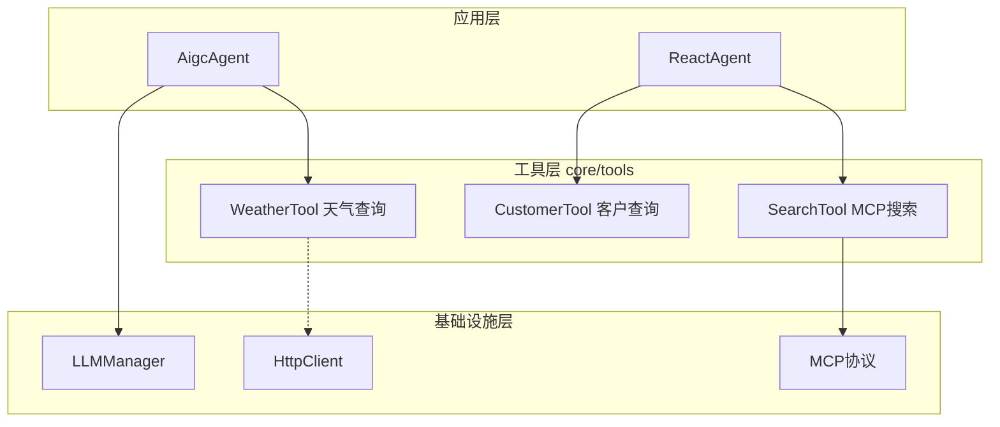
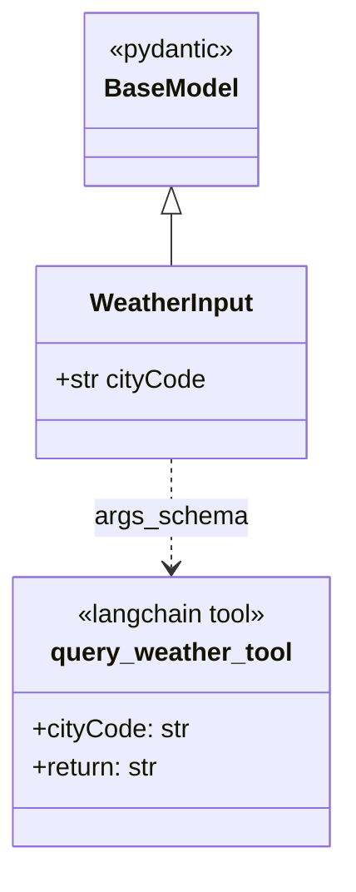
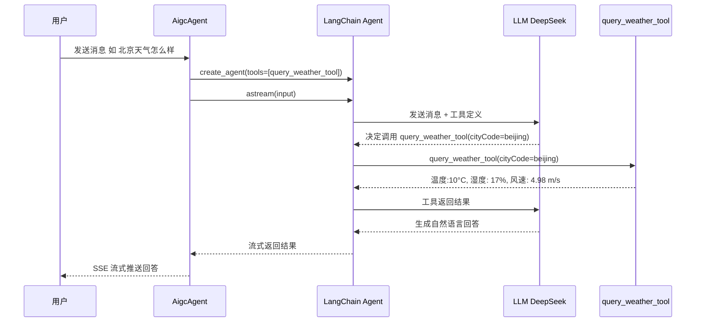
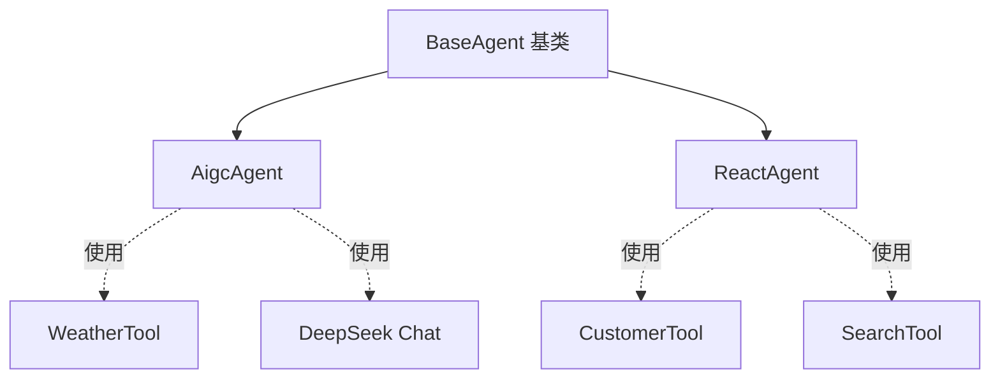
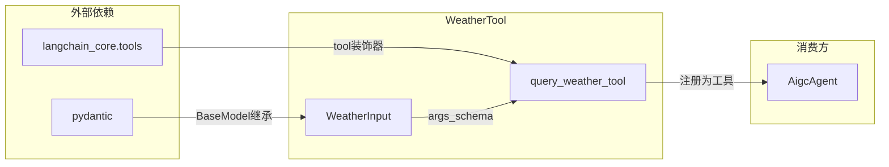

# WeatherTool 模块文档

## 模块概述

WeatherTool 是 Aigc-Agent 系统中的一个**工具模块**，位于 `core/tools/weather_tool.py`。它基于 LangChain 的 `@tool` 装饰器实现了一个天气查询工具，允许 Agent 在对话过程中调用该工具获取指定城市的天气信息。

该模块是系统工具层（`core/tools/`）的组成部分，当前以 Mock 数据方式提供天气查询能力，设计上预留了对接真实天气 API 的扩展空间。

## 系统定位

WeatherTool 在整体架构中处于**核心工具层**，位于 Agent 应用层与基础设施层之间，为上层 Agent 提供可调用的工具能力。



## 核心组件详解

### WeatherInput（参数模型）

`WeatherInput` 是一个 Pydantic `BaseModel`，定义了天气查询工具的输入参数 Schema。LangChain 通过 `args_schema` 参数将其绑定到工具函数，实现自动参数校验和 LLM Function Calling 的参数描述生成。



| 字段 | 类型 | 必填 | 描述 |
|------|------|------|------|
| `cityCode` | `str` | 是 | 城市的英文名称（如 `beijing`、`shanghai`） |

### query_weather_tool（工具函数）

使用 `@tool` 装饰器注册的 LangChain 工具函数，接受 `cityCode` 参数并返回天气报告字符串。

**当前行为（Mock 实现）：**

| 输入城市 | 返回结果 | 备注 |
|---------|---------|------|
| `chengdu` | 抛出 `Exception` | 模拟查询错误场景 |
| `beijing` | `温度:10°C, 湿度: 17%, 风速: 4.98 m/s` | 北京特定返回值 |
| 其他城市 | `温度:21°C, 湿度: 119%, 风速: 6 m/s` | 通用返回值 |

> **注意：** 当前实现为 Mock 版本，所有数据均为硬编码。正式环境中应替换为真实天气 API 调用。

## 工具调用流程

WeatherTool 通过 LangChain Agent 框架的 Tool Calling 机制被调用。整体流程如下：



## 与 AigcAgent 的集成

WeatherTool 目前仅被 `AigcAgent` 引用和使用。AigcAgent 在模块级创建 LangChain Agent 时将 `query_weather_tool` 注册为可用工具：

```python
# applications/agent/demo_agent/aigc_agent.py
from agent.core.tools.weather_tool import query_weather_tool

agent = create_agent(
    model=model,
    tools=[query_weather_tool],   # 注册天气工具
    system_prompt=SYSTEM_PROMPT,
    checkpointer=create_checkpointer(CheckpointerBackend.MEMORY)
)
```

AigcAgent 继承自 [BaseAgent](ApplicationBase.md)，覆盖了 `execute_stream()` 方法，直接使用 LangChain Agent 的 `astream()` 进行流式执行，而非通过基类的 LangGraph StateGraph 流程。



## 工具层生态

WeatherTool 所在的 `core/tools/` 目录包含系统中所有自定义工具，它们共享相同的 LangChain `@tool` 定义模式：

| 工具 | 文件 | 用途 | 被引用的 Agent |
|------|------|------|---------------|
| `query_weather_tool` | `weather_tool.py` | 天气查询（Mock） | AigcAgent |
| `query_customer_info` | `customer_tool.py` | 客户信息查询（Mock） | ReactAgent |
| `get_mcp_search_tools` | `search_tool.py` | MCP 协议搜索工具 | ReactAgent |
| `wxwork_emoji` | `wxwork_emoji.py` | 企业微信表情 | - |
| MCP 工具 | `mcp/` | MCP 协议客户端 | ReactAgent |

## 依赖关系



WeatherTool 的外部依赖非常轻量，仅依赖两个包：
- **langchain_core**：提供 `@tool` 装饰器，用于将函数注册为 LangChain 可调用工具
- **pydantic**：提供 `BaseModel` 和 `Field`，用于定义输入参数的 Schema 和描述

## 扩展建议

当前 WeatherTool 为 Mock 实现，如需对接真实天气服务，建议：

1. **接入真实 API**：在 `query_weather_tool` 函数内替换为 HTTP 调用，可使用 [HttpClient](HttpClient.md) 模块中的 `AsyncHttpClientManager` 发起异步请求
2. **缓存策略**：天气数据变化频率有限，建议引入 [CacheInfrastructure](CacheInfrastructure.md) 的 `CacheManager` 对查询结果做短期缓存，减少外部 API 调用
3. **错误处理增强**：当前 `chengdu` 的异常抛出方式较为粗糙，建议返回结构化错误信息，由 LLM 决定如何向用户解释
4. **参数扩展**：`WeatherInput` 可增加 `date`（查询日期）、`unit`（温度单位）等可选字段，提升工具的灵活性
