# change_contract_strategy 模块

## 模块概述

`change_contract_strategy` 模块是合同变更流程的核心路由层，采用 **策略模式（Strategy Pattern）** 将不同合同类型的变更逻辑解耦。该模块根据合同类型（如套餐变更协议、设计变更协议）将请求分发到对应的具体策略实现，每个策略封装了各自独特的校验规则、数据加载方式和提交逻辑，同时共享通用的变更合同服务层能力。

模块解决了以下核心问题：
- **类型差异隔离**：不同合同类型（PACKAGE_CHANGE / DESIGN_CHANGE）在详情查询、校验规则、差异计算上存在本质差异，策略模式避免了大量的 `if-else` 分支
- **统一生命周期管理**：所有策略共享一致的 7 阶段生命周期接口（查看详情 → 保存前校验 → 保存草稿 → 提交前校验 → 提交 → 提交V2 → 确认）
- **可扩展性**：新增合同变更类型只需实现 `ChangeContractStrategy` 接口并注册为 Spring Bean，无需修改工厂或调用方代码

---

## 架构总览

### 系统定位

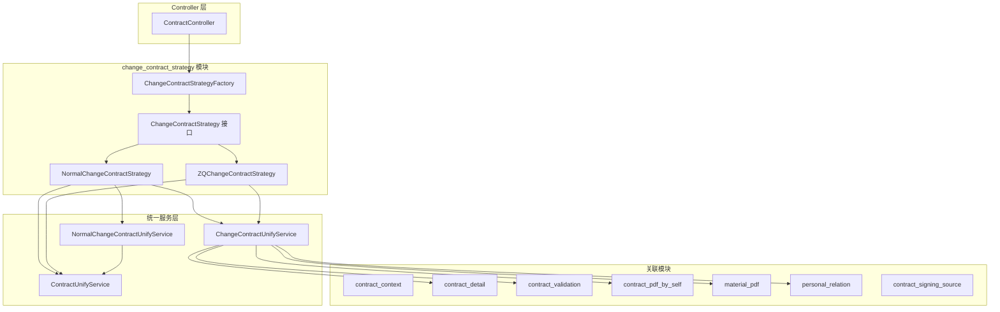

### 核心组件关系

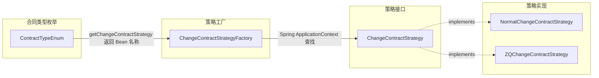

---

## 核心组件详解

### 1. ChangeContractStrategyFactory — 策略工厂

**职责**：基于合同类型枚举动态选择对应的策略实现。

**实现机制**：
- 实现 `ApplicationContextAware` 接口，在 Spring 容器启动时自动扫描所有 `ChangeContractStrategy` 类型的 Bean，注册到 `Map<String, ChangeContractStrategy>` 中
- `getChangeContractStrategy(ContractTypeEnum)` 方法通过枚举的 `getChangeContractStrategy()` 获取 Bean 名称，从 Map 中查找对应策略

**调用流程**：

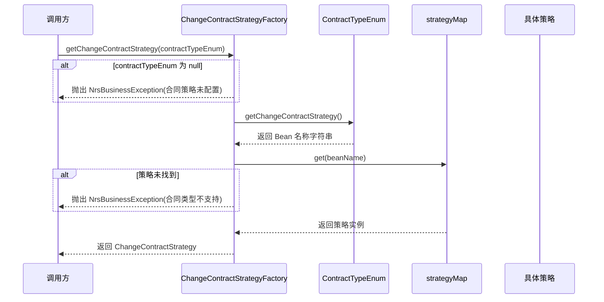

**Bean 名称与合同类型映射**：

| ContractTypeEnum | 枚举编码 | 合同类型名称 | 策略 Bean 名称 |
|-----------------|---------|-------------|---------------|
| `PACKAGE_CHANGE` | 4 | 套餐变更协议 | `zqChangeContractStrategy` |
| `DESIGN_CHANGE` | 11 | 设计变更协议 | `normalChangeContractStrategy` |

### 2. ChangeContractStrategy — 策略接口

**职责**：定义变更合同的统一生命周期方法，所有具体策略必须实现。

**7 个生命周期方法**：

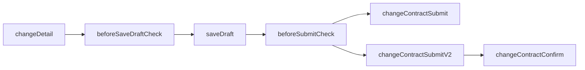

| 阶段 | 方法 | 说明 |
|------|------|------|
| 查看 | `changeDetail()` | 加载变更合同详情，根据策略类型选择不同查询方式 |
| 保存前校验 | `beforeSaveDraftCheck()` | 校验基础参数 + 变更单/合同发起资格 |
| 保存草稿 | `saveDraft()` | 持久化变更合同草稿 |
| 提交前校验 | `beforeSubmitCheck()` | 在保存前校验基础上增加必填字段校验 |
| 提交 V1 | `changeContractSubmit()` | 模块级差异计算（兼容旧版 PC 对比方式，已废弃） |
| 提交 V2 | `changeContractSubmitV2()` | 统一差异字段计算（2.5 版本，当前主用） |
| 确认 | `changeContractConfirm()` | 异步最终确认 + PDF 生成 |

### 3. NormalChangeContractStrategy — 设计变更策略

**适用合同类型**：`DESIGN_CHANGE`（设计变更协议，枚举编码 11）

**核心特征**：不依赖 `changeOrderId`，变更基于正式合同（formal contract）本身字段的修改。

**组件依赖**：

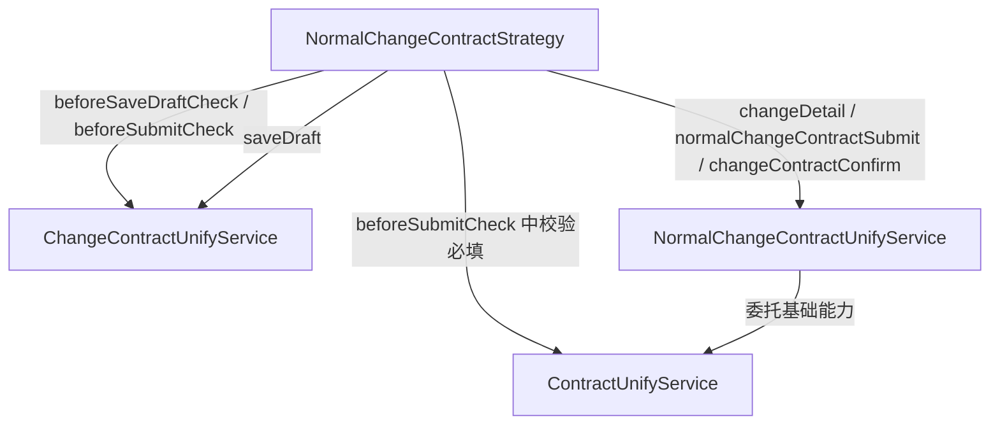

**各方法行为详解**：

| 方法 | 行为 |
|------|------|
| `changeDetail()` | 委托 `NormalChangeContractUnifyService.detail()`，从正式合同继承字段 |
| `beforeSaveDraftCheck()` | ① 调用 `changeContractBaseParamCheck` 校验基础参数 ② 调用 `checkChangeContractWithoutChangeOrderId` 校验变更合同发起资格（不检查变更单） |
| `saveDraft()` | 委托 `ChangeContractUnifyService.saveDraft()` |
| `beforeSubmitCheck()` | 在保存前校验基础上追加 `contractUnifyService.checkContractRequired()` 必填字段校验 |
| `changeContractSubmit()` | 返回 null（设计变更不使用 V1 提交） |
| `changeContractSubmitV2()` | 委托 `NormalChangeContractUnifyService.normalChangeContractSubmit()`，计算模板字段差异 |
| `changeContractConfirm()` | 委托 `NormalChangeContractUnifyService.changeContractConfirm()` |

**提交流程（normalChangeContractSubmit 内部）**：

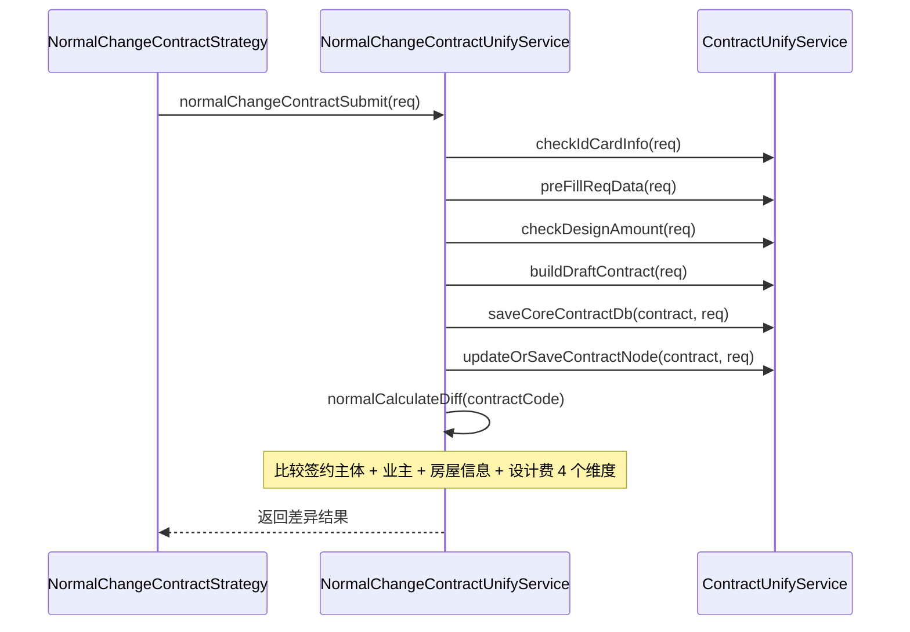

### 4. ZQChangeContractStrategy — 整迁变更策略

**适用合同类型**：`PACKAGE_CHANGE`（套餐变更协议，枚举编码 4）

**核心特征**：强依赖 `changeOrderId`（变更单 ID），变更基于变更单触发的套餐/报价调整。

**组件依赖**：

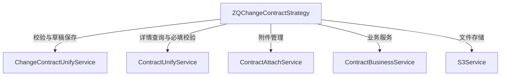

**各方法行为详解**：

| 方法 | 行为 |
|------|------|
| `changeDetail()` | 委托 `ContractUnifyService.changeDetail()`，基于 contractCode + projectOrderId + changeOrderId 联合查询 |
| `beforeSaveDraftCheck()` | ① 调用 `changeContractBaseParamCheck` 校验基础参数 ② 调用 `checkChangeOrder` 校验变更单是否能发起合同变更 ③ 调用 `checkChangeContract` 校验变更合同发起资格（含变更单） |
| `saveDraft()` | 委托 `ChangeContractUnifyService.saveDraft()` |
| `beforeSubmitCheck()` | 在保存前校验基础上追加 `contractUnifyService.checkContractRequired()` 必填字段校验 |
| `changeContractSubmit()` | 委托 `ChangeContractUnifyService.changeContractSubmit()`（V1，兼容旧版 PC） |
| `changeContractSubmitV2()` | 委托 `ChangeContractUnifyService.changeContractSubmitV2()`（V2，统一 diff 接口） |
| `changeContractConfirm()` | 委托 `ChangeContractUnifyService.changeContractConfirm()` |

---

## 策略差异对比

### Normal vs ZQ 策略核心差异

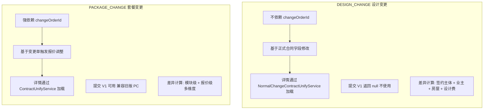

| 维度 | NormalChangeContractStrategy | ZQChangeContractStrategy |
|------|----------------------------|-------------------------|
| 合同类型 | `DESIGN_CHANGE`（11） | `PACKAGE_CHANGE`（4） |
| changeOrderId 依赖 | 不依赖 | 强依赖 |
| 校验链 | `baseParamCheck` → `checkWithoutChangeOrderId` | `baseParamCheck` → `checkChangeOrder` → `checkChangeContract` |
| 详情加载服务 | `NormalChangeContractUnifyService.detail()` | `ContractUnifyService.changeDetail()` |
| 提交 V1 | 不支持（返回 null） | 支持（兼容旧版 PC） |
| 提交 V2 差异范围 | 4 维度：签约主体/业主/房屋/设计费 | 多维度：模块/报价/图纸/其他字段 |
| 依赖的附件/存储服务 | 不直接依赖 | 依赖 `ContractAttachService`、`S3Service` |

---

## 数据流

### 变更合同完整生命周期数据流

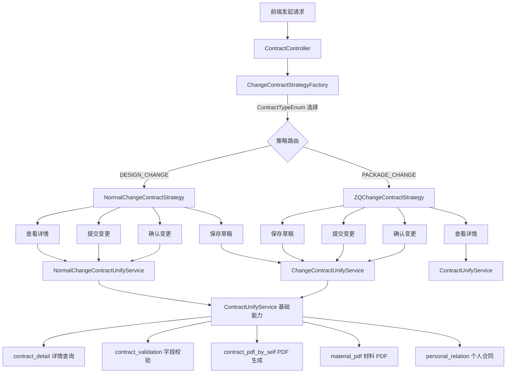

### 校验流程对比

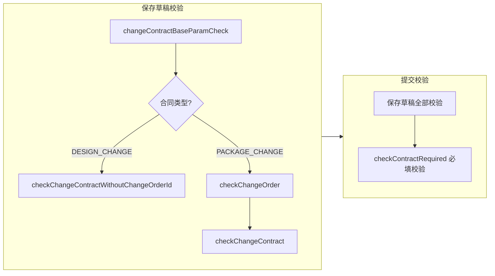

---

## 关键设计模式

### 1. 策略模式（Strategy Pattern）

本模块的核心设计模式。`ChangeContractStrategy` 接口定义统一的算法骨架（7 阶段生命周期），`NormalChangeContractStrategy` 和 `ZQChangeContractStrategy` 分别实现不同合同类型的差异化逻辑。

**优势**：
- 新增合同变更类型只需实现接口 + 注册 Bean
- 各策略的校验和提交逻辑独立演进，互不影响
- `beforeSaveDraftCheck` / `beforeSubmitCheck` 的差异化校验被自然封装

### 2. 工厂模式（Factory Pattern）+ Spring IoC 自动发现

`ChangeContractStrategyFactory` 结合 `ApplicationContextAware` 实现了基于 Spring 容器的自动策略注册：

```java
changeContractStrategyMap = applicationContext.getBeansOfType(ChangeContractStrategy.class);
```

调用方无需关心具体策略实现的存在，只需传入 `ContractTypeEnum` 即可获得正确的策略实例。新增策略时零配置成本——只要类标注了 `@Component` 并实现了接口，就会被自动发现。

### 3. 模板方法模式（Template Method）的隐式应用

`beforeSubmitCheck` 在两个策略中都遵循相同的骨架：先执行 `beforeSaveDraftCheck` 的校验逻辑，再追加 `checkContractRequired` 必填校验。虽然没有显式的模板方法抽象类，但这种"校验链叠加"的模式本质上是模板方法的变体。

### 4. 委托模式（Delegation Pattern）

两个策略自身不包含复杂业务逻辑，而是将实际工作委托给统一服务层：
- `ChangeContractUnifyService`：通用变更合同能力（草稿保存、提交、确认、diff 计算）
- `NormalChangeContractUnifyService`：设计变更专属能力（详情加载、差异计算）
- `ContractUnifyService`：合同基础能力（字段校验、数据预填充、DB 持久化）

策略层的职责被精确定位为**路由 + 组合调用**，而非业务逻辑实现。

---

## 模块间依赖关系

| 依赖模块 | 依赖方式 | 说明 |
|---------|---------|------|
| [contract_context](contract_context.md) | 间接 | 通过 `ContractContextHandler` 获取合同上下文信息 |
| [contract_detail](contract_detail.md) | 通过 `ChangeContractUnifyService` | 详情查询由统一服务层委托至详情模块 |
| [contract_validation](contract_validation.md) | 通过 `ContractUnifyService` | `checkContractRequired` / `checkIdCardInfo` 等校验方法 |
| [contract_pdf_by_self](contract_pdf_by_self.md) | 通过 `ChangeContractUnifyService` | 变更确认后的 PDF 生成 |
| [material_pdf](material_pdf.md) | 通过 `ChangeContractUnifyService` | 材料 PDF 差异计算 |
| [personal_relation](personal_relation.md) | 通过 `ChangeContractUnifyService` | 个人合同（C 端合同）自动生成 |
| [contract_signing_source](contract_signing_source.md) | 通过 `ChangeContractUnifyService` | 签约来源策略（变更单签约来源） |

---

## 扩展指南

### 新增合同变更类型

1. 在 `ContractTypeEnum` 中新增枚举值，实现 `getChangeContractStrategy()` 返回新策略的 Bean 名称
2. 创建新策略类实现 `ChangeContractStrategy` 接口，标注 `@Component`
3. 在策略类中注入所需的统一服务，按业务需求选择性委托
4. 工厂自动发现新策略，无需修改 `ChangeContractStrategyFactory` 或调用方代码

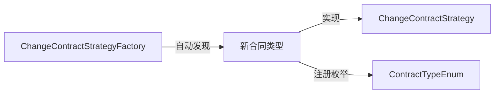
