# Contract Context 模块

## 1. 模块概述

Contract Context 是合同子系统中的**数据准备与上下文管理**模块，采用 AOP（面向切面编程）模式，在合同的保存/提交/查询等业务方法执行前，自动完成多维度数据的并行加载与预处理，并将结果存储在线程隔离的上下文中供后续业务逻辑使用。

该模块的核心设计理念是：**将数据准备（横切关注点）与业务逻辑（核心关注点）彻底分离**，通过注解驱动 + AOP 拦截的机制，让业务代码无需关心"数据从哪里来、怎么拼装"，只需从上下文中读取即可。

模块包含两大核心场景：
- **合同保存/提交场景**：`ContractContextAspect` + `ContractContextHandler`，对应注解 `@ContractDataPrepare`
- **合同详情查询场景**：`ContractDetailAspect` + `ContractDetailContextHandler`，对应注解 `@ContractDetailDataPrepare`

---

## 2. 架构总览

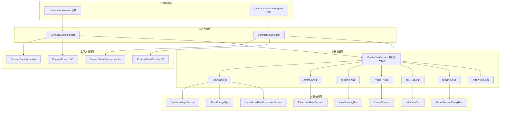

---

## 3. 核心组件详解

### 3.1 ContractContextHandler -- 线程级上下文容器

`ContractContextHandler` 是一个基于 `ThreadLocal` 的静态工具类，负责在当前请求线程内存储和读取合同上下文数据。

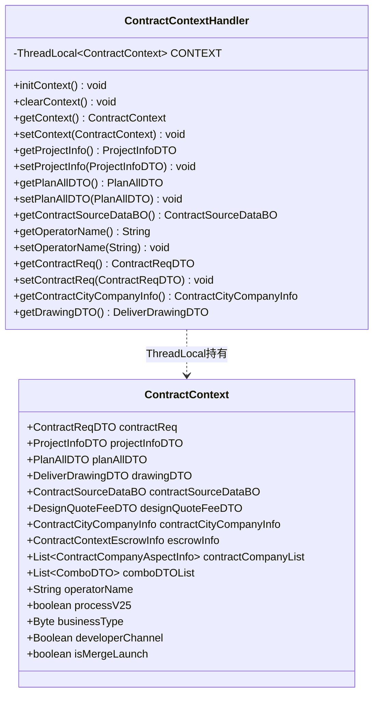

**关键特性：**

| 特性 | 说明 |
|------|------|
| 线程隔离 | 每个请求线程拥有独立的 `ContractContext` 实例，天然线程安全 |
| 生命周期管理 | `@Before` 初始化、业务方法执行、`@After`/`@AfterThrowing` 清除 |
| 空安全 | getter 方法在 `CONTEXT.get() == null` 时返回 null，而非抛出 NPE |
| 便捷访问 | 提供静态方法直接访问常用字段，如 `getPlanAllDTO()`、`getOperatorName()` |

### 3.2 ContractContextAspect -- 合同数据准备切面

`ContractContextAspect` 是模块的核心引擎，拦截所有标注了 `@ContractDataPrepare` 注解的方法，在方法执行前完成合同所需的全量数据准备。切面共创建 **9 个并行任务**：基础信息、报价信息、套餐信息、项目信息、操作人姓名、图纸信息、存管账户、标准设计费、合同主体。

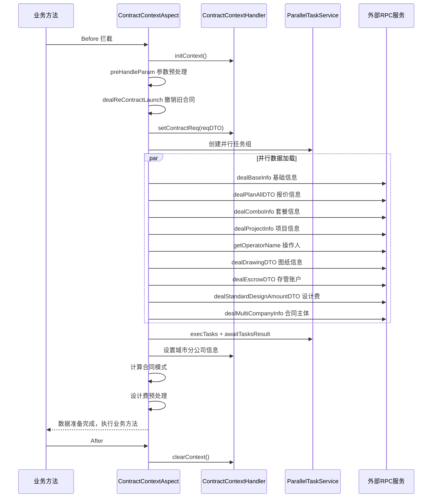

#### 3.2.1 参数预处理流程 (preHandleParam)

参数预处理是数据准备的第一步，负责清理和规范化前端传入的请求参数：

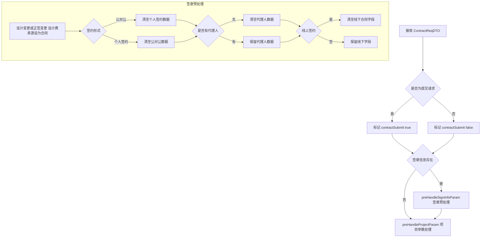

#### 3.2.2 报价信息准备 (dealPlanAllDTO)

报价信息的准备逻辑因合同类型不同而有显著差异：

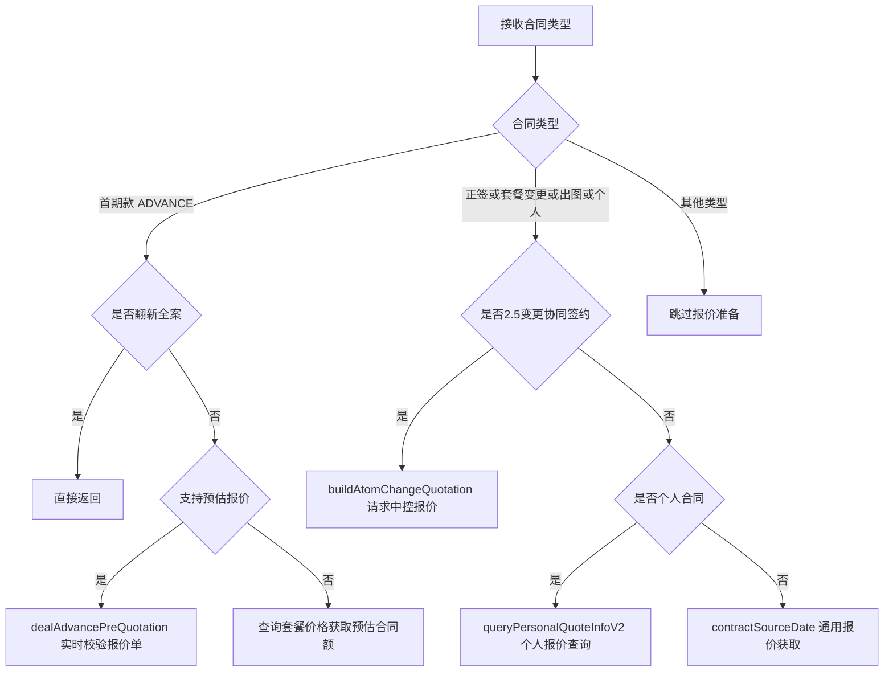

#### 3.2.3 图纸信息准备 (dealDrawingDTO)

图纸信息的获取路径同样按合同类型和业务类型区分：

| 条件 | 数据来源 |
|------|---------|
| 团装2.5正签 | `contractBusinessService.getGroupDrawingDTO()` |
| 套餐变更 | `atomDrawingRpc.getChangeListDrawings()` |
| 个人合同 | `contractSigningSourceRouter.route().buildPersonalDrawing()` |
| 其他正签 | `atomDrawingRpc.listDrawings()` |

仅当合同类型属于 `[正签, 出图, 个人, 套餐变更]` 且流程版本为 V2.5 时才加载图纸数据。

### 3.3 ContractDetailContextHandler -- 合同详情上下文容器

`ContractDetailContextHandler` 是合同详情查询场景的上下文管理器，结构与 `ContractContextHandler` 类似，但存储的是详情查询专用的 `ContractDetailContext`。

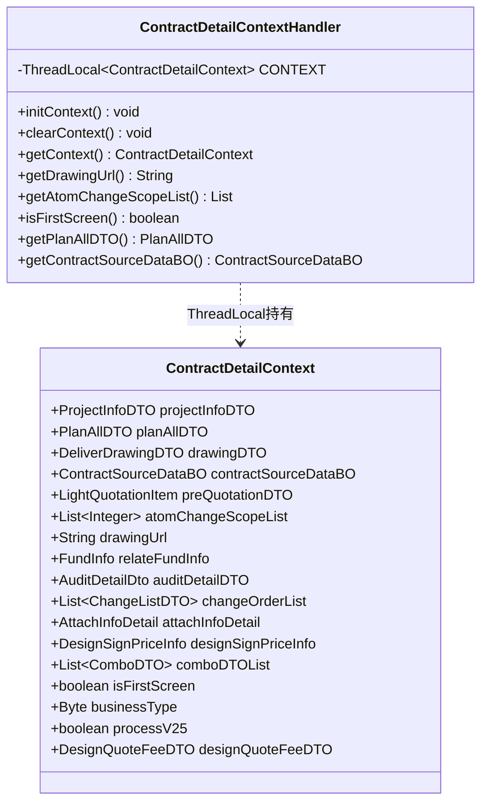

**首屏优化策略**：当请求参数 `isFirstScreen=true` 时，`ContractDetailAspect` 仅加载 3 项轻量数据（项目信息、附件信息、设计费），而非全量 8 项，显著缩短首屏响应时间。

**已知风险**：`ContractDetailContextHandler` 的 getter 方法缺少 null 安全检查（与 `ContractContextHandler` 不同），在上下文未初始化时存在 NPE 风险。

### 3.4 ContractDetailService -- 合同详情组装服务

`ContractDetailService` 负责将上下文中预加载的数据组装为完整的合同详情响应，主要入口方法为 `initContractDetail`。

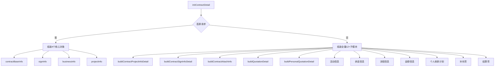

---

## 4. 模块间依赖关系

```mermaid
graph LR
    subgraph CtxMod[contract_context 核心模块]
        A1[ContractContextAspect]
        A2[ContractContextHandler]
    end

    subgraph DetMod[contract_detail 详情模块]
        B1[ContractDetailAspect]
        B2[ContractDetailContextHandler]
        B3[ContractDetailService]
    end

    subgraph ValMod[contract_validation 校验模块]
        C1[ContractFieldCheckService]
        C2[WorkerTypeCheckService]
    end

    subgraph ChgMod[change_contract_strategy 变更策略模块]
        D1[ChangeContractStrategyFactory]
        D2[NormalChangeContractStrategy]
        D3[ZQChangeContractStrategy]
    end

    subgraph PdfMod[contract_pdf_by_self 自生成PDF模块]
        E1[DrawingContractPdfBySelfStrategy]
        E2[GroupFormalContractPdfBySelfStrategy]
        E3[ReformAllFormalContractPdfBySelfStrategy]
    end

    subgraph TermMod[terminal_contract_pdf 解约PDF模块]
        F1[TerminalContractPdfBuildService]
    end

    subgraph MatMod[material_pdf 物料PDF模块]
        G1[MaterialPdfDiffService]
        G2[MaterialPdfUtil]
    end

    subgraph RelMod[personal_relation 个人关系模块]
        H1[PersonalRelationHandler]
        H2[PersonalRelationHandlerImpl]
    end

    subgraph SrcMod[contract_signing_source 签约来源模块]
        I1[ContractSigningSource]
        I2[BillSigningSourceStrategy]
        I3[ChangeOrderSigningSourceStrategy]
        I4[SubOrderSigningSourceStrategy]
    end

    A1 -->|上下文管理| A2
    A1 -->|获取设计师等级| B3
    A1 -->|变更合同报价处理| D1
    A1 -->|个人合同图纸路由| I1
    B1 -->|上下文管理| B2
    B3 -->|读取预加载数据| B2
    B3 -->|字段校验| C1
    D1 -->|设计变更策略| D2
    D1 -->|套餐变更策略| D3
```

| 依赖模块 | 依赖方式 | 说明 |
|---------|---------|------|
| [contract_detail](contract_detail.md) | `ContractDetailService.getDesignerLevelName()` | 上下文切面在设计费预处理时调用详情服务获取设计师等级 |
| [change_contract_strategy](change_contract_strategy.md) | `ChangeContractUnifyService` | 报价准备中变更合同走统一变更服务，间接使用策略工厂 |
| [contract_signing_source](contract_signing_source.md) | `ContractSigningSourceRouter` | 个人合同图纸获取时通过签约来源路由选择对应策略 |
| [contract_validation](contract_validation.md) | 间接依赖 | 校验模块在数据准备完成后执行，读取上下文中的数据进行字段校验 |
| [personal_relation](personal_relation.md) | 间接依赖 | 个人关系处理依赖上下文中已准备的签约信息 |
| [contract_pdf_by_self](contract_pdf_by_self.md) | 间接依赖 | PDF生成依赖上下文中已准备的报价、图纸等数据 |
| [terminal_contract_pdf](terminal_contract_pdf.md) | 间接依赖 | 解约PDF生成依赖上下文中的签约主体信息 |
| [material_pdf](material_pdf.md) | 间接依赖 | 物料PDF差异比对依赖上下文中的套餐/报价数据 |

---

## 5. 数据流全景

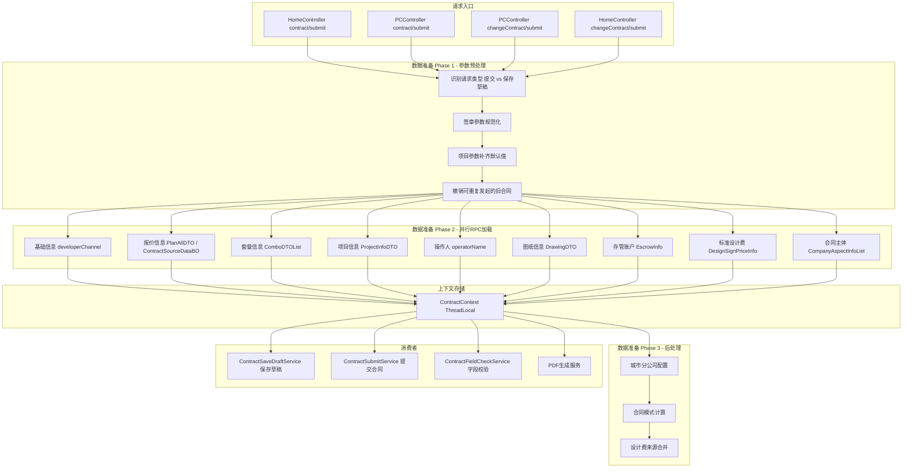

---

## 6. 关键设计模式

### 6.1 AOP 横切模式

模块采用 Spring AOP 的 `@Aspect` + 自定义注解模式，将数据准备逻辑从业务代码中剥离：

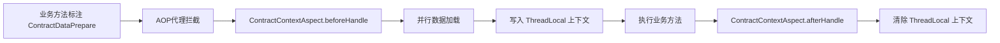

**优势**：业务代码只需声明 `@ContractDataPrepare` 注解即可获得完整的数据准备能力，无需编写任何数据获取代码。

### 6.2 并行任务编排模式

通过 `ParallelTaskService` 实现多任务并行执行，显著降低数据准备的总耗时：

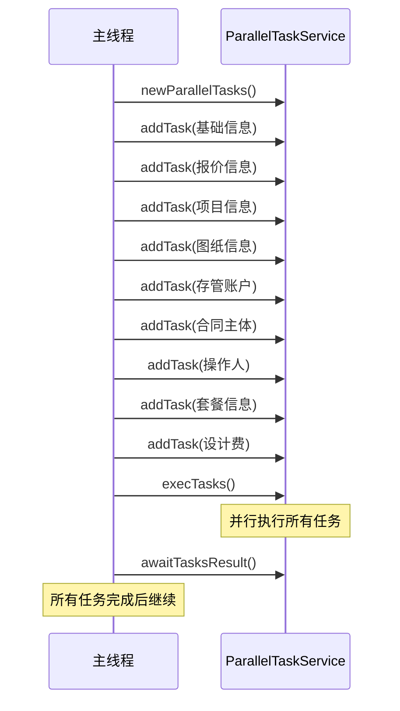

9 个独立的数据加载任务并行执行，总耗时约等于最慢的单个 RPC 调用耗时，而非所有调用之和。`ParallelTaskService` 底层使用 `CountDownLatch` 实现同步等待，默认超时 20 秒，支持失败重试机制。

### 6.3 策略路由模式

合同上下文模块中的数据准备逻辑根据不同合同类型、业务类型、流程版本等维度采用不同的处理策略：

| 维度 | 策略分支示例 |
|------|------------|
| 合同类型 | 正签/首期款/变更/出图/个人/设计费/存管/解约 |
| 业务类型 | 户证/团装/翻新全案 |
| 流程版本 | V2.5 vs 旧版本 |
| 签约形式 | 个人签约 vs 公对公签约 |
| 签约渠道 | 线上签约 vs 线下签约 |

这种多维度条件分支的设计使得数据准备逻辑能够精准适配每种业务场景，但也导致了较长的条件判断链。

### 6.4 ThreadLocal 上下文模式

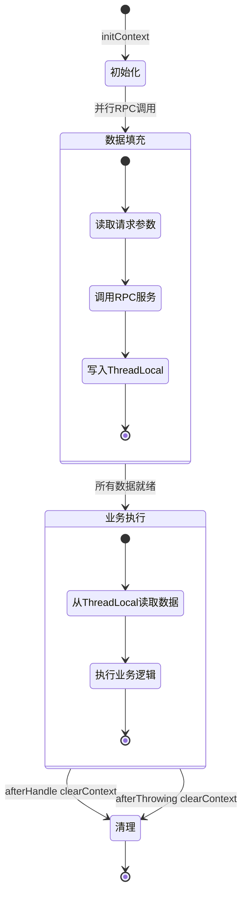

**生命周期保证**：
- `@Before` 初始化 + 数据填充
- 业务方法执行 从上下文读取
- `@After` + `@AfterThrowing` 双保险清除，避免 ThreadLocal 内存泄漏

---

## 7. 线程安全与风险点

| 风险项 | 说明 | 缓解措施 |
|--------|------|---------|
| ThreadLocal 内存泄漏 | 线程池复用时若上下文未清除会累积 | `@After` 和 `@AfterThrowing` 双重清除 |
| ContractDetailContextHandler 空安全 | getter 方法缺少 null 检查，上下文未初始化时 NPE | 建议参照 `ContractContextHandler` 增加 null 安全检查 |
| 并行任务异常传播 | 单个 RPC 失败可能导致整个数据准备失败 | `ParallelTaskService.awaitTasksResult` 内置异常收集与传播机制，通过 Future 获取异常并统一抛出 |
| 嵌套并行任务 | `buildAtomChangeQuotation` 内部再次创建并行任务组 | 需确保父子任务组之间不产生资源竞争 |
| 并行任务超时 | 默认超时 20 秒，超时后取消所有未完成任务 | `awaitTasksResult` 使用 `CountDownLatch.await(timeout)` 控制超时，超时后主动 cancel |
