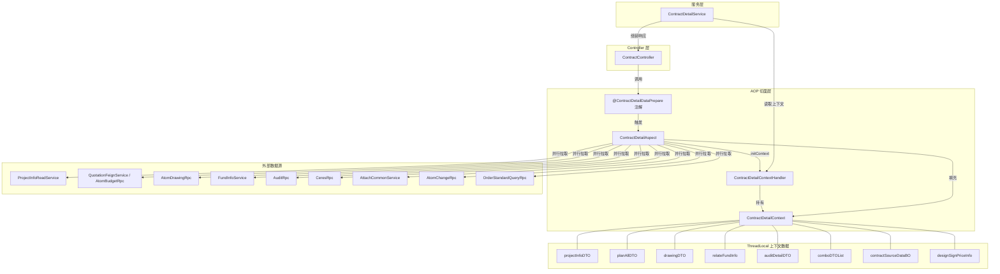
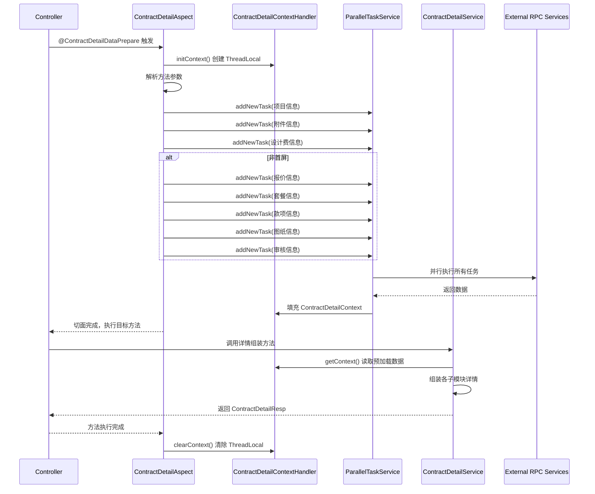
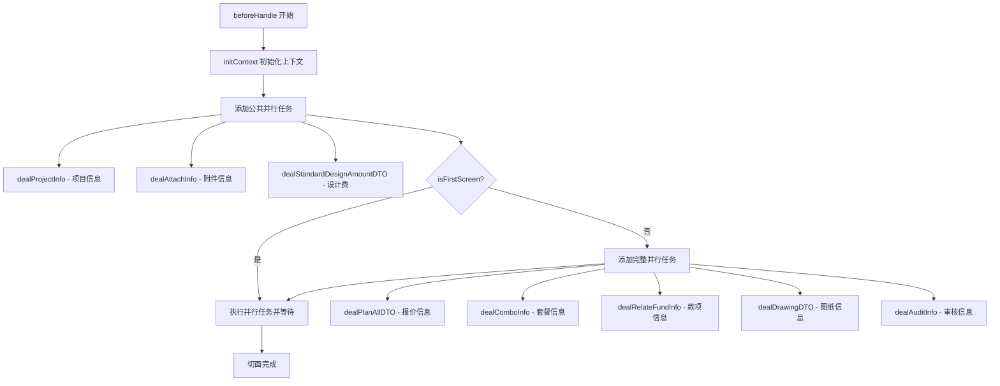
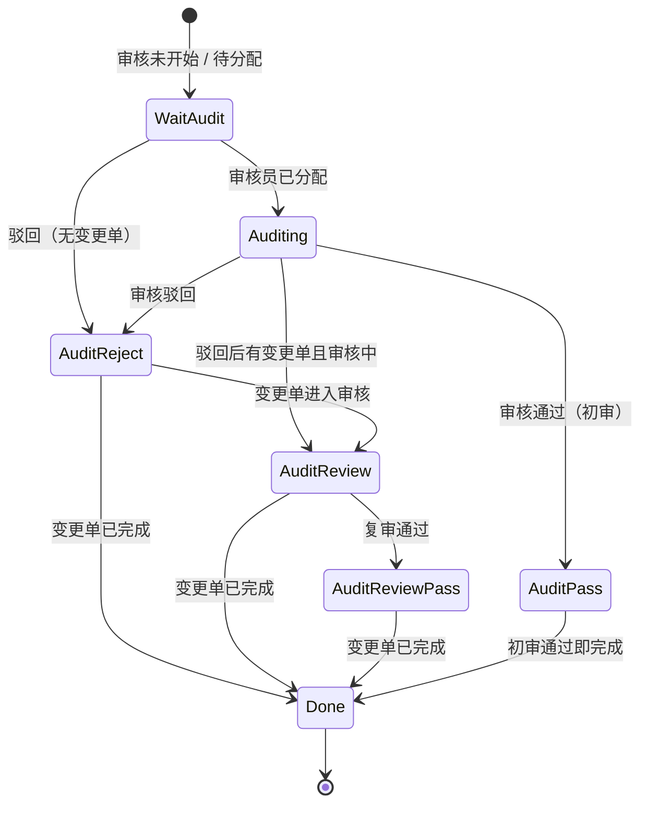
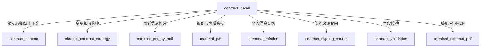
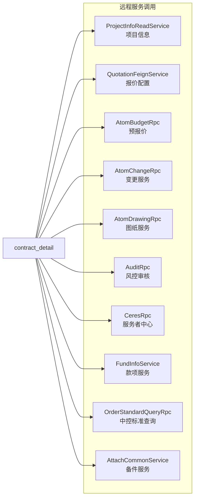
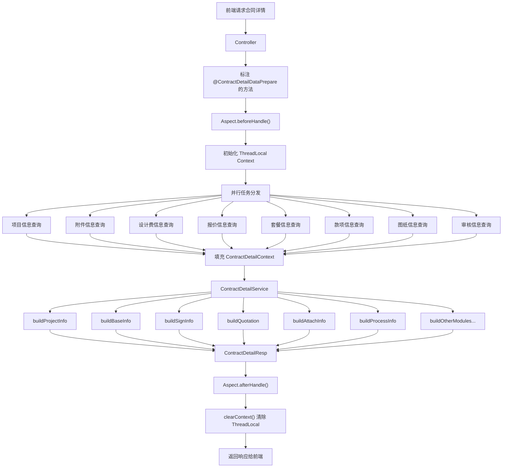
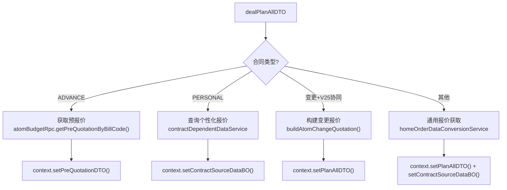

# contract_detail 模块文档

## 1. 模块概述

`contract_detail` 是销售项目合同管理系统的核心模块，负责**合同详情的查询与组装**。该模块采用 AOP 切面编程模式，在合同详情查询前通过 `@ContractDetailDataPrepare` 注解自动触发数据预加载，利用 ThreadLocal 上下文在切面与业务逻辑之间共享数据，通过并行任务机制高效拉取多源异构数据，最终由 `ContractDetailService` 组装为前端所需的完整合同详情响应。

### 核心职责

- **数据预加载**：通过 AOP 切面在方法执行前并行拉取项目信息、报价信息、图纸信息、款项信息、审核信息等
- **上下文管理**：基于 ThreadLocal 的线程安全上下文，贯穿数据预加载与详情组装全过程
- **详情组装**：将多源数据组装为统一的合同详情响应（`ContractDetailResp`），涵盖项目信息、签约信息、报价信息、附件信息、流程信息等十余个子模块

## 2. 架构设计

### 2.1 整体架构图



### 2.2 组件交互时序图



## 3. 核心组件详解

### 3.1 ContractDetailAspect — 数据预加载切面

**包路径**：`com.ke.utopia.nrs.salesproject.service.contract.v2.ContractDetailAspect`

**职责**：作为 AOP 切面，在标注 `@ContractDetailDataPrepare` 的方法执行前，并行拉取合同详情所需的多源数据，填充到 ThreadLocal 上下文中。

#### 3.1.1 切入点与通知

| 通知类型 | 方法 | 触发时机 | 作用 |
|---------|------|---------|------|
| `@Before` | `beforeHandle()` | 目标方法执行前 | 初始化上下文，并行拉取数据 |
| `@After` | `afterHandle()` | 目标方法正常执行后 | 清除 ThreadLocal 上下文 |
| `@AfterThrowing` | `afterThrowing()` | 目标方法抛异常后 | 清除 ThreadLocal 上下文（防止内存泄漏） |

#### 3.1.2 并行数据拉取策略

切面根据 **首屏/非首屏** 和 **合同类型** 两个维度决定数据拉取范围：



#### 3.1.3 报价信息获取的分支逻辑

`dealPlanAllDTO` 方法是数据预加载中最复杂的部分，根据合同类型和业务类型存在多条分支路径：

| 条件 | 处理逻辑 | 数据来源 |
|------|---------|---------|
| 预签合同（ADVANCE） | 获取预报价信息 | `contractDetailService.getAdvanceQuote()` |
| 个性化合同（PERSONAL） | 查询个性化报价 | `contractDependentDataService.queryPersonalQuoteInfoV2()` |
| 变更协议 + 2.5协同模式 | 构建变更报价 | `buildAtomChangeQuotation()` |
| 其他（套餐正签/变更等） | 通用报价获取 | `homeOrderDataConversionService.contractSourceDate()` |

### 3.2 ContractDetailContextHandler — 上下文管理器

**包路径**：`com.ke.utopia.nrs.salesproject.service.contract.v2.ContractDetailContextHandler`

**职责**：基于 `ThreadLocal<ContractDetailContext>` 管理合同详情查询过程中的共享数据，提供线程安全的上下文生命周期管理。

#### 核心 API

| 方法 | 说明 |
|------|------|
| `initContext()` | 创建新的 `ContractDetailContext` 实例并绑定到当前线程 |
| `clearContext()` | 移除当前线程的上下文（防止内存泄漏） |
| `getContext()` | 获取当前线程的上下文对象 |
| `setContext(context)` | 替换当前线程的上下文对象 |
| `getProjectInfo()` / `setProjectInfo()` | 项目信息快捷访问 |
| `getPlanAllDTO()` / `setPlanAllDTO()` | 报价信息快捷访问 |
| `getContractSourceDataBO()` | 合同数据源信息快捷访问 |
| `getDrawingUrl()` / `setDrawingUrl()` | 图纸 URL 快捷访问 |
| `isFirstScreen()` / `setFirstScreen()` | 首屏标记快捷访问 |

### 3.3 ContractDetailContext — 上下文数据载体

**包路径**：`com.ke.utopia.nrs.salesproject.service.contract.bo.ContractDetailContext`

**职责**：承载合同详情查询过程中的所有预加载数据，作为 AOP 切面与 Service 层之间的数据桥梁。

#### 数据字段

| 字段 | 类型 | 说明 | 数据来源 |
|------|------|------|---------|
| `projectInfoDTO` | `ProjectInfoDTO` | 项目基础信息 | `ProjectInfoReadService` |
| `planAllDTO` | `PlanAllDTO` | 报价信息（中控） | `HomeOrderDataConversionService` |
| `contractSourceDataBO` | `ContractSourceDataBO` | 合同数据源信息 | 多源聚合 |
| `preQuotationDTO` | `LightQuotationItem` | 预报价信息 | `AtomBudgetRpc` |
| `drawingDTO` | `DeliverDrawingDTO` | 施工图纸信息 | `AtomDrawingRpc` |
| `drawingUrl` | `String` | 变更图纸 URL | `AtomDrawingRpc` |
| `atomChangeScopeList` | `List<Integer>` | 变更范围列表 | `AtomChangeRpc` |
| `relateFundInfo` | `FundInfo` | 关联款项信息 | `FundInfoService` |
| `auditDetailDTO` | `AuditDetailDto` | 风控审核详情 | `AuditRpc` |
| `changeOrderList` | `List<ChangeListDTO>` | 变更单列表 | `AtomChangeRpc` |
| `attachInfoDetail` | `AttachInfoDetail` | 备件附件信息 | `AttachCommonService` |
| `designSignPriceInfo` | `DesignSignPriceInfo` | 设计费签约信息 | `CeresRpc` + `QuotationFeignService` |
| `comboDTOList` | `List<ComboDTO>` | 套餐信息 | `OrderStandardQueryRpc` |
| `designQuoteFeeDTO` | `DesignQuoteFeeDTO` | 设计费报价信息 | 报价数据提取 |
| `isFirstScreen` | `boolean` | 是否首屏加载 | Controller 参数 |
| `businessType` | `Byte` | 业务类型 | `CommonBusinessService` |
| `processV25` | `boolean` | 是否2.5流程 | `CommonBusinessService` |

### 3.4 ContractDetailService — 详情组装服务

**包路径**：`com.ke.utopia.nrs.salesproject.service.contract.v2.ContractDetailService`

**职责**：从 ThreadLocal 上下文中读取预加载数据，按照合同详情的模块结构组装为完整的 `ContractDetailResp` 响应。

#### 3.4.1 主入口方法

```
initContractDetail(projectOrderId, contractType, moduleKeyList, changeOrderId, billCodeInfoList, subOrderInfoList, changeOrderInfoList)
```

该方法根据 `isFirstScreen` 标记分为两种组装路径：

- **首屏**：仅组装 `signInfo`、`contractBaseInfo`、`businessInfo`、`projectInfo` 四个基础模块
- **非首屏**：组装全部模块，包括报价、优惠、附件、流程、个性化报价、收款计划、补充协议等

#### 3.4.2 子模块构建方法

| 方法 | 输出类型 | 说明 |
|------|---------|------|
| `buildContractProjectInfoDetail()` | `ContractProjectInfoDetail` | 项目信息：客户姓名、电话、地址、户型、设计师等 |
| `buildContractBaseInfoDetail()` | `ContractBaseInfoDetail` | 合同基础信息：合同类型、状态、模式、功能开关等 |
| `buildContractSignInfoDetail()` | `ContractSignInfoDetail` | 签约信息：签约对象、签约渠道、代理人、证件信息等 |
| `buildBusinessInfoDetail()` | `BusinessInfoDetail` | 业务信息：装修类型、品类、变更单号等 |
| `buildQuotationDetail()` | `QuotationInfo` | 报价信息：套餐、价格、附件列表等 |
| `buildActivityInfoDetail()` | `ActivityInfo` | 优惠信息：活动名称、优惠金额、券包等 |
| `buildPromiseInfoDetail()` | `PromiseInfoDetail` | 承包约定：施工图模式、甲供材料、纠纷处理等 |
| `buildContractAttachInfo()` | `ContractAttachInfoDetail` | 合同附件：各类证件、房产证、委托书等 |
| `buildAmountInfoDetail()` | `AmountInfo` | 金额信息：报价总额、应缴总额、已缴金额 |
| `buildProcessInfoDetail()` | `ProcessInfo` | 审核流程：风控审核状态节点、审核人、时间线 |
| `buildDrawingDetail()` | `DrawingInfo` | 图纸信息 |
| `buildPersonalQuotationDetail()` | `PersonalQuotation` | 个性化报价 |
| `buildPersonalCollectionPlanInfo()` | `PersonalCollectionPlanInfo` | 定软电收款计划 |
| `buildSupplementItemInfo()` | `SupplementItemInfo` | 补充协议信息 |
| `buildSettlementItemInfo()` | `SettlementItemInfo` | 和解协议信息 |
| `buildCollectionPlanConfigInfo()` | `CollectionPlanConfigInfo` | 收款计划配置 |
| `buildGuaranteeDetail()` | `GuaranteeDetail` | 保修信息 |

#### 3.4.3 风控审核流程状态机

`buildProcessInfoDetail()` 内部通过 `computeProcessStatus()` 方法，基于风控审核状态和变更单状态计算当前流程节点：



#### 3.4.4 附件信息合并机制

`mergeContractAttachInfoTOSignInfo()` 方法实现了备件模块向签约信息模块的字段映射：

- 当备件 OCR 开城时，将附件的 `documentCode` 传递到签约信息
- 当未开城时，将附件实体直接复制到签约信息的对应字段
- 处理历史兼容：对于 2023-03-23 之前的数据，从 `contract_user` 表补充证件信息

## 4. 模块间依赖关系

### 4.1 依赖关系图



### 4.2 外部 RPC 依赖



## 5. 数据流

### 5.1 合同详情查询完整数据流



### 5.2 报价信息获取数据流



## 6. 关键设计模式

### 6.1 AOP + ThreadLocal 模式

本模块最核心的设计模式是 **AOP 切面 + ThreadLocal 上下文** 的组合：

- **AOP 切面**：通过 `@ContractDetailDataPrepare` 注解声明式地触发数据预加载，业务方法无需手动调用数据准备逻辑
- **ThreadLocal 上下文**：在切面的 `@Before` 中预加载数据存入 ThreadLocal，业务方法通过 `ContractDetailContextHandler.getContext()` 隐式访问
- **生命周期管理**：`@After` 和 `@AfterThrowing` 双保险确保 ThreadLocal 清除，防止内存泄漏

**优势**：解耦数据预加载与业务逻辑，新增预加载数据源只需在 Aspect 中添加并行任务，不影响 Service 层代码。

### 6.2 并行任务编排模式

通过 `ParallelTaskService` 实现并行数据拉取：

```java
ParallelTasksContext ctx = parallelTaskService.newParallelTasks();
parallelTaskService.addNewTask(ctx, () -> dealProjectInfo(...));
parallelTaskService.addNewTask(ctx, () -> dealAttachInfo(...));
// ... 更多任务
parallelTaskService.execTasks(ctx);
parallelTaskService.awaitTasksResult(ctx);
```

所有任务并行执行，通过 `awaitTasksResult` 等待全部完成，显著降低接口响应时间。

### 6.3 首屏延迟加载模式

通过 `isFirstScreen` 参数实现分屏加载：

- **首屏**：仅加载 `项目信息`、`附件信息`、`设计费信息` 三个轻量任务，快速渲染基础信息
- **非首屏**：追加 `报价信息`、`套餐信息`、`款项信息`、`图纸信息`、`审核信息` 等重量级任务

### 6.4 策略分支模式

`dealPlanAllDTO()` 方法根据合同类型（ADVANCE / PERSONAL / PACKAGE_FORMAL / PACKAGE_CHANGE / DRAWING）和业务类型（HOUSE_CERTIFICATE / REFORM_ALL / GROUP_DECORATE）采用条件分支策略，选择不同的数据获取路径和转换逻辑。

### 6.5 模板方法模式

`ContractDetailService` 的各 `build*` 方法遵循统一的模板模式：

1. 检查模块是否在 `moduleKeyList` 中（按需加载）
2. 从 `ContractDetailContextHandler` 读取上下文数据
3. 执行模块特有的组装逻辑
4. 返回对应的详情 DTO（或 null）

## 7. 关键枚举说明

| 枚举 | 用途 |
|------|------|
| `ContractTypeEnum` | 合同类型：ADVANCE（首期）、PACKAGE_FORMAL（套餐正签）、PACKAGE_CHANGE（套餐变更）、DRAWING（施工图）、PERSONAL（个性化）、DESIGN（设计）、TERMINAL（终结）等 |
| `ContractStatusEnum` | 合同状态：DRAFT（草稿）、PENDING_USER_SIGN（待签署）、PENDING_USER_CONFIRM（待确认）、FINISH（已签署）、AUDITING（审核中）等 |
| `BusinessTypeEnum` | 业务类型：HOUSE_CERTIFICATE（家装）、REFORM_ALL（翻新全案）、GROUP_DECORATE（团装） |
| `ProcessStatusEnum` | 流程审核状态：WAIT_AUDIT、AUDITING、AUDIT_PASS、AUDIT_REJECT、AUDIT_REVIEW、AUDIT_REVIEW_PASS、DONE |
| `SignChannelTypeEnum` | 签约渠道：ONLINE（线上）、OFFLINE（线下） |
| `ContractObjectTypeEnum` | 签约对象类型：PERSON（个人）、COMPANY（公司） |

## 8. 与其他模块的关系

| 关联模块 | 关系描述 |
|---------|---------|
| [contract_context](contract_context.md) | 共享 ThreadLocal 上下文管理模式；`ContractContextAspect` 与本模块的 `ContractDetailAspect` 遵循相同的 AOP 数据预加载范式 |
| [change_contract_strategy](change_contract_strategy.md) | 本模块在 `buildAtomChangeQuotation()` 中依赖变更策略工厂构建变更报价 |
| [contract_signing_source](contract_signing_source.md) | 个性化合同图纸信息通过 `ContractSigningSourceRouter` 路由到对应策略获取 |
| [contract_validation](contract_validation.md) | 附件上传完成状态校验依赖 `ContractFieldCheckService` |
| [personal_relation](personal_relation.md) | 个性化合同报价查询涉及 `PersonalRelationHandler` 的人员关系处理 |
| [material_pdf](material_pdf.md) | 套餐报价 PDF 生成与比对逻辑由 `MaterialPdfDiffService` 处理 |
| [terminal_contract_pdf](terminal_contract_pdf.md) | 终结合同 PDF 构建由 `TerminalContractPdfBuildService` 负责 |
