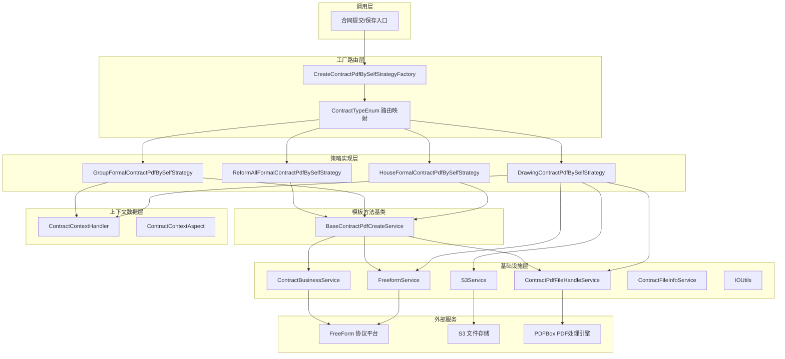
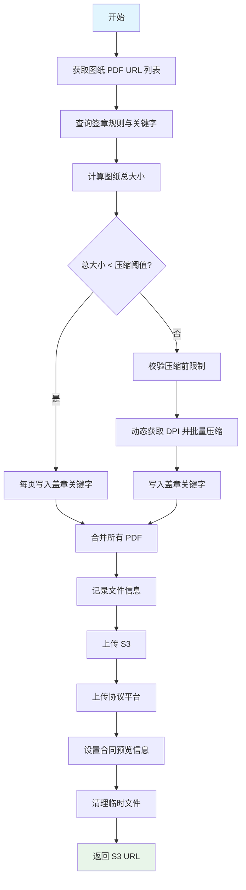
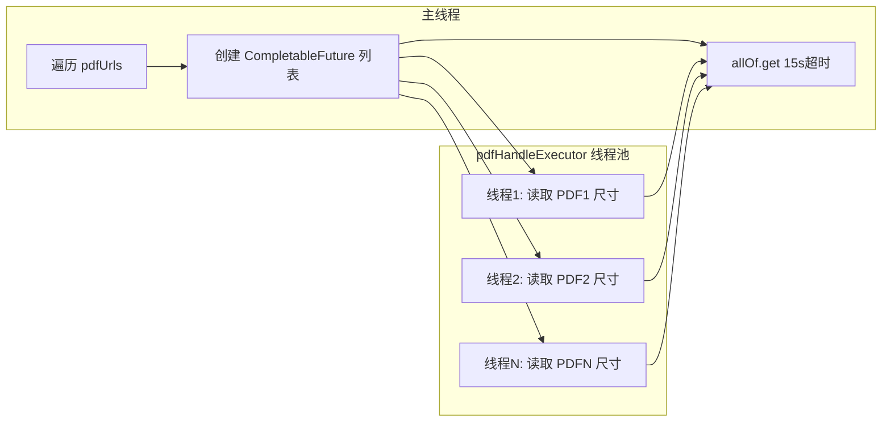
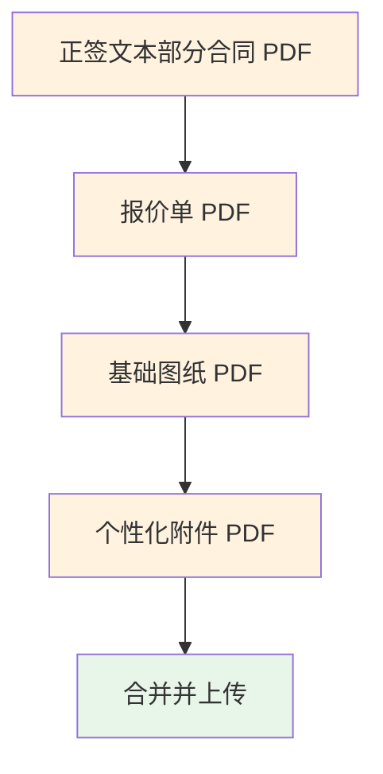
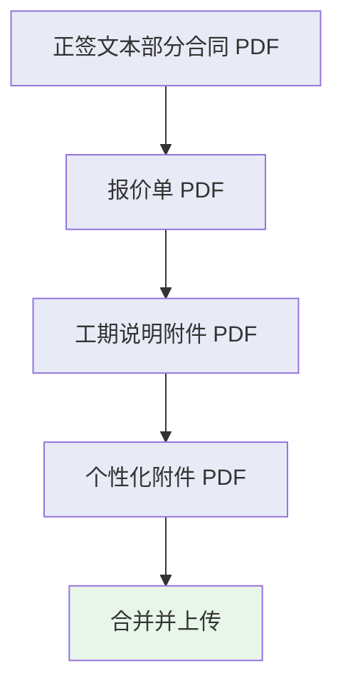
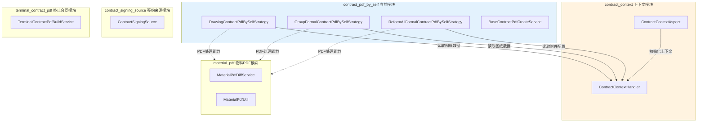
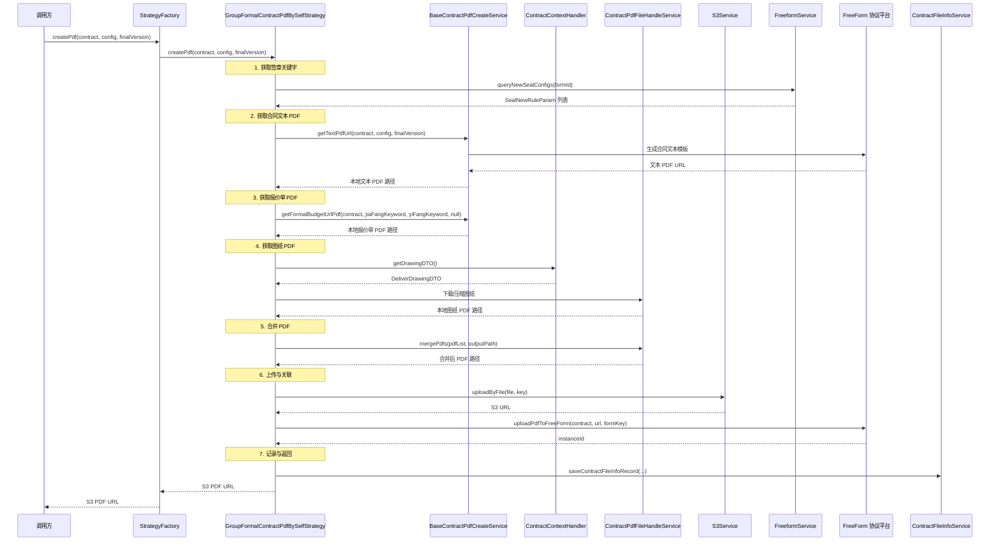
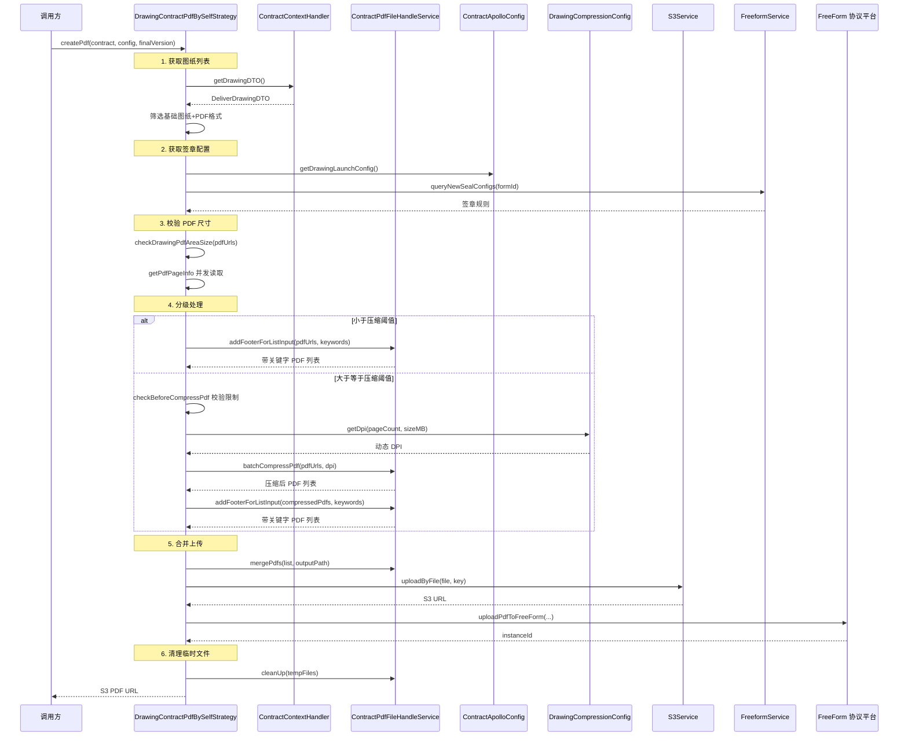
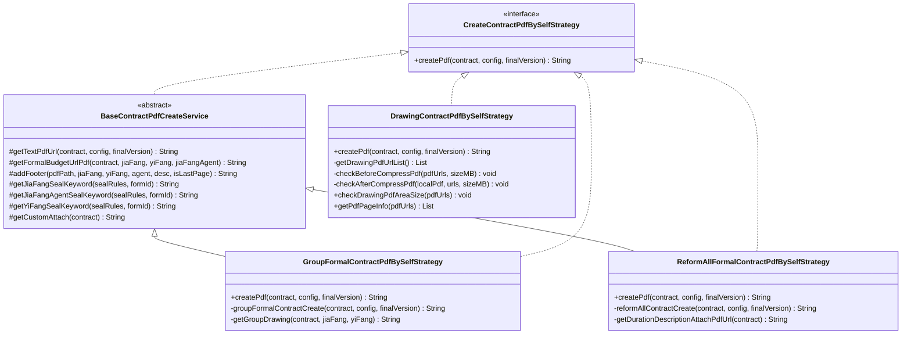
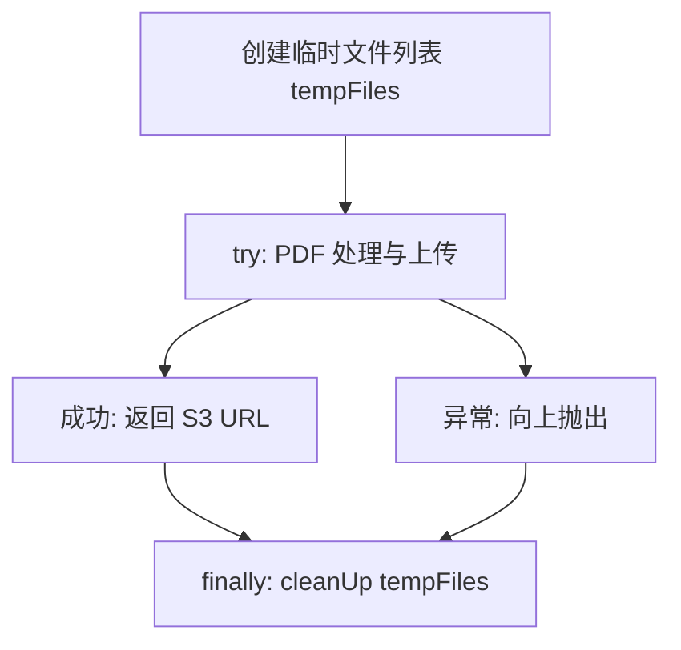

# Contract PDF By Self 模块

## 1. 模块概述

Contract PDF By Self 是合同子系统中的**自定义 PDF 生成模块**，负责根据不同业务类型（整装、团装、翻新全案、图纸合同）将合同文本、报价单、图纸、个性化附件等多源 PDF 资产拼接为一份完整的合同 PDF 文件，并上传至 S3 和协议平台（FreeForm）。

该模块采用**策略模式（Strategy Pattern）** + **模板方法模式（Template Method Pattern）**的组合设计：
- 统一接口 `CreateContractPdfBySelfStrategy` 定义 PDF 生成契约
- 基类 `BaseContractPdfCreateService` 提供公共的 PDF 构建能力（文本获取、报价单处理、盖章关键字写入、压缩、合并）
- 四个策略实现类各自定义不同业务类型的附件拼接顺序与特殊逻辑
- 工厂类 `CreateContractPdfBySelfStrategyFactory` 根据合同类型和业务类型在运行时路由到对应策略

核心价值：**将复杂的 PDF 生成逻辑按业务类型解耦，每种合同类型的 PDF 拼接规则独立维护，新增业务类型只需新增策略实现类**。

---

## 2. 架构总览



---

## 3. 核心组件详解

### 3.1 CreateContractPdfBySelfStrategy（策略接口）

```java
public interface CreateContractPdfBySelfStrategy {
    String createPdf(Contract contract, ContractCityCompanyInfo config, boolean finalVersion) throws Exception;
}
```

统一的 PDF 生成契约接口，所有业务类型的 PDF 生成策略必须实现此接口。

| 参数 | 类型 | 说明 |
|------|------|------|
| `contract` | `Contract` | 合同实体，包含合同编号、项目订单ID等核心信息 |
| `config` | `ContractCityCompanyInfo` | 城市公司配置，包含 formId、formKey 等协议平台配置 |
| `finalVersion` | `boolean` | 是否为终版合同，影响文本 PDF 的生成方式 |
| 返回值 | `String` | 生成的 PDF 在 S3 上的访问 URL |

### 3.2 CreateContractPdfBySelfStrategyFactory（策略工厂）

实现 `ApplicationContextAware` 接口，在 Spring 容器启动时收集所有 `CreateContractPdfBySelfStrategy` 的 Bean 实现，存入 `Map<beanName, Strategy>`。运行时通过 `ContractTypeEnum.getContractPdfBySelfStrategy(contractType, businessType)` 确定目标 Bean 名称，从 Map 中获取对应策略实例。

**路由映射关系**：

| 策略类 | Bean 名称 | 适用业务类型 |
|--------|----------|-------------|
| `HouseFormalContractPdfBySelfStrategy` | houseFormalContractPdfBySelfStrategy | 整装（全屋定制）正式合同 |
| `GroupFormalContractPdfBySelfStrategy` | groupFormalContractPdfBySelfStrategy | 团装正式合同 |
| `ReformAllFormalContractPdfBySelfStrategy` | reformAllFormalContractPdfBySelfStrategy | 翻新全案正式合同 |
| `DrawingContractPdfBySelfStrategy` | drawingContractPdfBySelfStrategy | 图纸合同（独立生成） |

### 3.3 BaseContractPdfCreateService（模板方法基类）

为三个正式合同策略（House、Group、ReformAll）提供公共的 PDF 构建能力，采用模板方法模式封装通用步骤。

**核心方法**：

| 方法 | 功能 | 说明 |
|------|------|------|
| `getTextPdfUrl()` | 获取合同文本 PDF | 调用 FreeForm 平台生成合同文本模板 PDF，下载到本地 |
| `getFormalBudgetUrlPdf()` | 获取报价单 PDF | 下载报价单 PDF，超阈值时压缩，写入盖章关键字 |
| `addFooter()` | 写入盖章关键字 | 在 PDF 指定坐标位置写入签章关键字文本 |
| `getJiaFangSealKeyword()` | 获取甲方关键字 | 从 FreeForm 签章规则中提取甲方签章关键字 |
| `getJiaFangAgentSealKeyword()` | 获取甲方代理人关键字 | 从 FreeForm 签章规则中提取甲方代理人签章关键字 |
| `getYiFangSealKeyword()` | 获取乙方关键字 | 从 FreeForm 签章规则中提取乙方（装修公司）签章关键字 |
| `getCustomAttach()` | 获取个性化附件 | 根据城市、公司、业务类型查询并下载个性化附件 PDF |
| `getDurationDescriptionAttachPdfUrl()` | 获取工期说明附件 | 查询附件配置表获取图片 URL，转换为 PDF，超阈值时压缩 |

**设计意图**：基类封装了 PDF 生成的骨架步骤，子类通过组合调用这些公共方法，按各自业务规则定义附件拼接顺序，实现代码复用与业务定制的平衡。

---

## 4. 策略实现详解

### 4.1 DrawingContractPdfBySelfStrategy（图纸合同策略）

**特点**：不继承 `BaseContractPdfCreateService`，独立实现全部 PDF 处理逻辑，因为图纸合同的生成流程与正式合同差异较大。

**核心流程**：



**关键设计细节**：

1. **图纸来源**：通过 `ContractContextHandler.getDrawingDTO()` 从上下文获取图纸数据，筛选类型为"基础图纸"且格式为 PDF 的文件
2. **大小分级处理**：
   - 小于阈值（Apollo 配置）：直接写关键字 + 合并
   - 大于等于阈值：先压缩再写关键字 + 合并
3. **压缩前校验**（`checkBeforeCompressPdf`）：图纸数量和总大小超出最大限制时直接抛异常，提示线下签署
4. **压缩后校验**（`checkAfterCompressPdf`）：压缩后仍超协议平台限制时抛异常
5. **PDF 尺寸校验**（`checkDrawingPdfAreaSize`）：通过并发读取每张图纸的宽高，校验面积是否超出最大限制（3370x2384）
6. **并发处理**：`getPdfPageInfo` 使用 `CompletableFuture` + 自定义线程池并发读取 PDF 尺寸，设置 15 秒超时

**并发架构**：



### 4.2 GroupFormalContractPdfBySelfStrategy（团装正式合同策略）

继承 `BaseContractPdfCreateService`，实现团装正式套餐合同的 PDF 生成。

**附件拼接顺序**（团装 2.5 正签合同）：



**关键设计细节**：

1. **图纸来源**：筛选"全屋图纸"类型且格式为 PDF 的文件（与图纸合同的"基础图纸"不同）
2. **图纸压缩策略**：阈值固定为 5MB，小于 5MB 直接下载合并，大于等于 5MB 使用 DPI=90 压缩
3. **签章关键字**：提取甲方和乙方关键字，写入报价单末页和图纸末页
4. **个性化附件**：可选，当 `getCustomAttach()` 返回非空时拼接到最后

### 4.3 ReformAllFormalContractPdfBySelfStrategy（翻新全案正式合同策略）

继承 `BaseContractPdfCreateService`，实现翻新全案正式套餐合同的 PDF 生成。

**附件拼接顺序**：



**关键设计细节**：

1. **工期说明附件**（`getDurationDescriptionAttachPdfUrl`）：
   - 从 `ContractAttachConfigService` 查询附件配置表获取图片 URL
   - 通过 `ContractPdfFileHandleService.imageToPdfAndUpload()` 将图片转换为 PDF
   - 超过配置阈值时使用 DPI=120 压缩
   - 记录压缩前后的文件大小信息
2. **签章关键字**：提取甲方、乙方和甲方代理人三个关键字，写入报价单末页
3. **开发商渠道判断**：通过 `ContractUnifyService.isDeveloperChannel()` 判断是否为开发商渠道，影响附件配置的查询条件

---

## 5. 模块间依赖关系



### 5.1 对 Contract Context 模块的依赖

本模块**强依赖** [contract_context](contract_context.md) 模块提供的上下文数据：

| 上下文数据 | 来源 | 使用方 | 用途 |
|-----------|------|--------|------|
| `DrawingDTO`（图纸数据） | `ContractContextHandler.getDrawingDTO()` | Drawing策略、Group策略 | 获取图纸 PDF URL 列表 |
| `ContractCityCompanyInfo`（城市公司配置） | `ContractContextHandler.getContractCityCompanyInfo()` | 所有策略 | 协议平台 formId/formKey |
| `ContractReqDTO`（合同请求参数） | `ContractContextHandler.getContractReq()` | BaseContractPdfCreateService | 合同基础信息 |

上下文的生命周期由 `ContractContextAspect` 管理：`@Before` 初始化 → 业务方法执行（本模块在此阶段被调用） → `@After` 清理。确保每次请求的上下文数据线程隔离且生命周期可控。

---

## 6. 数据流

### 6.1 正式合同 PDF 生成数据流（以团装为例）



### 6.2 图纸合同 PDF 生成数据流



---

## 7. 关键设计模式

### 7.1 策略模式（Strategy Pattern）



**策略模式的体现**：
- `CreateContractPdfBySelfStrategy` 接口定义统一契约
- 四个实现类各自封装不同的 PDF 生成逻辑
- 工厂类在运行时根据合同类型路由到具体策略
- 新增业务类型只需实现接口并注册为 Spring Bean

### 7.2 模板方法模式（Template Method Pattern）

`BaseContractPdfCreateService` 提供 PDF 生成的骨架步骤，子类按需组合调用：

```
正式合同 PDF 生成骨架：
  1. getTextPdfUrl()          → 获取合同文本 PDF
  2. getFormalBudgetUrlPdf()  → 获取报价单 PDF（含关键字写入）
  3. [子类特定附件]           → 图纸/工期说明/个性化附件
  4. mergePdfs()              → 合并所有 PDF
  5. uploadByFile()           → 上传 S3
  6. uploadPdfToFreeForm()    → 上传协议平台
```

子类差异：
- **GroupFormal**：追加团装图纸（全屋图纸）
- **ReformAllFormal**：追加工期说明附件 + 个性化附件

### 7.3 工厂模式（Factory Pattern）

`CreateContractPdfBySelfStrategyFactory` 实现 `ApplicationContextAware`，在容器启动时自动收集所有策略 Bean，运行时通过枚举映射动态路由，实现了策略选择与策略实现的解耦。

---

## 8. 基础设施服务依赖

### 8.1 ContractPdfFileHandleService

PDF 处理的核心工具服务，封装了 PDFBox 的底层操作：

| 方法 | 功能 |
|------|------|
| `mergePdfs(List<String>, String)` | 合并多个 PDF 文件为一个 |
| `addFooterForListInput(List<String>, List<AddFooterTextInfo>)` | 批量为 PDF 列表写入盖章关键字 |
| `batchCompressPdf(List<String>, int dpi)` | 批量压缩 PDF 文件 |
| `compressPDF(String, String, int dpi)` | 单个 PDF 压缩 |
| `downloadFileFromUrl(String, String)` | 从 URL 下载文件到本地 |
| `imageToPdfAndUpload(List<String>)` | 图片列表转 PDF 并上传 |
| `getPdfCount(String)` | 获取 PDF 页数 |
| `cleanUp(List<String>)` | 清理临时文件 |

### 8.2 S3Service

文件存储服务，负责 PDF 文件的上传和 URL 生成：

| 方法 | 功能 |
|------|------|
| `uploadByFile(File, String, boolean)` | 上传本地文件到 S3 |
| `generateUrl(String, int)` | 生成带过期时间的 S3 访问 URL（默认 7 天） |
| `md5FileName(String)` | 基于 MD5 生成唯一文件名 |

### 8.3 FreeformService

协议平台服务，负责签章规则查询：

| 方法 | 功能 |
|------|------|
| `queryNewSealConfigs(Long formId)` | 查询指定表单的签章规则配置 |

### 8.4 ContractBusinessService

合同业务服务，负责与协议平台的交互：

| 方法 | 功能 |
|------|------|
| `uploadPdfToFreeForm(Contract, String, String)` | 上传 PDF 到协议平台并与合同实例关联 |

### 8.5 DrawingCompressionConfig

图纸压缩配置服务，根据图纸数量和文件大小动态计算压缩 DPI：

| 方法 | 功能 |
|------|------|
| `getDpi(int pageCount, double sizeMB)` | 根据图纸页数和总大小动态获取压缩 DPI |

---

## 9. 配置项（Apollo 动态配置）

图纸合同策略依赖 Apollo 配置中心的 `ContractApolloConfig`：

| 配置项 | 说明 |
|--------|------|
| `drawingLaunchConfig.positionXRatio` | 甲方关键字 X 坐标比例 |
| `drawingLaunchConfig.positionYRatio` | 甲方关键字 Y 坐标比例 |
| `drawingLaunchConfig.jiaFangAgentPositionXRatio` | 甲方代理人关键字 X 坐标比例 |
| `drawingLaunchConfig.jiaFangAgentPositionYRatio` | 甲方代理人关键字 Y 坐标比例 |
| `drawingLaunchConfig.drawingCompressSize` | 图纸压缩阈值（MB） |
| `drawingLaunchConfig.drawingCountLimit` | 图纸数量最大限制 |
| `drawingLaunchConfig.drawingSpaceSizeLimit` | 图纸总大小最大限制（MB） |
| `drawingLaunchConfig.pdfMaxArea` | 单页 PDF 面积最大限制 |
| `drawingLaunchConfig.checkPdfAreaSize` | 是否开启 PDF 尺寸校验开关 |
| `drawingLaunchConfig.formId` | 图纸合同的 FreeForm 表单 ID |
| `drawingLaunchConfig.formKey` | 图纸合同的 FreeForm 表单 Key |

---

## 10. 异常处理与容错

### 10.1 图纸合同异常场景

| 场景 | 处理方式 | 错误码 |
|------|---------|--------|
| 图纸数量超限 | 抛出 `NrsBusinessException(WARN)`，提示线下签署 | `DRAWING_LIMIT_ERROR` |
| 图纸总大小超限 | 抛出 `NrsBusinessException(WARN)`，提示线下签署 | `DRAWING_LIMIT_ERROR` |
| 压缩后仍超限 | 抛出 `NrsBusinessException(WARN)`，提示线下签署 | `DRAWING_LIMIT_ERROR` |
| PDF 宽高超限 | 抛出 `NrsBusinessException(WARN)`，提示调整至 3370x2384 以内 | `DRAWING_LIMIT_ERROR` |
| PDF 尺寸读取超时（15s） | 抛出 `UtopiaBussinessException` | `ERROR_BUSINESS` |
| 签章关键字获取失败 | 抛出 `NrsBusinessException(WARN)` | `ERROR_BUSINESS` |

### 10.2 资源清理机制

所有策略均采用 `try-finally` 模式确保临时文件清理：



---

## 11. 性能优化

| 优化手段 | 适用策略 | 说明 |
|---------|---------|------|
| **并发读取 PDF 尺寸** | Drawing | 使用 `CompletableFuture` + 自定义线程池并发处理，15 秒超时保护 |
| **动态 DPI 压缩** | Drawing | 根据图纸数量和大小动态计算 DPI，避免过度压缩或压缩不足 |
| **分级压缩策略** | 所有策略 | 小文件跳过压缩，大文件才压缩，减少不必要的处理耗时 |
| **按需压缩** | Group/ReformAll | 固定 5MB 阈值，小图纸直接下载合并 |
| **StopWatch 计时** | 所有策略 | 全流程耗时监控，便于性能排查 |
| **异步文件清理** | 所有策略 | finally 块中清理临时文件，防止磁盘空间泄漏 |
