# Contract Signing Source 模块

## 模块概述

`contract_signing_source` 模块负责为**个性化销售合同签约**提供不同订单类型的统一数据源抽象。在销售合同业务中，合同可绑定不同类型的单据（报价单、变更单、子单），每种单据在状态校验、商品信息构建、可签约单据查询、图纸获取等方面逻辑各异。本模块通过 **策略模式（Strategy Pattern）** 将这些差异封装为独立的策略实现，对外暴露统一的 `ContractSigningSource` 接口，使上层签约流程无需感知底层单据类型。

### 核心职责

| 职责 | 说明 |
|------|------|
| 单据状态校验 | 判断所绑定的单据是否处于可签约状态（非已删除/已取消/已调整等） |
| 商品信息构建 | 从不同数据源提取商品类目信息，生成 goodsInfo 字符串 |
| 可签约单据查询 | 查询主订单下尚未绑定合同的有效单据，构建签约弹窗数据 |
| 个性化报价查询 | 获取个性化报价数据，支持按公司主体过滤 |
| 图纸数据获取 | 构建个性化图纸的图片列表和 PDF 交付物 |
| 部件类型判定 | 判断绑定单据中是否包含 C 部分（业主承担）或 B 部分（开发商承担）的品 |

---

## 架构总览

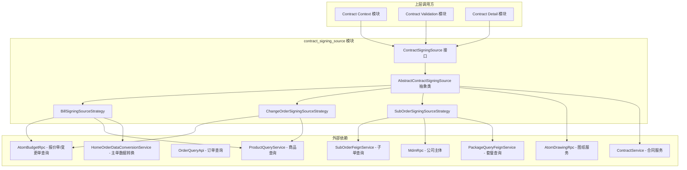

### 模块在系统中的位置

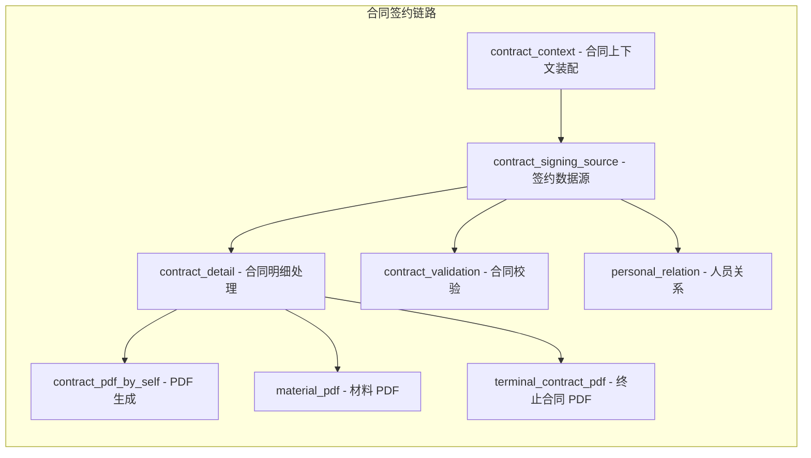

---

## 核心组件详解

### 1. ContractSigningSource 接口

**文件**: `personal/bind/ContractSigningSource.java`

该接口定义了签约数据源的统一契约，是整个模块的核心抽象。上层业务通过此接口与不同单据类型交互，无需关心底层实现差异。

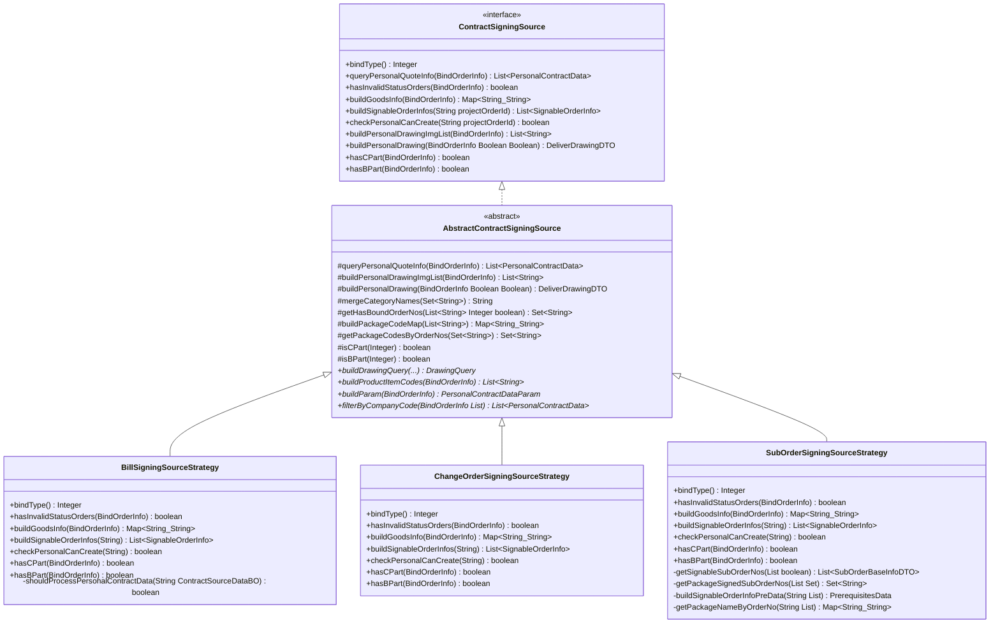

接口方法说明：

| 方法 | 用途 | 调用场景 |
|------|------|---------|
| `bindType()` | 返回策略对应的 `BindTypeEnum` 编码 | 策略工厂路由选择 |
| `queryPersonalQuoteInfo()` | 从主订单查询个性化报价数据 | 合同数据装配 |
| `hasInvalidStatusOrders()` | 校验绑定单据是否存在无效状态 | 签约前校验 |
| `buildGoodsInfo()` | 构建单据编号→商品类目名称的映射 | 签约弹窗展示 |
| `buildSignableOrderInfos()` | 查询可签约单据列表 | 签约弹窗初始化 |
| `checkPersonalCanCreate()` | 校验是否可发起个性化合同创建/编辑 | 合同创建入口校验 |
| `buildPersonalDrawingImgList()` | 构建个性化图纸图片列表 | 图纸附件展示 |
| `buildPersonalDrawing()` | 构建个性化图纸 PDF 交付物 | 合同附件生成 |
| `hasCPart()` / `hasBPart()` | 判断单据是否含 C 部分（业主承担）/ B 部分（开发商承担） | 合同条款判断 |

### 2. AbstractContractSigningSource 抽象基类

**文件**: `personal/bind/AbstractContractSigningSource.java`

模板方法模式的基类，封装了三种策略的**通用逻辑**，将差异点留给子类实现。

#### 模板方法流程

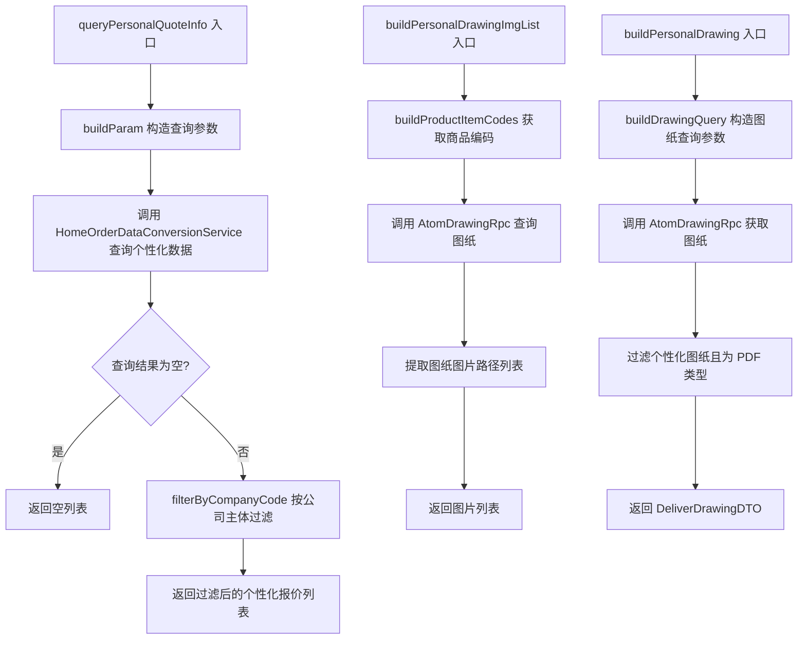

#### 抽象方法（子类必须实现）

| 抽象方法 | 职责 | 差异化原因 |
|---------|------|-----------|
| `buildParam()` | 构造个性化数据查询参数 | 报价单用 billCodeList，变更单用 changeOrderId，子单用 subOrderNoList |
| `buildProductItemCodes()` | 提取商品唯一编码 | 报价单从 SKU 产品取 productItemCode，子单从 SubOrderItem 取 skuUniqueKey，变更单从变更报价 SKU 取 productItemCode |
| `buildDrawingQuery()` | 构造图纸查询参数 | 变更单需额外携带 projectChangeNo 和临时图纸状态 |
| `filterByCompanyCode()` | 按公司主体过滤报价数据 | 报价单用 billCode+orgCode 匹配，变更单用 changeOrderId+orgCode 匹配，子单不过滤 |

#### 公共工具方法

| 方法 | 说明 |
|------|------|
| `mergeCategoryNames()` | 合并最多 3 个类目名，超出部分以"等"结尾 |
| `getHasBoundOrderNos()` | 查询已绑定合同的单据编号集合，编辑模式下排除草稿合同绑定 |
| `buildPackageCodeMap()` | 构建单据编号→套餐实例编码的映射 |
| `isCPart()` / `isBPart()` | 根据 purchaseType 判断业主承担/开发商承担的品 |

### 3. BillSigningSourceStrategy（报价单策略）

**文件**: `personal/bind/strategy/BillSigningSourceStrategy.java`
**绑定类型**: `BindTypeEnum.BILL_CODE (1)`

处理**报价单（Bill Code）**类型的签约数据源。

#### 关键实现

**状态校验逻辑**：通过 `AtomBudgetRpc` 查询报价单，校验状态是否为"调整中"（IN_ADJUST）、"已删除"（DELETED）或"已取消"（CANCELED），任一命中则判定为无效。

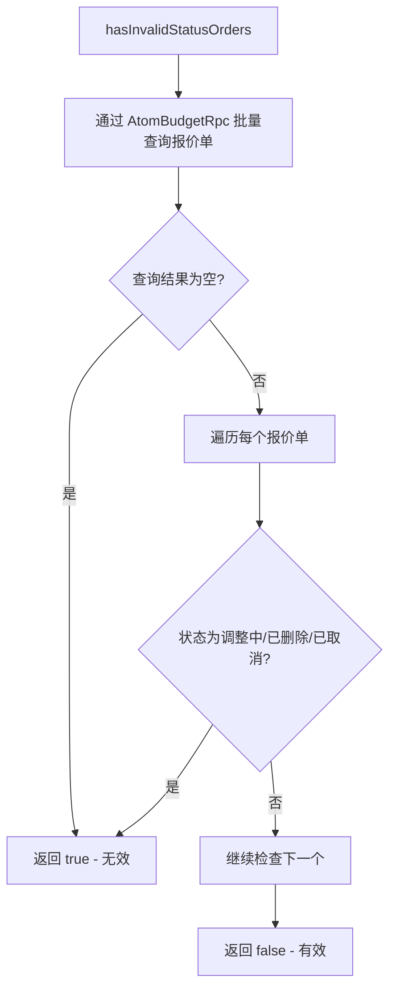

**可签约单据构建**：仅在"全改"（REFORM_ALL）和"房产证"（HOUSE_CERTIFICATE）业务类型下，查询正签报价中的个性化报价单作为可签约单据。

**商品信息构建**：通过 `ProductQueryService` 获取报价单的 SKU 产品，提取内控类目名称（skuCategoryName），合并后作为 goodsInfo。

### 4. ChangeOrderSigningSourceStrategy（变更单策略）

**文件**: `personal/bind/strategy/ChangeOrderSigningSourceStrategy.java`
**绑定类型**: `BindTypeEnum.CHANGE_ORDER (2)`

处理**变更单（Change Order）**类型的签约数据源。

#### 关键实现

**状态校验逻辑**：通过 `AtomBudgetRpc.getChangeApplyDetails()` 查询变更申请详情，仅"待签约"（WAIT_SIGN）和"已完成"（FINISHED）状态允许签约。

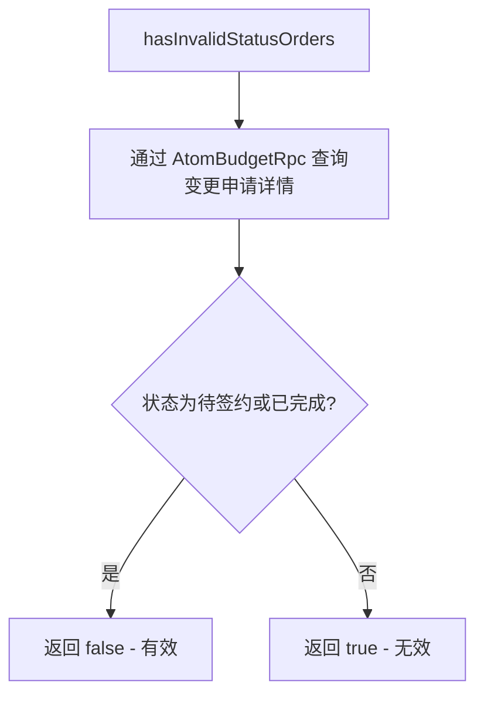

**图纸查询差异**：变更单在构建图纸查询时需额外携带 `projectChangeNo`（变更单号）和 `drawingStatus = TEMP`（临时状态），这是区别于其他策略的关键差异。

**可签约单据**：变更单策略不支持独立发起签约弹窗（`buildSignableOrderInfos` 返回空列表），`checkPersonalCanCreate` 直接返回 false。

### 5. SubOrderSigningSourceStrategy（子单策略）

**文件**: `personal/bind/strategy/SubOrderSigningSourceStrategy.java`
**绑定类型**: `BindTypeEnum.SUB_ORDER (3)`

处理**子单（Sub Order / S 单）**类型的签约数据源，是三个策略中逻辑最复杂的一个。

#### 关键实现

**状态校验逻辑**：通过 `SubOrderFeignService.batchQuerySubOrderByNo()` 批量查询子单，校验数量一致性和状态有效性。

**可签约单据构建**（最复杂的逻辑）：

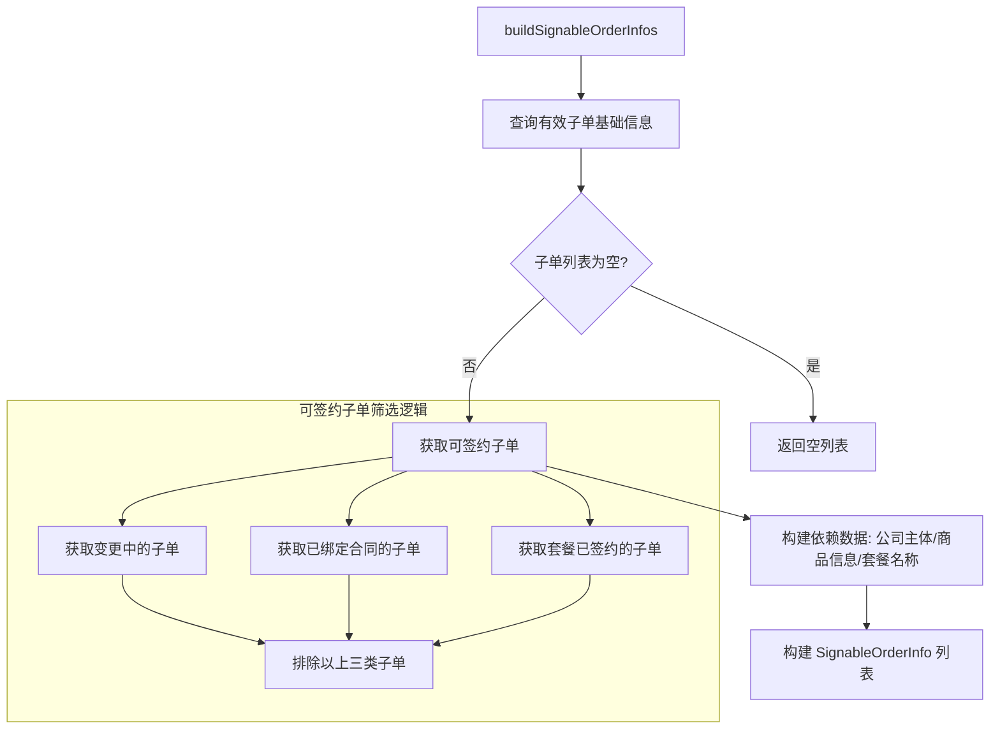

**套餐关联过滤**：子单策略独有的逻辑——同属一个套餐（packageInstanceCode）的子单，如果其中某个子单已绑定合同，则同套餐的其他子单也视为"已签约"，不可再被选中。这通过 `getPackageSignedSubOrderNos()` 方法实现。

**可签约单据聚合**：在 `SignableOrderInfo.buildSignableSubOrderInfo()` 中，同套餐的子单会被聚合为一条签约项（金额求和、编号逗号拼接、取最早创建时间）。

**checkPersonalCanCreate 独特逻辑**：子单策略是唯一真正实现了此方法的策略（其他均返回 false）。它以编辑模式查询可签约单据，即使子单绑定了草稿合同，只要有可签约单据就返回 true。

---

## 策略分发机制

上层通过 `BindTypeEnum` 编码路由到对应的策略实现。各策略通过 Spring 的 `@Service` 注解注册为 Bean，由调用方按 `bindType()` 进行匹配选择。

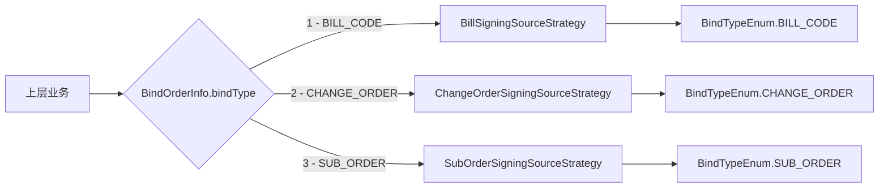

### 三种策略的能力对比

| 能力 | Bill (报价单) | ChangeOrder (变更单) | SubOrder (子单) |
|------|:------------:|:-------------------:|:---------------:|
| 状态校验 | 报价单状态检查 | 变更流程状态检查 | 子单数量+状态检查 |
| 商品信息来源 | SKU 内控类目 | 变更 SKU 内控类目 | 子单商品前后台类目 |
| 可签约单据查询 | 全改/房产证场景 | 不支持 | 多重过滤（变更/已绑定/套餐） |
| checkPersonalCanCreate | false | false | true（可查可签约 S 单） |
| 图纸查询 | 标准查询 | 带变更单号+临时状态 | 标准查询 |
| 套餐关联逻辑 | 无 | 无 | 有（同套餐聚合/互斥） |
| 公司主体过滤 | billCode+orgCode | changeOrderId+orgCode | 不过滤 |

---

## 核心数据流

### 签约弹窗数据构建流程

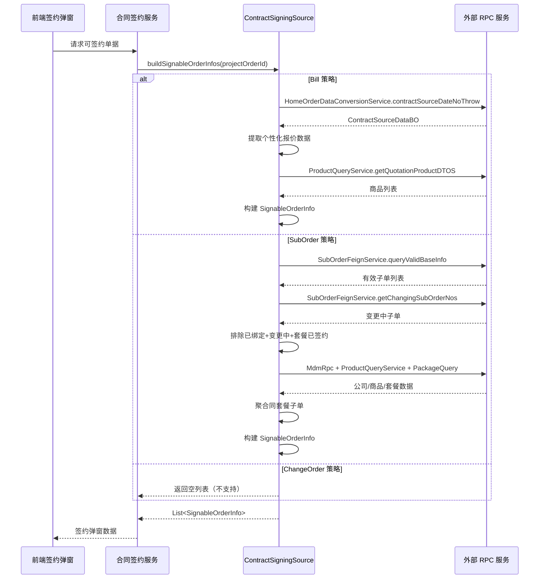

### 个性化报价查询流程

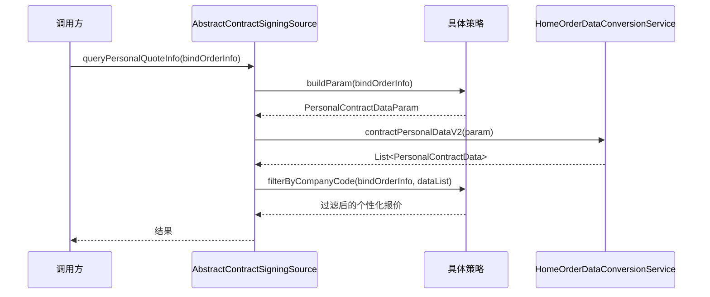

### 图纸获取流程

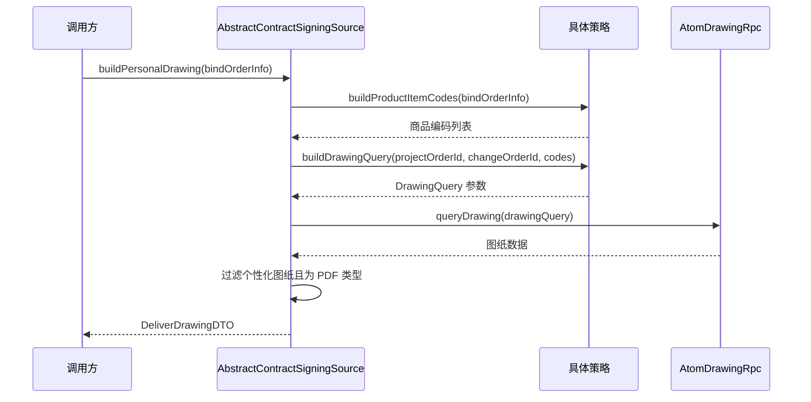

---

## 与其他模块的关系

### 依赖关系图

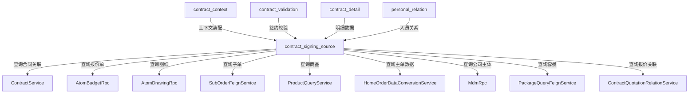

| 关联模块 | 关系 | 说明 |
|---------|------|------|
| [contract_context](contract_context.md) | 被依赖 | 合同上下文装配时调用本模块获取签约数据源 |
| [contract_detail](contract_detail.md) | 被依赖 | 合同明细处理时使用签约数据源获取报价和商品信息 |
| [contract_validation](contract_validation.md) | 被依赖 | 合同校验时调用状态校验和可签约检查 |
| [personal_relation](personal_relation.md) | 被依赖 | 人员关系处理时可能依赖签约数据源的绑定信息 |

---

## 关键设计模式

### 1. 策略模式（Strategy Pattern）

模块的核心设计模式。`ContractSigningSource` 定义统一接口，三个策略类分别实现报价单、变更单、子单的差异化逻辑。上层通过 `bindType()` 路由，实现了**开闭原则**——新增单据类型时只需添加新的策略实现，不修改已有代码。

### 2. 模板方法模式（Template Method Pattern）

`AbstractContractSigningSource` 将通用流程（查询个性化报价、构建图纸等）固化在基类中，通过 `buildParam()`、`buildProductItemCodes()`、`buildDrawingQuery()`、`filterByCompanyCode()` 四个抽象方法让子类插入差异逻辑。这避免了三种策略中大量重复的查询和过滤代码。

### 3. 工厂方法的使用

`BindOrderInfo` 类提供了多个静态工厂方法（`convert`），根据优先级（S 单 > 变更单 > 报价单）将不同来源的订单信息统一转换为 `BindOrderInfo`，简化了上层调用方的数据构造。

---

## 关键业务概念

### BindTypeEnum 绑定类型

| 编码 | 枚举值 | 含义 | 对应策略 |
|------|--------|------|---------|
| 1 | BILL_CODE | 报价单号 | BillSigningSourceStrategy |
| 2 | CHANGE_ORDER | 变更单号 | ChangeOrderSigningSourceStrategy |
| 3 | SUB_ORDER | 子单号（S 单） | SubOrderSigningSourceStrategy |

该枚举同时映射到数据库 `contract_quotation_relation` 表的 `bind_type` 字段。

### 部件类型（C 部分 / B 部分）

- **C 部分（Customer Part）**：业主承担的品，`isCPart` 判断 `purchaseType` 是否为业主承担类型
- **B 部分（Builder Part）**：开发商承担的品，`isBPart` 判断 `purchaseType` 是否为开发商承担或混合承担类型

这些判断影响合同条款的生成和费用分摊。

### 套餐关联逻辑（子单独有）

子单策略中的套餐（Package）机制：
- 同一子单下的所有商品属于同一个套餐实例
- 同套餐的子单在签约弹窗中**聚合为一条**（金额求和、编号拼接）
- 同套餐内任一子单已绑定合同，则其他子单也**不可再被选中**
- 套餐名称通过 `PackageQueryFeignService` 查询获取
