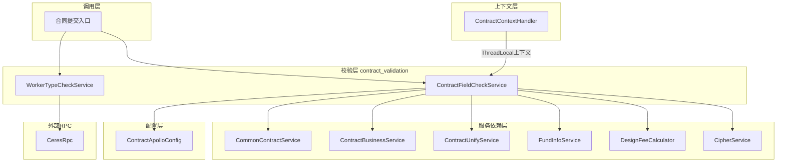
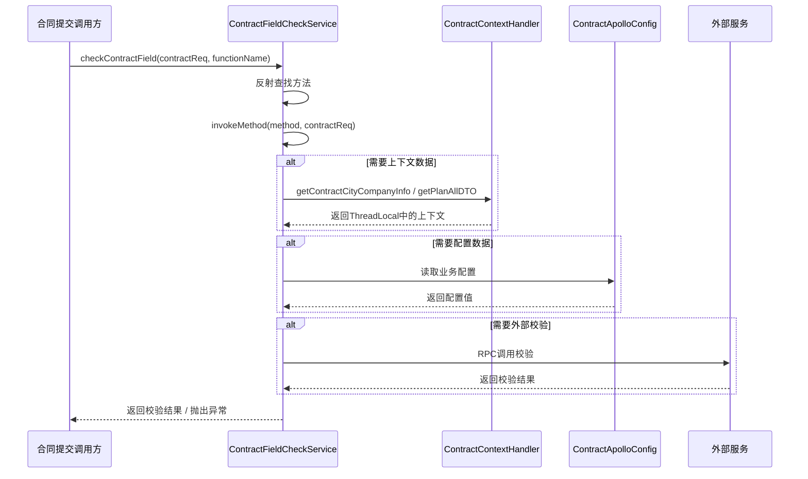
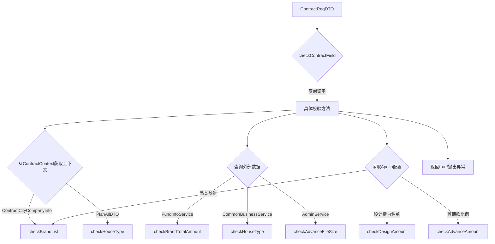
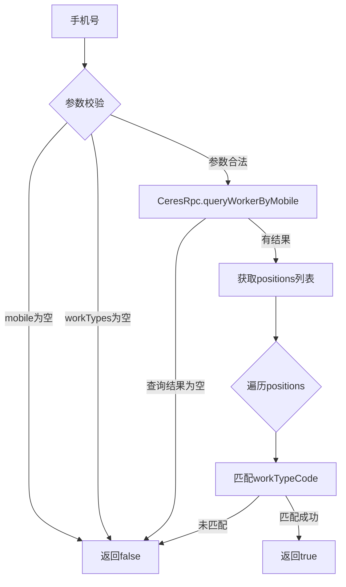
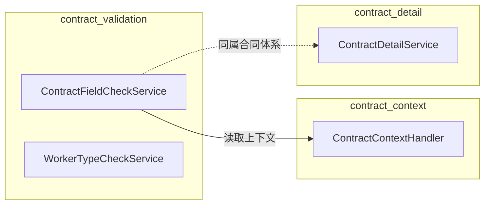

# Contract Validation 模块文档

## 模块概述

`contract_validation` 模块是合同业务流程中的**字段校验层**，负责在合同提交前对各类业务字段进行规则校验。该模块采用**反射调度 + 策略分发**的设计，通过方法名称动态调用对应的校验规则，实现校验逻辑与调用方的解耦。

模块包含两个核心服务：
- **ContractFieldCheckService**：合同字段综合校验服务，覆盖品类、金额、身份、企业信息等多维度校验
- **WorkerTypeCheckService**：工种身份校验服务，校验手机号是否属于指定工种

## 系统架构

### 模块在系统中的位置



### 核心组件交互



## 核心组件详解

### ContractFieldCheckService

合同字段校验的主服务类。所有校验方法通过**反射机制**动态调用，方法签名统一为 `public boolean methodName(ContractReqDTO)`，返回 `true` 表示校验通过。

> **重要约束**：由于方法通过反射调用，方法名称不能修改，方法不能删除。

#### 反射调度入口

```
checkContractField(contractReq, functionName)
```

核心调度流程：
1. 若 `functionName` 为空，直接返回 `true`（无需校验）
2. 通过 `ReflectionUtils.findMethod` 在当前类中查找匹配方法
3. 方法未找到时记录错误日志并返回 `true`（容错处理）
4. 调用找到的方法并返回结果

#### 校验方法清单

| 方法名 | 校验内容 | 异常行为 |
|-------|---------|---------|
| `checkBrandList` | 品类列表预收金额、报价金额、品类编号合法性 | 预收金额不足时抛出 `NrsBusinessException` |
| `checkBrandTotalAmount` | 品类总计金额 >= 款项已付金额 | 返回 `false` |
| `checkAdvanceAmount` | 首期款金额在预估合同额的 20%~70% 范围内 | 抛出 `UtopiaBussinessException` |
| `checkAdvanceFileSize` | 首期款报价单文件大小不超过配置上限 | 抛出 `NrsBusinessException` |
| `checkHouseType` | 正式套餐合同房屋类型与报价侧一致 | 抛出 `NrsBusinessException` |
| `checkIdCardInfo` | 业主/代理人/公司代理人/法人身份证号与姓名一致性 | 抛出 `UtopiaBussinessException` |
| `checkCompanyInfo` | 企业名称与统一社会信用代码一致性 | 抛出 `UtopiaBussinessException` |
| `checkDesignAmount` | 设计服务费优惠后 <= 优惠前，且 > 0 | 抛出 `UtopiaBussinessException` |

#### 数据流：校验执行过程



#### 关键校验逻辑说明

**checkBrandList — 品类金额校验**
- 遍历品类列表，校验每个品类的预收金额 >= 报价金额 x 配置比例
- 累加计算所有品类的预收/报价总额，与请求中的汇总金额交叉验证
- 品类编号必须在 Apollo 配置的品类枚举中存在

**checkAdvanceAmount — 首期款校验**
- 根据业务类型（整装/翻新）应用不同的预估合同额范围规则
- 支持从报价模块（quotation）获取首期款比例，或使用默认值 20%
- 首期款金额范围约束：`预估合同额 x advanceRate <= 首期款 <= 预估合同额 x 70%`

**checkIdCardInfo — 身份证校验**
- 分场景校验：个人业主、代理人、公司代理人、法人
- 通过 `CipherService` 解密身份证号后与姓名进行一致性比对
- 仅当证件类型为身份证（`CertificateTypeEnum.ID`）时才校验

**checkDesignAmount — 设计服务费校验**
- 支持白名单跳过（通过 Apollo 配置）
- 支持按城市开通状态和订单维度判断是否需要校验
- 校验条件：仅线上签约渠道（`SignChannelTypeEnum.ONLINE`）且城市已开通设计费计算

### WorkerTypeCheckService

工种身份校验服务，提供基于手机号的工种查询和校验能力。

#### 方法说明

| 方法名 | 功能 | 返回值 |
|-------|------|-------|
| `hasWorkerType(mobile, workTypes...)` | 检查手机号是否属于指定工种 | `boolean` |
| `checkWorkerType(mobile, errorMsg, workTypes...)` | 校验手机号不能为指定工种 | 抛出 `NrsBusinessException` |

#### 校验流程



## 依赖关系

### 模块间依赖



### 外部服务依赖

| 依赖服务 | 用途 | 调用方 |
|---------|------|-------|
| `ContractApolloConfig` | 动态业务配置（品类映射、白名单、金额范围等） | ContractFieldCheckService |
| `CommonContractService` | 身份证号与姓名一致性校验 | ContractFieldCheckService |
| `ContractBusinessService` | 企业信息校验（公司名+信用代码） | ContractFieldCheckService |
| `ContractUnifyService` | 首期款来源判断、设计费计算开关 | ContractFieldCheckService |
| `FundInfoService` | 查询款项已付金额 | ContractFieldCheckService |
| `DesignFeeCalculator` | 设计费计算跳过判断 | ContractFieldCheckService |
| `CipherService` | 身份证号解密 | ContractFieldCheckService |
| `AdminService` | 获取 PDF 文件大小 | ContractFieldCheckService |
| `CommonBusinessService` | 业务类型判断（V2.5 流程等） | ContractFieldCheckService |
| `ProjectConfigSnapService` | 项目配置快照 | ContractFieldCheckService |
| `FundBaseService` | 基础款项服务 | ContractFieldCheckService |
| `CeresRpc` | 查询人员工种信息 | WorkerTypeCheckService |

### 与 ContractContext 的交互

`ContractFieldCheckService` 通过 [ContractContextHandler](contract_context.md) 的 ThreadLocal 上下文获取校验所需的全局数据，避免方法间参数层层传递：

| 上下文数据 | 来源 | 使用场景 |
|-----------|------|---------|
| `ContractCityCompanyInfo` | 合同上下文 | 品类校验时获取公司编码以匹配品类配置 |
| `PlanAllDTO` | 报价模块数据 | 房屋类型校验时比对报价侧房屋类型 |

## 关键设计模式

### 1. 反射调度模式

`checkContractField` 方法通过 `ReflectionUtils.findMethod` + `ReflectionUtils.invokeMethod` 实现校验方法的动态分发。调用方只需传入方法名字符串，无需直接引用具体校验方法，实现了调用方与校验逻辑的解耦。

```
调用方 --> checkContractField(req, "checkBrandList")
               |
               v
         反射查找 checkBrandList(ContractReqDTO)
               |
               v
         反射调用并返回结果
```

### 2. ThreadLocal 上下文模式

通过 `ContractContextHandler` 维护线程级上下文，在请求入口处初始化，在 AOP 切面（[ContractContextAspect](contract_context.md)）中管理生命周期。校验方法可随时通过静态方法读取上下文数据，无需通过方法参数传递。

### 3. 配置驱动校验

大量校验规则通过 `ContractApolloConfig` 进行动态配置，包括：
- 品类编码与名称映射
- 预收金额比例阈值
- 首期款翻新金额范围
- 设计费校验白名单
- 设计费已开通城市列表

这使得校验规则可以在不修改代码的情况下通过配置中心进行调整。

### 4. 异常分级策略

校验失败时根据场景采用不同的异常类型和处理方式：

| 异常类型 | 使用场景 | 处理方式 |
|---------|---------|---------|
| `NrsBusinessException` (SHOW_TO_CLIENT) | 用户可修正的业务错误 | 前端展示友好提示 |
| `NrsBusinessException` (WARN) | 警告级错误 | 前端展示警告提示 |
| `UtopiaBussinessException` | 系统级业务异常 | 通用错误处理 |
| 返回 `false` | 配置/数据缺失 | 调用方自行处理 |
